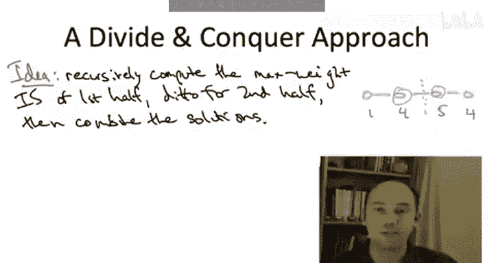

# 算法启蒙（第3册）：贪心算法和动态规划｜P25：-25- 引言 - 路径图中的带权独立集问题 📚

在本节课中，我们将开始学习动态规划。这是一个通用的算法设计范式，正如我在课程开始时提到的，它有许多著名的应用。然而，我现在还不会直接告诉你什么特性使得一个算法成为动态规划算法。相反，我们的计划是在接下来的几个视频中，从一个非平凡的具体计算问题出发，从头开始开发一个算法。这个问题就是在路径图中寻找最大权独立集。

这个具体问题将迫使我们发展一系列新思路。一旦我们解决了这个问题，我们将退一步，指出我们解决方案中的哪些特征使其成为一个动态规划算法。然后，我们将带着开发动态规划算法的“公式”和一个具体实例，继续探讨该范式的更多、通常也更难的应用。

事实上，动态规划范式尤其需要练习才能掌握。根据我的经验，学生起初会觉得它违反直觉，并且常常难以将其应用到他们未曾见过的问题上。但好消息是，动态规划相对而言是模式化的，肯定比我们最近学习的贪心算法更模式化。通过足够的练习，你应该能掌握这个强大且广泛适用的新工具。

接下来，让我介绍我们将在未来几个视频中研究的具体问题。这是一个图论问题，但非常简单。事实上，我们只关注路径图，即仅由一条包含 n 个顶点的路径构成的图。输入的另一个部分是每个顶点的一个非负数，我们称之为权重。例如，这是一个包含四个顶点的路径图，我们给顶点赋予权重 1、4、5 和 4。

算法的任务是输出一个独立集。这意味着图顶点的一个子集，其中没有两个顶点是相邻的。因此，在简单路径图的上下文中，它意味着你必须返回一些顶点，并且总是避免连续的一对顶点。例如，在一个四个顶点的路径中，独立集的例子包括空集、任何单个顶点、顶点 1 和 3、顶点 2 和 4，以及顶点 1 和 4。你不能返回顶点 2 和 3，因为它们是相邻的，这是不允许的。

为了使问题更有趣，我们想要的不是任何一个旧的独立集，而是顶点权重之和尽可能大的那个，这就是最大权独立集问题。接下来，我将利用这个具体问题来回顾我们迄今为止见过的各种算法设计范式。在此过程中，我们将看到它们对于这个问题实际上都不太奏效，这将激励我们设计一种新方法，而这种方法最终将成为动态规划。

首先，作为我们标准的“沙袋”，考虑暴力搜索。这将需要遍历所有独立集，并记住总权重最大的那个。当然，这是正确的，但通常这需要指数时间。即使在路径图中，独立集的数量也是顶点数 n 的指数级。

我们还知道哪些其他算法设计范式呢？我们刚刚完成了一个关于贪心算法的大章节。我们当然可以考虑它。对于大多数问题，提出贪心算法很容易，这个问题也不例外。我认为，计算最大权独立集最自然的贪心算法可能是：在每个步骤中，选择你尚未选择的、权重最高的顶点。当然，你必须担心可行性。记住，我们不允许输出连续的顶点。因此，如果任何顶点因相邻而被排除，我们就忽略它；在那些保持可行性的顶点中，我们将权重最高的那个包含到当前的集合中。

让我重新绘制上一张幻灯片中的四节点路径图，并问你：这个贪心算法在这个四节点路径上会计算出什么？这与最优解（即具有最大总权重的独立集）相比如何？正确答案是第二个选项。让我们看看原因。

首先看最优解，即最大权独立集。记住，独立集禁止选择相邻或连续的顶点。因此，在这种情况下，唯一合理的考虑方案是第一个和第三个顶点、第二个和第四个顶点，或者第一个和第四个顶点。其中最好的是第二个和第四个顶点，总权重为 8。

那么贪心算法呢？它首先选择整体权重最高的顶点，即权重为 5 的顶点。不幸的是，这阻止了算法选择两个权重为 4 的顶点中的任何一个。保持可行性的唯一剩余选项是选择权重为 1 的顶点。这给了我们一个权重为 6 的独立集。

如果这个贪心算法不正确，你当然可以尝试设计其他类型的贪心算法，但我不知道有任何贪心方法能真正最优地解决这个问题。

这令人失望，但我们还没有穷尽我们的算法设计范式。还记得我们在本课程第一部分早期学到的非常强大的分治法吗？它似乎可以在这里应用。我们有许多成功的应用，其中输入是一个数组，我们将其分成两部分，递归处理两边，然后合并结果。在这里，路径图看起来与数字数组没有太大不同。因此，分治法的明显方法是：将路径分成两条路径，每条长度是原路径的一半，递归计算每条路径中的最大权独立集，然后以某种方式合并结果。

但分治法的问题在我们简单的四顶点例子中就已经很明显了。如果我们递归处理左半部分（即前两个顶点），并计算一个最大独立集，那将只是第二个顶点本身。如果我们独立地递归处理右半部分（顶点 3 和 4），右半部分的最大权独立集将是权重为 5 的顶点。现在，当递归完成，我们得到子解时，我们有了第二个顶点和第三个顶点。但问题是，这两个解的并集存在冲突：我们不能同时输出第二个和第三个顶点，它们是连续的、相邻的，这是不允许的。此外，在一个四节点图中，修复这个冲突似乎很容易，但在一个有数千个节点的大图中，如果两个子问题相遇的地方存在冲突，如何快速修复并获得原始问题的可行且最优的解，这一点一点也不明显。

在某种意义上，分治范式比贪心方法更适合这个问题，因为我知道一些分治算法可以最优地解决这个问题，其运行时间为二次时间。但以分治的方式做得比这更好似乎相当具有挑战性。而在我们将要开发的基于动态规划的算法中，我们将以线性时间解决这个问题。

本节课中，我们一起学习了最大权独立集问题的定义，并回顾了暴力搜索、贪心算法和分治法对该问题的适用性。我们发现，暴力搜索效率低下，贪心算法可能无法得到最优解，而分治法在合并子问题时面临挑战。这为引入动态规划这一新方法做好了铺垫。在接下来的课程中，我们将详细探讨如何应用动态规划高效地解决此问题。