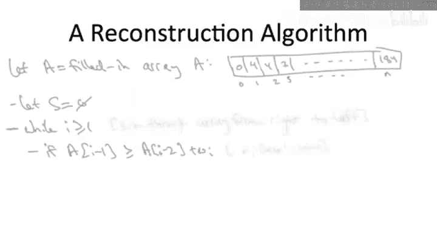

# 算法启蒙（第3册）：贪心算法和动态规划｜P28：-28-路径图中的最大权独立集：重构算法 🧩


在本节课中，我们将学习如何从动态规划算法生成的表格中，重构出最大权独立集问题的具体最优解，而不仅仅是其最优值。上一节我们介绍了一个优雅的线性时间算法来计算最优值，本节中我们来看看如何利用该算法留下的“线索”来恢复出实际的顶点集合。

## 概述

我们之前已经得到了一个解决路径图（Path Graph）上加权独立集问题（Weighted Independent Set, WIS）的算法。该算法非常优雅，能在 **O(N)** 的线性时间内计算出最优解的总权重。然而，这个算法只告诉我们最优解的值（例如184），并没有告诉我们具体由哪些顶点构成这个独立集。本节的目的是展示如何利用上一节算法填充的表格，来重构出一个实际的最优解。

## 算法回顾与问题定义

首先，让我们快速回顾一下上一节的算法。该算法通过填充一个数组 `A` 来工作，其中 `A[i]` 存储了由前 `i` 个顶点构成的子图 `G_i` 中最大权独立集的总权重。其核心递推公式如下：

```
A[0] = 0
A[1] = w1
For i = 2 to n:
    A[i] = max(A[i-1], A[i-2] + wi)
```

当算法结束时，`A[n]` 中的值（例如184）就是整个图 `G` 的最大权独立集的总权重。

## 为什么需要重构？

在许多实际应用中，仅仅知道最优值是不够的。我们通常希望知道是哪些顶点构成了这个总权重为184的独立集。一个直观的想法是修改算法，让数组 `A` 的每个条目不仅存储最优值，还存储达到该值的顶点集合。然而，在动态规划中，这通常不是首选方法，因为它会不必要地浪费时间和空间。更聪明的方法是在需要时，根据已填充的表格来重构最优解。

有趣的是，我们的一行算法并没有“掩盖踪迹”，它在表格中留下了足够的线索，让我们可以像侦探一样回溯并重构出最优解。

## 重构算法的核心思想

重构可能性的关键在于我们算法的正确性。我们已经证明，算法能正确填充数组的每个条目。回想我们证明正确性时的思路实验：对于最后一个顶点 `v_n`，最优解只可能有两种情况：
1.  **情况一**：最优解不包含 `v_n`。此时，最优解就是前 `n-1` 个顶点构成的子图 `G_{n-1}` 的最优解。
2.  **情况二**：最优解包含 `v_n`。此时，由于独立集的性质，`v_{n-1}` 不能被包含，因此最优解是 `v_n` 的权重加上前 `n-2` 个顶点构成的子图 `G_{n-2}` 的最优解。

算法在计算 `A[n]` 时，通过 `max` 操作明确比较了这两种情况：
*   如果 `A[n-1] >= A[n-2] + w_n`，则情况一胜出，意味着最优解不包含 `v_n`。
*   否则，情况二胜出，意味着最优解包含 `v_n`。

**这个比较结果就是我们重构的起点。** 已填充的表格 `A` 就是我们的“知更鸟”，它通过记录哪个“情况”被用来填充每个 `A[i]`，间接告诉了我们每个顶点 `v_i` 是否应该被包含在最优解中。

## 重构算法步骤



重构算法以正向算法填充好的数组 `A` 和顶点权重列表 `w` 作为输入。它将从右向左（从 `i=n` 到 `i=1`）扫描数组，并根据每个位置 `i` 的填充方式来决定是否将顶点 `v_i` 加入解集 `S`。

以下是重构算法的伪代码描述：

```
ReconstructWIS(A[0...n], w[1...n]):
    Initialize an empty set S
    i = n
    While i >= 1:
        // 判断A[i]是由哪种情况计算得出的
        If (i == 1) OR (A[i-1] >= A[i-2] + w[i]):
            // 情况一胜出：不包含v_i
            i = i - 1
        Else:
            // 情况二胜出：包含v_i
            Add v_i to set S
            i = i - 2
    Return S
```

让我们详细解释一下这个循环：

*   **条件判断**：我们检查在计算 `A[i]` 时，是 `A[i-1]`（情况一）更大，还是 `A[i-2] + w[i]`（情况二）更大。注意边界条件 `i=1` 时，只有情况一（`A[0]`）可选。
*   **情况一（排除顶点）**：如果 `A[i-1]` 更大或相等，说明最优解不包含 `v_i`。因此我们跳过 `v_i`，并将索引 `i` 减1，去考察前一个顶点。
*   **情况二（包含顶点）**：如果 `A[i-2] + w[i]` 更大，说明最优解包含 `v_i`。因此我们将 `v_i` 加入解集 `S`。由于包含 `v_i` 意味着不能包含 `v_{i-1}`，我们将索引 `i` 减2，直接跳到 `v_{i-2}` 进行考察。

## 算法正确性与复杂度分析

**正确性**：重构算法的正确性可以通过归纳法严格证明。归纳假设对于子图 `G_i`，算法能正确重构出其最大权独立集。在归纳步骤中，算法利用了我们反复使用的案例分析：对于当前顶点 `v_i`，最优解只有两种可能。算法通过比较 `A[i-1]` 和 `A[i-2] + w[i]` 显式地确定了是哪种情况，并据此决定包含或排除 `v_i`，然后递归地（通过移动索引）解决剩余子问题。因此，最终输出的集合 `S` 确实是原图 `G` 的一个最大权独立集。

**时间复杂度**：重构算法包含一个 `while` 循环，最多迭代 `n` 次（每次迭代索引 `i` 至少减1）。每次迭代只进行常数时间的比较和操作。因此，**与正向算法一样，这个反向的重构过程也是线性 O(N) 时间的**，速度极快。

## 总结

本节课中我们一起学习了如何从动态规划表格中重构具体解。我们首先指出了仅获得最优值的不足，然后揭示了已填充的动态规划表格中蕴含了关于每个顶点是否在最优解中的关键信息。基于此，我们设计了一个从右向左扫描表格的重构算法，该算法通过检查每个位置 `A[i]` 是由哪种候选情况计算得出，来决定是否将顶点 `v_i` 加入最终解集。这个重构过程同样高效，仅需线性时间，并且严格保证了输出集合是最优解。至此，我们完整地解决了路径图上的加权独立集问题，既能计算最优值，也能给出具体的解。