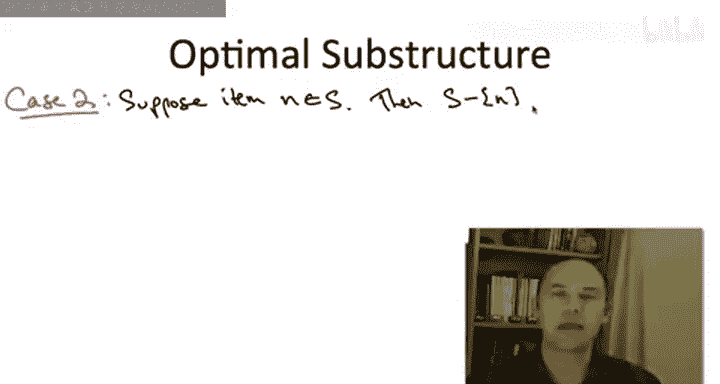

# 算法启蒙（第3册）：贪心算法和动态规划｜Part 3 Greedy Algorithms and Dynamic Programming：P30：背包问题

在本节课中，我们将学习动态规划的第二个经典应用：**背包问题**。我们将展示如何沿用之前求解路径图最大独立集问题的相同思路，来推导出这个著名问题的动态规划解法。

## 概述

接下来的两个视频将介绍动态规划的第二个应用实例。这是一个非常著名的问题，称为**背包问题**。我们将展示如何遵循与计算路径图独立集完全相同的步骤，来得出这个问题的著名动态规划解法。

现在，让我们直接进入背包问题的定义。

## 背包问题定义

输入由 **n** 个物品组成。

每个物品都有一个价值 **vᵢ**（对我们来说越大越好）和一个大小 **wᵢ**。

我们假设这两个值都是非负的。对于物品大小，我们额外假设它们是**整数**。

除了这两个 n 维数组，我们还给定一个称为**容量**的数值 **W**。同样，我们假设它也是非负整数。

这些整数假设的作用将在后续说明。

在背包问题中，算法的任务是选择一个物品的子集。我们的目标是最大化所选物品的总价值。

那么，是什么阻止我们选择所有物品呢？限制是所选物品的总大小不能超过容量 **W**。

我可以讲一个关于小偷带着容量为 W 的背包入室盗窃，想带走最好战利品的老套故事，但这实际上低估了这个问题的重要性。背包问题是一个非常基础的问题，经常作为更大任务的子程序出现。基本上，每当你有一个资源预算，并希望以最聪明的方式使用它时，这就是背包问题。你可以想象它在许多场景中都会出现。

## 动态规划算法设计思路

现在，让我们执行开发动态规划算法的标准步骤。记住，任何动态规划解决方案的关键在于找出正确的**子问题集合**。我们将通过思考最优解的结构，来推导背包问题的子问题，就像我们为最大权独立集所做的那样。

这个思考实验的最终成果将是一个**递推关系式**，一个公式，它告诉我们一个子问题的最优值如何依赖于更小子问题的最优值。

### 思考实验开始

首先，固定一个背包问题的实例，并让 **S** 表示一个最优解（即价值最大的可行解）。

我们之前的思考实验从一个无关内容的陈述开始：路径的最后一个顶点要么在最优解中，要么不在。那么，在背包问题中，什么类似于“最右边的顶点”呢？与路径图不同，给定的物品没有内在的顺序性，它们只是一个无序集合。但实际上，将物品按顺序编号为 1, 2, 3, ..., n 来思考是有用的。那么，“最右边的顶点”的类比就是**最后一个物品**。

因此，我们在这里要使用的无关内容的陈述是：**要么最后一个物品属于最优解 S，要么不属于**。

我们将再次从简单的情况开始：当它不属于时。

在路径图问题中，我们论证了在类似情况1下，如果我们只是从图中删除最右边的边，那么最大权独立集必须是最优的。这里的类似主张是：如果我们从背包实例中删除最后一个物品 n，集合 S 应该仍然是最优的。

论证过程完全相同，几乎是一个微不足道的矛盾：如果在第一个 n-1 个物品中存在一个不同的解 S*，其价值比 S 还大，那么我们同样可以将其视为包含所有 n 个物品的、更优的背包可行解，但这与 S 的最优性假设相矛盾。

### 情况二：最后一个物品在最优解中

现在，让我们通过一个小测验来一起探讨稍微复杂一些的情况二。

假设最优的背包解确实使用了这最后一个物品 N。

现在，我们希望说明这个解在某种意义上是由一个更小子问题的最优解组合而成的。所以，如果我们打算删除最后一个物品，我们就不能直接讨论 S，因为 S 包含了最后一个物品。因此，在讨论其最优性之前，我们需要从 S 中移除最后一个物品。这类似于在独立集问题中，我们在讨论更小子问题的最优性之前，从最优解中移除最右边的顶点。

那么问题是：如果我们取最优解 S，移除物品 N，那么剩余的解在什么意义下是最优的？换句话说，对于哪种背包实例（如果有的话），它是一个最优解？

正确答案是 **C**。

回到独立集问题，我们说过，如果我们移除最右边的顶点，那么剩下的部分对于移除最右边两个顶点后得到的残差独立集问题是最优的。在这里，当我们从最优解 S 中移除物品 n 时，结论是：我们得到的是对于涉及**前 n-1 个物品**且**剩余背包容量为 W - wₙ** 的背包问题的最优解。也就是说，原始的背包容量中为第 n 个物品预留或删除了空间。

在我给出简要证明之前，让我先简要解释为什么其他几个答案不正确。

首先，答案 **B**，我希望你能快速排除，它类型不匹配。W 是背包容量，单位是大小；vₙ 是物品价值，单位是价值。谈论这两者的差值没有意义，就像苹果和橘子。

答案 **D**，如果你担心可行性问题。如果你取 S 并移除物品 n，你做了什么？你取了一个总大小至多为 W 的物品集合（根据 S 的可行性），然后从中移除了一个大小为 wₙ 的物品。因此，剩余部分的总大小至多为 W - wₙ。所以，S - {n} 确实对于这个减少后的剩余背包容量 W - wₙ 是可行的。

更微妙的一点是答案 **A**，这是一个很自然的猜测，但结果证明是不正确的。事实证明，如果你有完整的背包容量 W 可以使用，可能存在比 S - {n} 更聪明地使用前 n-1 个物品的方法。这是一个更微妙的点，你可以作为一个很好的练习来说服自己 A 是错误的：没有理由认为当你从 S 中取出物品 n，并且仍然使用原始背包容量时，这必须是最优的，这不会成立。

那么，为什么 **C** 是正确的呢？这将与我们加权独立集思考实验中情况二的精神相同。

让我给出证明。证明将采用与我们在加权独立集问题中论证情况二时相同的矛盾法。

假设存在一个比 S - {n} 更好的解（在剩余容量 W - wₙ 下），称这个假设更好的解为 S*。那么我们如何得出矛盾呢？我们只需取 S*（它只涉及前 n-1 个物品），然后把物品 n 加进去。由于 S* 的总大小至多为 W - wₙ，而物品 n 的大小为 wₙ，结果的总大小至多为 W，所以取 S* 并扩展以包含物品 n 是一个可行解。如果 S* 的价值比 S - {n} 高，那么包含 n 的 S* 的价值就比 S 高。

例如，如果 S 的总价值是 1100，其中 100 来自物品 n，那么 S - {n} 的价值是 1000。如果 S* 更好，价值是 1050，那么我们只需把 n 加回去，它就具有 1150 的价值，这与 S 的最优性（总价值仅为 1100）相矛盾。

注意这里发生了什么：在查看残差问题之前，我们从背包容量中减去 wₙ，实际上是在为物品 n 预留一个缓冲区。这就是为什么当我们把 n 放回解 S* 时，我们知道它是可行的。这类似于在独立集问题中删除倒数第二个顶点作为缓冲区，以确保当我们把顶点 n 加回时是可行的。

## 思考实验的意义

那么，这个我们已经完成的整个思考实验的意义是什么？同样，其意义在于说明：**最优解，无论它是什么，必须只有两种形式之一**。我们已经将候选列表缩小到两种可能性：
1.  你直接继承**少一个物品、相同容量**的背包问题的最优解。
2.  你查看**少一个物品、容量减少 wₙ** 的背包问题的最优解，然后用物品 n 扩展它。

只有这两种可能性。所以，再次强调，如果我们只知道这两种情况中哪一种是正确的，即我们只知道物品 n 是否在最优解中，那么在某种意义上，我们就可以递归地计算出解的其余部分。正如这足以让我们开始为加权独立集设计动态规划算法一样，对于背包问题也是如此，我将在下一个视频中展示。

## 总结

本节课中，我们一起学习了**背包问题**的定义，并通过一个思考实验分析了其最优解的结构。我们发现，包含 n 个物品、容量为 W 的背包问题的最优解，必然属于以下两种情况之一：
*   **情况一**：最优解不包含物品 n，那么它等于 `(n-1, W)` 子问题的最优解。
*   **情况二**：最优解包含物品 n，那么它等于 `(n-1, W - wₙ)` 子问题的最优解加上物品 n 的价值 vₙ。

这个关键的观察为我们下一节构建动态规划递推公式和算法奠定了基础。