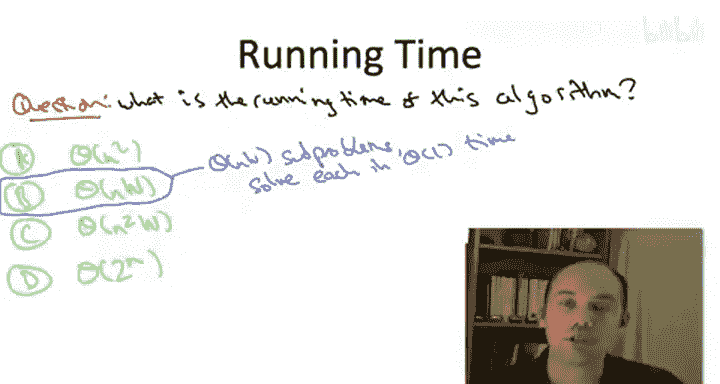

# 算法启蒙（第3册）：贪心算法和动态规划｜Part 3 Greedy Algorithms and Dynamic Programming：P31：-31-背包问题：动态规划算法 🎒


## 概述
在本节课中，我们将学习如何为背包问题设计一个动态规划算法。我们将从理解最优解的结构开始，推导出递推关系，然后将其转化为一个系统的动态规划解决方案。

## 最优解结构与递推关系
上一节我们讨论了最优解必须由更小子问题的最优解组成。现在，我们准备将其转化为一个递推关系，并最终形成背包问题的动态规划解法。

为了将我们之前的讨论整理成递推式，首先引入一些符号。我们用 **V(i, X)** 表示满足两个约束的解所能获得的最大价值：
1.  只能使用前 **i** 个物品。
2.  所选物品的总大小最多为 **X**。

这与独立集问题中的符号 **G_i**（前 i 个顶点的图）类似。我们现在使用两个索引而不是一个，因为子问题可以通过两种方式变得更小。回想一下我们思维实验的第二种情况，当我们观察一个更小的子问题时，既可能少一个物品，也可能剩余容量减少。因此，在考虑子问题时，我们需要同时跟踪允许使用的物品数量和允许使用的总容量。

让我们用这个符号来表达上一视频的结论。我们上一视频发现，最优解必须具有以下两种形式之一：
*   要么直接继承少一个物品（即前 i-1 个物品）但容量相同的背包实例的最优解（第一种情况）。
*   要么取一个子问题的最优解，该子问题少一个物品，并且容量减少了当前物品的重量，然后通过使用第 i 个物品将其扩展为当前子问题的最优解。

因此，**V(i, X)**，即当前子问题的最优值，是两种可能性中较好的那个，所以我们取最大值。

**递推公式如下：**
```
V(i, X) = max( V(i-1, X), V(i-1, X - w_i) + v_i )
```
其中：
*   `V(i-1, X)` 是不使用第 i 个物品的情况。
*   `V(i-1, X - w_i) + v_i` 是使用第 i 个物品的情况，`v_i` 是物品 i 的价值，`w_i` 是物品 i 的重量。

一个快速的边界情况：如果第 i 个物品的重量 `w_i` 大于我们允许的容量 `X`，那么我们当然不能使用它，因此我们被迫使用第一种情况。

这就是背包问题的递推关系。这完成了第一步，即思考最优解结构并用其设计递推式。

## 确定子问题范围
现在进入第二步，我们将精确确定需要关心哪些子问题。

在我们的路径图最大权重独立集例子中，每次递归或查找子问题解时，都是通过从图的右侧移除顶点获得的。因此，我们只需要关心图的所有可能前缀。

在这里的一维情况下，我们有类似的情况。每当我们查看更小的子问题时，总是少一个物品，我们总是在查找之前删除最后一个物品。因此，我们需要考虑所有可能的物品前缀，即对于所有 i 值，前 i 个物品的子问题。

然而，对于背包问题，子问题变小的还有第二种方式。回想我们思维实验的第二种情况，当我们想知道保证使用当前物品 i 的最优解时，我们必须在查找相应子问题的最优解之前减少容量。也就是说，我们不仅剥离物品，还在剥离背包容量的一部分。

这里我们将使用我们在开始时提到的假设：输入中所有物品大小都是整数，背包容量也是整数。背包容量从 **W** 开始，每次我们从它剥离一些整数单位的容量。因此，在所有子问题中，我们处理的都是整数背包容量。所以，在最坏情况下，可能出现的各种子问题就是所有可能的剩余容量选择：0, 1, 2, ...，一直到原始背包容量 **W**。

现在我们在第二步中处于有利位置。我们已经精确找出了需要关心的子问题。在第一步中，我们找到了一个公式，可以根据较小子问题的解来求解较大的子问题。剩下的就是写下一个表格，并系统地使用递推式填充它，从最小的子问题开始，直到最大的子问题。

## 动态规划算法实现
以下是伪代码，它将再次非常简单。

在这个算法中，我们要填充的数组 **A** 是二维的，这与加权独立集问题中的一维数组形成对比。这是因为我们的子问题有两个不同的索引，我们既要跟踪允许使用的物品集合，也要跟踪需要遵守的容量。

以下是算法的核心步骤：

1.  **初始化**：填充所有 `i = 0` 的条目（即没有物品可用），此时最优解值当然是 0。
2.  **系统填充**：通过双重循环系统地遍历所有子问题。
3.  **计算每个子问题**：对于给定的子问题（允许使用前 i 个物品，剩余容量为 X），我们使用推导出的递推式来计算表格中的条目。这本质上是对两种可能性进行暴力搜索：
    *   第一种情况：继承少一个物品但容量相同的最优解。
    *   第二种情况：使用物品 i，并将其与来自前 i-1 个物品、且为物品 i 留出足够空间的最优解组合。
4.  **边界处理**：如果当前物品的重量 `w_i` 严格大于容量 `X`，则忽略第二种情况，直接令 `A[i, X] = A[i-1, X]`。
5.  **返回结果**：双重循环完成后，存储在 `A[n, W]` 中的就是我们想要的解，即可以使用任何物品且可以使用整个原始背包容量 **W** 的最大价值解。

**伪代码示例：**
```
初始化二维数组 A[0..n, 0..W]
for x = 0 to W:
    A[0, x] = 0

for i = 1 to n:
    for x = 0 to W:
        if w_i > x:
            A[i, x] = A[i-1, x]
        else:
            A[i, x] = max( A[i-1, x], A[i-1, x - w_i] + v_i )

返回 A[n, W]
```

一个关键点是，当我们需要求解给定 i 和 X 的子问题时，我们已经拥有了所有所需子问题的解。具体来说，在外层 for 循环的前一次迭代中，我们已经计算了评估此递推式所需的两个相关子问题的解，它们正等待着我们进行常数时间的查找。



## 算法分析
运行时间分析非常简单，就像最大独立集问题一样：我们只需计算子问题的数量，并查看每个子问题做了多少工作。

子问题由 i 和 X 共同索引。i 有 n+1 种选择，X 有 W+1 种选择。这给了我们 **θ(n * W)** 个不同的子问题。对于每个子问题，我们只对先前计算的解进行一次比较，即每个子问题做常数工作，从而得到 **O(n * W)** 的总体运行时间。

## 其他要点
与最大独立集问题类似，本算法也存在一些相同的细节：

*   **正确性**：证明方式与之前的动态规划算法和分治算法完全相同，通过问题规模进行归纳，并使用我们的案例分析（思维实验）来形式化地证明归纳步骤。
*   **重构最优解**：此算法计算的是最优解的值，而不是最优解本身（它返回一个数字，而不是物品的实际子集）。但是，就像独立集问题一样，你可以通过回溯已填充的数组来重构一个最优解。直觉是：从最大的子问题开始，查看填充该条目时使用了两种情况中的哪一种。如果使用了第一种情况，你知道应该排除最后一个物品；如果使用了第二种情况，你知道应该包括最后一个物品。同时，这两种情况也告诉你应该回溯到哪个子问题以继续该过程。

## 总结
本节课中，我们一起学习了如何为背包问题设计动态规划算法。我们从分析最优解的结构出发，推导出了关键的递推关系 `V(i, X) = max( V(i-1, X), V(i-1, X - w_i) + v_i )`。然后，我们确定了需要求解的所有子问题（共 n*W 个），并系统地实现了填充二维表格的算法。该算法的时间复杂度为 O(n * W)，并且可以通过回溯表格来重构出具体的物品选择方案。