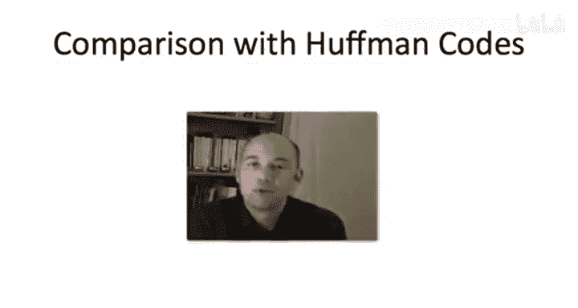

# 算法启蒙：贪心算法和动态规划：第36讲 - 最优二叉搜索树：最优子结构


在本节课中，我们将学习最优二叉搜索树问题，并探讨其最优子结构性质。这是设计动态规划算法的关键一步。

---

## 问题定义

首先，让我们回顾一下最优二叉搜索树问题的正式定义。

我们有 `n` 个对象需要存储在搜索树中。为简化起见，我们按它们的键值顺序将它们命名为 `1, 2, 3, ..., n`。同时，我们被赋予一组频率或权重 `P1, P2, ..., Pn`，这些正数反映了不同对象被搜索的频率。通常，这些概率之和为1，但算法本身不依赖于此，它们可以是任意正数。

我们的目标是输出一棵满足二叉搜索树性质的搜索树，它包含所有对象 `1` 到 `n`。在所有这样的搜索树中，它应该最小化加权搜索时间。加权搜索时间的计算公式为：对每个对象 `i`，将其被搜索的概率 `Pi` 乘以其在树中的搜索时间（即深度 `depth(i)` 加1），然后对所有 `i` 求和。

**公式表示：**
```
最小化： Σ [ Pi * (depth(i) + 1) ]， 其中 i 从 1 到 n
```

---

## 贪心算法为何失效

在上一节，我们介绍了最优前缀码问题，并成功用霍夫曼算法（一种贪心算法）解决了它。本节中我们来看看，对于最优二叉搜索树问题，贪心算法是否同样有效。

一个直观的想法是：我们希望访问频率高的对象靠近树根，频率低的对象位于树的底层（如叶子节点）。基于此，可以设计两种贪心策略：

1.  **自底向上策略**：从最底层开始，将访问频率最低的对象作为叶子节点。这类似于霍夫曼算法的思路。
2.  **自顶向下策略**：将访问频率最高的对象直接放在根节点，然后递归地为左右子树构造最优结构。

然而，这两种策略都是错误的。以下是两个简单的反例：

**反例一（针对自底向上策略）：**
假设有四个对象 `{1, 2, 3, 4}`，其访问频率分别为 `2%`, `23%`, `73%`, `1%`。任何坚持将最低频率对象（1%）放在最底层的贪心算法，可能会产生左边的树（以2为根，4在深度2）。但实际上，最优的是右边的树（以3为根，2%的对象深度反而比1%的对象深），因为访问频率最高的对象（73%）被放在了根节点。

**反例二（针对自顶向下策略）：**
使用同样的四个对象，但改变频率：`{1%, 34%, 33%, 32%}`。贪心算法会选择频率最高的对象2（34%）作为根节点，得到左边的树。但实际上，最优的是右边的平衡树（以3为根，2、3、4各占约三分之一），因为三个高频对象频率相近，平衡树能获得更小的平均搜索时间。

这些反例表明，简单的贪心规则无法解决此问题。问题的难点在于，选择根节点会对左右子树的结构产生难以预测的深远影响。

---

## 转向动态规划与递归思路

既然贪心算法行不通，我们转向动态规划。动态规划的核心是识别最优子结构：最优解是否由子问题的最优解构成？

对于二叉搜索树，其结构天然具有递归性。一个诱人的想法是：**如果我们知道最优树的根节点 `r` 是什么**，那么问题就简化为：
*   为键值小于 `r` 的所有对象（即 `1 ... r-1`）构造一棵最优左子树。
*   为键值大于 `r` 的所有对象（即 `r+1 ... n`）构造一棵最优右子树。

这听起来很熟悉，就像我们之前解决动态规划问题的思路：如果有一个“小提示”告诉我们解决方案的某个关键部分（这里是根节点），我们就可以通过组合子问题的最优解来轻松构建整体最优解。

---

## 最优子结构引理

为了将上述思路形式化，我们需要一个最优子结构引理。以下哪个陈述正确地描述了最优二叉搜索树的结构？

**假设我们有一棵包含键值 `1` 到 `n` 的最优二叉搜索树 `T`，其根节点为 `r`。令 `T1` 为左子树，`T2` 为右子树。那么：**

A. `T1` 和 `T2` 是二叉搜索树。
B. `T1` 和 `T2` 是二叉搜索树，且对于它们各自包含的键值集合是最优的。
C. `T1` 是键值 `1...r-1` 的最优二叉搜索树，`T2` 是键值 `r+1...n` 的最优二叉搜索树。
D. `T1` 是键值 `1...r-1` 的最优二叉搜索树，`T2` 是键值 `r+1...n` 的最优二叉搜索树。

**正确答案是 D。**

解释如下：
*   根据二叉搜索树的性质，左子树 `T1` 必须包含所有键值小于 `r` 的对象，即 `1 ... r-1`。右子树 `T2` 必须包含所有键值大于 `r` 的对象，即 `r+1 ... n`。
*   引理进一步断言，`T1` 不仅是 `1...r-1` 的一棵二叉搜索树，而且是**最优的**（即最小化其内部对象的加权搜索时间）。`T2` 同理。
*   选项A和B不够强，选项C没有明确指出子树包含的确切键值集合。D是最精确、最强的陈述。



这个引理是整个动态规划算法能够工作的基石。如果它不成立，我们将无从下手。

---

## 引理证明概要（思路）

证明采用反证法，思路与我们之前证明其他最优子结构性质类似：

1.  **假设相反**：假设 `T` 是最优树，但其左子树 `T1` 对于键值 `1...r-1` **不是**最优的。那么，存在另一棵针对相同键值集的更优搜索树 `T1‘`（其加权搜索成本更低）。
2.  **构造新树**：我们可以用 `T1‘` 替换 `T` 中的左子树 `T1`，得到一棵新的搜索树 `T‘`。由于 `T1‘` 和 `T1` 包含相同的键值集，且根节点 `r` 不变，`T‘` 仍然是一棵合法的二叉搜索树。
3.  **成本分析**：比较 `T‘` 和 `T` 的总成本。
    *   对于右子树 `T2` 中的所有节点，以及根节点 `r`，它们在两棵树中的深度相同，因此贡献的成本相同。
    *   对于左子树中的节点，在 `T‘` 中的成本严格低于在 `T` 中的成本（因为 `T1‘` 更优）。
4.  **得出矛盾**：因此，`T‘` 的总成本严格小于 `T` 的总成本。这与 `T` 是最优树的假设矛盾。
5.  **结论**：所以，最初的假设错误，`T1` 必须是最优的。同理可证 `T2` 也是最优的。

这个证明确认了我们的直觉：整体最优必然要求局部最优。

---

## 本节总结

本节课中我们一起学习了：
1.  **最优二叉搜索树问题的正式定义**：目标是构建一棵二叉搜索树，最小化给定访问频率下的加权搜索时间。
2.  **贪心算法的局限性**：通过具体反例，我们看到了自顶向下和自底向上贪心策略在此问题上都会失败。
3.  **动态规划的关键思路**：将问题递归分解，关键在于识别根节点。
4.  **最优子结构引理**：一棵最优二叉搜索树的左右子树，必须分别是其对应键值范围（小于根和大于根）内的最优二叉搜索树。这是设计动态规划算法的理论基础。

在下一节中，我们将基于这个最优子结构性质，正式推导出动态规划的状态定义、递推关系，并最终构建出解决最优二叉搜索树问题的算法。