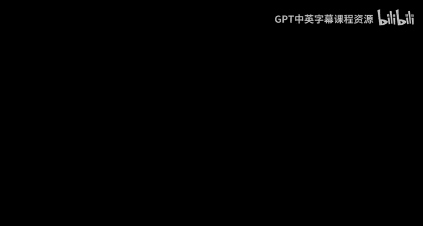
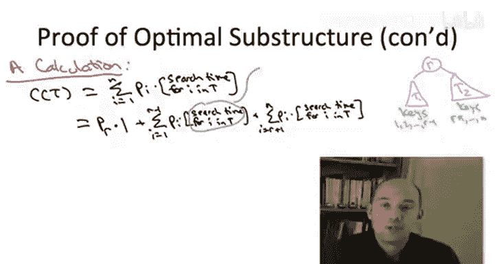

# 算法启蒙（第3册）：贪心算法和动态规划｜P37：最优二叉搜索树：最优子结构证明




在本节课中，我们将学习最优二叉搜索树问题的一个关键性质：最优子结构。我们将通过反证法，详细证明如果一棵树对于所有键是最优的，那么它的左右子树也必然分别是其对应键集上的最优二叉搜索树。理解这个证明是后续设计动态规划算法的基础。

## 证明概述与假设

我们首先设定证明的场景。假设我们有一棵对于键 `1` 到 `n`（对应频率为 `P1` 到 `Pn`）的最优二叉搜索树 `T`。这棵树的根节点是某个键 `r`。

我们想要证明的命题是：树 `T` 的左子树 `T1`（包含键 `1` 到 `r-1`）必须是这些键上的最优二叉搜索树；同时，其右子树 `T2`（包含键 `r+1` 到 `n`）也必须是这些键上的最优二叉搜索树。

我们将采用反证法来证明。这意味着我们假设上述命题不成立，然后推导出一个矛盾。

## 反证法的起点

如果命题不成立，那么至少对于其中一个子问题（`1` 到 `r-1` 或 `r+1` 到 `n`），存在一棵具有更小加权搜索成本的二叉搜索树。我们假设左子树 `T1` 不是最优的来进行证明，右子树的情况完全对称。

因此，如果 `T1` 不是最优的，那么必然存在另一棵针对键 `1` 到 `r-1` 的搜索树 `T1*`，其加权搜索成本比 `T1` 更低。

上一节我们建立了反证的前提，本节中我们将通过构造一棵新的全局树来引出矛盾。

## 构造更优的全局树

现在，我们通过“剪切-粘贴”的方式，用更优的子树 `T1*` 替换掉原树 `T` 中的左子树 `T1`，从而得到一棵新的全局树 `T*`。

为了完成反证（从而证明最优子结构引理），我们只需要证明新树 `T*` 的加权搜索成本严格小于原树 `T` 的成本。这将与 `T` 是最优树的假设相矛盾。

接下来，我们将通过计算来清晰地展示这一点。

## 加权搜索成本的计算与分析

我们首先展开原最优树 `T` 的加权搜索成本的定义。对于树 `T` 中的每个键 `i`，其搜索成本是它的频率 `P_i` 乘以在 `T` 中搜索到它所需的深度（或访问节点数）。

计算的关键在于，我们希望将树 `T` 的总搜索成本用其左右子树 `T1` 和 `T2` 的搜索成本来表达。这样我们就能轻松分析“剪切-粘贴”操作带来的影响。

我们将求和项按三个部分拆分：根节点 `r`、左子树 `T1` 中的键、右子树 `T2` 中的键。

*   **根节点 `r`**：其贡献为 `P_r * 1`，因为根节点的深度为1。
*   **左子树中的键 (`i < r`)**：在树 `T` 中搜索这些键时，你需要先访问根节点 `r`（1次），然后再在子树 `T1` 中搜索。因此，对于 `T1` 中的键 `i`，其在 `T` 中的搜索成本等于 `1 + (在 T1 中搜索 i 的成本)`。
*   **右子树中的键 (`i > r`)**：同理，其在 `T` 中的搜索成本等于 `1 + (在 T2 中搜索 i 的成本)`。

基于以上分析，我们可以将 `T` 的总加权搜索成本 `C(T)` 重写如下：

```
C(T) = P_r * 1 
       + Σ_{i=1}^{r-1} [ P_i * (1 + cost_in_T1(i)) ] 
       + Σ_{i=r+1}^{n} [ P_i * (1 + cost_in_T2(i)) ]
```

接下来，我们展开并合并同类项：

```
C(T) = P_r 
       + Σ_{i=1}^{r-1} P_i + Σ_{i=1}^{r-1} [ P_i * cost_in_T1(i) ] 
       + Σ_{i=r+1}^{n} P_i + Σ_{i=r+1}^{n} [ P_i * cost_in_T2(i) ]
```

现在，让我们审视这四项：



1.  `P_r + Σ_{i=1}^{r-1} P_i + Σ_{i=r+1}^{n} P_i`：这其实就是所有键的频率之和 `Σ_{i=1}^{n} P_i`。这是一个**常数**，与树的结构无关。
2.  `Σ_{i=1}^{r-1} [ P_i * cost_in_T1(i) ]`：这正是左子树 `T1` 的加权搜索成本 `C(T1)`。
3.  `Σ_{i=r+1}^{n} [ P_i * cost_in_T2(i) ]`：这正是右子树 `T2` 的加权搜索成本 `C(T2)`。

因此，我们得到了一个关键公式：

```
C(T) = 常数 + C(T1) + C(T2)
```

这个推导虽然始于最优树 `T`，但其代数过程适用于任何二叉搜索树。对于任何树，其总成本都可以表示为常数加上其左右子树的成本。

## 完成矛盾推导

现在将这个推理应用到我们通过剪切粘贴得到的新树 `T*` 上。`T*` 的根节点同样是 `r`，其左子树是 `T1*`，右子树与 `T` 相同，是 `T2`。因此，它的成本为：

```
C(T*) = 常数 + C(T1*) + C(T2)
```

回顾我们的假设：`T1*` 是比 `T1` 更优的树，即 `C(T1*) < C(T1)`。由于常数项和 `C(T2)` 在 `C(T)` 和 `C(T*)` 中是相同的，我们可以立即得出：

```
C(T*) = 常数 + C(T1*) + C(T2)
      < 常数 + C(T1) + C(T2)
      = C(T)
```

这证明了 `C(T*) < C(T)`。但我们最初假设 `T` 是针对所有键 `1` 到 `n` 的**最优**二叉搜索树，这意味着不可能存在成本比它更低的树。`T*` 的存在与此假设矛盾。

因此，我们最初的假设（`T1` 不是最优的）是错误的。同理可证 `T2` 也必须是最优的。这就完成了最优二叉搜索树具有最优子结构性质的证明。

## 总结

本节课中我们一起学习了最优二叉搜索树最优子结构性质的完整证明。我们通过反证法，假设最优树的子树不是最优的，然后构造出一棵全局成本更低的树，从而引出矛盾。证明的核心步骤是将全局树的搜索成本分解为常数项与其左右子树成本之和。这个性质是后续应用动态规划高效求解最优二叉搜索树问题的基石。