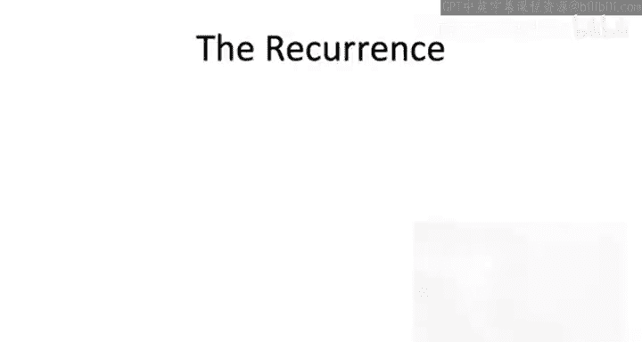
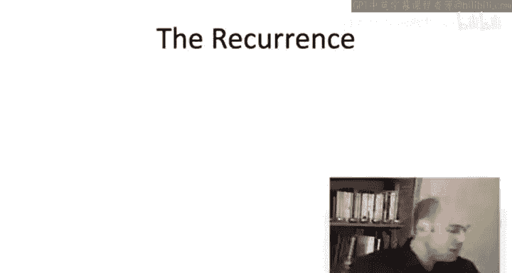

# 算法启蒙（第3册）：贪心算法和动态规划｜Part 3 Greedy算法和动态规划：P38：-38-_ 动态规划算法 1

## 📖 概述
在本节课中，我们将学习如何为最优二叉搜索树问题设计一个多项式时间的动态规划算法。我们将从回顾最优子结构引理开始，识别出所有相关的子问题，并最终形式化一个递推关系，从而系统地计算出所有子问题的最优解。

## 🔍 回顾最优子结构引理
上一节我们介绍了最优二叉搜索树问题的最优子结构。现在我们来快速回顾一下我们在上一个视频中证明的引理。

假设我们有一个针对给定键集合1到n及其概率的最优二叉搜索树，并且这个最优二叉搜索树的根节点是R。那么，根据二叉搜索树的性质，它有两个子树T1和T2。我们知道这两个子树各自包含的确切键集合：T1必须包含键1到R-1（我们通常假设键是按排序顺序排列的），而右子树T2必须包含键R+1到n。此外，T1和T2本身分别是这两个键集合的有效搜索树。最后，我们在上一个视频中证明，它们对于各自的子问题是最优的：T1对于键1到R-1及其对应的权重或概率是最优的，T2对于键R+1到n及其对应的频率是最优的。

## 🧩 识别相关子问题
现在我们已经理解了最优解必须由更小子问题的解以简单方式构成。让我们退一步思考：既然我们最终关心的是原始问题的最优解，那么哪些子问题是相关的？哪些子问题是我们在求解过程中必须解决的？

例如，在线图的独立集问题中，我们观察到，要解决一个子问题，我们需要知道从右侧移除一个或两个顶点后得到的子问题的答案。因此，我们最终关心的是对应于图前缀的所有子问题。在背包问题中，我们需要理解涉及少一个物品和可能减少的剩余背包容量的子问题，这导致我们关心对应于所有物品前缀和所有整数剩余背包容量的子问题的解。在序列比对中，当我们查看子问题时，我们是从一个或两个字符串中移除一个字符，因此我们关心对应于两个字符串各自前缀的子问题。

现在，二叉搜索树问题的一个有趣之处在于，当我们查看最优子结构引理中的子问题时，我们可能会考虑两个子问题，而不仅仅是从右侧移除。我们既关心由左子树诱导的子问题，也关心由右子树诱导的子问题。在第一种情况下，我们查看的是起始物品的一个前缀，这类似于我们在许多例子中看到的情况。但在第二种情况下，对应于子树T2的子问题实际上是我们起始物品的一个后缀。换句话说，我们关心的子问题是通过丢弃起始物品的一个前缀或一个后缀而得到的。

基于最优解的值仅取决于通过丢弃物品前缀或后缀得到的子问题这一观察，请思考以下问题：对于原始物品1到n的哪些子集S，计算仅包含S中物品的最优二叉搜索树的值是重要的？

在解释正确答案（第三个选项）之前，让我先谈谈一个非常自然但不正确的答案，即第二个选项。确实，第二个答案似乎与最优子结构引理有最好的对应关系。最优子结构引理指出，最优解必须由某个前缀的最优解和某个后缀的最优解在一个共同的根R下联合构成。因此，我们肯定关心所有物品前缀和后缀的解，但我们关心的不仅仅是这些。

也许理解这一点最简单的方法是考虑最优子结构引理的递归应用。最终，相关的子问题将对应于在整个递归实现过程中解决的所有不同子问题。让我们考虑递归树中的一个示例路径。在最顶层的递归中，你有整个物品集，假设有100个物品1到100。你正在尝试所有可能的根节点。在某个时刻，你尝试根节点23，看看它的效果如何。你必须递归地调用一次，为物品1到22最优地构建一个搜索树，同样地为物品24到100构建一个搜索树。现在，让我们深入到这个第一个递归调用中，你递归地处理物品1到22。在这里，你再次尝试所有可能的根节点，有22个选择。在某个时刻，你会尝试根节点17，同样会有两个递归调用。第二个递归调用将针对物品18到22，这是传递给这个递归调用的物品（原始物品的一个前缀）的一个后缀。因此，在这个例子中，物品18到22是原始前缀1到22的一个后缀。总的来说，当你思考这个递归的多个层级时，每一步你都在做的是要么从开头删除一块物品（一个前缀），要么从末尾删除一块物品（一个后缀），但你可能会交错进行这两种操作。因此，你并不总是拥有原始物品集的一个前缀或后缀，但正确的是，你将拥有一些连续的物品集合。如果你的子问题中最小的物品是i，最大的物品是j，那么你将拥有介于i和j之间的所有物品。这是因为你只从左侧或右侧移除物品。这就是为什么C是正确答案，你需要比仅仅前缀和后缀更多的子问题。

## 📝 形式化递推关系
好的，识别相关子问题有点棘手，但现在我们已经掌握了它们，动态规划算法将像往常一样水到渠成。相关的子问题集合以一种非常机械的方式解锁了整个范式的力量。现在让我们来填写所有细节。

第一步是形式化递推关系，即给定子问题的最优解如何依赖于更小子问题的值。这将是一个数学公式，编码了我们在最优子结构引理中已经证明的内容。然后，我们将使用这个公式在动态规划算法中填充一个表格，系统地求解所有子问题的值。

让我们引入一些符号来放入我们的递推公式中。

我们将用两个索引i和j来索引子问题，这是因为我们有两个自由度：连续物品区间的起始位置i和结束位置j。

对于给定的i和j的选择（当然i应该小于等于j），我将用大写C_ij表示仅包含从i到j的连续物品集合的最优二叉搜索树的加权搜索成本。当然，权重或概率与原始问题完全相同，它们只是在这里被继承下来，即p_i到p_j。

现在让我们陈述递推关系。对于给定的子问题C_ij，我们将根据更小子问题的最优解来表达最优二叉搜索树的值。最优子结构引理告诉我们如何做到这一点。

最优子结构引理指出，如果我们知道根节点r（这里r将介于物品i和j之间），那么在这种情况下，最优解必须由两个更小子问题的最优解在根节点下联合构成。但我们不知道根节点是什么。这里有j-i+1种可能性，它可以是i到j（包含）之间的任何值。因此，像往常一样，我们将对我们已识别的相对较小的候选集合进行暴力搜索。暴力搜索通过显式地取最小值来编码。

因此，我们选择某个根节点r，介于i和j之间（包含）。给定根节点r的选择，我们将继承仅包含物品i到r-1这个前缀的最优解的加权搜索成本，用我们的符号表示就是C(i, r-1)。同样地，我们获取包含物品r+1到j这个后缀的最优解的加权搜索成本。如果你回顾我们对最优子结构引理的证明，你会看到我们进行了一个计算，给出了树的加权搜索成本如何依赖于其子树的加权搜索成本的公式。除了两个搜索树各自贡献的加权搜索成本外，我们还加上一个常数，即我们正在处理的物品中所有概率的总和。在这里，这个总和是p_k的和，其中k的范围从该子问题的第一个物品i到最后一个物品j。

我们需要处理的一个额外边界情况是：如果我们选择根节点为第一个物品i，那么第一个递归项就没有意义，我们将得到C(i, i-1)，这是未定义的。同样地，如果我们选择根节点为j，那么最后一项将是C(j+1, j)，这也是未定义的。记住，索引应该是按顺序的。因此，在这种情况下，我们只需将这些大写C解释为0。

为什么这个递推关系是正确的？所有繁重的工作都在我们证明最优子结构引理时完成了。我们在那里证明了什么？我们证明了最优解必须是j-i+1种可能情况之一，它只取决于根节点的选择。给定根节点，其余部分就为我们确定了。递推关系通过定义对唯一的候选集合进行暴力搜索，因此它确实是基于更小子问题最优解来表达最优解值的正确公式。

## 🎯 总结
本节课中，我们一起学习了如何为最优二叉搜索树问题构建动态规划算法。我们首先回顾了最优子结构引理，理解了最优解如何由更小子问题的解构成。接着，我们识别出所有相关的子问题，即所有连续的物品区间。最后，我们形式化了一个递推关系，该关系通过尝试所有可能的根节点并组合更小子问题的最优解，来系统地计算任意连续物品区间的最优二叉搜索树成本。这为我们下一步实现具体的动态规划算法奠定了坚实的基础。