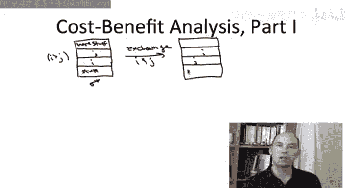
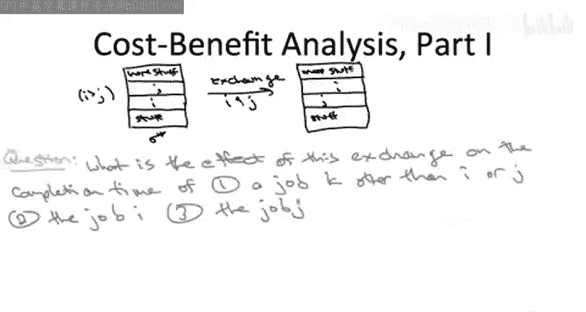
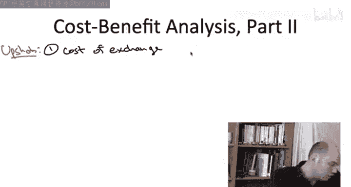
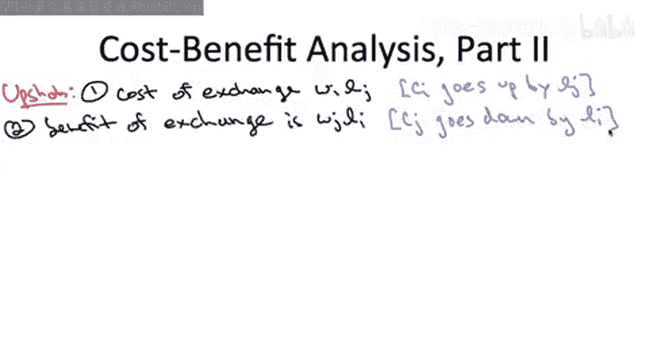
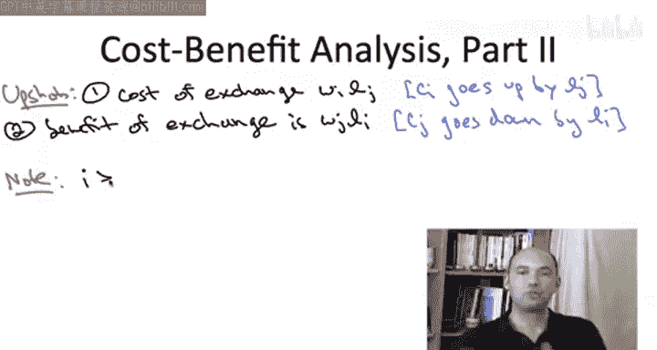
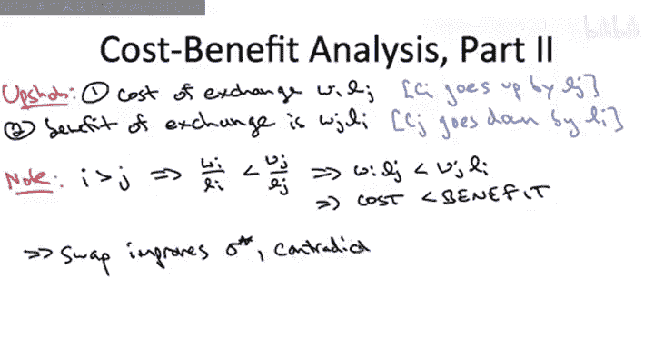

# 算法启蒙（第3册）：贪心算法和动态规划｜Part 3 Greedy算法和动态规划：P5：-05-A 调度应用：正确性证明 - 第二部分

在本节课中，我们将继续学习如何证明最小化加权完成时间总和的贪心算法的正确性。我们将深入分析上一节末尾提出的交换两个作业所带来的影响，并最终完成整个证明。

上一节我们介绍了证明的核心思路：通过反证法，假设存在一个与贪心算法结果不同的最优调度方案，并从中找到一对违反贪心排序规则的连续作业。本节中，我们来看看交换这对作业会对所有作业的完成时间产生何种具体影响。

## 交换作业对完成时间的影响

以下是交换作业 `i` 和 `j` 后，对其他作业完成时间的影响分析：

*   **作业 `i` 和 `j` 之外的作业**：它们的完成时间**不受影响**。因为无论 `i` 和 `j` 的顺序如何，排在它们之前或之后的作业集合没有变化，所以这些作业需要等待的总处理时间保持不变。
*   **作业 `i`**：它的完成时间**增加**。在交换前，`i` 在 `j` 之前完成；交换后，`i` 需要等待 `j` 完成才能开始。具体来说，其完成时间的增加量恰好等于作业 `j` 的长度 `l_j`。
*   **作业 `j`**：它的完成时间**减少**。在交换前，`j` 需要等待 `i` 完成；交换后，`j` 不再需要等待 `i`。具体来说，其完成时间的减少量恰好等于作业 `i` 的长度 `l_i`。

## 成本效益分析

基于以上分析，我们可以对这次交换进行成本效益核算。

*   **成本**：由作业 `i` 的完成时间增加引起。成本值为作业 `i` 的权重 `w_i` 乘以它增加的时间 `l_j`。
    > **成本公式：** `cost = w_i * l_j`
*   **收益**：由作业 `j` 的完成时间减少引起。收益值为作业 `j` 的权重 `w_j` 乘以它减少的时间 `l_i`。
    > **收益公式：** `benefit = w_j * l_i`

## 利用贪心排序规则得出矛盾

现在，我们利用一个关键事实：在假设的最优调度方案 Sigma* 中，作业 `i` 的索引高于作业 `j`（即 `i > j`）。根据我们的索引规则（比值 `w/l` 越高，索引越小），这意味着作业 `i` 的比值严格低于作业 `j` 的比值。

用不等式表示为：
> `w_i / l_i < w_j / l_j`

为了更清晰地比较成本和收益，我们将不等式两边同时乘以 `l_i * l_j` 以消去分母：
> `w_i * l_j < w_j * l_i`

观察这个不等式，它的左边正是我们计算出的**交换成本** (`w_i * l_j`)，而右边正是计算出的**交换收益** (`w_j * l_i`)。

不等式 `w_i * l_j < w_j * l_i` 表明，**交换作业 `i` 和 `j` 所带来的收益大于成本**。这意味着，如果我们对假设的最优方案 Sigma* 执行这次交换，得到的新调度方案的加权完成时间总和将**严格小于**原 Sigma* 的总和。

但这与 Sigma* 是最优方案的假设相矛盾。因此，我们的初始假设（存在一个与贪心算法结果不同的最优调度）是错误的。贪心算法产生的调度方案确实是最优的。

## 总结

本节课中我们一起学习了贪心调度算法正确性证明的第二部分。我们详细分析了交换一对违反贪心规则的作业对整体目标函数的影响，并通过精确的成本效益计算，结合贪心排序规则（按 `w/l` 降序排列），推导出了一个矛盾，从而完成了整个证明。这证实了“按权重与长度比值降序排序”的贪心策略对于最小化加权完成时间总和问题是绝对正确的。