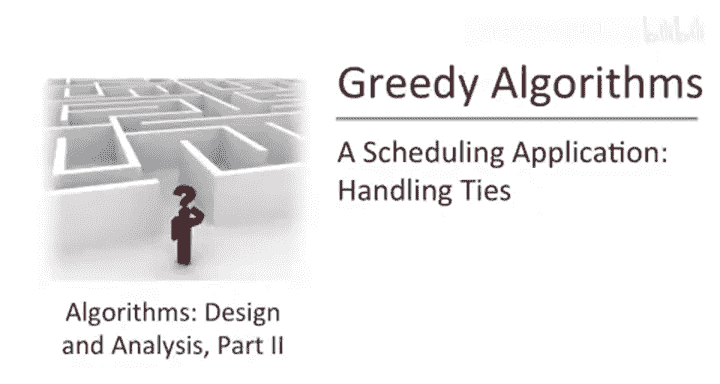
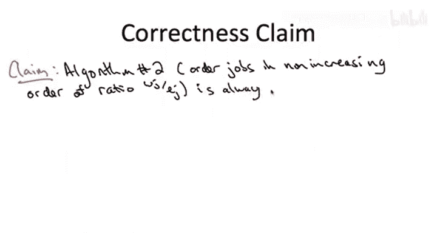
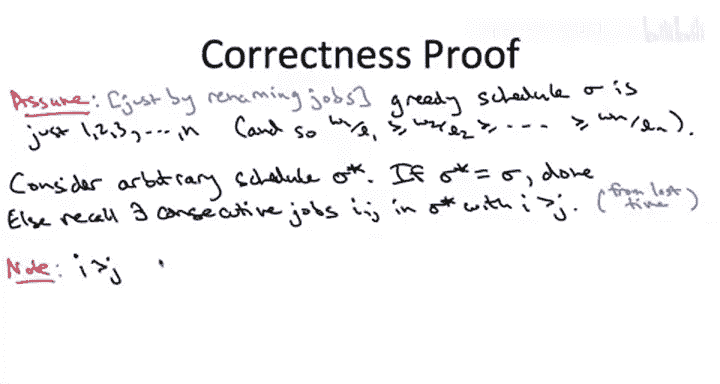
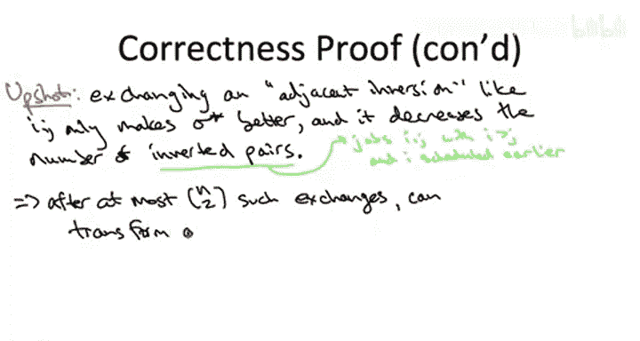

# 算法启蒙（第3册）：贪心算法和动态规划｜Part 3 Greedy算法和动态规划：P6：处理并列情况的调度应用



## 概述
在本节课中，我们将重新审视用于最小化加权完成时间总和的贪心算法。我们将给出一个更健壮、更通用的正确性证明，该证明也能处理不同工作权重与长度比值出现并列的情况。核心概念将通过**公式**和**代码**进行描述。




## 证明计划
上一节我们介绍了在比值互不相同情况下的证明。本节中，我们将采用一个不同的、更通用的证明计划。

我们将证明，对于任意输入实例，贪心算法产生的调度方案 `Sigma` 至少与任何其他调度方案 `Sigma*` 一样好。由于 `Sigma*` 是任意的，这意味着贪心算法的输出是最优的。

## 符号与假设
我们将沿用之前的符号。贪心算法按工作的权重与长度比值 `w_i / l_i` 的非递增顺序（即从大到小）对工作进行排序。当比值相同时，可以任意打破平局。我们将证明，无论如何处理并列情况，算法都是正确的。


为简化表述，我们假设贪心算法的输出顺序恰好是 `1, 2, 3, ..., n`。这只是一个符号上的重命名，不失一般性。

## 关键观察
现在，固定任意一个其他调度方案 `Sigma*`。如果 `Sigma*` 与贪心调度 `Sigma` 完全相同，则无需证明。

如果 `Sigma*` 与 `Sigma` 不同，那么 `Sigma*` 中必然存在一对连续执行的工作 `(i, j)`，其中 `j` 紧接在 `i` 之后执行，但 `i` 的索引（在贪心排序中的位置）高于 `j`。这意味着在贪心排序中，`i` 排在 `j` 之后，因此其比值 `w_i / l_i` 小于或等于 `j` 的比值 `w_j / l_j`。




用公式表示这个关系：
```
w_i / l_i <= w_j / l_j
```
通过交叉相乘，我们得到：
```
w_i * l_j <= w_j * l_i
```

## 交换操作的分析
上一节我们分析了交换一对连续工作的效果。现在，我们考虑交换 `Sigma*` 中的 `i` 和 `j`。

*   **收益**：工作 `j` 的完成时间减少了 `l_i`，因此加权完成时间的总收益为 `w_j * l_i`。
*   **成本**：工作 `i` 的完成时间增加了 `l_j`，因此加权完成时间的总成本为 `w_i * l_j`。

因此，交换 `i` 和 `j` 带来的**净变化**为：
```
净变化 = 收益 - 成本 = w_j * l_i - w_i * l_j
```
根据我们推导出的不等式 `w_i * l_j <= w_j * l_i`，可以得出净变化 `>= 0`。

这意味着，交换这样一个“相邻逆序对”不会使调度方案 `Sigma*` 变得更差。它可能变得更好（如果不等式是严格的），也可能保持不变（如果比值相等，即出现并列）。

## 构造性证明
上一节我们通过反证法得出结论。本节我们将采用一个构造性的论证。

我们注意到，交换一个相邻逆序对有两个关键性质：
1.  它不会使目标函数（加权完成时间总和）变差（`净变化 >= 0`）。
2.  它恰好将逆序对的数量减少 1（因为交换的是相邻的逆序对，不会产生新的逆序）。

以下是证明的核心步骤：
1.  从任意竞争调度 `Sigma*` 开始。
2.  检查 `Sigma*` 是否与贪心调度 `Sigma` (`1, 2, ..., n`) 相同。
    *   如果相同，则 `Sigma*` 不优于 `Sigma`，证明完成。
    *   如果不同，则 `Sigma*` 中必然存在一个相邻逆序对 `(i, j)`。
3.  交换这个相邻逆序对 `(i, j)`。根据分析，得到的新调度 `Sigma*'` 至少和 `Sigma*` 一样好，并且逆序对数量减少 1。
4.  将 `Sigma*'` 作为新的 `Sigma*`，重复步骤 2。

这个过程不能永远持续下去，因为初始的逆序对数量最多为 `n*(n-1)/2`（即所有工作完全逆序排列时）。因此，经过有限次（最多 `n*(n-1)/2` 次）交换后，我们必然会将原始的 `Sigma*` 转换成了贪心调度 `Sigma`。

在整个转换过程中，每一步都没有使调度方案变差。因此，最终的贪心调度 `Sigma` 至少和最初的任意调度 `Sigma*` 一样好。这就证明了贪心算法的最优性。


## 与冒泡排序的类比
熟悉冒泡排序算法的读者可能会发现，上述证明过程本质上是在对竞争调度 `Sigma*` 应用冒泡排序。我们不断地交换相邻的逆序对，最终将其“排序”成贪心顺序 `1, 2, ..., n`，并且在此过程中目标函数值从未增加。这直观地说明了贪心顺序的最优性。



## 总结
本节课中，我们一起学习了如何为处理加权完成时间调度问题的贪心算法提供一个更通用的正确性证明。我们放弃了反证法，转而使用一个构造性的交换论证。我们证明了，通过反复交换竞争调度中的相邻逆序对，可以将其逐步转化为贪心调度，且每一步都不会使解的质量变差。这有力地证明了，无论工作间的权重长度比值是否存在并列，按该比值非递增顺序进行调度的贪心算法总能产生最优解。