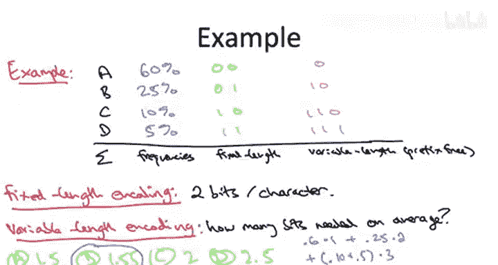

# 算法启蒙（第3册）：贪心算法和动态规划｜Part 3 Greedy Algorithms and Dynamic Programming：P7：-07-HUFFMAN CODES_ Introduction and Motivation

在本节课中，我们将学习贪心算法设计范式的最后一个应用：数据压缩。具体来说，我们将介绍一种用于构建特定类型前缀自由二进制码（称为霍夫曼码）的贪心算法。

我们将用这个视频来铺垫背景知识。

## 二进制码的定义

首先，我们来定义什么是二进制码。二进制码是一种将通用字母表中的符号以计算机能够理解的方式记录下来的方法。它本质上是一个函数，将字母表 `Σ` 中的每个符号映射到一个二进制字符串（即由0和1组成的序列）。

字母表 `Σ` 可以是任何东西。一个简单的例子是小写字母a到z，加上空格和一些标点符号，总共可能有32个符号。

如果你有32个符号需要用二进制编码，一个显而易见的方法是使用长度为5的二进制字符串，因为正好有32个不同的5位二进制串。这样，每个符号都使用相同长度的5位二进制码进行编码。这类似于ASCII码的工作原理，是一种**定长编码**。

## 从定长编码到变长编码

本课程的一个核心思想是：我们何时能比显而易见的解决方案做得更好？在这个上下文中，问题是：我们何时能比定长编码做得更好？

答案是：当某些符号出现的概率远高于其他符号时。在这种情况下，我们可以通过使用**变长编码**，用更少的比特来编码信息。这是一个非常实用的想法，变长编码在实践中被广泛使用，例如在MP3音频文件的编码中。在MP3编码标准中，完成模数转换后，会应用霍夫曼码（即本视频将要教授的内容）来进一步压缩文件长度。压缩，特别是像霍夫曼码这样的无损压缩，是很有益的，因为它能让文件下载更快或文件体积更小。

## 变长编码带来的新问题

从定长编码转向变长编码会带来一个新问题。让我们用一个简单的例子来说明。

假设我们的字母表 `Σ` 只有四个字符：A、B、C、D。
*   明显的定长编码是：A=00， B=01， C=10， D=11。
*   假设我们想使用更少的比特，尝试使用变长编码。一个自然的想法是让其中几个字符只用一个比特。
    *   例如，我们不用`00`表示A，而只用`0`。
    *   不用`11`表示D，而只用`1`。

这似乎只用了更少的比特，应该更好。但问题是：如果有人给你一个编码后的传输序列`001`，原始符号序列应该是什么？

答案是：**无法确定**。原因是，采用变长编码后，现在存在歧义。在这个编码方案下，可能有多个原始符号序列会导致输出`001`。
*   序列`AB`（A=`0`， B=`01`）会得到`001`。
*   序列`AA`（A=`0`， A=`0`， B=`1`？）也会得到`001`。

这与定长编码形成对比。对于定长编码，例如每个符号用5位编码，你只需读取5位就知道是什么符号，再读下5位，依此类推。而对于变长编码，如果没有进一步的预防措施，就不清楚一个符号在哪里结束，下一个符号在哪里开始。这是我们使用变长编码时必须确保解决的一个额外问题。

## 解决方案：前缀自由码

为了解决变长编码中符号边界不清晰的问题，我们将要求我们的变长编码是**前缀自由**的。

这意味着，当我们编码一组符号时，要确保对于原始字母表 `Σ` 中的任意一对符号 `i` 和 `j`，它们对应的编码满足：**任何一个编码都不是另一个编码的前缀**。

回顾上一节的例子，那个编码就不是前缀自由的。例如，`0`（A的编码）是`01`（B的编码）的前缀，这导致了歧义。同样，`1`（D的编码）是`10`（C的编码）的前缀，也导致了歧义。

如果编码是前缀自由的（我们稍后会详细说明），那么就没有歧义。给定一串0和1，就有唯一的方法解码并重建原始的符号序列。

## 前缀自由码的示例

你可能会觉得这个属性太强了。但实际上，存在许多有趣且有用的变长码满足前缀自由属性。

一个简单的例子，还是编码字母A、B、C、D：
*   我们可以让符号A只用一个比特：`0`。
*   为了保持前缀自由，B、C、D的编码都必须以比特`1`开头（否则就会与A的编码`0`构成前缀关系）。
*   我们可以将B编码为`10`。
*   现在，C和D的编码必须既不以`0`开头，也不以`10`开头，也就是说它们必须以`11`开头。
*   我们可以将C编码为`110`，将D编码为`111`。

这样我们就得到了一个变长码，编码长度在1到3位之间变化，并且它是前缀自由的。

## 变长编码的优势：利用符号的非均匀频率

我们可能希望使用变长编码的原因是为了利用给定字母表中符号的非均匀出现频率。

让我们通过一个具体例子来展示这类编码能带来的好处。

继续使用我们的四符号字母表：A、B、C、D。
假设我们通过应用领域的统计知识，确切知道每个符号的出现频率：
*   A是最常见的符号，假设60%的符号是A。
*   B占25%。
*   C占10%。
*   D占5%。

你如何知道这些统计数据？在某些领域，你会有丰富的专业知识（例如在基因组学中，你知道A、C、G、T的通常频率）。对于像MP3文件这样的应用，你可以在完成模数转换后，直接对中间版本的文件进行统计，计算每个符号的出现次数，从而得到精确的频率。

现在，让我们比较两种编码方案的性能：
1.  **定长码**：对四个字符中的每一个都使用2位。
2.  **变长前缀自由码**：如上一节所述，A=`0`， B=`10`， C=`110`， D=`111`。

我们将通过计算**编码一个字符所需的平均比特数**来衡量这些编码的性能，平均值基于四个不同符号的频率。

*   对于定长编码，每个符号恰好使用2位，平均也是2位/字符。
*   对于右侧粉色的变长编码，给定这些符号频率，编码字母表 `Σ` 中的一个字符平均需要多少位？

正确答案是第二个：**平均1.55位/字符**。

计算过程如下：
*   60%的时间（遇到A）只使用1位，这是节省大量比特的关键。
*   25%的时间（遇到B）使用2位。
*   10%的时间（遇到C）使用3位。
*   5%的时间（遇到D）使用3位。
*   加权平均：`0.60 * 1 + 0.25 * 2 + 0.10 * 3 + 0.05 * 3 = 0.60 + 0.50 + 0.30 + 0.15 = 1.55`。

## 算法机会与问题定义

这个例子揭示了一个很好的算法机会：给定一个字母表以及通常不均匀的符号频率，我们现在知道显而易见的定长码方案不一定是最优的。我们可以使用**变长前缀自由码**来改进它。

因此，我们想要解决的计算问题是：**哪一个变长码是最好的？我们如何获得最优压缩？哪个变长码能给出这个字母表中符号的最小平均编码长度？**

**霍夫曼码**就是解决这个问题的方案。我们将在下一个视频中开始构建它。

## 总结

本节课中，我们一起学习了数据压缩的背景知识。我们定义了二进制码，并比较了定长编码和变长编码。我们了解到变长编码在符号频率不均匀时可以更高效，但它带来了解码歧义的问题。为了解决这个问题，我们引入了**前缀自由码**的概念，它确保了编码的唯一可解码性。最后，我们通过一个例子展示了变长前缀自由码如何显著降低平均编码长度，从而引出了寻找最优前缀自由码（即霍夫曼码）的算法问题。