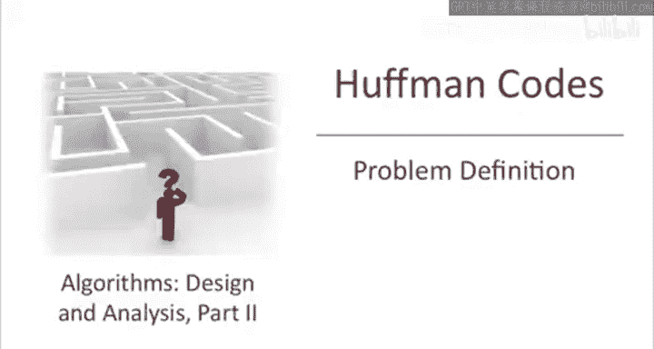
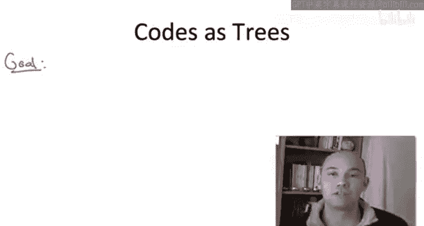
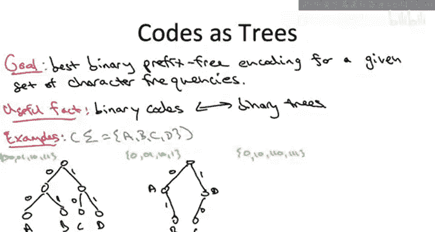
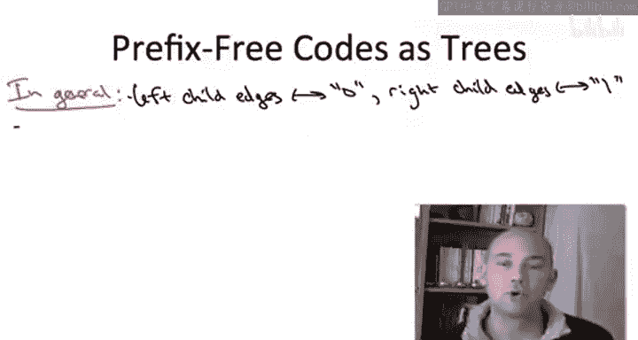
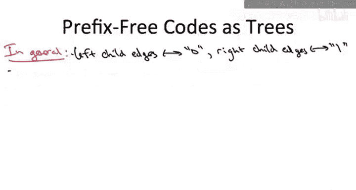
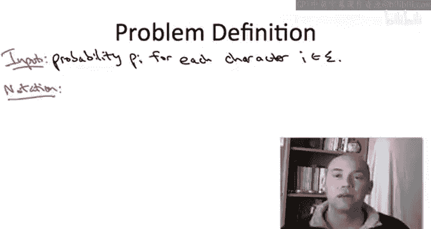
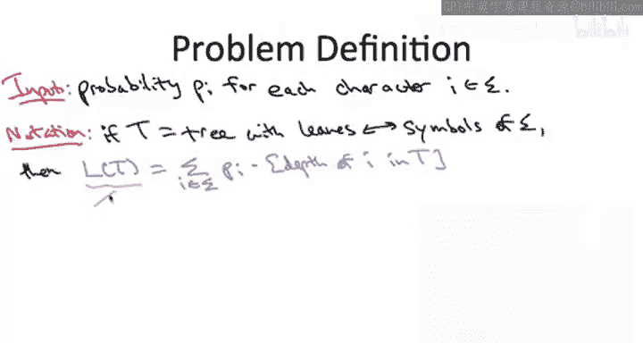
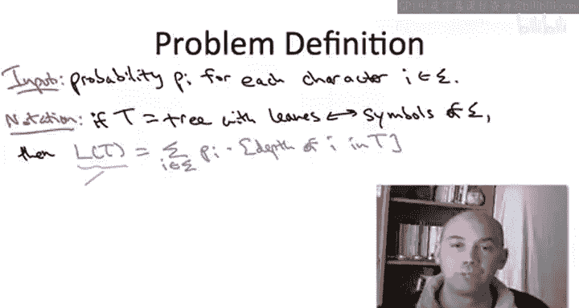
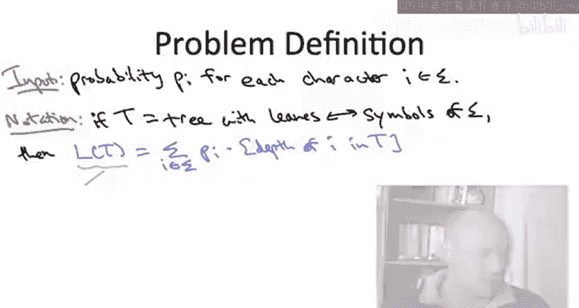

# 算法启蒙（第3册）：贪心算法和动态规划｜Part 3 Greedy Algorithms and Dynamic Programming：P8：-08-HUFFMAN CODES_ Problem Definition

## 📖 概述
在本节课中，我们将学习霍夫曼编码问题的精确定义。我们将理解如何将二进制前缀码与二叉树联系起来，并最终形式化我们的优化目标。

---

## 🌳 将编码视为二叉树
上一节我们介绍了寻找最优二进制前缀码的问题。为了精确地定义这个问题，将编码视为二叉树是非常有用的。本节中，我们将建立这种联系。

任何二进制编码都可以用一棵树来表示。我们约定：指向左子节点的边标记为 `0`，指向右子节点的边标记为 `1`。树中的节点用给定字母表中的符号标记。从根节点到标记为某个符号的节点的路径上的比特序列，就对应于该符号的编码。

以下是三种编码示例及其对应的树形表示：

### 示例1：定长编码
对于字母表 `{A, B, C, D}`，使用编码 `{00, 01, 10, 11}`。这对应一棵有四个叶子的**完全二叉树**。叶子从左到右依次标记为 `A, B, C, D`。路径比特与编码完全一致，例如，到叶子 `C` 的路径是 `右(1)` -> `左(0)`，编码为 `10`。

### 示例2：非前缀码
考虑一个非前缀码：`A=0`, `B=01`, `C=10`, `D=1`。这对应一棵**非完全**的树。关键区别在于，符号 `A` 和 `D` 被标记在了**内部节点**上，而不仅仅是叶子节点。这导致了歧义：比特 `0` 可能代表 `A`，也可能是 `B` 编码 `01` 的前缀。这种歧义在树中表现为符号出现在内部节点。

### 示例3：前缀码
考虑一个前缀码：`A=0`, `B=10`, `C=110`, `D=111`。这对应一棵**所有符号都仅出现在叶子节点**的树。这种结构保证了前缀自由属性：因为没有一个叶子节点是另一个叶子节点的祖先，所以没有一个编码是另一个编码的前缀。

---

## 🔍 树表示法的优势
将编码视为树有两个关键优势。

首先，**前缀自由条件**的检查变得非常直观。在树表示中，前缀自由条件等价于：**所有符号标签必须且仅能出现在叶子节点上**。如果一个符号出现在内部节点，那么它的编码就会成为其子树中其他所有编码的前缀。

其次，**解码过程**在树中变得一目了然。给定一个由 `0` 和 `1` 组成的比特流，解码算法如下：
1.  从根节点开始。
2.  读取下一个比特：
    *   如果是 `0`，则移动到左子节点。
    *   如果是 `1`，则移动到右子节点。
3.  重复步骤2，直到到达一个叶子节点。输出该叶子节点标记的符号。
4.  返回根节点，从步骤1开始处理下一个比特。

例如，使用我们的前缀码解码比特流 `0 1 1 0 1 1 1`：
*   `0` -> 到达叶子 `A`，输出 `A`。
*   `1` -> `1` -> `0` -> 到达叶子 `C`，输出 `C`。
*   `1` -> `1` -> `1` -> 到达叶子 `D`，输出 `D`。
解码结果为 `A, C, D`。整个过程没有歧义。

最后，一个重要的对应关系是：**符号的编码长度等于对应叶子节点在树中的深度**。例如，在我们的前缀码树中，`A` 的深度为1（编码长度1），`B` 的深度为2（编码长度2），`C` 和 `D` 的深度为3（编码长度3）。

---

## 🎯 问题的形式化定义
基于树表示法，我们现在可以给出霍夫曼编码问题的精确定义。

**输入**：
*   一个字母表 Σ，包含 n 个符号。
*   每个符号 i ∈ Σ 都有一个给定的频率（或概率）pᵢ。所有频率之和为 1。

**可行解**：
*   一棵二叉树 T。
*   树 T 的叶子节点与字母表 Σ 中的符号一一对应。这代表了一个**二进制前缀码**。

**目标函数**：
*   我们希望最小化编码的**平均长度** L(T)。
*   平均长度 L(T) 定义为各符号编码长度的加权和，权重即为其频率。

用公式表示如下：

**L(T) = Σ (pᵢ * depth_T(i))**
*   `i` 遍历字母表 Σ 中的所有符号。
*   `pᵢ` 是符号 `i` 的频率。
*   `depth_T(i)` 是树 T 中标记为符号 `i` 的叶子节点的深度（即从根节点到该叶子节点的边数，也就是编码所需的比特数）。

**问题目标**：
在**所有**满足条件的二叉树 T 中，找到使平均编码长度 L(T) **最小**的那一棵树。霍夫曼的贪心算法将为我们解决这个问题。

---

## 📝 总结
本节课中，我们一起学习了霍夫曼编码问题的完整定义。
1.  我们建立了**二进制前缀码**与**二叉树**之间的对应关系。
2.  我们了解到，**前缀自由属性**等价于树中**所有符号标签必须位于叶子节点**。
3.  我们看到了如何利用树进行直观的**解码**。
4.  我们认识到，**符号的编码长度**等于其在树中的**深度**。
5.  最终，我们形式化了问题的**输入**（符号及其频率）、**可行解**（对应前缀码的二叉树）和**优化目标**（最小化加权平均深度 L(T)）。

有了这个清晰的问题定义，我们就可以在接下来的课程中探讨霍夫曼的贪心算法是如何高效地构造出这棵最优树的。