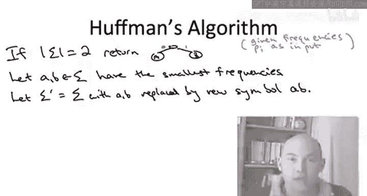

# 算法启蒙（第3册）：贪心算法和动态规划｜Part 3 Greedy Algorithms and Dynamic Programming：P9：-09-HUFFMAN CODES_ A Greedy Algorithm


## 概述 📚

在本节课中，我们将要学习**霍夫曼编码**，这是一种用于数据压缩的**贪心算法**。我们将了解它如何通过构建一棵**最优前缀码二叉树**，来最小化编码的平均长度。

---

## 问题定义与背景

上一节我们介绍了数据压缩和前缀码的基本概念。本节中我们来看看霍夫曼算法要解决的具体计算问题。

问题的输入是字母表 Σ 中每个符号 i 的频率。算法的目标是计算一个**最优编码**。这个编码必须满足以下条件：
*   必须是**二进制**的（只使用0和1）。
*   必须是**前缀码**，即任何两个字符的编码，一个都不能是另一个的前缀。这是为了确保解码时没有歧义。
*   编码一个字符所需的**平均比特数**（根据输入频率加权平均）应尽可能小。

这类编码对应着**二叉树**。前缀码条件意味着字母表 Σ 的符号与树的叶子节点一一对应。每个符号的编码长度等于其对应叶子节点的深度。

我们可以形式化地定义平均编码长度。给定一棵合法的树 T，其平均编码长度 L(T) 为：
`L(T) = Σ (频率_i * 深度_i)`
其中，求和遍历字母表中的所有符号。我们的目标是找到使这个值最小的树 T。

这个任务与我们之前见过的都不同。输入只是一组数字（频率），但我们必须输出一棵完整的树。如何从一堆数字出发，以一种合理、有原则的方式构建出这样一棵树呢？

---

## 构建树的思路：自顶向下 vs. 自底向上

让我们思考一下如何从非结构化的输入构建这棵树。一个很自然但被证明是次优的想法是采用**自顶向下**的方法，这也可以看作是**分治算法设计范式**的一个实例。

分治范式通常包括将给定子问题分解为多个更小的子问题，递归求解，然后将解组合成原问题的解。由于树具有递归子结构，很自然地会考虑将这个范式应用于此问题。具体来说，我们希望依靠递归调用来构建左子树和右子树，然后将结果在一个共同的根节点下合并。

然而，如何将符号分成两组并不明确。一种想法是，为了从编码的第一个比特中获得最大收益（即最多信息），你可能希望将符号分成两组，使每组的总频率尽可能接近50%。

这种自顶向下的方法有时被称为**香农-法诺编码**。但霍夫曼在他的学期论文中发现，自顶向下的方法并非最佳途径。正确的方法是**自底向上**地构建树。这样不仅能得到最优编码，还能得到一个构建速度极快的贪心算法。

---

## 自底向上构建与合并操作

那么，自底向上是什么意思呢？我们首先从一堆节点开始，每个节点标记为字母表中的一个符号。实际上，我们是从树的叶子节点开始，然后进行**连续的合并**。在每一步，我们将当前的两棵子树链接在一起，使它们成为一个新内部节点的左右子树。

让我们通过一个例子来理解。假设我们要构建一棵叶子节点为 A、B、C、D 的树。
1.  第一次合并：将叶子节点 C 和 D 作为兄弟节点链接到一个共同的祖先节点下。
2.  第二步：将叶子节点 B 与上一步得到的子树（包含节点 C、D 及其共同祖先）合并。
3.  最后，我们别无选择，只能将剩下的两棵子树合并，最终得到一棵完整的树。

我希望现在能直观地理解，自底向上的方法是构建具有指定叶子节点集合的系统方法。如果我们有一个包含 n 个符号的字母表，我们就从 n 个叶子节点开始。一次合并操作会引入一个新的、未标记的内部节点，并将两棵旧子树合并为一棵。这样，我们处理的子树数量就减少了一棵。

如果我们从 n 个叶子节点开始，进行 n-1 次连续的合并，一方面我们会引入 n-1 个新的未标记内部节点，另一方面我们会构建出一棵单一的树，这棵树的叶子节点与字母表符号一一对应，正如我们所愿。

---

## 贪心准则：如何选择合并对象？

现在，我不指望你对“我们应该合并什么以及为什么”有任何直觉。即使我们只想设计一个贪心算法，只想做出一个当前看起来不错的短视决策，我们该如何做呢？指导我们合并特定树对的贪心准则是什么？

我们可以用与最小生成树问题类似的方式来重新审视这个困境。当你做出不可撤销的决策时，最担心的是这个决定会在以后回过头来困扰你。你只会在算法结束时才意识到，在算法早期犯了一个可怕的错误。

就像最小生成树问题一样，我们问：什么时候可以确信包含一条边是安全的？在这里，我们必须进行合并。我们想进行连续的合并，如何知道一次合并是安全的，不会妨碍我们最终计算出最优解呢？

以下是一种看待问题的方式，它至少能为我们提供一个关于这个问题的直观猜想（证明将在下一节视频中给出）。

当我们合并两棵子树时，会产生什么影响？每次合并都会引入一个新的内部节点，将这两棵子树统一在其下。在最终的树中，这个节点将成为这两棵子树中所有叶子节点从根到叶路径上的又一个节点。

换句话说，如果你的符号所在的子树与另一棵子树合并了，你会很“沮丧”，因为你的编码中又多了一个比特。在返回最终树根的路上，你又多了一个必须经过的节点。

让我们看一个例子来更清楚地说明这一点。我们使用简单的四字母表 A、B、C、D。
*   初始时，每个符号都是自己的叶子节点，编码长度为 0 比特。
*   第一次合并 C 和 D：引入一个新的内部节点。结果，C 和 D 的编码长度增加了 1 比特。
*   第二次合并 B 与包含 C 和 D 的子树：引入另一个内部节点。这给 B、C、D 的编码各增加了 1 比特。
*   最后一次合并所有内容：每个人的编码长度又增加了 1 比特。

你会发现，一个符号的最终编码长度**正好等于其所在子树所经历的合并次数**。每次你的子树与另一棵子树合并，你的编码就会增加一个比特，因为在通往最终树根的路径上，你会多经过一个内部节点。

在这个例子中，符号 C 和 D 在三次迭代中都经历了合并，所以它们的编码长度是 3。符号 B 只在后两次迭代中被合并，所以编码长度是 2。

这非常有帮助，因为它将我们算法的实际操作（即合并）与我们关心的目标函数（即平均编码长度）联系了起来：**合并会使参与合并的符号的编码长度增加 1**。

---

## 设计贪心启发式算法

这让我们可以过渡到如何设计合并的贪心启发式算法。让我们只考虑第一次迭代。我们有 n 个原始符号，必须选择两个进行合并。记住，合并的后果是，我们选择的两个符号的编码长度将增加 1 比特。

我们想要做的是，根据给定的频率，最小化平均编码长度。那么，我们最不介意让哪一对符号的编码长度增加呢？答案显然是**频率最低**的那对符号。因为增加它们的编码长度，对总平均长度的影响最小。

所以，贪心合并启发式算法就是：**在每一步，合并当前频率最低的两个符号**。这似乎是进行第一次迭代的一个非常好的想法。

接下来的问题是，我们如何递归地进行下去？让我们通过下面的小测验来思考。

---

## 递归与元符号

我们同意贪心启发式算法的第一次迭代将合并频率最低的两个符号，记作 a 和 b。问题是，接下来我们如何取得进一步进展？

一个非常好的做法是，我们能够以某种方式在更小的子问题上进行递归。那么是哪个更小的子问题呢？合并符号 a 和 b 意味着什么？在我们最终构建的树中，由于我们合并了 a 和 b，我们强制算法输出一棵 a 和 b 是兄弟节点（拥有完全相同父节点）的树。

这意味着 a 和 b 的编码除了最低位比特外，其余部分将完全相同。a 的编码是一串比特后跟一个 0，b 的编码是相同的前缀比特后跟一个 1。因此，对于我们的递归，我们可以将它们视为**同一个符号**。

我们引入一个新的**元符号**，称之为 ab，它代表 a 和 b 的结合，意味着它代表了 a 或 b 中任意一个的所有出现频率。

但请记住，我们研究的计算问题的输入不仅仅是字母表，还有该字母表中每个符号的频率。那么，当我们引入这个新的元符号 ab 时，我们应该为这个元符号定义什么频率呢？

根据合并操作的语义，为了使递归有意义，我们应该将这个新元符号的频率定义为它所替代的两个符号的频率之和。因为元符号 ab 旨在代表 a 和 b 的所有出现，所以应该是它们的频率之和。

---

## 霍夫曼算法描述

我现在准备正式描述霍夫曼的贪心算法。让我先通过一个例子来描述，然后通用的代码就会不言自明。

我们使用通常的例子：字母 A、B、C、D，频率分别为 60、25、10、5。
1.  我们从每个符号作为自己的节点开始，标注频率。
2.  贪心启发式算法说，首先合并频率最小的两个节点，即 C(10) 和 D(5)。
3.  合并后，我们用元符号 CD（频率 15）替换它们。
4.  现在，我们运行贪心算法的下一次迭代，合并当前频率最小的两个节点：B(25) 和 CD(15)。
5.  现在我们只剩下两个符号：原始符号 A(60) 和元符号 BCD(40)。
6.  当只剩下两个节点时，这就是霍夫曼算法的基础情况。只有一种合理的方式来编码它们：一个为 0，一个为 1。递归调用返回一棵有两个叶子节点（A 和 BCD）的树。
7.  随着递归的展开，我们实际上“撤销”合并。对于每次合并，我们对相应的元节点进行拆分，用一个内部节点和两个子节点（对应合并成该元节点的符号）来替换它。
    *   首先，拆分 BCD 节点，得到左子节点 B，右子节点 CD。
    *   然后，拆分 CD 节点，得到左子节点 C，右子节点 D。

最终，我们得到了一棵完整的霍夫曼编码树。

---

## 通用算法伪代码

根据具体例子的讨论，霍夫曼算法的通用伪代码如下：

```
function Huffman(字母表 Σ, 频率数组 f):
    if |Σ| == 2:
        返回一棵树，有两个叶子节点，分别标记为 Σ 中的两个符号
    else:
        令 a 和 b 为 Σ 中频率 f[a] 和 f[b] 最小的两个符号
        定义新的字母表 Σ' = Σ \ {a, b} ∪ {ab} // 移除 a, b，添加元符号 ab
        定义新频率 f'[ab] = f[a] + f[b]
        对于 Σ' 中其他符号 x，f'[x] = f[x]
        // 递归求解更小的子问题
        T' = Huffman(Σ', f')
        // 将解 T' 扩展为原问题的解
        在 T' 中找到标记为 ab 的叶子节点
        将该叶子节点替换为一个新的内部节点
        令该内部节点的左子节点为标记 a 的新叶子节点
        令该内部节点的右子节点为标记 b 的新叶子节点
        返回修改后的树 T'
```



---

## 总结 🎯

本节课中我们一起学习了**霍夫曼编码算法**。我们了解到：
1.  该算法采用**自底向上**的构建方式，通过连续的**合并**操作来构建前缀码二叉树。
2.  其核心的**贪心选择**是：在每一步，总是合并当前**频率最低**的两个符号（或子树）。
3.  为了实现递归，算法引入了**元符号**的概念，其频率为合并符号的频率之和。
4.  霍夫曼算法能高效地产生**最优前缀码**，从而最小化数据的平均编码长度。

与所有贪心算法一样，我们可能有直觉认为这是个好主意，但需要严谨的论证来确保其最优性，这将是下一节视频的主题。