# 算法启蒙（第4册）：NP难｜Part 4 Algorithms for NP-Hard Problems：1：概述与预备知识 🎯

在本节课中，我们将学习《算法启蒙》第四册的概述，了解课程内容、学习目标以及学习本课程所需的预备知识。我们将探讨NP难问题的本质，以及面对这类问题时算法设计者可以采取的策略。

## 课程概述

本书的主题是NP难问题及其应对方法。现实世界中出现的许多计算问题都属于所谓的NP难问题。我们相信，这类问题无法通过前几册书中介绍的“始终正确且快速”的算法来解决。这意味着，当你在自己的项目中遇到NP难问题时，必须在**正确性**或**速度**上做出妥协。

### 妥协于正确性：快速启发式算法

如果你选择妥协于正确性，你将进入快速启发式算法的领域。这类算法总是能快速运行，但在某些情况下可能无法输出正确的解。算法设计者的目标是设计一个至少在某种意义上是近似正确的快速启发式算法。

我们将重新审视一个古老的算法设计范式——**贪心算法**，并探讨其在设计快速启发式算法中的应用。我们还将学习一种你可能未曾接触过的技术——**局部搜索**，它在实践中对许多NP难问题非常有效。

以下是本部分将涉及的案例研究：
*   旅行商问题
*   调度问题
*   团队招聘问题
*   社交网络中的影响力最大化问题

### 妥协于速度：精确但可能较慢的算法

另一种选择是妥协于速度。这里你将设计一种始终保证正确的算法，但它并非在所有输入上都能快速运行，甚至在某些情况下可能需要指数时间。此处的目标是设计一个至少比穷举搜索等朴素算法有所改进的算法。

我们将再次回顾**动态规划**这一算法设计范式，并探讨其在改进NP难问题穷举搜索方面的应用。同样，我们还将学习一些新工具，特别是针对**混合整数规划**和**可满足性问题**的先进求解器。

以下是本部分将涉及的案例研究：
*   旅行商问题（再次探讨）
*   在蛋白质-蛋白质相互作用网络中寻找信号通路
*   几年前美国进行的一项涉及无线频谱的高风险拍卖

### 识别NP难问题

本书还将赋予你识别NP难问题的能力，这对于实际工作至关重要。你不希望无意中浪费时间，为一个可能根本不存在“始终正确且快速”算法的问题去设计这样的算法。

你将熟悉几个著名的NP难问题，例如：
*   可满足性问题
*   图着色问题
*   哈密顿路径问题

通过实例，你还将学习NP难归约的技巧，从而具备证明新问题也是NP难的能力。

### P vs NP 问题

最后，如果你曾听说过P与NP猜想并想知道它究竟是什么，本课程也将对此进行讲解。

## 详细内容概览

上一节我们介绍了课程的整体目标，本节中我们来看看各章节的详细内容安排。

### 第19章：什么是NP难问题

第19章将宏观地解释什么是NP难问题，它对算法设计者意味着什么，以及处理NP难问题时可用的工具。本章还将提供一个简单的“食谱”，帮助你在工作中识别NP难问题。

本章的目标是双重的：
1.  在学完本章后，你将获得对NP难问题准确但较为浅显的理解，这本身已非常有用。
2.  本章将为你奠定基础，为后续章节的深入学习提供背景。

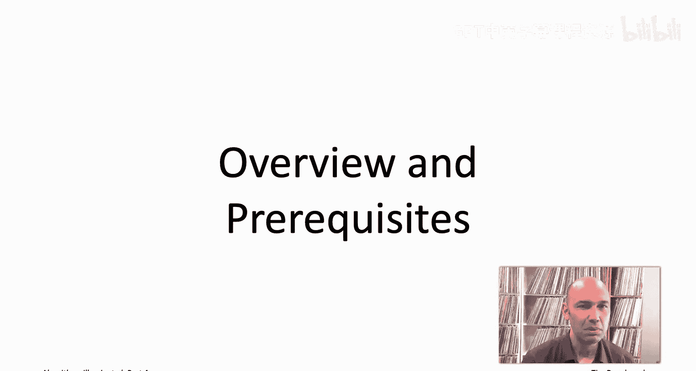

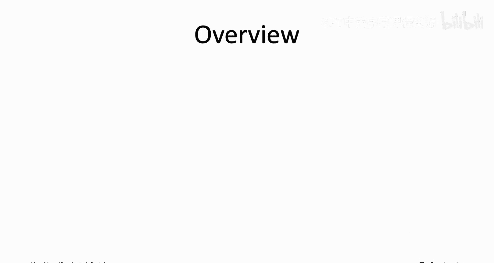

### 第20章：妥协于正确性

第20章将探讨妥协于正确性的策略，即研究那些保证快速运行，但仅在某种意义上是近似正确的算法。

本章前半部分将聚焦于具有可证明性能保证的启发式算法，主要使用贪心算法来保证解接近最优。
本章后半部分将讨论局部搜索及其变体，它们通常没有可证明的保证，但在实践中对解决许多NP难问题却异常有效。

### 第21章：妥协于速度

第21章将讨论处理NP难问题的另一种妥协方式——妥协于速度。你希望算法始终正确，但愿意接受它有时会运行超过多项式时间。

本章前半部分将讨论具有可证明保证的算法，展示动态规划算法如何为一些有趣的问题（包括旅行商问题）改进穷举搜索。
本章后半部分将探讨一些在实践中同样异常有效但缺乏可证明保证的方法，特别是针对混合整数规划和可满足性问题的先进求解器。

第20章和第21章旨在丰富你的算法工具箱。如果有人给你一个问题并告诉你它是NP难的，你就知道该怎么做，有一些工具可以尝试。

### 第22章：识别NP难问题

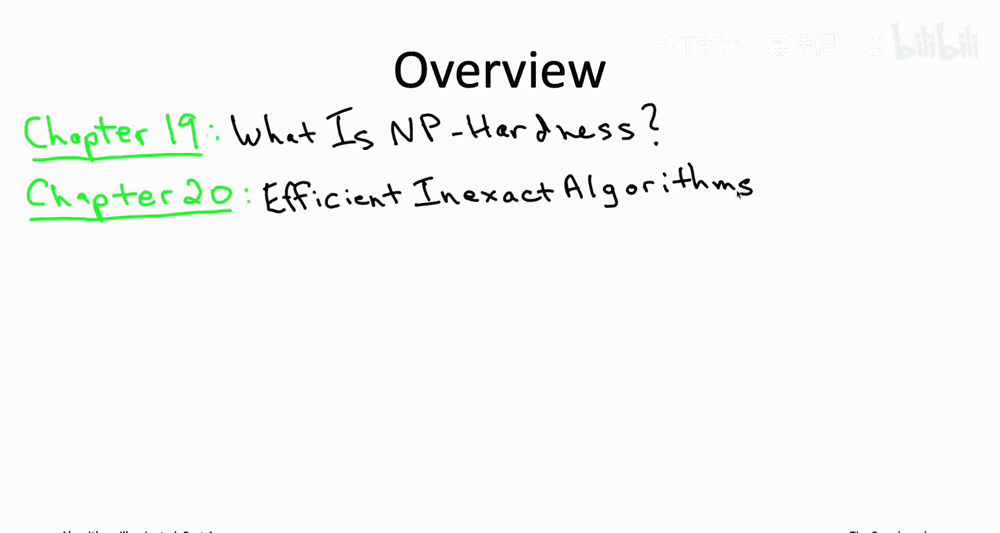

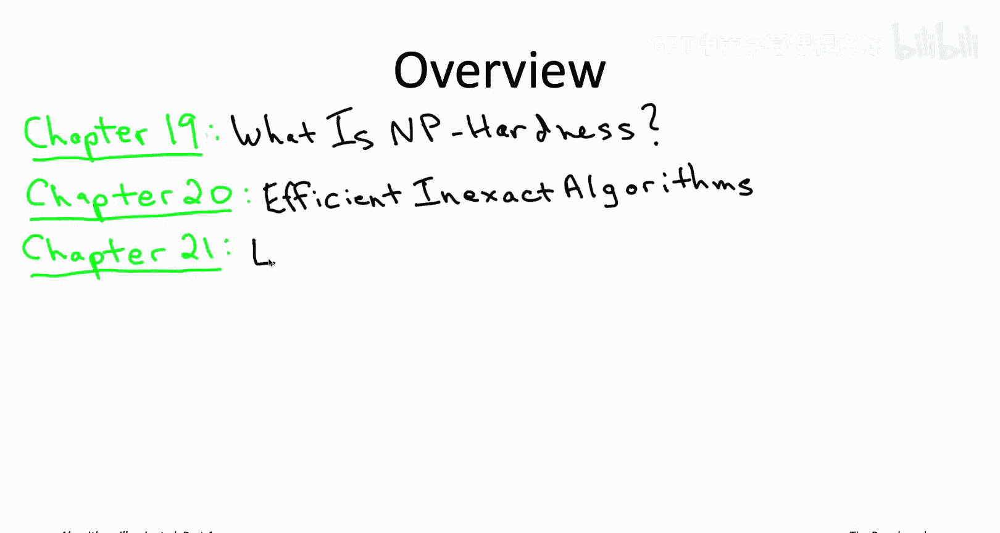

但还有一个问题：如果遇到一个问题，你不知道它是否是NP难的，你如何判断是应该应用刚刚学到的新工具箱，还是回到设计快速精确算法的旧工具箱呢？这正是第22章要解决的问题。

本章旨在赋予你快速识别NP难问题的能力。这样，无需他人告知，你就能自己判断问题是否为NP难。如果是，你就可以运用在前两章中学到的技能。

### 第23章：深入理解（可选）

在前四章（19-22）中，对NP难问题的浅显理解足以满足我们的讨论需求。作为算法设计者，如果你只想用NP难理论来指导如何处理各种问题，浅显的理解就足够了。

然而，如果你想知道更多，比如NP和NP难的数学定义究竟是什么，或者你想了解P与NP猜想及其现状，我们将在第23章讨论所有这些内容。这是一组可选视频，适合那些希望深入数学原理的学习者。我们将重点介绍P与NP猜想以及一些更强的变体，如指数时间假说。

### 第24章：案例研究：高风险的频谱拍卖

作为“甜点”，最后一章（第24章）将探讨这个算法工具箱在一个涉及数百亿美元的真实高风险应用中的实践。

该应用涉及美国联邦通信委员会在2016年至2017年间进行的一次拍卖，目的是出售无线频谱许可证。政府希望一次性将大量许可证出售给出价最高者。

事实证明，用于此应用的拍卖从根本上涉及计算困难的问题，即NP难问题。因此，在2016年实际部署的拍卖实现中，使用了本课程中将学到的工具箱中令人惊讶的广泛部分。

在这个案例研究中，我们将看到从图着色问题，到基于贪心算法的快速启发式算法，再到可满足性求解器的使用。这一切旨在将本书和本课程的所有主题汇集在一起，同时也希望向你展示，到本课程结束时你将掌握的是一套相当复杂的工具箱，它能在重要应用中成为决定成败的关键技能。

## 预备知识

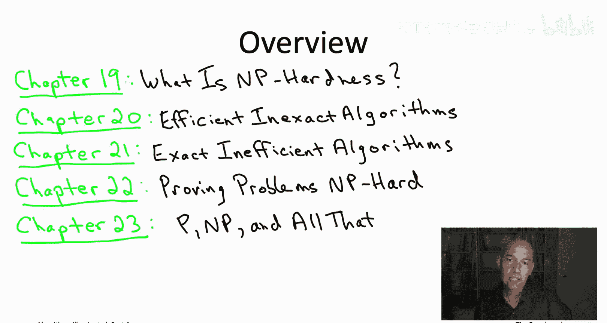

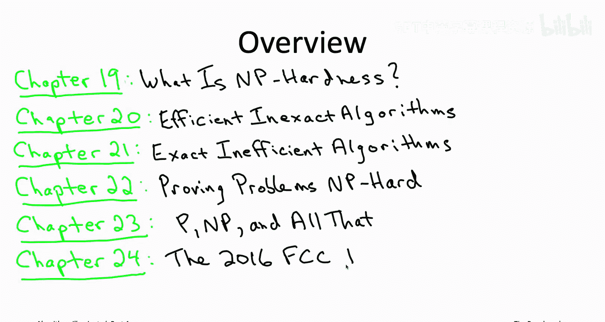

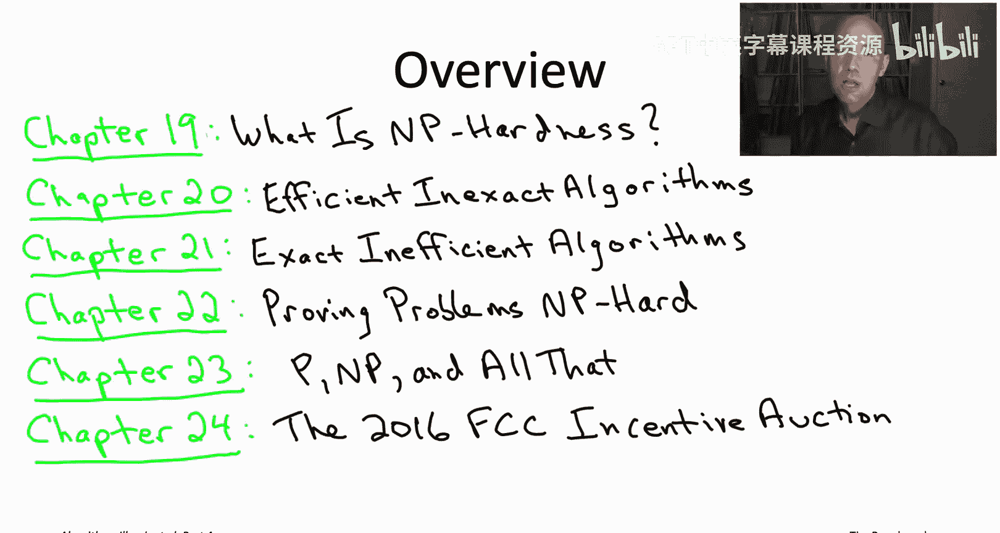

本课程是四册系列中的第四部分，因此我将假设你对前几部分的一些最重要概念有基本的了解。

以下是所需的基础知识：
*   **渐近记法**：特别是用于分析算法运行时间的大O记法。
*   **基本数据结构**：例如堆或搜索树。
*   **图论基础**：例如，你可以使用广度优先搜索或深度优先搜索算法高效地搜索图，并且可以使用迪杰斯特拉等算法计算最短路径。
*   **算法设计范式**：例如，一些贪心算法和动态规划算法的例子。

你不需要是数学天才才能学完本课程，但我希望你对数学不完全陌生。

以下是所需的数学基础：
*   如果你在幻灯片上写下求和符号来对一系列数字求和，我希望你以前见过。
*   希望你见过归纳证明和反证法的例子。
*   如果我写下对数函数或指数函数，希望这不会让你感到太害怕。

你可以通过观看前三册的视频、阅读本系列的前几本书，或者很久以前通过其他教材学习过课程来获得这些背景知识。无论你如何获得这些背景知识，这都很好，这就是我期望你在学习本课程前已经掌握的内容。

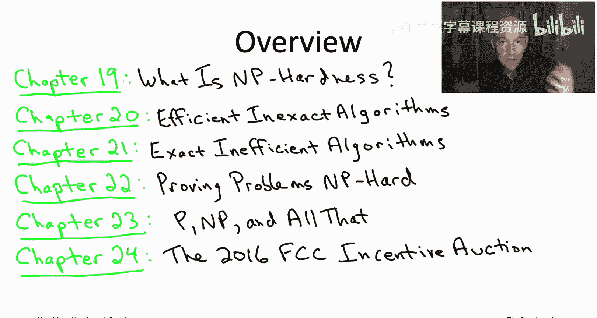

## 总结

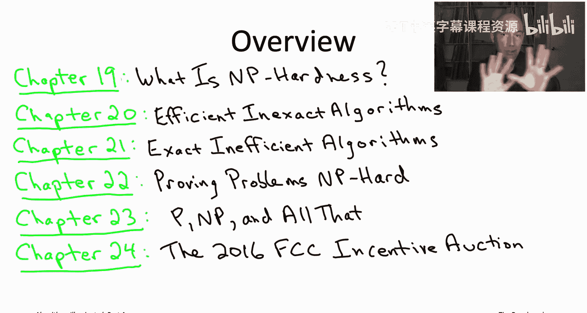

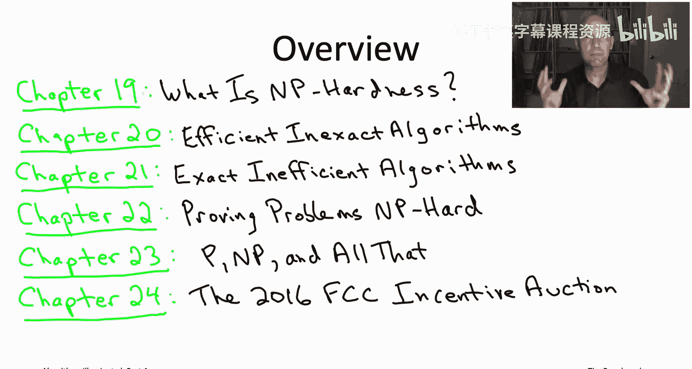

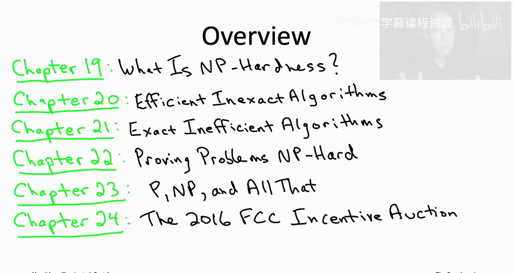

本节课中我们一起学习了《算法启蒙》第四册的课程概述。我们了解到，本课程将聚焦于NP难问题，并探讨两种主要的应对策略：妥协于正确性的快速启发式算法，以及妥协于速度的精确算法。我们还将学习如何识别NP难问题，并可选地深入理解其背后的数学理论。最后，我们将通过一个真实的频谱拍卖案例，看到所学工具箱的综合应用。要学习本课程，你需要具备算法、数据结构和基本的数学知识作为预备。