# 算法启蒙（第4册）：NP难｜Part 4 Algorithms for NP-Hard Problems：19.2：可能的专业水平层级 🎯

在本节课中，我们将学习如何界定你在掌握NP难问题及其算法含义方面所追求的专业水平层级。我们将探讨从零基础到专家级别的不同阶段，并明确每个阶段所需的知识和技能。

## 概述

本节内容旨在帮助你识别自己当前所处的专业水平，并明确未来希望达到的目标层级。理解这些层级有助于你规划学习路径，高效地投入时间。

## 专业水平层级详解

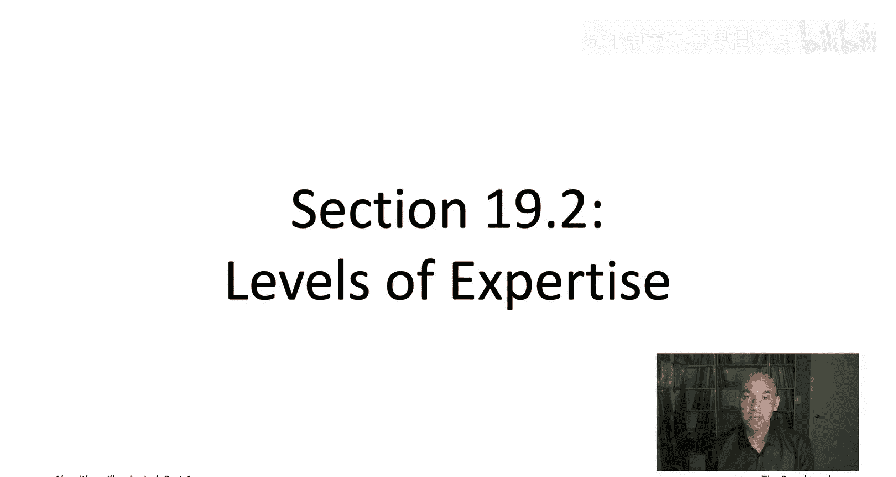

上一节我们介绍了本节的主题，本节中我们来看看具体的专业水平层级划分。

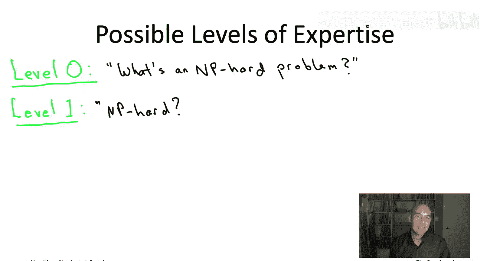

### 层级 0：完全不了解

在层级0，你从未听说过NP难问题。你不知道某些计算问题本质上是棘手的，无法用快速算法解决。当然，如果你遇到这些问题，你也不知道该如何处理。

### 层级 1：初步认知（鸡尾酒会水平）

达到层级1意味着你对NP难问题有了初步的认知。如果有人在谈话中提到它，你大致能明白他们在说什么。以下是该层级的关键认知：

*   你知道NP难问题通常被认为是“困难”的。
*   你理解“NP难”这个标签意味着，对于大规模问题实例，可能不存在既快速又总能给出正确答案的算法。
*   你知道，如果你在工作中遇到一个被标记为NP难的问题，你需要采取行动。你可能需要重新表述问题、降低解决问题的期望，或者投入更多资源（包括人力和计算资源）。

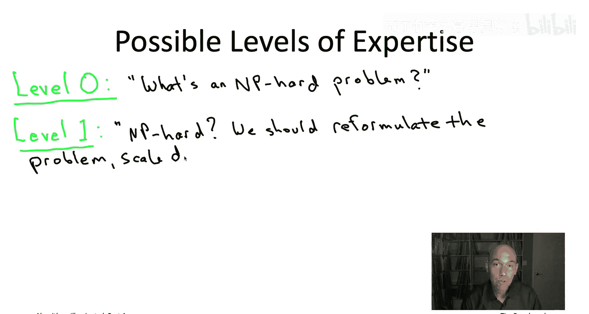

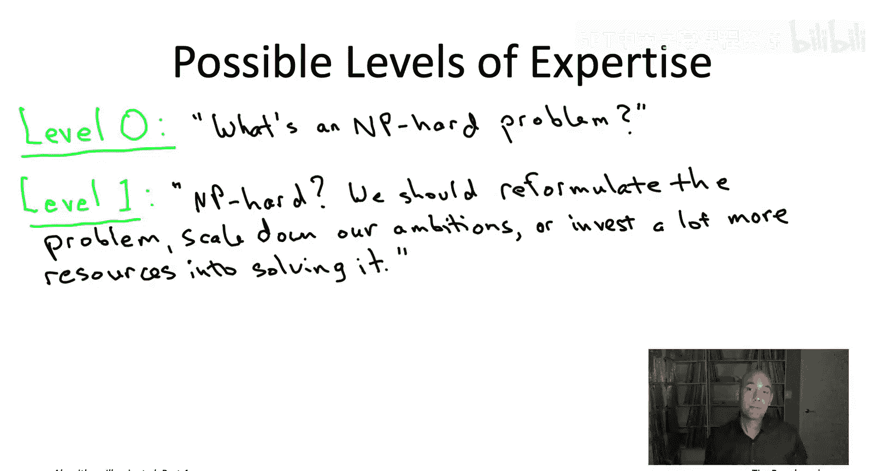

例如，如果你管理的软件项目涉及算法组件，当团队工程师告诉你他们遇到了一个NP难问题时，你至少需要具备层级1的专业知识来理解情况的严重性。

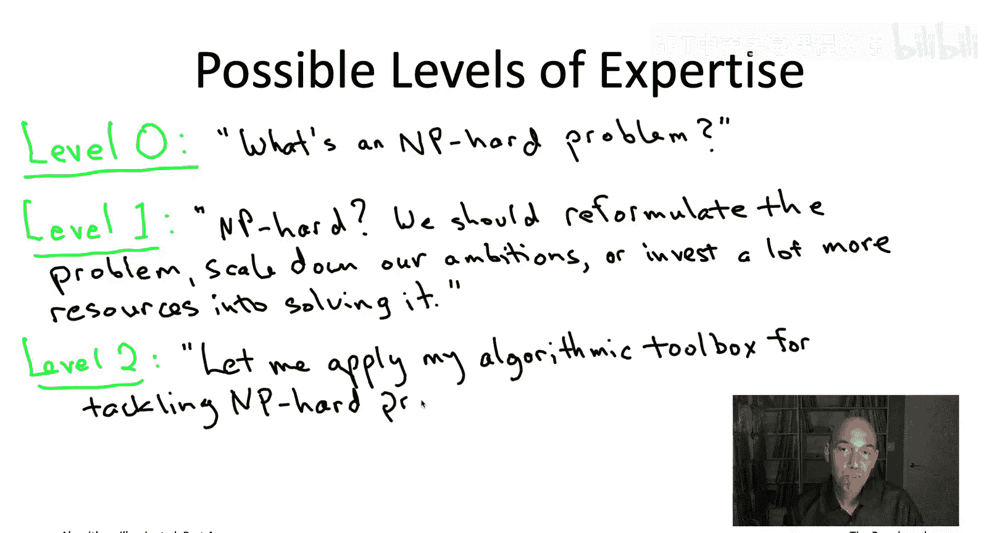

如果满足于停留在层级1，阅读本书第19章或观看对应的初始系列视频就足够了。

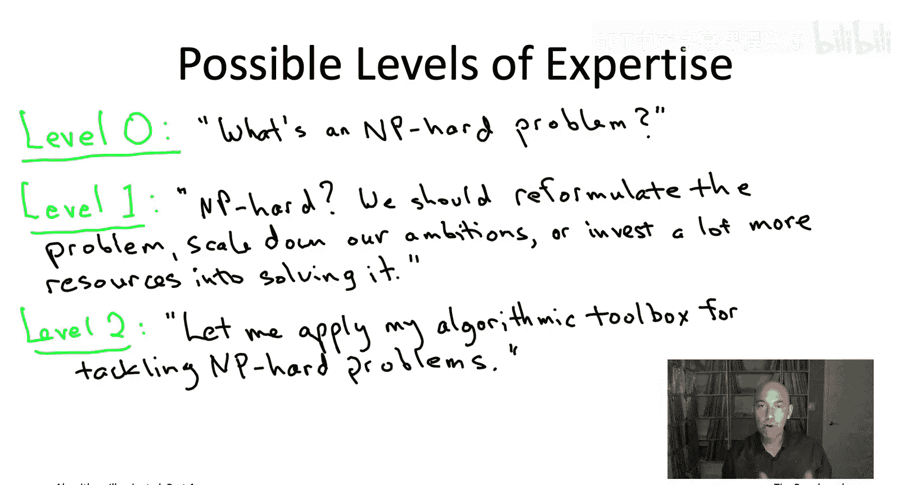

### 层级 2：算法工具箱（赋能工程师）

对于对算法感兴趣的软件工程师而言，达到层级2可能是最具赋能性的。在此层级，你拥有丰富的算法工具箱，可以在自己的项目中遇到NP难问题时取得进展。

令人高兴的是，本系列前几册书中出现的所有算法设计范式，尤其是**贪心算法**和**动态规划**，也将成为应对NP难问题的工具箱的一部分。我们还将看到一些新工具加入，例如**局部搜索**和**混合整数规划求解器**。

要将你的水平提升到层级2，你需要阅读本书第20章和第21章，或观看对应的视频。第20章专注于**启发式算法**（即放弃绝对正确性以保留速度），而第21章则探讨相反的折衷方案（即始终保持正确，并希望比朴素的穷举搜索做得更好）。

### 层级 3：问题诊断专家

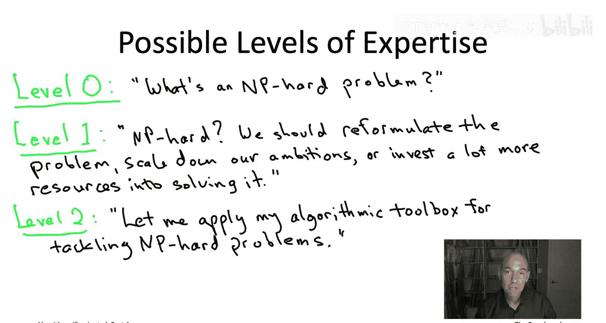

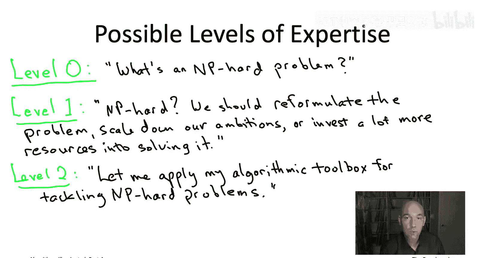

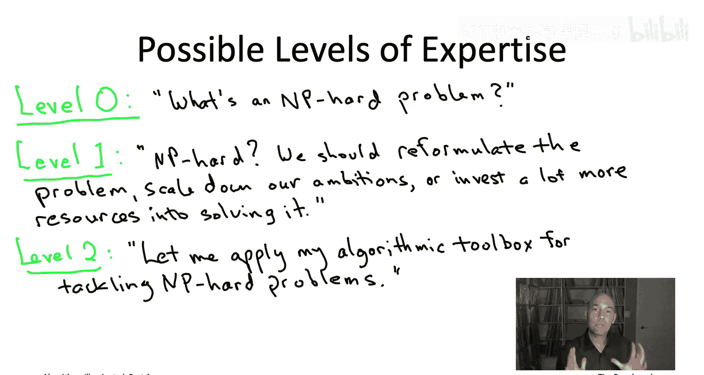

在层级3，你不仅知道遇到NP难问题时该怎么做，还知道如何识别它们。在此层级，你的同事会带着问题来找你，帮助你诊断他们是需要更努力地思考一个快速且正确的算法，还是该问题确实是NP难的。

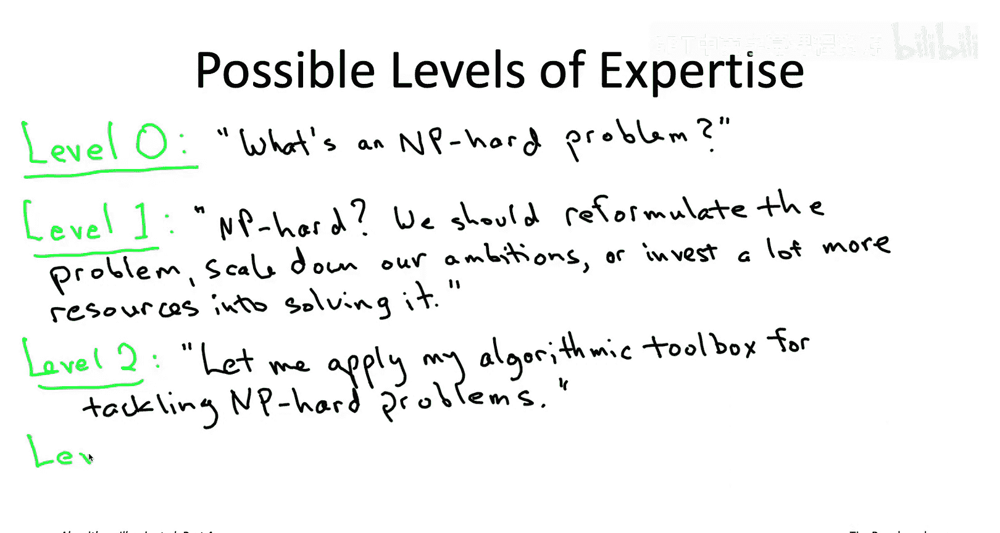

可以想象，当我为学生、同事或行业人士提供建议时，我经常同时运用层级2和层级3的工具箱。当然，一旦你运用层级3的工具箱确定问题是NP难的，你就可以切换到层级2的工具箱，设计算法在NP难的前提下尽力做到最好。

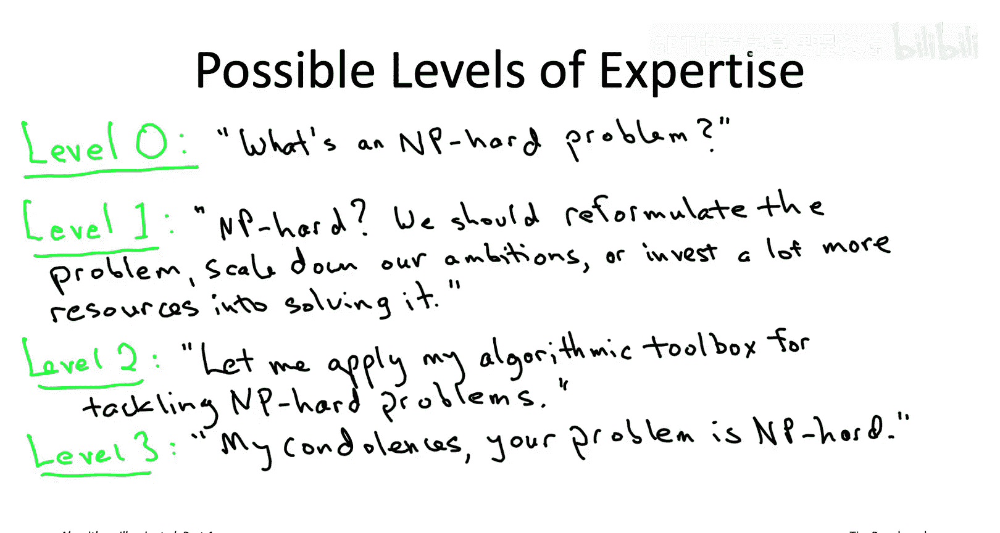

### 层级 4：黑带大师级（理论理解）

最后是NP难问题的黑带大师级，即层级4。这适用于初露头角的理论家，或那些真正希望从数学上深入理解NP难性和P与NP猜想本质的人。

在此层级，你可以拿起记号笔走到白板前，向你的同事准确解释整个“P与NP”问题。这将由第23章对应的可选视频涵盖。不阅读第23章，你也能完美理解本书的其他所有内容；但如果你想要更深入的数学理解，那么一定要查看第23章对应的视频。

## 总结

本节课中我们一起学习了关于掌握NP难问题的五个专业水平层级：

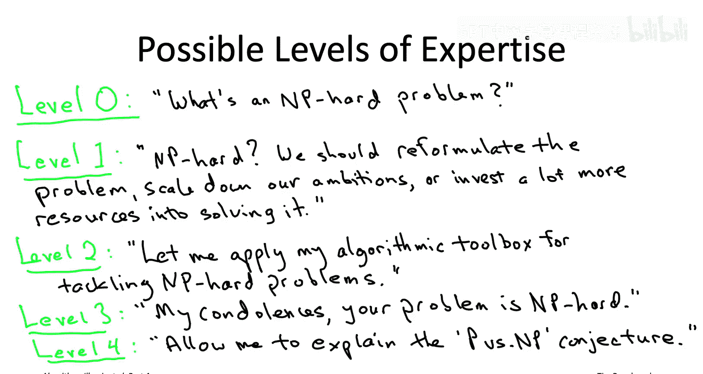

*   **层级0**：完全不了解。
*   **层级1**：具备初步认知，知道NP难意味着什么及其影响。
*   **层级2**：掌握实用的算法工具箱，能对NP难问题取得实际进展。
*   **层级3**：能够诊断并识别NP难问题。
*   **层级4**：具备深入的理论理解，能解释P与NP等核心概念。

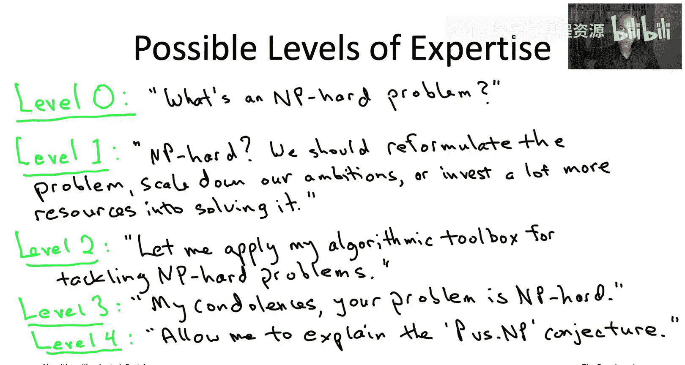

你应该根据自己愿意投入的时间以及认为值得达到的水平，来决定瞄准哪个层级。希望这些视频能帮你厘清最优的时间投入方式，让你根据想要达到的水平，明确知道该阅读什么和观看什么。

明确了这些层级之后，现在让我们进入第19章的核心内容，开始建立关于“简单问题”和“困难问题”含义的非正式理解。我们下节课见。