# 算法启蒙（第4册）：NP难｜Part 4 Algorithms for NP-Hard Problems：19.4：NP难问题的算法策略 🛠️

在本节课中，我们将要学习面对NP难问题时，可以采取的三种核心算法策略。这些策略通过在不同方面做出妥协，使得我们能够在实践中处理这些计算上棘手的问题。

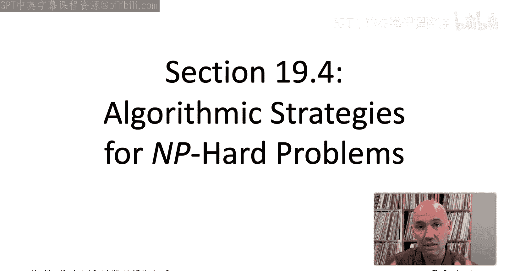

## 概述

NP难问题在现实世界中非常普遍。假设你在一个项目中遇到了一个对项目成功至关重要的计算问题，但尝试了所有已知的算法设计范式、数据结构和基础原语后，仍然找不到高效的算法。最终，你意识到这个问题是NP难的。这解释了之前的努力为何失败，但问题本身并未消失。好消息是，NP难并不意味着完全无解。通过应用足够的算法技巧和资源，我们通常可以在实践中（至少近似地）解决这些问题。NP难性对算法设计者提出了挑战，并设定了合理的期望：我们不应期望找到像排序、最短路径或序列比对那样既快速又永远正确的“完美”算法，除非处理的是非常小或结构特殊的实例。

## 三种妥协策略

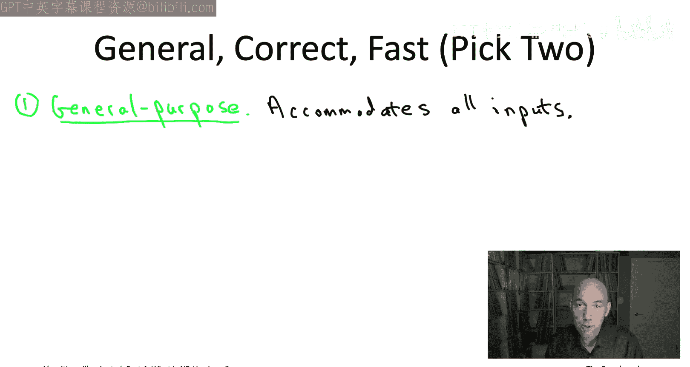

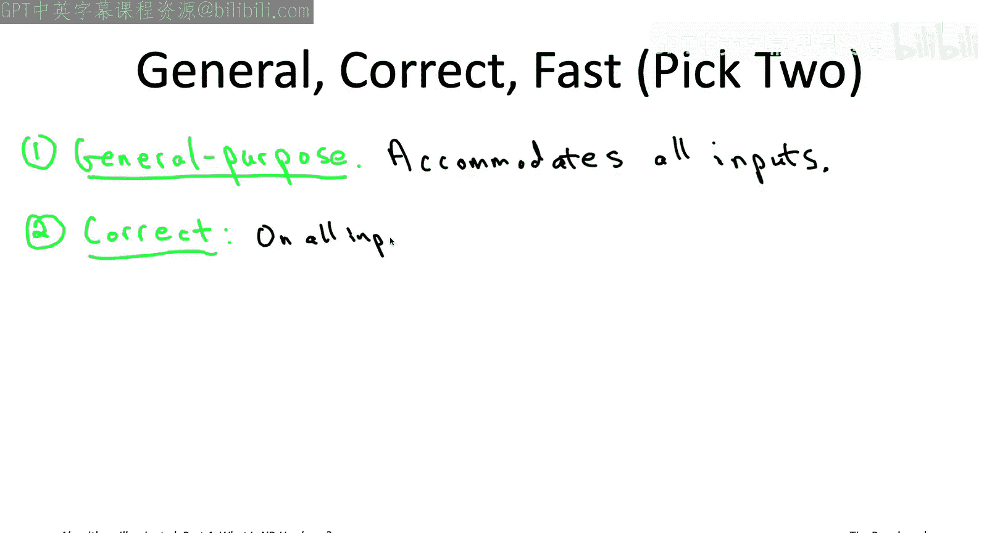

NP难性排除了同时具备三个理想属性的算法（假设P≠NP猜想成立）。这三个理想属性是：**通用性**（适用于所有输入）、**正确性**（总能给出正确答案）和**快速性**（理想情况下是多项式时间）。因此，相应地，我们可以选择在以下三个方面之一做出妥协。

以下是三种主要的妥协策略：

1.  **妥协于通用性**：放弃解决所有可能输入的NP难问题，转而专注于处理一个特定的、更易处理的输入子集。对于这个子集，问题可能变得多项式时间可解。
2.  **妥协于正确性**：放弃算法总能给出精确正确答案的要求，转而寻求在大多数情况下正确，或者总能给出近似正确答案的算法（即启发式算法或近似算法）。
3.  **妥协于速度**：放弃多项式时间运行的要求，接受算法在最坏情况下可能需要超多项式时间（如指数时间），但力求设计出比穷举搜索快得多的精确算法。

接下来，我们将详细阐述这三种策略。

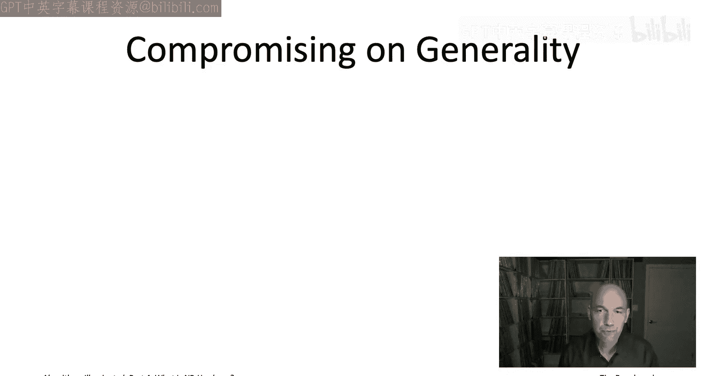

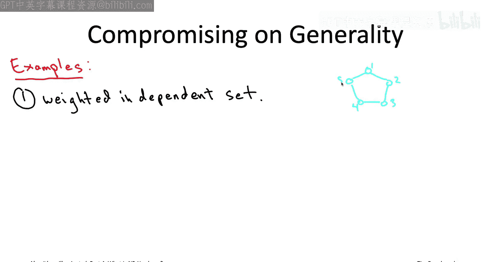

## 策略一：妥协于通用性 🎯

第一种策略是妥协于通用性，即放弃尝试解决NP难问题的所有可能输入，转而将注意力限制在所有可能输入的一个子集上。在最理想的情况下，对于你所关注的这个子集，问题实际上会变得多项式时间可解，你将能够为该特殊类别的输入设计出既快速又永远正确的算法。

如果你一直跟随本系列书籍或视频，你已经见过几个针对NP难问题特殊情况的快速精确算法的例子。

以下是两个例子：

*   **加权独立集问题**：给定一个无向图，每个顶点有一个非负权重。目标是找到一个**独立集**（即一组互不相邻的顶点），使得其总权重最大。这个问题在一般情况下是NP难的。然而，在**路径图**（顶点排成一条线）或**树图**的特殊情况下，我们可以使用动态规划在线性时间内精确求解最大权重独立集。
*   **背包问题**：给定n个物品，每个物品有整数价值和整数体积，以及一个整数背包容量。目标是选择总体积不超过容量且总价值最大的物品子集。背包问题在一般情况下也是NP难的。我们之前学过一种动态规划算法，其运行时间为 **`O(n * C)`**，其中n是物品数量，C是背包容量。需要注意的是，只有当容量C以n的多项式为界时，这个算法才是多项式时间的。如果C非常大（例如 `2^n`），那么运行时间将是指数级的，而输入规模（描述数字所需的位数）可能只是多项式的，这解释了为何该算法不违反P≠NP猜想。

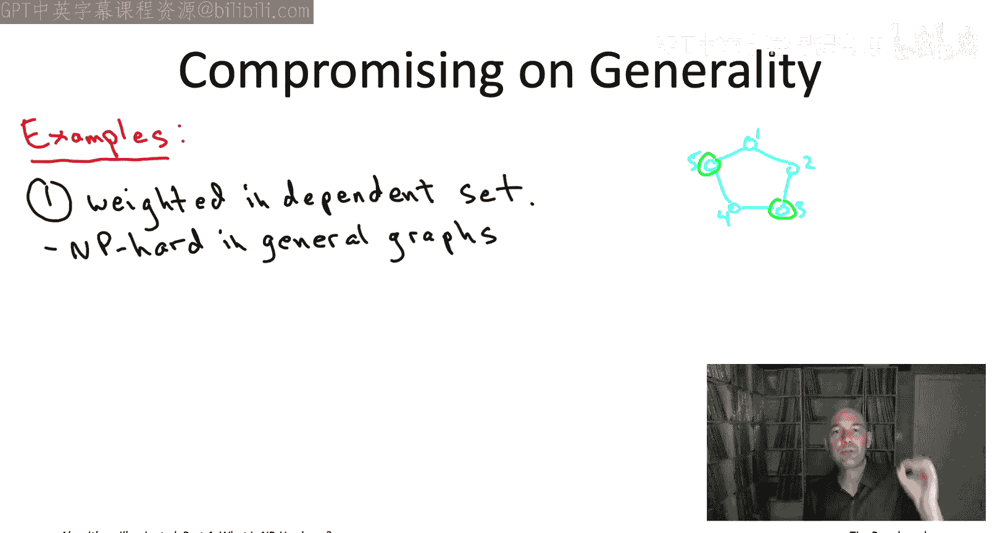

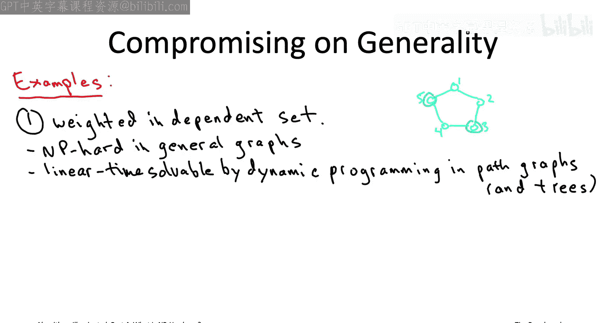

关于妥协通用性的工作，看起来与我们在第一部分到第三部分所做的所有工作完全相同。第一到第三部分的重点就是开发一个工具箱，用于设计总是正确且总是快速的算法。这个工具箱尤其可以应用于NP难问题的特殊情形，当这些情形实际上是多项式时间可解的时候。

这里可以做一个总体评论并给予一些鼓励：如果在现实生活中必须处理NP难问题，保持坚持和不放弃至关重要。作为算法设计者，你已经知道这一点，但对于在NP难问题上取得进展而言，这一点比以往任何时候都更重要。通常，你必须“用尽一切办法”来真正获得你想要的进展。

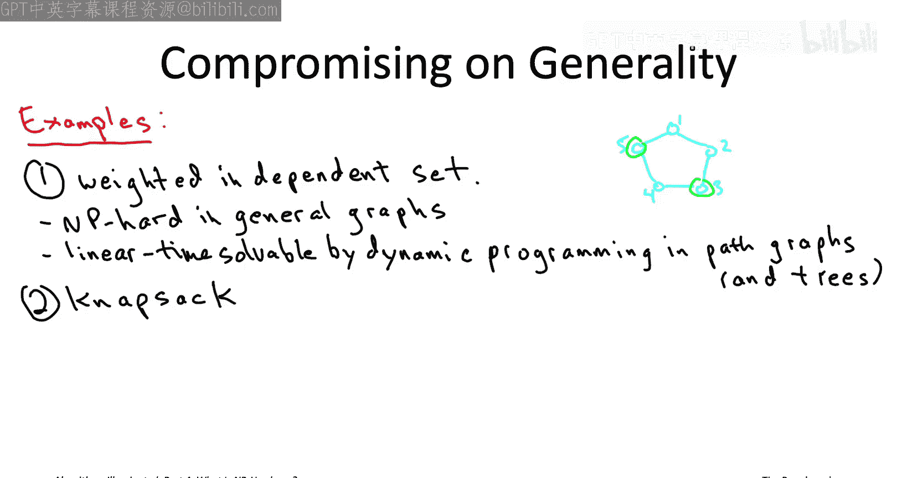

让我举一个随机例子，说明如何组合工具箱中的不同工具。假设老板给你一个相当大的图（例如10000个顶点），需要计算最大权重独立集。你不能使用穷举搜索，因为图有10000个顶点。如果它是一个树，你可以用动态规划在线性时间内解决问题。假设它不是树，而是包含许多循环。也许你似乎陷入了困境。但想象一下，你运用领域专业知识，意识到在这10000个顶点中，有20个顶点是最重要的，并且这20个顶点实际上与图中的每个循环都相交。换句话说，当你从图中移除这20个顶点时，剩下的图是无环的，只是一些树的集合。如果是这种情况，你确实可以精确地解决这个问题：通过结合穷举搜索和动态规划的混合方法来计算最大权重独立集。

具体做法是：你对这20个特殊顶点的所有子集进行穷举搜索，猜测哪些属于独立集，哪些不属于。然后移除这些顶点，剩下一个无环图，现在你可以应用动态规划在线性时间内解决剩余问题。这将需要检查大约 `2^20`（约一百万）个子集，每个子集对应一个可以在线性时间内解决的子问题。总体计算量可能在数百亿次操作，现代笔记本电脑可以在可接受的时间内完成。相比之下，如果不使用这种技巧，直接进行穷举搜索，当n超过40时，操作次数就会超过万亿。

关键要点是：即使你的应用问题并不完全等同于某个NP难问题的计算易处理特例，你仍然可以将特例的解决方案作为更复杂算法的构建模块。

## 策略二：妥协于正确性 🤖

第二种处理NP难问题的算法策略是妥协于正确性。这在时间紧迫的应用中是一个特别受欢迎的选择，因为你确实需要算法快速运行，并且愿意牺牲一点正确性来实现这一点。这类不保证永远正确的算法通常被称为**启发式算法**。

在本系列中，我们还没有真正见过许多不保证正确的算法解决方案的例子。事实上，我能想到的唯一例子是在第二部分末尾讨论数据结构时提到的布隆过滤器。布隆过滤器是哈希表的一种“表亲”，它使用更少的空间，但代价是存在较小的误报率。那是一个不总是给出正确答案的数据结构例子。因此，我认为这将是我们第一次讨论不总是给出正确答案的算法。

在设计启发式算法时，你是有意放弃正确性。当然，你希望尽可能少地放弃正确性，你希望启发式算法在某种意义上仍然是近似正确的。也许它在大多数你可能遇到的输入上都是正确的，或者甚至对于所有输入，你都有某种可证明的保证，确保算法至少是近似正确的。

对于**优化问题**（目标是计算一个具有最佳目标函数值的可行解，例如总成本最低的旅行商路线），“几乎正确”可能最容易理解。它意味着算法输出一个可行解，其目标函数值接近最佳可能值，例如一条总成本不比最优路线高太多的旅行商路线。

你现有的用于设计快速精确算法的工具箱，对于设计快速启发式算法也直接有用。例如，在本视频播放列表的后面，我们将看到用于从调度到团队招聘问题，再到社交网络中影响力最大化等一系列问题的贪心启发式算法。我们将讨论的所有这些启发式算法都附有近似正确性的证明，保证对于每个输入，启发式算法的输出都在最佳可能目标函数值的一个适度常数因子范围内。

需要说明的是，有些作者将这类保证目标函数值在最优值常数倍范围内的算法称为**近似算法**，而将“启发式算法”这个术语保留给没有这种可证明保证的算法。我们不会做这种区分，对我们来说，启发式算法指的是不总是正确的算法，它可能具有近似正确性的可证明保证，也可能没有。

这些例子实际上是重新审视了我们算法工具箱中久经考验的可靠成员——贪心算法，并将其重新定位，不是用于精确算法，而是用于快速启发式算法。

我还想介绍一种我们在本书系列中尚未讨论过的技术，它特别适合许多不同的NP难问题，尽管它通常没有可证明的保证，但在实践中对解决NP难问题常常异常有效，这种技术就是**局部搜索**。

## 策略三：妥协于速度 ⚡

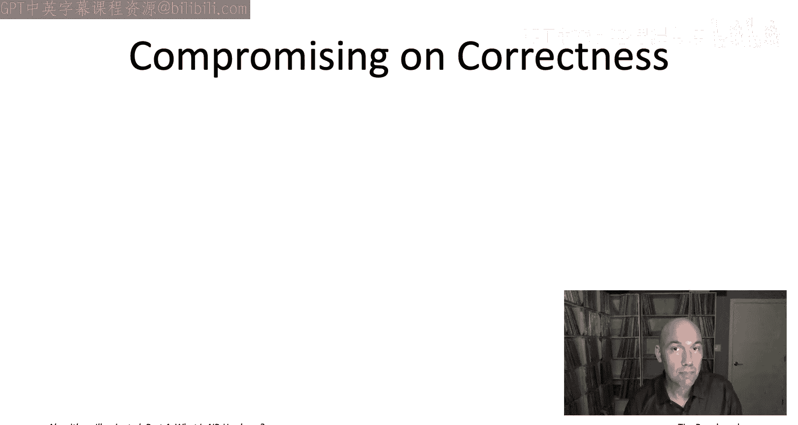

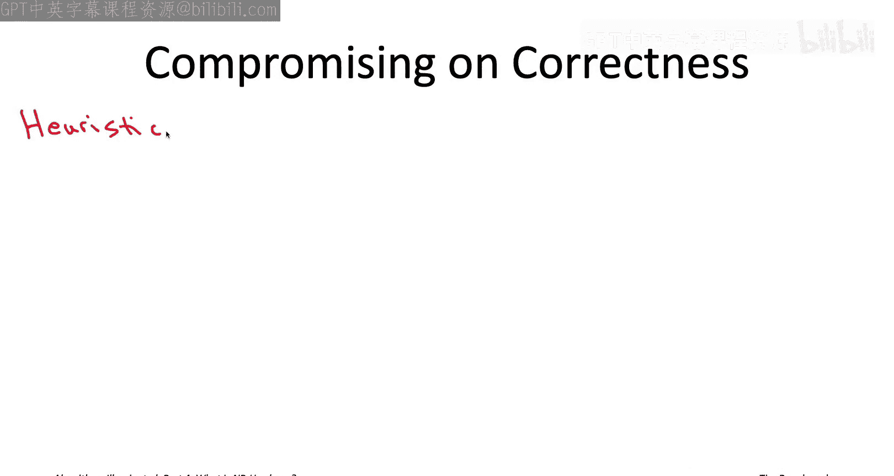

我们将讨论的第三种也是最后一种处理NP难问题的策略是妥协于速度。在这里，我们将关注精确算法，这适用于那些确实不能在正确性上妥协的应用。在保证正确的前提下，你希望算法尽可能快。

对于NP难问题，再次假设P≠NP猜想成立，你不应期望多项式时间，甚至不应期望在最坏情况下是亚指数时间。你必须准备好接受指数级的最坏情况运行时间。但希望是，在大多数情况下，你仍然能比穷举搜索做得更好。

这可能意味着几件不同的事情：

1.  算法**通常**运行得很快，例如在多项式时间内，或者甚至是低次多项式时间内，至少对于你应用中经常出现的输入是如此。也许不是永远，但大多数时候你看到的是非常快的运行时间。
2.  你可能希望有一个**可证明的保证**，表明对于问题的每一个输入，你保证比穷举搜索运行得更快。

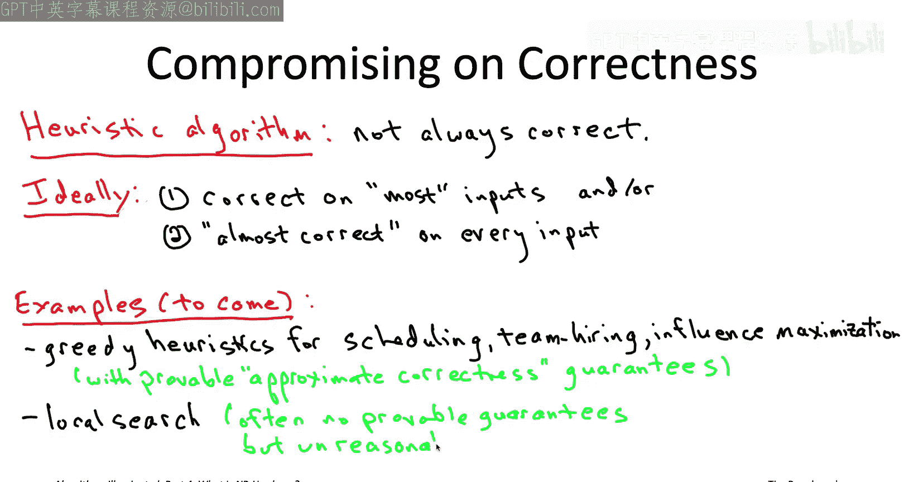

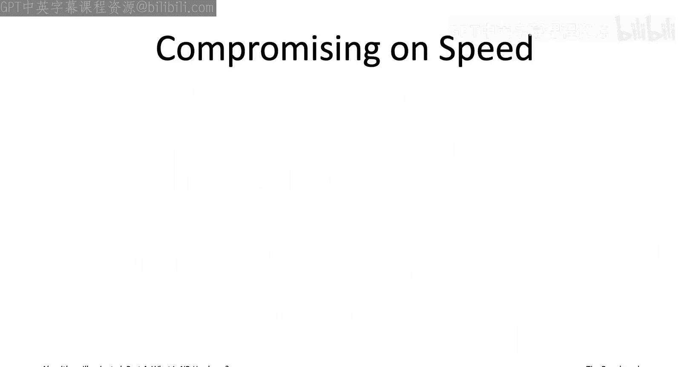

在第二种情况下，即使我们保证对每个输入都比穷举搜索快，我们仍然应该预期算法在最坏情况下以指数时间运行。毕竟，问题是NP难的。但我们将看到几个例子，虽然仍然是指数时间算法，但它们保证能比穷举搜索做得**显著更好**。

第一个例子是针对**旅行商问题**。正如我们所知，穷举搜索的时间规模是 **`n!`**（n的阶乘）。我们将使用动态规划来设计一个算法，其运行时间规模为更小的 **`2^n`**（仍然是指数级，但比 `n!` 好），再乘以n的一个多项式函数。

我们还将看一个结合了随机化的动态规划算法，用于在图中寻找长路径，该算法已应用于在蛋白质-蛋白质相互作用网络中寻找信号通路。具体来说，如果我们在图中寻找长度为K的路径（即跨越K个顶点，K-1条边），朴素的穷举搜索规模为 **`n^K`**，其中n是顶点数，K是目标路径长度。而我们结合随机化和动态规划的方法将把运行时间降低到大约 **`e^K`**（其中e是自然对数的底数，约2.718）乘以图大小的线性函数。

这是两个非常酷的例子，我们再次重新审视了工具箱中已有的一个工具——动态规划。我们曾努力掌握这项技能，在这里我们看到了它的另外几个非常好的应用，将其应用于NP难问题，并且即使在最坏情况下也比穷举搜索更快。

要在规模达到数千或更大的NP难问题实例上取得进展，通常需要额外的工具，这些工具没有比穷举搜索更好的最坏情况运行时间保证，但在实践中却异常有效。我想在本视频播放列表的后面部分向你介绍其中两种工具：**混合整数规划求解器**（MIP求解器）和**可满足性问题求解器**（SAT求解器）。

这里的“求解器”指的是一种现成的、经过专家实现和精细调优、在实践中表现非常出色的实现。事实证明，许多NP难优化问题（如旅行商问题等）都可以编码为混合整数规划问题。同样，许多是/否问题（例如检查一系列对稀缺资源的请求是否能全部满足）自然可以转化为可满足性问题。每当你面对一个可以轻松指定为MIP或SAT问题的NP难问题时，尝试应用最新、最先进的求解器是非常值得的。当然，MIP或SAT求解器无法保证在合理时间内解决你的特定实例（毕竟问题是NP难的），但它们构成了在实践中处理NP难问题的最前沿技术。

## 总结

在本节课中，我们一起学习了面对NP难问题时可以采取的三种核心算法策略。

首先，我们了解到**妥协于通用性**意味着专注于问题的易处理特例，并利用已有的算法工具箱（如动态规划）为这些特例设计快速精确的算法。我们甚至可以将特例解决方案作为构建块，嵌入到更复杂的混合算法中。

其次，**妥协于正确性**引导我们使用启发式或近似算法。这些算法放弃永远正确，以换取速度，并可能提供近似最优解的可证明保证。贪心算法和局部搜索是这类策略的典型代表。

最后，**妥协于速度**涉及设计最坏情况下为指数时间，但比朴素穷举搜索快得多的精确算法。动态规划结合其他技巧（如随机化）可以在此方面发挥强大作用。此外，利用成熟的MIP或SAT求解器也是处理许多可编码NP难问题的强大实用方法。

重要的是要记住，NP难问题无处不在，遇到它们是正常的。NP难性意味着（在P≠NP的假设下）我们无法同时获得通用性、正确性和快速性。然而，NP难性并非死刑判决。通过运用算法技巧、投入足够的资源，并愿意在上述一个或多个方面做出明智的妥协，我们通常能够在实践中有效地处理这些问题。接下来的课程将深入探讨后两种妥协策略的具体技术和应用。