# 算法启蒙（第4册）：NP难｜Part 4 Algorithms for NP-Hard Problems：19.5：证明NP难性的简单方法 🧪

在本节课中，我们将学习如何证明一个问题是NP难的。核心方法是掌握一个简单的“两步法”配方，并通过归约来传播计算难解性。

---

## 概述

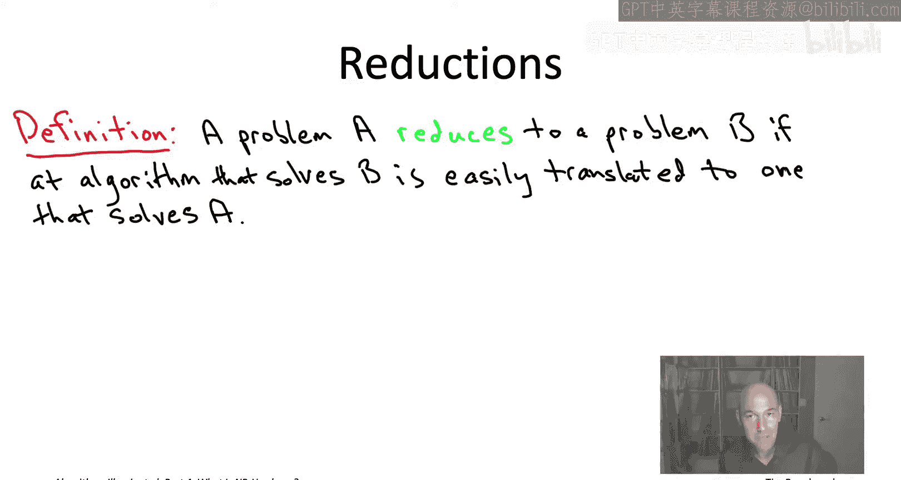

在算法研究中，识别NP难问题至关重要，这能避免我们徒劳地为其寻找“过于理想”的多项式时间算法。为此，我们需要掌握两项核心技能：一是了解一系列已知的NP难问题；二是熟练运用归约法，将一个已知的NP难问题归约到我们关心的问题上，从而证明后者的NP难性。

上一节我们介绍了NP难问题的基本概念，本节中我们来看看如何具体证明一个问题是NP难的。

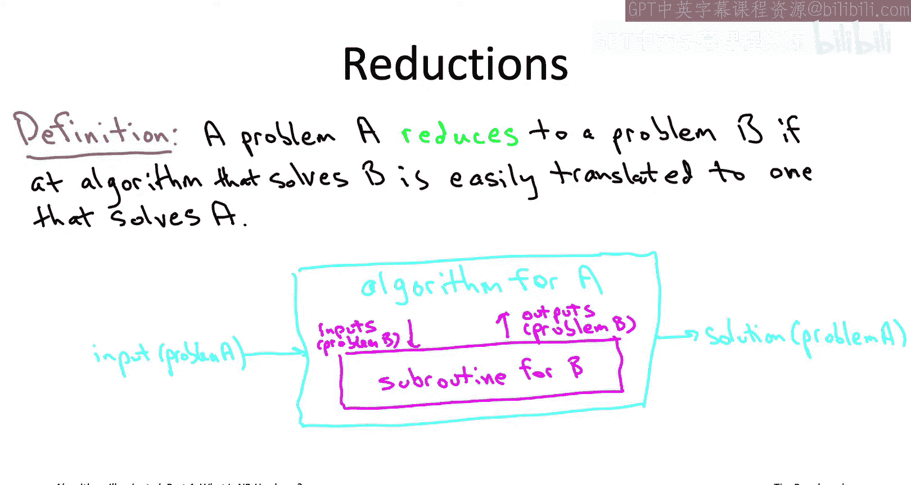

---

## 归约：传播可解性与难解性

作为算法学习者，我们习惯于寻找归约。当我们遇到一个新问题时，会思考它是否能归约到某个已知如何解决的问题上。归约可以将一个问题的可解性（即多项式时间可解性）传播到另一个问题。

更正式地说，如果问题A可以归约到问题B，并且B存在多项式时间算法，那么A也存在多项式时间算法。可解性传播的方向与归约方向相反。

然而，NP难理论则利用归约来传播**难解性**。如果问题A是NP难的，并且A可以归约到问题B，那么问题B也是NP难的。难解性传播的方向与归约方向相同。

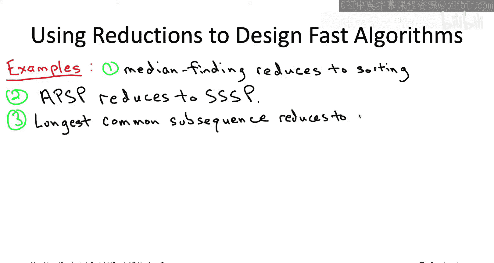

以下是归约的数学定义：

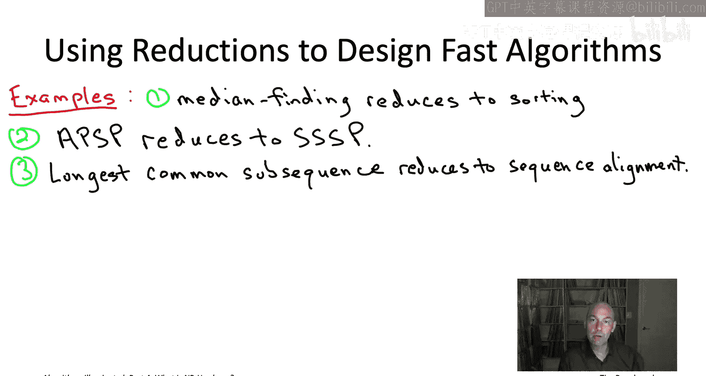

**定义**：如果任何解决B的算法都能被“轻松地”转化为解决A的算法，则称问题A**归约**到问题B。

这里的“轻松地”转化，意味着转化过程本身是一个多项式时间算法，并且它调用B求解子程序的次数也是输入规模的多项式函数。

---

## 证明NP难性的两步法

基于上述原理，我们得到一个证明问题NP难性的简单配方：

1.  **第一步**：选择一个已知的NP难问题A。
2.  **第二步**：将问题A归约到你所关心的问题B。

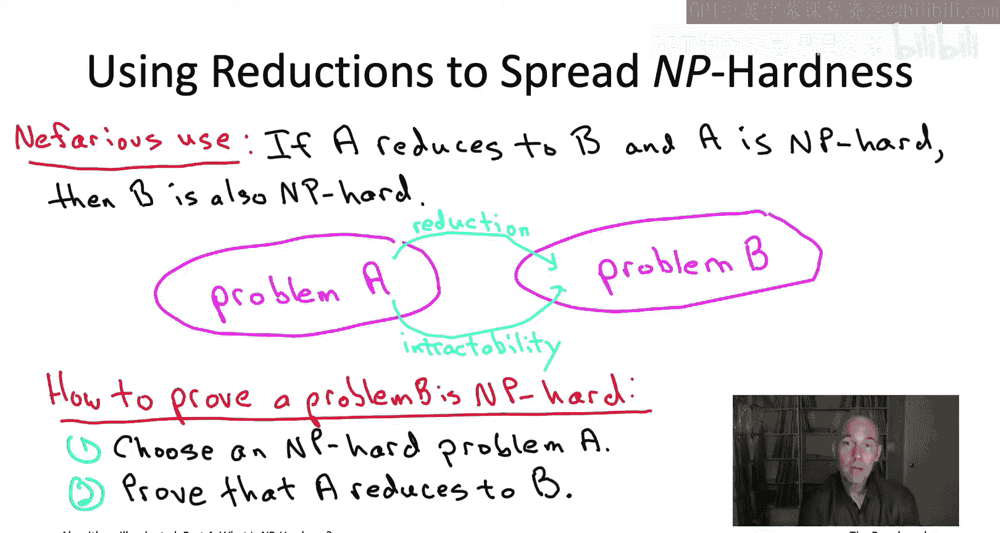

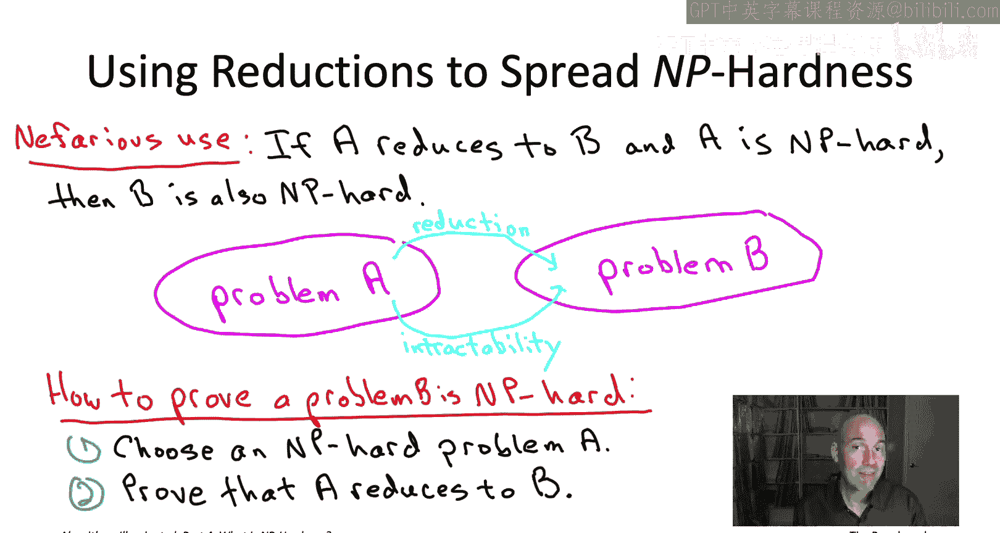

如果你成功完成了这个归约，那么你就证明了问题B至少和问题A一样难。由于A是NP难的，因此B也是NP难的。

---

## 归约实例回顾

为了加深理解，让我们回顾一些之前见过的、用于传播可解性的归约例子：

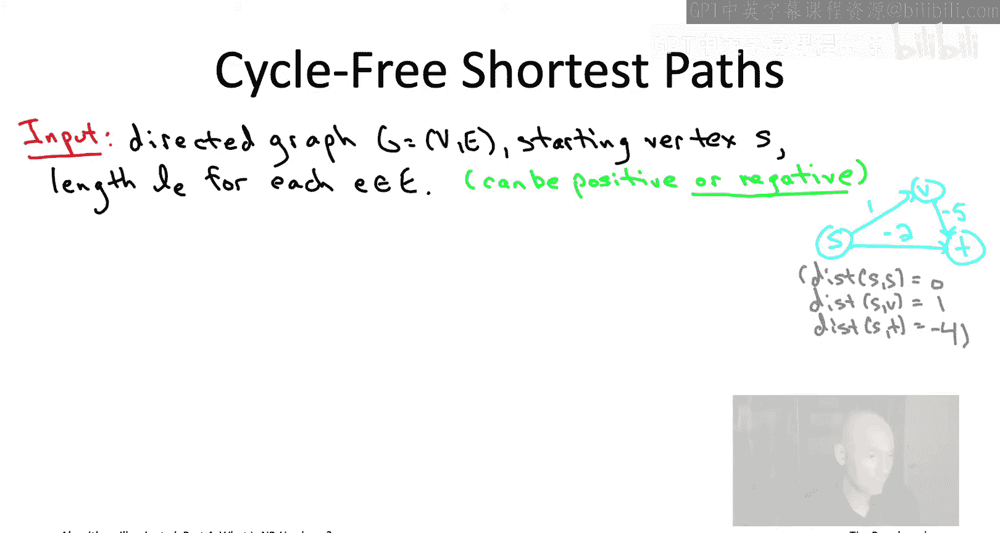

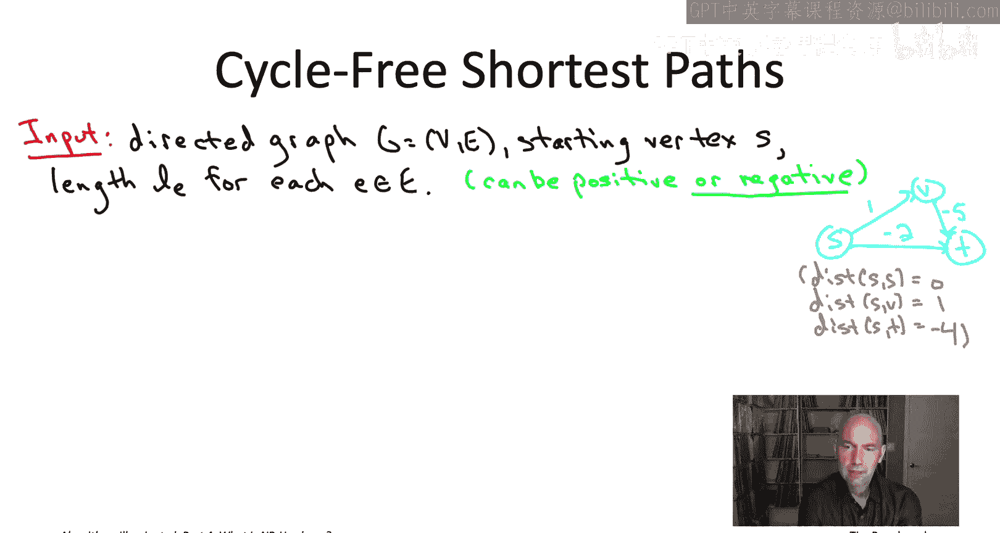

以下是几个归约的例子：
*   **中位数查找归约到排序**：对数组排序后，中位数就是中间元素。因此，任何O(n log n)的排序算法都能给出一个O(n log n)的中位数查找算法。
*   **全源最短路径归约到单源最短路径**：要计算图中所有顶点对之间的最短距离，可以对每个顶点运行一次单源最短路径算法（如Bellman-Ford算法）。如果单源算法的时间复杂度是O(mn)，那么全源算法的时间复杂度就是O(mn²)。
*   **最长公共子序列归约到序列比对**：通过将序列比对问题中的间隙惩罚设为1，并将不匹配代价设为一个非常大的数，序列比对的动态规划算法就可以用来求解最长公共子序列问题，时间复杂度同为O(mn)。

这些例子展示了如何利用已知问题的快速算法，为其他问题构造快速算法。

---

## 应用两步法：证明“无环最短路径”问题是NP难的

现在，让我们通过一个具体例子来实践两步法。我们将证明“**无环最短路径**”问题（即在允许负权边的图中，寻找不包含环的最短路径）是NP难的。

### 第一步：选择已知的NP难问题

我们选择**有向哈密顿路径问题**作为已知的NP难问题A。
*   **输入**：一个有向图G，以及指定的起点S和终点T。
*   **目标**：判断图中是否存在一条从S到T的哈密顿路径（即恰好访问每个顶点一次的路径）。

我们暂且接受“有向哈密顿路径问题是NP难的”这一结论。

### 第二步：归约到“无环最短路径”问题

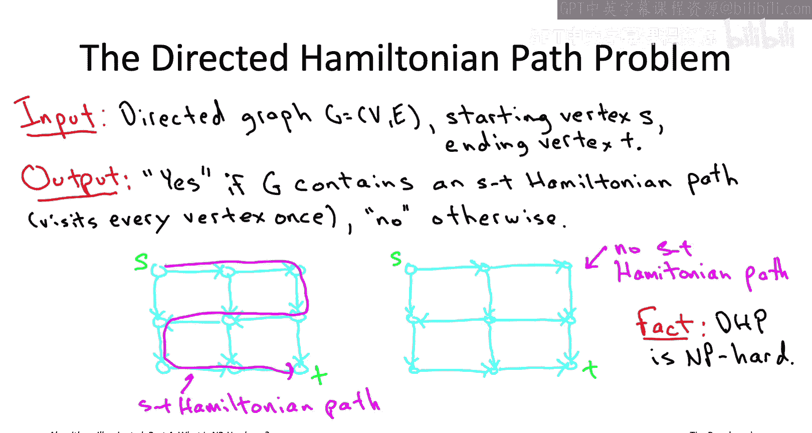

我们需要构造一个归约，使得如果我们有一个能解决“无环最短路径”问题的“魔法黑盒”，我们就能利用它来解决“有向哈密顿路径”问题。

以下是归约的具体步骤：
1.  **构造实例**：给定一个有向哈密顿路径问题的实例（图G，起点S，终点T）。我们构造一个“无环最短路径”问题的实例：使用同一个图G和同一个起点S，并为**图中的每条边赋予长度-1**。
2.  **调用子程序**：将构造好的实例（图G，起点S，所有边长为-1）输入到假设存在的“无环最短路径”求解子程序中。
3.  **解读答案**：子程序会返回从S到所有顶点的最短无环路径距离。我们只关心从S到T的距离。设图G有n个顶点。
    *   如果从S到T的最短无环路径距离恰好是 **-(n-1)**，则原始图G**存在**S到T的哈密顿路径。
    *   否则，原始图G**不存在**S到T的哈密顿路径。

### 归约正确性分析

*   **如果G存在哈密顿路径**：这条路径恰好有n-1条边，且无环。在我们构造的实例中，其长度就是-(n-1)。由于这是访问所有n个顶点所可能达到的**最长**（边数最多）的无环路径，因此它也是该实例中从S到T的**最短**（因为边权为负，路径越长，总权值越小）无环路径。子程序会返回距离-(n-1)。
*   **如果G不存在哈密顿路径**：那么任何从S到T的无环路径最多只能访问少于n个顶点，其边数最多为n-2条。因此，在我们构造的实例中，任何无环路径的长度都大于（即比-(n-1)大，例如-(n-2)）。子程序返回的距离将严格大于-(n-1)。

因此，通过检查子程序返回的S到T的距离是否为-(n-1)，我们可以正确判断原问题实例的答案。这证明了“有向哈密顿路径问题”可以归约到“无环最短路径问题”。

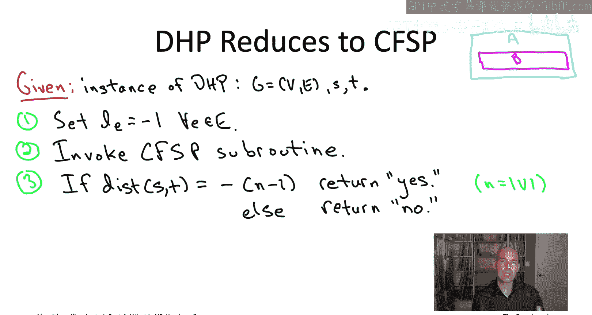

### 结论

由于我们假设“有向哈密顿路径问题”是NP难的，并且它可归约到“无环最短路径问题”，根据两步法，我们得出结论：“**无环最短路径问题也是NP难的**”。

这解释了为什么我们在学习最短路径算法（如Dijkstra算法、Bellman-Ford算法）时，都要求图中没有负环，或者只处理非负权边。如果存在能高效处理含负环图中无环最短路径的算法，那就意味着我们为NP难问题找到了多项式时间解法，从而否定了P≠NP的猜想。

---

## 总结

本节课中我们一起学习了证明问题NP难性的核心方法：
1.  我们理解了**归约**是传播问题可解性与难解性的关键工具。
2.  我们掌握了一个简单的**两步法配方**：1) 选取已知NP难问题；2) 将其归约到目标问题。
3.  我们通过将**有向哈密顿路径问题**归约到**无环最短路径问题**的具体例子，实践了这个配方，并证明了后者的NP难性。

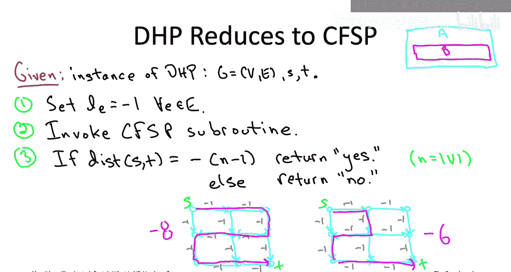

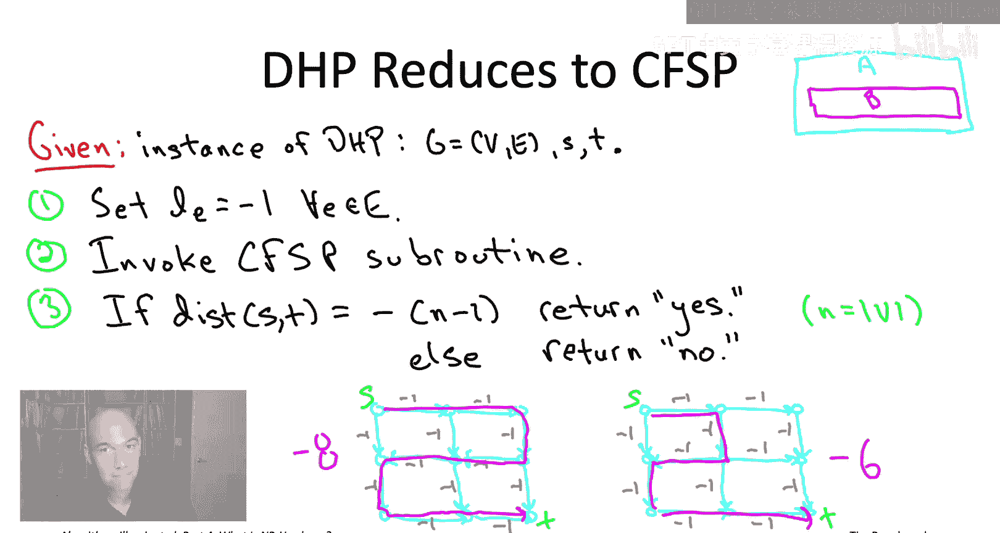

掌握这个方法能帮助我们在面对复杂问题时，快速判断其内在的计算难度，从而合理选择算法设计策略（如寻求近似算法、启发式方法或限制问题范围）。在后续章节中，我们将看到更多NP难问题的例子以及更复杂的归约技巧。