# 算法启蒙（第4册）：NP难｜Part 4 Algorithms for NP-Hard Problems：10：最大覆盖问题的贪心启发式算法 - Part 1

在本节课中，我们将要学习最大覆盖问题，并介绍一个用于解决该问题的简单而自然的贪心启发式算法。我们将从问题定义开始，通过实例理解其应用场景，然后详细描述贪心算法的步骤，并初步探讨其性能。

## 问题定义与应用场景

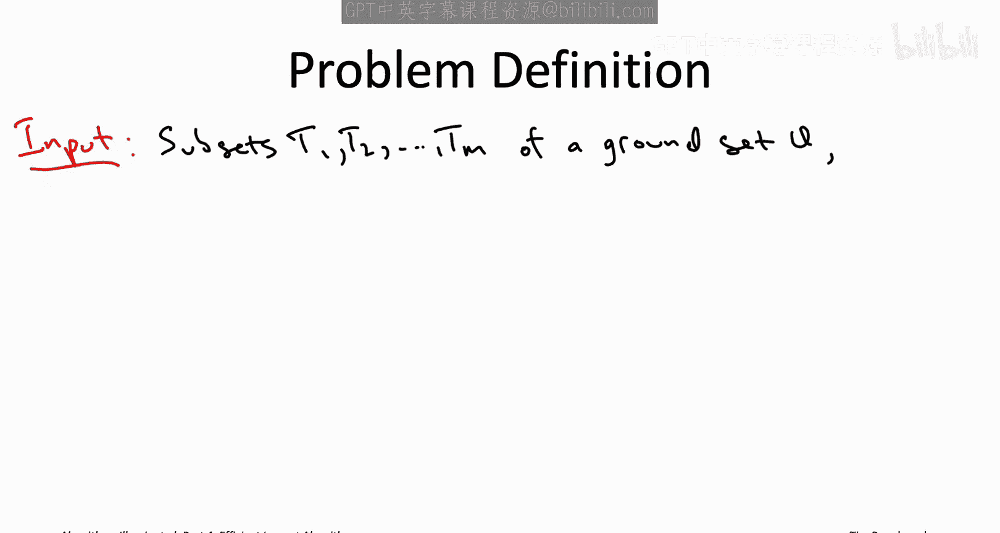

上一节我们介绍了本课程的主题。本节中我们来看看最大覆盖问题的具体定义。

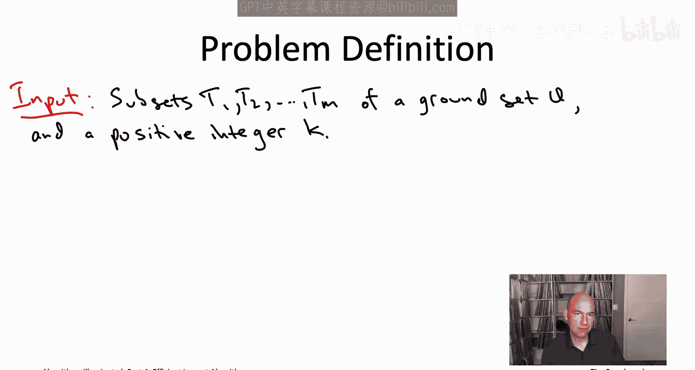

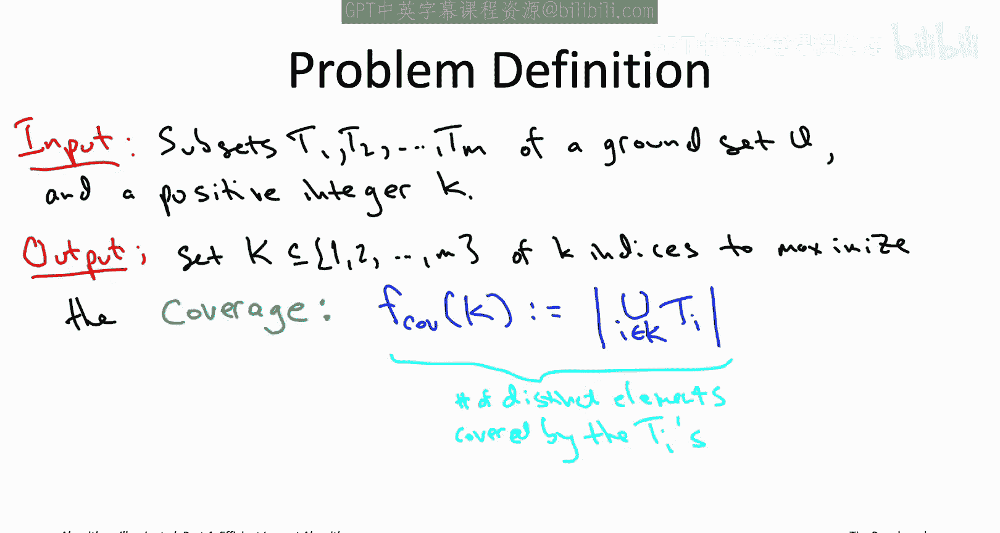

最大覆盖问题的输入包含 M 个子集，我们将其记为 t₁ 到 t_M，它们属于某个全集 U。同时还有一个预算，即一个正整数 K。
例如，在我们的团队组建例子中，可以想象全集 U 是所有可能的技能集合（或所有可能的场上位置）。同时，每个你可以雇佣的人对应一个子集，该子集包含此人拥有的技能。K 则是你的预算，即允许雇佣的人数。
目标是雇佣 K 个人，使得他们代表的技能尽可能多。用集合术语来说，我们希望选择 K 个子集，使得这些子集的并集能覆盖全集 U 中尽可能多的元素。这被称为子集集合的覆盖值。
例如，具体来说，可以想象给定一个数组对应于子集，另一个数组对应于全集 U 的元素。

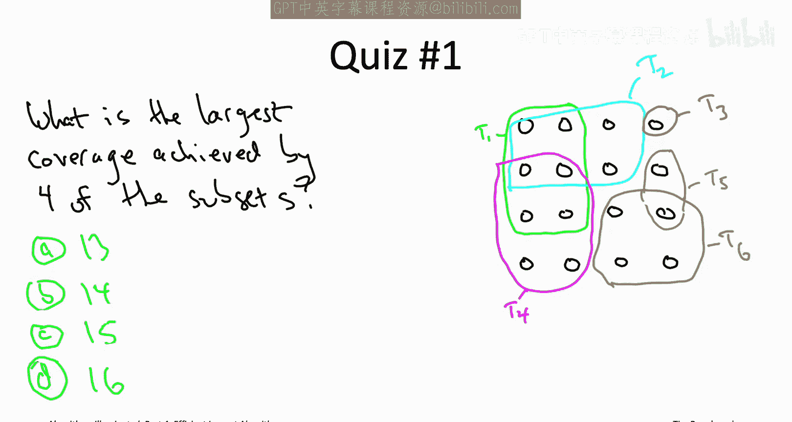

然后可以有相应的指针来回指向，即从每个子集指向它包含的元素，以及从每个元素指向包含它的子集。

为了确保问题完全清晰，我们来看一个快速测验。

在这张幻灯片的右侧部分，展示了一个最大覆盖问题的可能输入。
总共有 16 个元素，所有小黑圈就是元素，可以看到它们排列成一个 4x4 的网格，总共 16 个。
然后有 6 个不同颜色的子集。
输入的最后一部分是预算，即 k 值。假设允许你从 6 个子集中挑选 4 个。

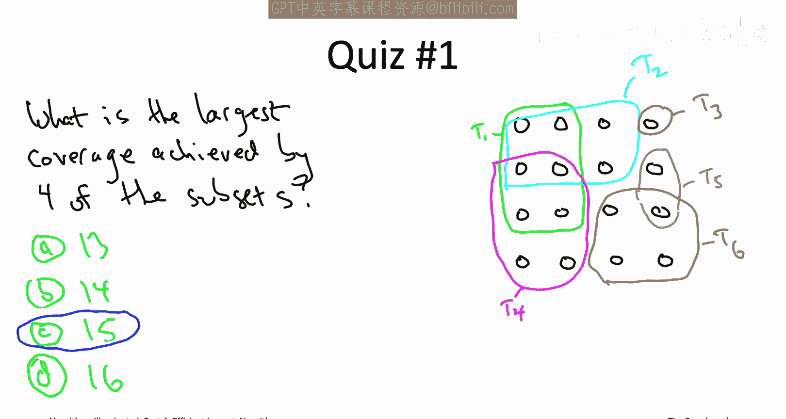

那么问题是，在所有从这 6 个子集中挑选 4 个的方式中，你能达到的最大可能覆盖值是多少？

正确答案是第三个。使用四个子集无法覆盖全部 16 个元素，但可以覆盖其中的 15 个，实际上有几种不同的方式。
你需要选择子集 t₄ 和 t₆，它们完全不重叠，一起已经覆盖了 10 个元素。
然后你肯定想选 t₂，它虽然有一些冗余元素，但确实覆盖了 4 个新元素，这样总共覆盖了 14 个。
现在，无论选择 t₃ 还是 t₅，都能再增加一个元素，总计达到 15 个。
需要注意的一点是，你永远不想选择子集 t₁。它是一个大集合，包含 6 个元素，但这些元素基本上已经被其他子集覆盖了。所以 t₁ 虽然大，但有些冗余，这就是为什么它没有出现在任何最优解中。

一般来说，最大覆盖问题之所以棘手，是因为子集之间存在重叠。
例如，某些技能可能很常见，意味着它们被许多子集覆盖。
其他技能可能很稀有，只被少数子集覆盖。
因此，一个理想的子集应该是大的，且冗余元素少，基本上就是一个拥有许多独特技能的团队成员。

一些最大覆盖问题经常出现，不仅仅限于我们目前提到的团队组建应用。
例如，假设你想在一个城市中选择 K 个新的消防站位置，以最大化居住在一英里范围内的居民数量。
这正是一个最大覆盖问题。全集元素对应于居民，每个子集对应于一个可能的消防站位置，该子集的元素是居住在该位置一英里范围内的居民。
对于一个更复杂的例子，假设你想让一群人参加一个活动，比如一场音乐会。你需要开始为活动做准备，但只有时间说服你的 K 个朋友来。
然而，无论你成功招募了哪些朋友，他们都可以带上他们的朋友，而他们的朋友又会带上朋友的朋友，依此类推。

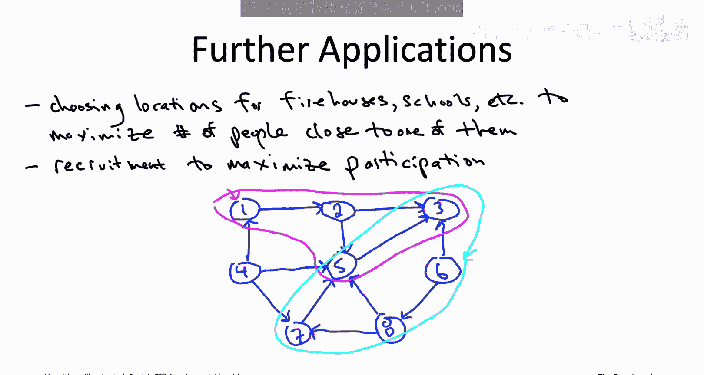

我们可以用一个有向图来可视化这个问题。
图的顶点将对应于人，如果 W 会跟随 V 参加活动（即如果 V 决定来，W 作为 V 的朋友会一起来），那么我们将有一条从一个人 V 指向另一个人 W 的有向边。
例如，考虑这个蓝色的有向图，它有 8 个顶点。
假设你招募了顶点 1。那么 2 会跟随 1 来参加活动，然后一旦 2 来了，3 和 5 也会跟随。
所以如果你招募了 1，最终会有这总共 4 个不同的顶点出现在活动中。
另一个有趣的案例是顶点 6。你会看到 6 没有入边。这意味着没有其他人能说服 6 来。
但是，如果 6 决定来，那么许多人会跟随，特别是 8 会跟随，然后是 5 和 7，接着是 3。
所以如果你决定同时招募 1 和 6，你最终会让这 8 个人中的 7 个出现在活动中。
像这样最大化出席人数正是一个最大覆盖问题。全集元素对应于人，或者等价于图中的顶点。每个人对应一个子集，表示最终会跟随此人参加活动的人。在图论中，该子集对应于从该顶点通过有向路径可到达的顶点。
例如，从这个顶点 1，你可以看到它的“团块”包含了所有从 1 通过有向路径可到达的顶点。
类似地，浅蓝色的团块包含了所有从 6 通过有向图可到达的顶点。
由于招募一组 K 个人而产生的总出席人数，正是对应的 K 个子集所实现的覆盖值。

## 贪心算法介绍

上一节我们了解了最大覆盖问题的定义和例子。本节中我们来看看一个解决该问题的自然算法思路。

我希望这能让你相信最大覆盖问题是一个基本问题。如果有一个现成的子程序能为你快速解决这个问题，那将是非常好的。
不幸的是，我们将在视频播放列表的第四部分看到，最大覆盖问题是一个 NP 难问题，所以我们必须在某些方面做出妥协。再次强调，这是播放列表中我们在正确性上妥协的部分。因此，我们将有一个通用且快速的算法，但它并不总是最优的。如果它能接近最优，就像上一节中我们的调度贪心算法那样，那将是最佳情况，因为问题是 NP 难的。

现在，和许多问题一样，贪心算法是解决最大覆盖问题的一个非常自然的起点。
算法最终负责输出 K 个子集。
那么，为什么不迭代地构建我们的解，一次选择一个集合，在每一步都做出短视的决策呢？
如果 k = 1，如果只允许选择一个子集，这不是一个难题。如果只能选一个子集，你想选的就是最大的那个，因为覆盖值将只是你选择的那个集合的大小。
当 k = 2 时，事情就变得有点意思了。假设允许选择两个子集，并且你已经决定选择最大的那个。
接下来你想选哪个？你可以选第二大的那个。
但正如我们在例子中看到的，重叠真的很重要。
所以真正重要的是，下一个子集覆盖了多少个新元素，即它增加了多少覆盖值。
因此，最合理的贪心准则应该是：总是选择能覆盖最多未被先前子集覆盖的新元素的子集。

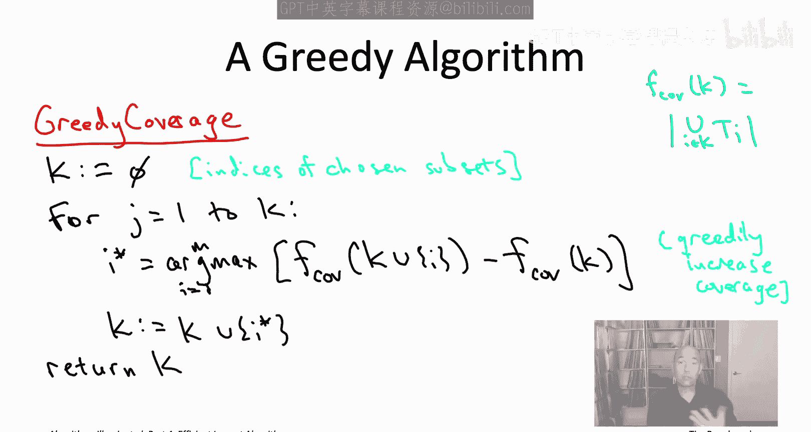

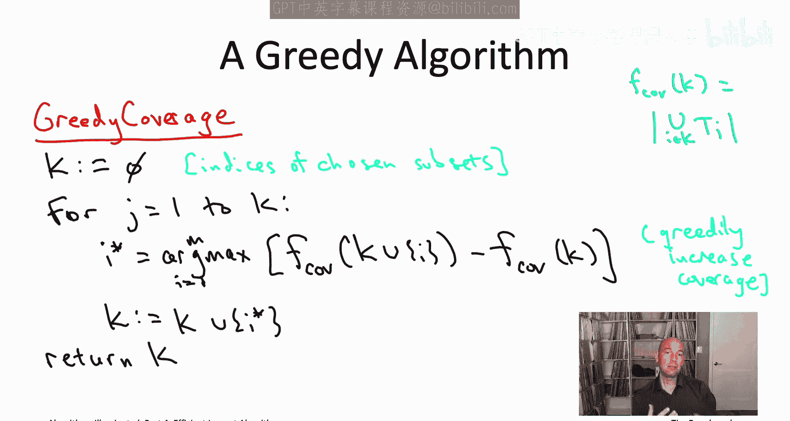

这就是最大覆盖问题的一个著名贪心算法，我们简称它为贪心覆盖算法。

## 算法伪代码与运行时间

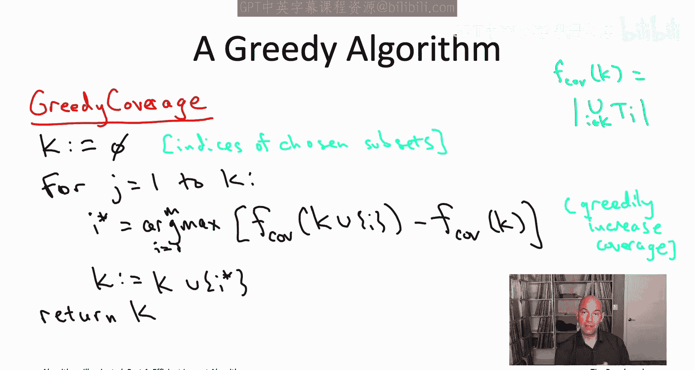

上一节我们介绍了贪心算法的核心思想。本节中我们来看看它的具体实现步骤。

该算法的伪代码相当简单。
只有一个简单的 for 循环，进行 k 次迭代，对应于我们需要选择的每个子集。
我们初始化一个集合 K，用于存储我们选择的集合的索引，初始为空。
在 K 次迭代的每一次中，我们选择一个子集。我们选择哪个子集？我们只是贪心地增加覆盖值。在第 j 次迭代中，我们选择能最大化新覆盖元素数量的子集，即未被前 j-1 个已选子集覆盖的元素数量。

我在这里使用了符号 F_c，我们在几页幻灯片前介绍过，它只是索引在集合 K 中的所有子集的并集的大小。
另外请注意，在这个 argmax 步骤中，它是在所有子集中搜索能最大程度增加覆盖值的那个。这个 argmax 永远不会被已经在集合 K 中的子集达到，因为那只会使覆盖值增加零。如果更清晰的话，可以认为这个 argmax 只在我们尚未选择的子集上进行。

和贪心算法一样，运行时间分析并不那么有趣，至少对于算法的直接实现来说是这样。
那么直接实现会是什么样子呢？主循环有 k 次迭代。
如何实现一次循环迭代？你必须评估这个 argmax，所以你必须遍历 M 个子集并找到最佳的那个。你可以直接对 M 个子集进行穷举搜索。对于每个子集，你必须计算选择该子集将带来的覆盖值增加量。你可以通过逐个访问该子集中的元素，并检查哪些已经被覆盖，哪些尚未被覆盖来实现。
在这种直接实现中，你有一个因子 k 来自循环迭代次数，一个因子 M 来自对 M 个子集选择的穷举搜索，然后评估覆盖值增加量所需的时间与该子集的大小成正比。

所以贪心算法可能不像我们在调度应用中看到的算法那样快如闪电，但它肯定是一个多项式时间算法。
那么真正的问题，和启发式算法一样，是它的性能如何。
贪心覆盖算法输出的解，与在完美世界中使用（例如）穷举搜索所能实现的解相比，有多好？

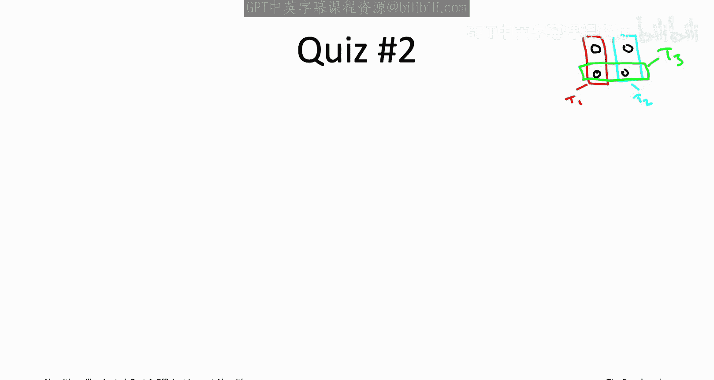

## 算法性能分析：反例

上一节我们讨论了算法的运行时间。本节中我们通过具体例子来看看贪心算法的性能可能有多差。

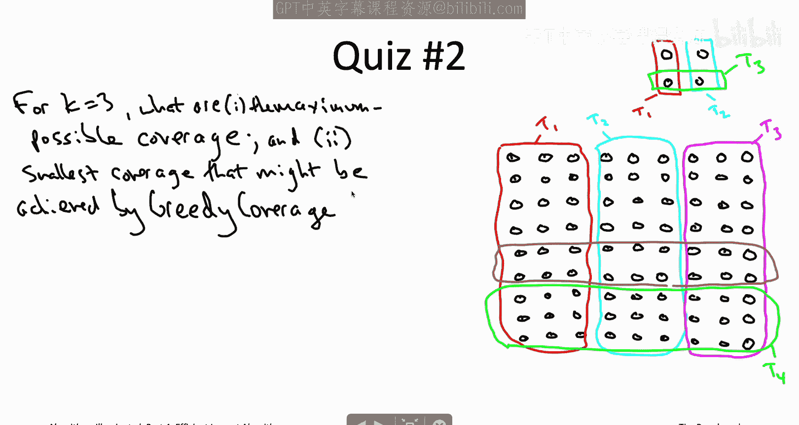

很容易想出一个简单的例子，其中贪心覆盖算法没有做对，它可能输出一个次优解。
例如，在这张幻灯片的右上角，有一个只有 4 个元素和 3 个子集的例子。将参数 K 视为等于 2。
所以如果允许你选择两个子集，很明显，如果你做出正确的选择，选择 t₁ 和 t₂，你可以覆盖所有 4 个元素。

但是我们的贪心算法，我们不知道它在第一次迭代中会做什么，至少假设它任意打破平局。
在第一次迭代中，它很可能选择集合 t₃。一旦选择了 t₃，无论它在第二次迭代中选择 t₁ 还是 t₂，最终都只能覆盖 4 个元素中的 3 个。
如果你担心我们假设了贪心算法在最坏情况下的平局处理，请放心，这个例子的一个更复杂版本即使贪心算法以最佳方式处理平局，也会显示出完全相同的情况。
所以这并不奇怪，我们完全预料到会有一些例子，其中贪心覆盖算法无法覆盖在完美世界中所能覆盖的那么多元素。
记住我说过这是一个 NP 难问题，我们已经看到贪心覆盖算法在多项式时间内运行，所以除非我们打算反驳 P = NP 猜想，否则肯定存在它不输出最优解的例子，这就是其中之一。

但是，一旦你看到这样一个简单的例子，你可能会担心，在更复杂的例子中，情况可能会变得更糟，至少如果参数 K 比 2 大一点，情况可能会更糟。让我们在这个测验中看看。

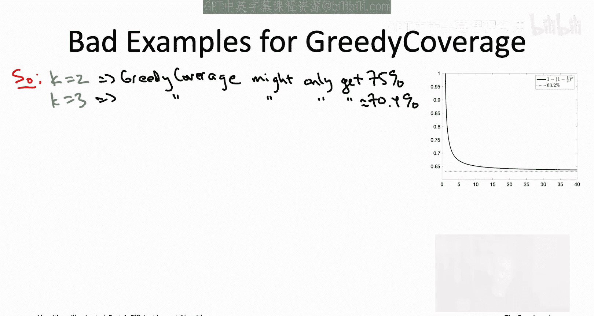

让我们看一个更复杂的例子，它有 81 个元素，排列成一个 9x9 的网格，然后还有 5 个子集。这里的预算是 3，所以允许从 5 个子集中选择 3 个。问题是通常的那些：首先，在最佳情况下，任意三个子集所能实现的最大覆盖值是多少？其次，贪心覆盖算法将实现的覆盖值是多少？我要求的是在任意平局处理下的答案。

正确答案是第二个，答案 B。
很容易看出，有一种方法可以选择三个子集来覆盖所有 81 个元素，只需选择 T₁、T₂ 和 T₃，即红色、浅蓝色和洋红色的子集。
贪心算法最终可能会这样做。但在任意平局处理下，就我们所知，贪心算法的第一次迭代可能会选择集合 T₄，它覆盖了 27 个新元素，就像 T₁、T₂ 和 T₃ 一样。所以 T₄ 是可能被选中的。
如果它确实选择了集合 T₄，现在它必须决定下一步做什么。T₅（棕色集合）将覆盖 18 个元素，这些元素都没有被 T₄ 覆盖，所以 T₅ 将覆盖 18 个新元素。
另一方面，如果你看 t₁、T₂ 和 T₃，它们 27 个元素中有 9 个已经被 T₄ 覆盖了，所以选择它们中的任何一个都只能覆盖 18 个新元素。
所以这又是一个四方的平局，它们都可能被选中。就我们所知，贪心算法可能会选择 T₅。
如果它这样做了，现在用它的最后一个集合，它可以选择 T₁、T₂ 或 T₃ 中的任何一个，无论选哪个都无关紧要。
总覆盖值是 T₄ 的 27 个加上 T₅ 的 18 个，总计 45，再加上从 T₁、T₂ 或 T₃ 中任选一个带来的 12 个，总共是 57。

## 性能下界与近似比

上一节我们看到了两个具体的反例。本节中我们将其推广，并理解贪心算法性能的理论下界。

我们现在已经看到了两个不同的例子，一个是可以选择两个子集，贪心算法可能只实现 3 的覆盖值，而 4 是可能的。换句话说，它可能只获得最大可能覆盖值的 75%。
然后在 K=3 的最后一个测验中，我们看到了一个例子，它只获得了最大可能覆盖值的 57/81，大约是 70.4%。

希望到目前为止我们看到的两个例子，一个有 4 个元素，一个有 81 个元素，它们有相似的模式。你可能会看到某种模式正在出现，并且可以想象尝试将这些例子推广到所有正整数值 K。
事实上你可以做到。我鼓励你将其作为一个练习来推导。例如，你可以将一堆元素排列在一个网格中，网格的边长是 k^(k-1)，这推广了我们之前的 2x2 和 9x9 网格。所以边长是 k^(k-1)。你将得到 2k - 1 个子集（当 k=2 时我们有 3 个，k=3 时有 5 个）。一般来说，你会有 2k - 1 个子集。
如果你为所有正整数 K 推广这个例子，以下是你对贪心覆盖算法及其解的质量的了解。
没错，一般来说，对于每个正整数 K，我们迄今为止看到的两个例子的推广表明，贪心覆盖算法可能输出的解的覆盖值仅为最大可能值的 1 - (1 - 1/k)^K 倍。

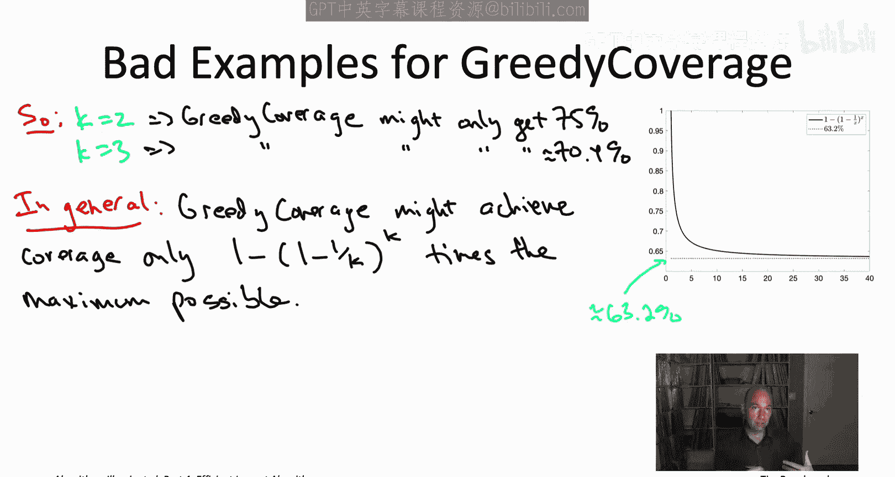

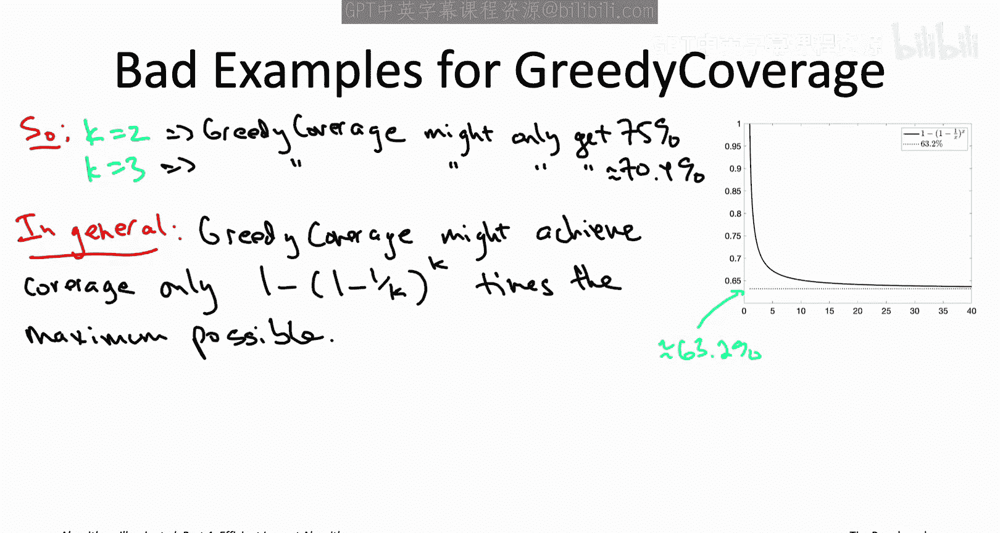

这有点拗口，但我们先来验证一下这个公式。
代入 k = 2。我们得到什么？那么 1 - 1/k 等于 1/2，将其平方得到 1/4，从 1 中减去它得到 3/4。这验证了它确实推广了我们在 k=2 时看到的情况。
如果代入 k = 3，1 - 1/k 是 2/3，现在将其立方得到 8/27，然后从 1 中减去它得到 19/27，这正好与我们测验中看到的 57/81 比例相同。
所以这个公式确实外推了我们已经看到的 k=2 和 k=3 的情况。如果你推导这两个例子的推广，你会发现这是正确的。
那么应该如何理解这个结果呢？我们知道当 k=2 时是 75%，k=3 时大约是 70.4%，但对于其他 K 值呢？
每当你遇到这样一个复杂的单变量表达式并想理解它的行为时，你应该立即绘制它的图像。我已经为你做了这件事，那就是你在右侧看到的图表。
实线就是这个表达式 1 - (1 - 1/k)^K 对所有正实数的插值。
你看那条曲线，立刻就能明白发生了什么：它在下降，我们大概预料到了。k 越大，从贪心覆盖算法得到的比例似乎越小。
另一方面，好的一点是它并没有一直下降到 0。它有一个渐近线。
如果你放大看，会发现渐近线大约在 63.2%。
所以无论我们把这个特定的例子族构造得多么大，我们永远无法证明贪心覆盖算法获得的最大可能覆盖值比例会低于 63.2%。
你们中的一些人可能想知道这是怎么回事。为什么这个东西渐近于 63.2%？
原因是当 k 变大时，1/k 变小。
一般来说，对于小的 x，量 1 - x 和 e^(-x) 非常相似。我鼓励你绘制这个图像自己看看。1 - x 是一条直线，而 e^(-x) 是一条曲线，它们在 0 点恰好相切。所以如果接近 0，它们彼此非常接近。
这意味着 1 - 1/k 的行为类似于 e^(-1/k)，这里的 e 是 2.71...，即欧拉数。
所以 (1 - 1/k)^k 的行为类似于 (e^(-1/k))^k = e^(-1) = 1/e。
然后 1 - 1/e 近似等于 0.632。
这就是你如何正式证明，无论 k 取多大，这个表达式永远不会低于 63.2%。

贪心覆盖算法如此简单自然，可能是你为最大覆盖问题写下的第一个启发式算法。
鉴于其简单性，你可能想知道这个奇怪的超越数 1 - 1/e 是如何出现在这个超自然算法中的。
你可能会想，哇，也许这只是我们在这张幻灯片上讨论的这类构造例子的产物。
我们接下来将看到，事实完全相反。我们将为贪心覆盖算法证明一个近似正确性保证，表明这是你可能遇到的最坏例子族。
换句话说，1 - 1/e 根本不是我们特定例子的产物，它是这个超自然贪心算法近似正确性的根本所在。

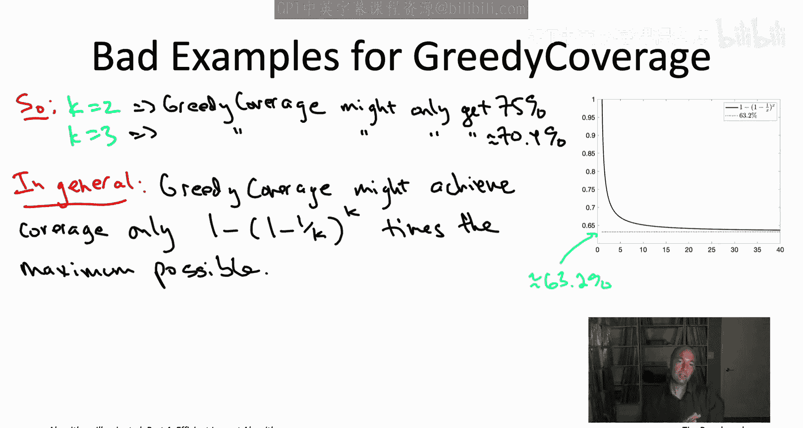

## 总结

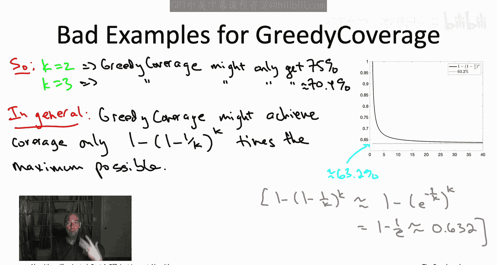

本节课中我们一起学习了最大覆盖问题及其一个简单自然的贪心启发式解法。
我们首先定义了问题，并通过团队组建、消防站选址和社交网络邀请等例子理解了其广泛的应用场景。
接着，我们详细描述了贪心覆盖算法的步骤：在每一步，都选择能增加最多新覆盖元素的子集。
我们分析了算法的简单实现及其多项式运行时间。
然后，我们通过构造具体的反例，发现贪心算法并不总能得到最优解，并且其近似性能存在一个下界，即覆盖值可能只有最优解的 1 - (1 - 1/k)^K 倍。
最后，我们观察到当 k 很大时，这个比例趋近于 1 - 1/e ≈ 63.2%，并指出这并非偶然，而是算法性能的理论极限。在接下来的课程中，我们将为这个近似比提供严格的理论证明。