# 算法启蒙（第4册）：NP难｜Part 4 Algorithms for NP-Hard Problems：12：影响力最大化的贪心启发式算法

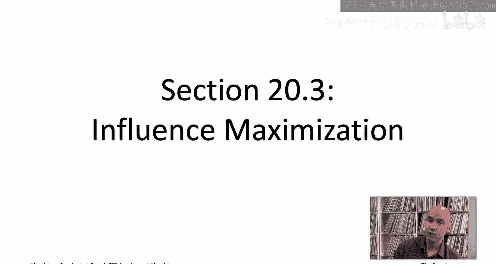

在本节课中，我们将学习影响力最大化问题，并探讨一个用于解决该问题的贪心启发式算法。我们将从社交网络和级联模型的基本概念开始，逐步深入到问题定义和算法分析。

## 概述


影响力最大化是社交网络分析中的一个经典问题。其核心目标是：在给定预算（即种子节点数量）的情况下，选择一组初始用户（种子节点），使得信息（如新闻、产品）通过社交网络传播后，最终被激活的用户数量期望值最大化。我们将介绍一个基于贪心策略的算法（KKT算法），并分析其性能保证。

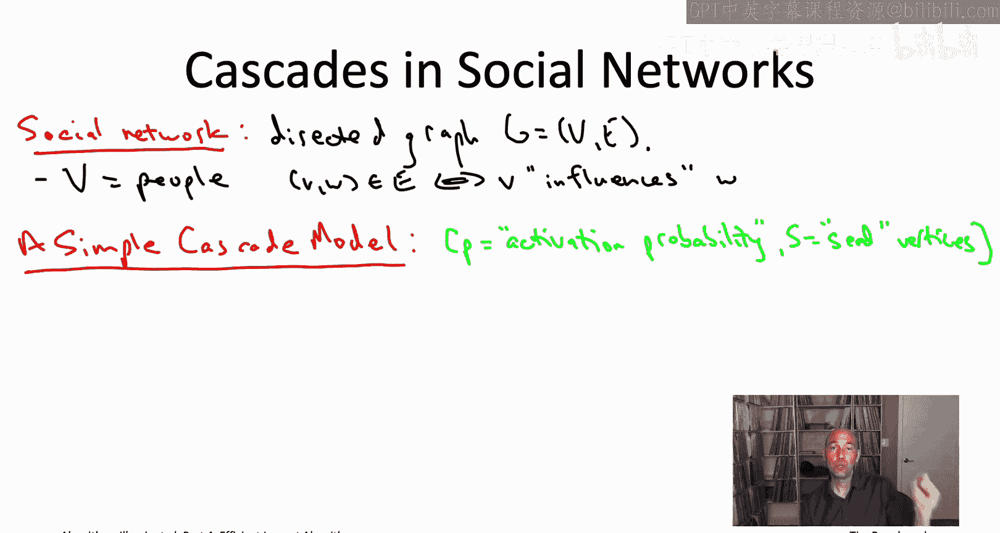


## 社交网络与级联模型

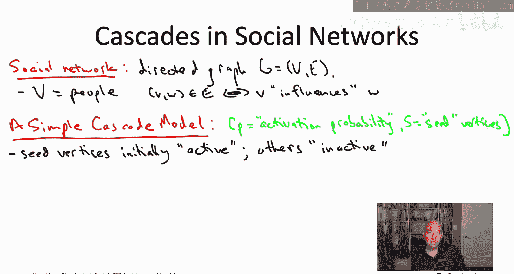


上一节我们介绍了NP难问题的背景，本节中我们来看看一个具体的应用问题——影响力最大化。首先，我们需要理解问题发生的场景：社交网络。

我们可以将社交网络建模为一个有向图 `G=(V, E)`。其中，顶点 `V` 代表人，有向边 `(v, w) ∈ E` 表示 `v` 对 `w` 有影响力（例如，`w` 在Twitter上关注了 `v`）。


级联模型描述了信息（如一篇文章或一个梗）如何在网络中传播。存在许多被深入研究的级联模型，这里我们关注一个简单的模型，它由两个参数定义：
*   **激活概率 `p`**：一个介于0和1之间的实数。
*   **种子节点集合 `S`**：一个顶点的子集。

在该模型中，每个顶点处于**活跃**或**非活跃**状态（例如，点击了文章链接或未点击）。过程开始时，所有种子节点 `S` 被设置为活跃状态，其他所有节点均为非活跃状态。节点一旦被激活，状态将不再改变。


激活过程如下：每个活跃节点 `v` 有一次机会去激活每一个它所能影响的、且连接边尚未被“翻转”的非活跃邻居 `w`。对于每条这样的边 `(v, w)`，我们进行一次 biased coin flip（偏置硬币翻转），其出现正面的概率为 `p`。

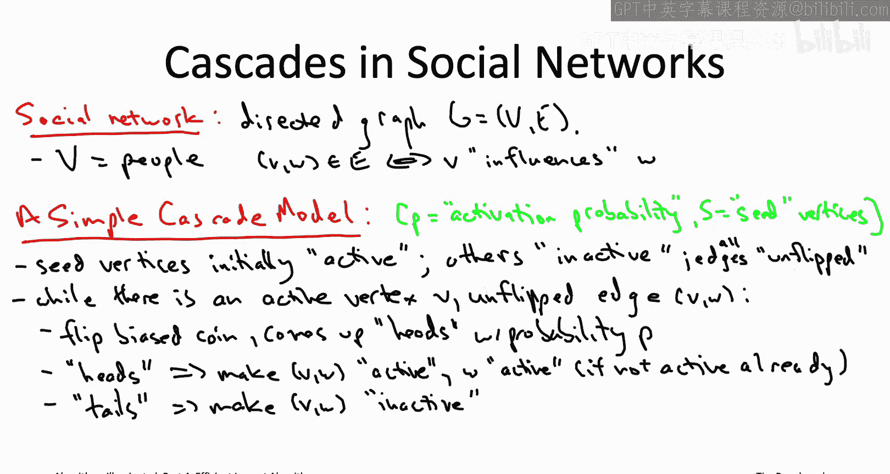

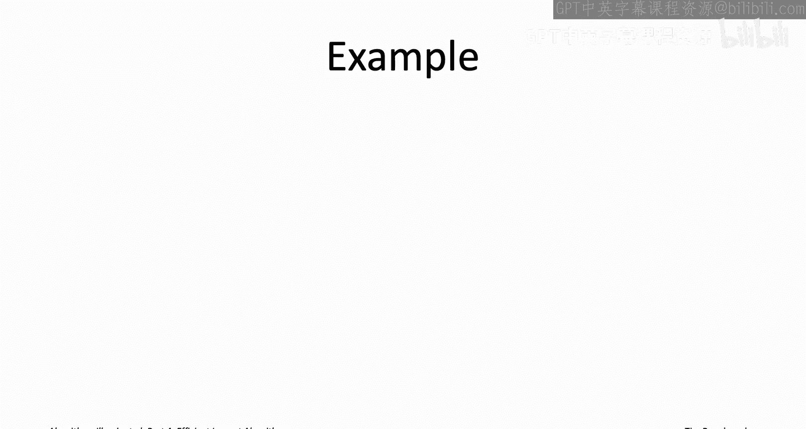

以下是翻转硬币后的规则：
*   若结果为**正面**：边 `(v, w)` 的状态变为“活跃”，且若 `w` 此前为非活跃，则将其状态更新为活跃。
*   若结果为**反面**：边 `(v, w)` 的状态变为“非活跃”，顶点 `w` 的状态保持不变。


这个过程持续进行，直到不存在这样的“机会”：即不存在一个活跃节点，其拥有指向未翻转边的邻居。最终，所有被激活的节点，恰好是从某个种子节点出发，通过一条全部由“活跃”边构成的有向路径可达的节点。

## 影响力最大化问题定义

基于上述级联模型，我们可以正式定义影响力最大化问题。

**输入**：
1.  一个有向图 `G=(V, E)`（社交网络）。
2.  一个激活概率 `p ∈ [0,1]`。
3.  一个预算 `K`（正整数）。

**定义**：对于给定的种子节点集合 `S`，用随机变量 `A(S)` 表示在级联过程结束后被激活的顶点集合。我们定义集合 `S` 的**影响力** `f(S)` 为最终被激活节点数量的期望值：
`f(S) = E[ |A(S)| ]`
这里的期望值是对级联过程中所有硬币翻转结果取平均。

**目标**：找到一个至多包含 `K` 个顶点的种子集合 `S*`，使得其影响力最大化：
`S* = argmax_{S ⊆ V, |S| ≤ K} f(S)`

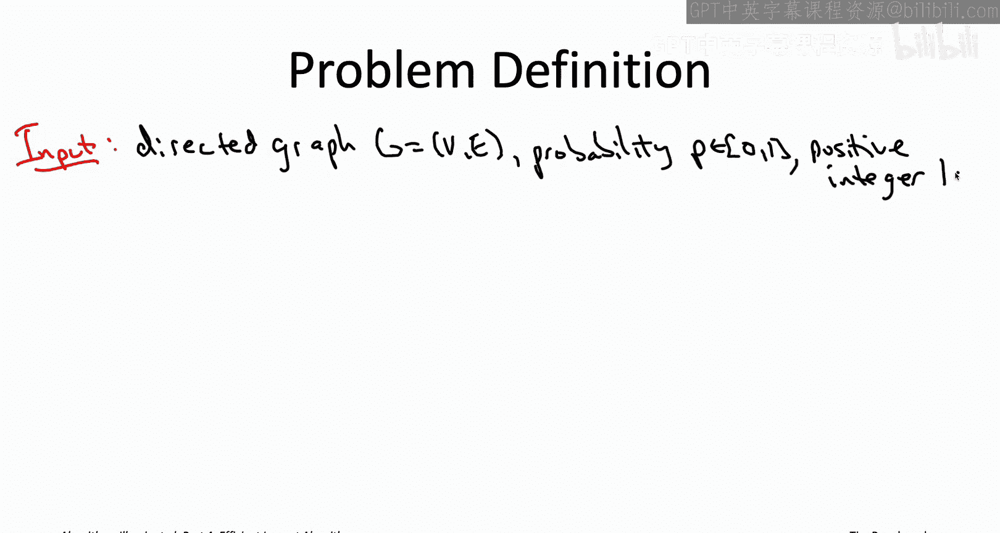

这个问题是NP难的。一个现实世界的例子是：你拥有 `K` 份免费产品，希望选择 `K` 个初始用户赠送，以最大化产品的最终总采用人数。

## KKT贪心算法

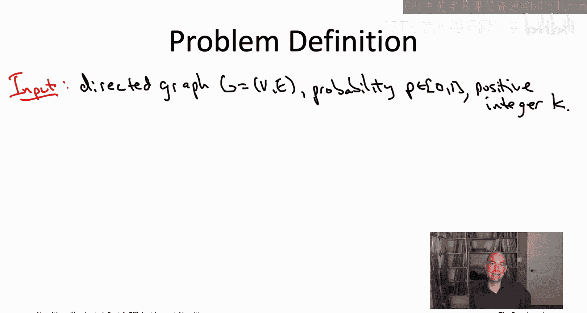

面对这个NP难问题，我们追求一个快速且近似正确的启发式算法。与解决最大覆盖问题的思路类似，一个自然的贪心算法应运而生，即KKT算法。

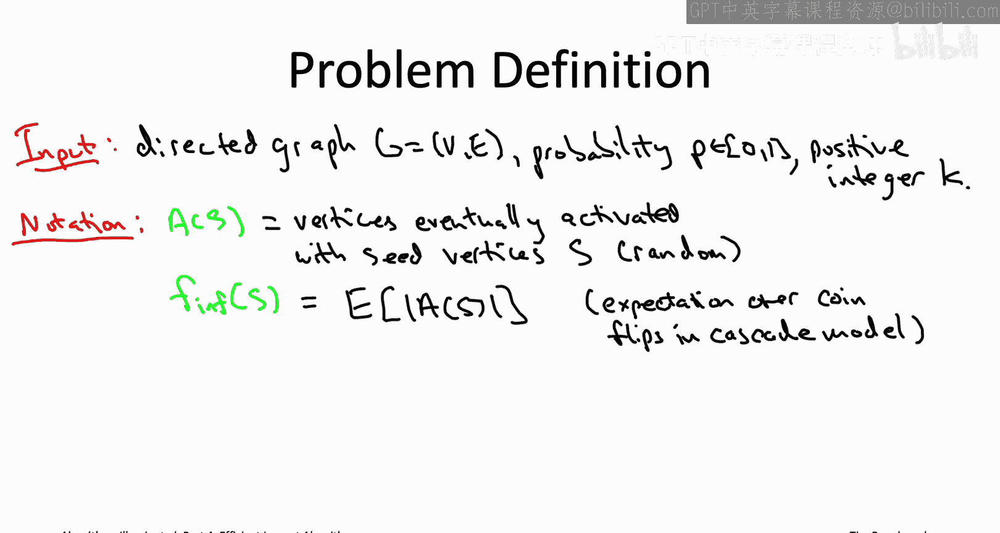

以下是该算法的伪代码描述：

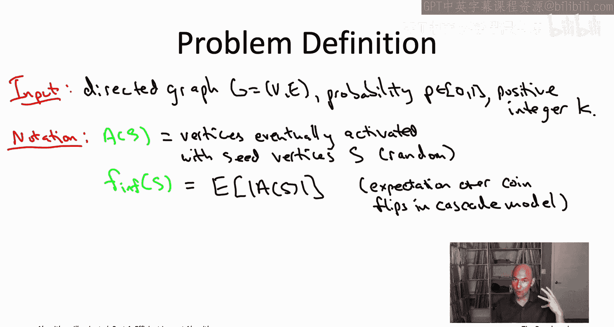

```
初始化空集合 S = ∅
for i = 1 to K:
    选择顶点 v ∈ V \ S，使得边际影响力增益 f(S ∪ {v}) - f(S) 最大
    将 v 加入集合 S
返回集合 S
```

简单来说，算法迭代 `K` 轮，在每一轮中，它“短视地”选择那个能为当前种子集合带来最大边际影响力提升的单个顶点。


## 算法运行时间分析


现在，我们来分析一下该算法的运行时间。一个直接的实现会面临计算挑战。


算法有 `K` 轮迭代。每轮需要遍历所有 `n` 个顶点，并对每个候选顶点 `v` 计算其边际增益 `f(S ∪ {v}) - f(S)`。这本质上需要计算两个集合的影响力 `f(·)`。

问题在于，根据定义，计算一个集合 `S` 的影响力 `f(S)` 需要求期望值，这涉及到对图中所有 `m` 条边的硬币翻转结果（共 `2^m` 种可能性）进行平均。如果采用最朴素的方法直接求和，那么计算一次 `f(S)` 就需要 `O(2^m)` 的时间，这使得总运行时间达到 `O(K * n * 2^m)`，是指数级的。

然而，在实践中，我们可以通过**随机采样**来高效地估计 `f(S)`。具体方法是：进行多次独立的随机实验，在每次实验中按照概率 `p` 模拟所有边的硬币翻转，运行级联过程，并记录被激活的节点数。然后将多次实验的平均激活节点数作为 `f(S)` 的估计值。使用这些估计值来运行贪心算法，可以在实际中取得很好的效果。

## 算法性能保证

尽管计算精确的影响力是困难的，但KKT贪心算法在理论上有优异的性能保证。


**定理**：令 `S_greedy` 为KKT贪心算法返回的种子集合，`S*` 为最优的种子集合。那么，贪心算法的影响力至少是最优解的 `(1 - 1/e)` 倍：
`f(S_greedy) ≥ (1 - 1/e) * f(S*)`
其中 `e` 是自然对数的底数。

这个保证与我们之前为最大覆盖问题分析的贪心算法保证完全相同。这是一个非常令人满意的结果，因为最大覆盖问题可以被视为影响力最大化的一个特例。对于这个更一般、更困难的问题，我们能期望的最好结果就是达到与特例问题相同的近似比，而KKT算法正好做到了这一点。

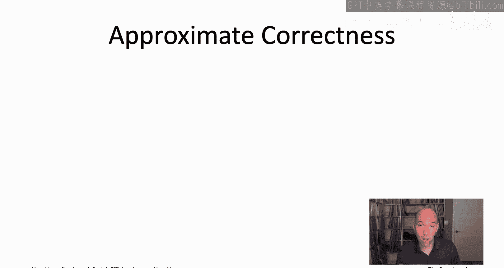

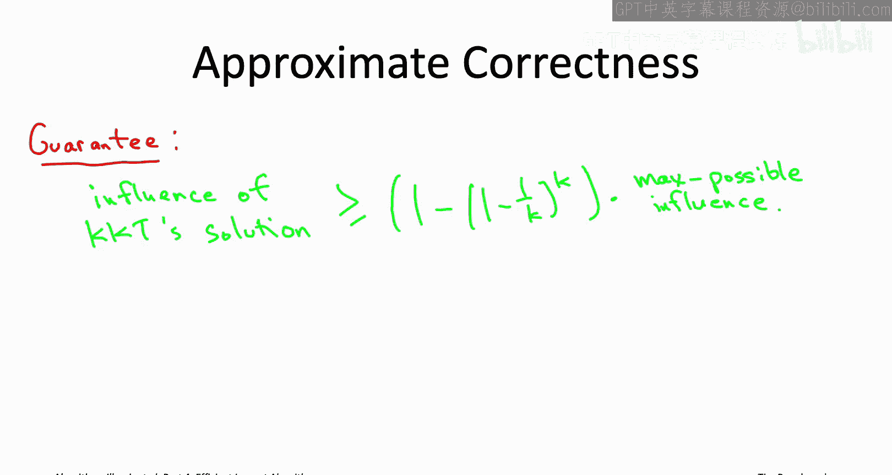

证明的直观思想在于，影响力函数 `f(S)` 可以表示为许多不同的“事件出席”问题（即最大覆盖问题）的加权平均。之前对最大覆盖问题的分析可以自然地扩展到这种加权平均的情形。

## 总结


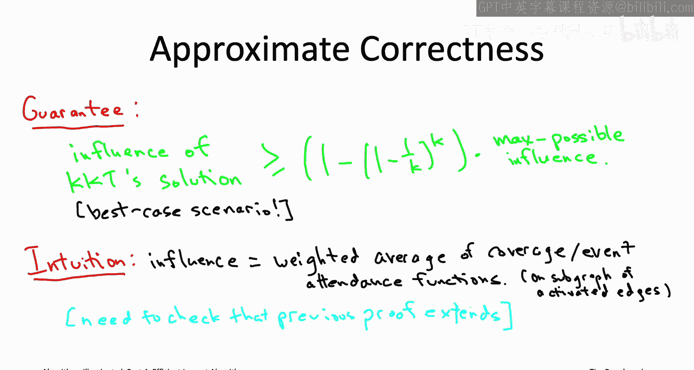

本节课中我们一起学习了社交网络中的影响力最大化问题。
1.  我们首先将社交网络建模为有向图，并引入了一个基于激活概率 `p` 的简单级联传播模型。
2.  接着，我们正式定义了影响力最大化问题：在预算 `K` 的限制下，选择种子集合以最大化最终激活节点数的期望值 `f(S)`。
3.  针对这个NP难问题，我们介绍了KKT贪心启发式算法，该算法迭代地选择能带来最大边际影响力增益的节点。
4.  我们讨论了算法的运行时间，指出直接计算精确影响力是指数级的，但可通过随机采样进行高效估计。
5.  最后，我们给出了算法的理论性能保证：其解的影响力至少是最优解的 `(1 - 1/e)` 倍。这个强保证说明了贪心策略在此类问题上的有效性。