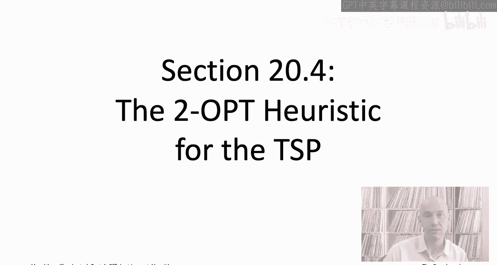
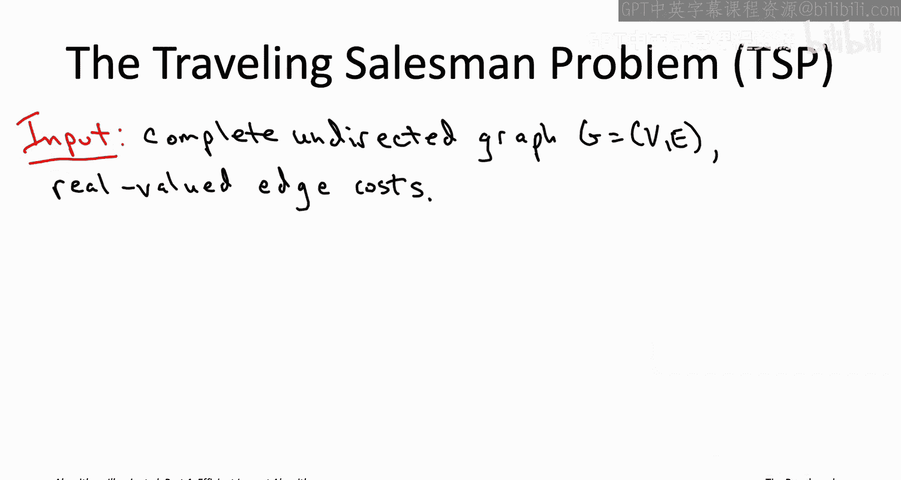
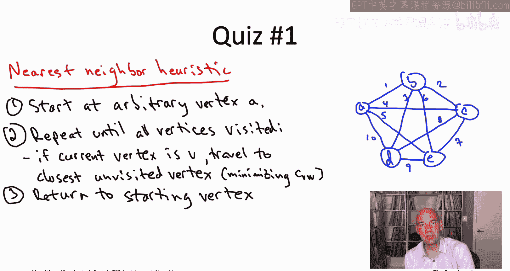
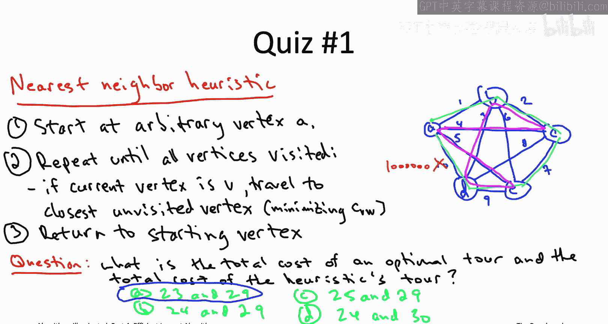
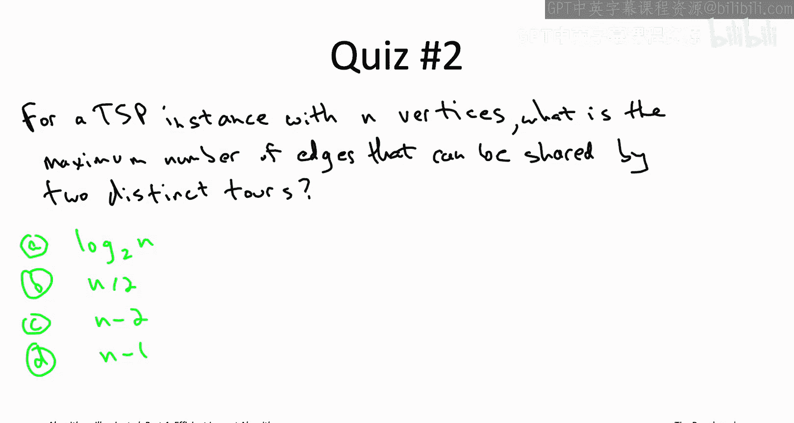
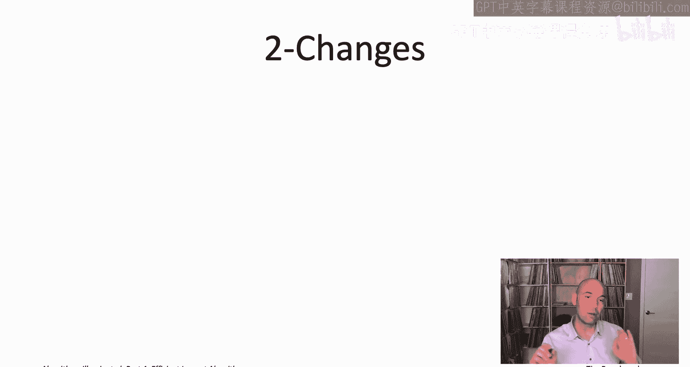
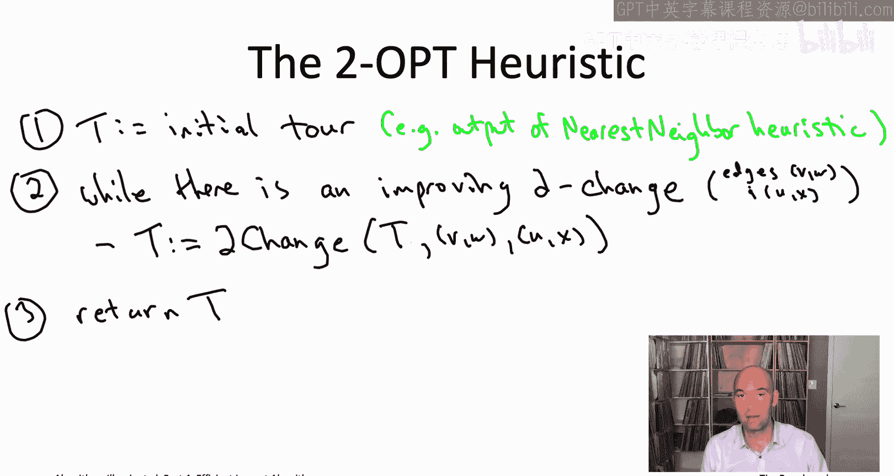

# 算法启蒙（第4册）：NP难｜Part 4 Algorithms for NP-Hard Problems：14：TSP的2-OPT启发式算法 - 第1部分

在本节课中，我们将学习如何为旅行商问题设计一个启发式算法。我们将从一个简单的贪心算法开始，然后介绍一种更强大的技术——局部搜索，并具体讲解其核心变体之一：2-OPT启发式算法。

## 概述：从NP难问题到启发式算法

NP难问题总是令人头疼。在我们之前研究过的几个问题中，如集合覆盖最小化、最大覆盖问题和影响力最大化问题，我们至少都拥有快速的启发式算法，并且这些算法享有近似正确性的保证，就像一份“保险单”。

然而，对于包括旅行商问题在内的一系列其他NP难问题，我们并不期望存在具有此类近似正确性保证的快速算法。事实上，如果存在这样的算法，将推翻P不等于NP的猜想。因此，如果你面对的是这类问题，并且确实需要一个快速算法，你唯一的选择就是设计一个启发式算法。虽然它没有“保险单”，但至少能在你的应用中出现的大多数或所有输入上表现良好。

局部搜索及其众多变体，正是这类技术中最强大、最灵活的一种。在本视频中，我们将从零开始为旅行商问题开发一个启发式算法，这将迫使我们发展出一些新思路。在下一部分，我们将退一步，识别出该TSP启发式算法中体现局部搜索原则的要素。掌握了应用局部搜索的模板以及针对TSP的具体实例后，你将能够很好地将此技术应用到自己的项目中。

## 旅行商问题回顾

首先，让我们快速回顾一下旅行商问题的定义。

问题的输入是一个**完全无向图**。这意味着有n个顶点，并且所有n选2条无向边都存在。此外，每条边都有一个实数值的**成本**，就像最小生成树问题中一样。

目标则是计算一个**旅行商回路**。所谓旅行商回路，是指一个访问每个顶点恰好一次的环。你从某个地方出发，经过n步后，访问完所有其他顶点并回到起点。在所有回路中，我们希望找到总边成本最小的那一个。

旅行商问题是一个非常著名的问题。如果你好奇为什么在本系列书的前三部分没有讨论它，那是因为不幸的是，它是一个NP难问题。我们将在视频列表中对应第22章的部分亲自证明这一点。但现在，让我们暂且相信TSP是NP难的。我们需要在正确性或速度上做出妥协。

## 探索简单的贪心启发式算法

为了感受如何为TSP设计启发式算法，让我们在这个测验中探索一个你可能想到的最简单的算法，类似于Prim算法在TSP问题上的类比。

这是一个贪心启发式算法，被称为TSP的**最近邻启发式算法**。你只需从任意一个你喜欢的顶点（称为小a）开始，然后以贪心、短视的方式，一次一条边地构建回路。从起始顶点A出发，你有n-1个顶点可以作为下一个访问点，你只需前往离你最近的那个，即对应边成本最小的那个顶点。此时你访问了两个顶点，还剩下n-2个。在所有这些剩余的顶点中，你前往最近的那个，即边成本最小的那个。然后你重复这个过程。当你重复了n-1次后，你得到了一条访问每个顶点恰好一次的路径。当然，在最后一步，你必须回到起点。这就是TSP的最近邻启发式算法。

接下来，我希望你计算出最近邻启发式算法在右侧幻灯片绘制的这个5顶点示例中会做什么。

除了找出最近邻启发式算法的输出外，我还希望你找出**最优的**、成本最小的旅行商回路。花几秒钟时间，计算出两者，然后我们将讨论答案。

答案是a。最小可能的回路成本是23，而最近邻启发式算法的回路成本是29。

让我们按相反的顺序来看这两个事实。首先从最近邻启发式算法开始。该算法将从顶点A开始，它查看其他四个顶点，发现整个图中成本最小的边与它相邻，并通向B。这肯定是最近邻启发式算法第一次迭代会选择的边。

现在，回路到达B后，它必须决定接下来是去C、D还是E。在这三个顶点中，B离C最近，到达C的成本仅为2，而到达D或E的成本分别为3或6。

现在回路在C点，只剩下两个选项。它必须接下来前往顶点D或顶点E，两个选项都不太好，但两者中较好的是沿着成本为7的边前往E。

从这里开始，回路的选择是强制的。此时只有一个未访问的顶点，所以它必须从E前往D。

当然，最后它必须返回起点，所以最终它从D回到A。

因此，最近邻启发式算法的回路如下所示，其总成本加起来确实是29。那么最优回路呢？虽然不一定立即显而易见，但总共只有12种选择，你可以对它们进行穷举搜索。确实存在一个成本为23的回路，我在这里用洋红色标出。

这个测验的启示是什么？我们在这个具体例子中看到，最近邻启发式算法不一定能计算出最小成本的旅行商回路。我们对此并不感到惊讶，因为我已经告诉过你TSP是NP难的。这个算法显然在多项式时间内运行，所以如果它是正确的，那将推翻P不等于NP的猜想，我们不期望这种情况发生。

然而，与我们之前看到的三个具有良好近似正确性保证的启发式算法不同，这个贪心算法可能离最佳回路相去甚远。要理解这一点，请记住这个回路的最后一步是强制的。因此，即使从D到E的最后一步成本高达十亿，这个回路仍然会选择那条边，因为在遍历了其余部分后，那是它唯一剩下的选择。

对于最近邻启发式算法来说，这将是一个非常糟糕的例子。你可以想象使用更复杂的贪心算法来规避这个特定例子，但不幸的是，所有贪心算法，实际上所有多项式时间算法，在更复杂的TSP实例中似乎都会遭受类似的命运。

## 寻求改进：局部搜索的思想

那么，我们能做得更好吗？这里有一个自然的想法：谁说我们必须在最近邻启发式算法结束时就必须停止？如果我们把该启发式算法得到的回路作为一个起点，然后贪婪地寻找进一步改进它的方法呢？

为了理解这可能如何运作，在这个测验中，我希望你思考一下，要对一个回路进行最小的修改以得到另一个不同的回路，需要改变什么。

这个测验的答案是第三个。两个包含n个顶点的回路可以共享n-2条边，但不能更多。为什么它们不能共享n-1条边？因为一旦我告诉你一个回路的n-1条边，它就唯一地确定了最后一条边必须是什么。将其变成回路的唯一方法是连接两个端点。因此，如果两个回路共享n-1条边，它们实际上必须共享所有边，并不是不同的。另一方面，你可以有仅相差两条边的不同回路。让我们看一个5顶点实例的例子。

一方面，你可以想象一个五边形回路，这就像我们上一个测验示例中沿着外圈走。或者，你可以有这条浅蓝色的回路，它使用了外圈的三条边和两条内部交叉的边。这就是两个不同的、访问五个顶点的回路，它们有三条公共边，这是可能的最大值。

记住这个测验的重点。我们对最近邻启发式算法不太满意，然后我们问，为什么我们必须止步于它的输出？为什么不能进一步贪婪地改进它？我们想知道可能导致更好回路的最小改变。在那个测验中，我们看到，你或许可以移除两条边，然后放入两条不同的边，这可能会给你一个更好的回路。这种移除两条边并放回两条不同边的修改，被称为**2-交换**。

## 理解2-交换操作

那么，2-交换具体是如何工作的呢？你有一个初始回路T，你从中移除两条边，然后插入两条不同的边。你需要选择两条边，它们应该有不同的端点。一条边是(v, w)，另一条是(u, x)，总共四个不同的端点。你把它们移除，这会将你的回路断开成两条路径。对于四个端点，在两条路径之间总共有三种不同的配对方式。其中一种会给你开始的回路，一种会给你两个不相交的环（这不是一个回路），第三种会给你一个新的回路，而这正是你想要的。

例如，在幻灯片上的这个图示中，v当前与w配对。两个候选的更改是：将v改为与x配对，或者将v改为与u配对。如果我们将v与x配对，从而将u与w配对，那么我们就得到一个新的回路，使用这两条洋红色的边。但是，如果我们将v与u配对，并被迫将w与x配对，我们添加这些绿色的边，那么我们得不到一个可行的解，只会得到两个不相交的环，这当然不是我们想要的。这就是2-交换：你取出这两条蓝边，然后放入相应的洋红边，得到一个新的回路。

自然地，修改回路会改变其总成本。那么，一次给定的2-交换能带来多少回路成本的下降呢？

好消息是，我们移除了边(v, w)和(u, x)，所以回路成本将下降我们之前为这些边支付的代价。另一方面，我们插入了这些新边（在例子中是(u, w)和(v, x)），所以我们现在必须为这些边付费，这会抵消掉回路成本的下降。因此，我们感兴趣的是那些下降为正的2-交换，即我们移除的边带来的好处超过了我们添加的新边的成本。如果一个2-交换具有这种性质，即严格降低了回路成本，我们称之为**改进型2-交换**。

## 2-OPT启发式算法

现在，你可能已经猜到了TSP的**2-OPT启发式算法**是什么。你只需用一个任意回路（例如，最近邻贪心启发式算法的输出）来初始化它，然后只要有可能，就继续贪婪地进一步改进回路。每次改进时，你都进行最小的必要修改以获得新回路，即进行一次2-交换，并且这个2-交换应该是改进型的，意味着你移除的边的成本应超过你插入的边的成本。你尽可能长时间地这样做。当没有更多的改进型2-交换时，你停止并返回该回路作为最终结果。

在伪代码中，`2-change`子程序以一条回路和该回路中两条无公共端点的边作为输入，然后执行相应的2-交换。它移除给定的边(v, w)和(u, x)，然后添加能给你一个新回路的那对边，即将v与u或x配对，然后将w与另一个配对，选择那个能给你新回路的配对方式。

## 总结

在本节课中，我们一起学习了如何为NP难的旅行商问题设计启发式算法。我们从回顾TSP定义开始，然后探讨了一个简单的贪心算法——最近邻启发式算法，并指出了其局限性。接着，我们引入了局部搜索的思想，并详细介绍了其核心操作：2-交换。我们定义了改进型2-交换，并最终构建了2-OPT启发式算法的基本框架：从一个初始回路开始，反复应用改进型2-交换，直到无法进一步改进为止。这为我们处理缺乏近似保证的困难优化问题提供了一个强大而灵活的工具。在下一部分，我们将更抽象地审视这个算法，提炼出局部搜索的一般原则。