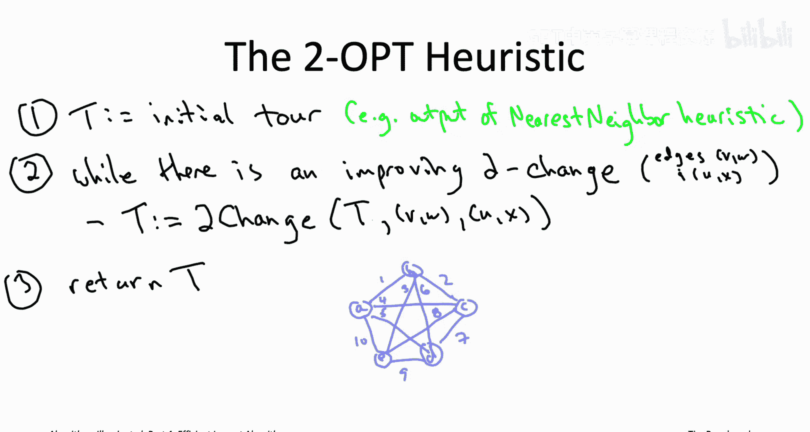
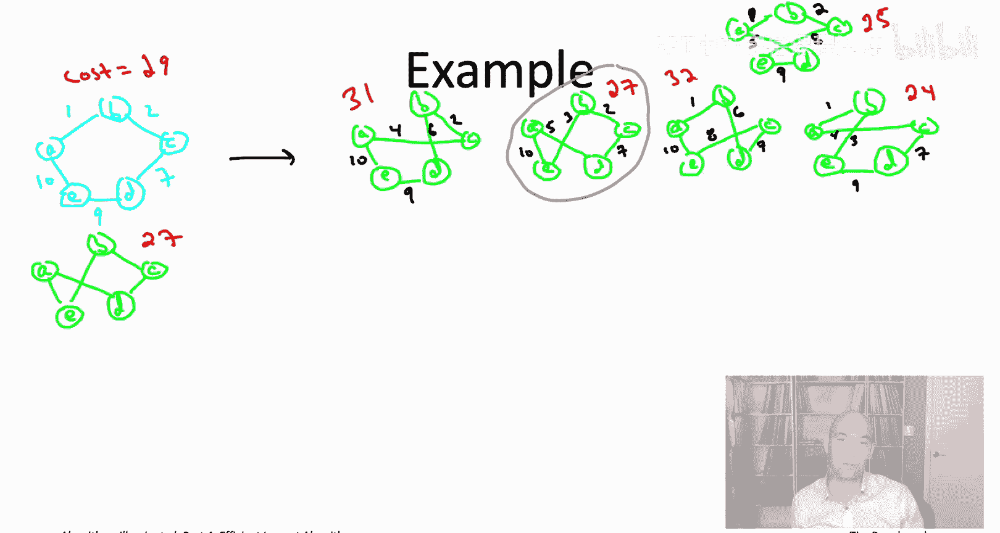
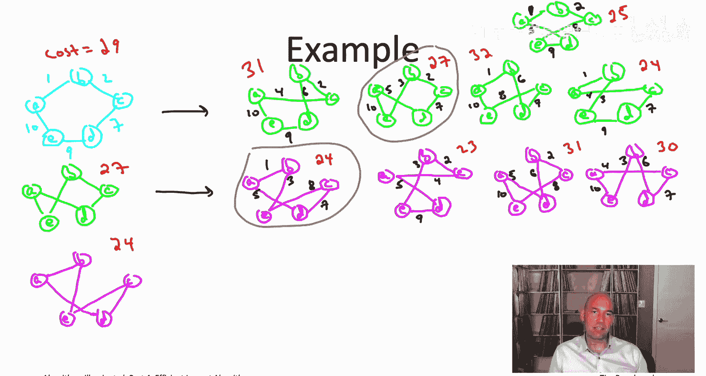
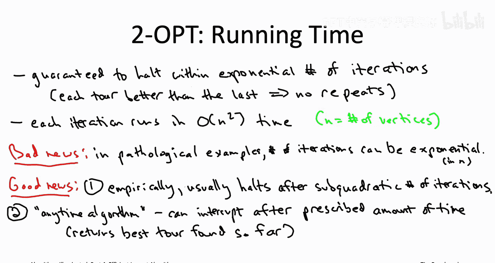

# 算法启蒙（第4册）：NP难｜Part 4：15-20.4_ TSP的2-OPT启发式算法 - 第2部分

在本节课中，我们将通过一个具体例子，详细学习2-OPT启发式算法如何工作。我们将分析其运行步骤，并讨论算法的运行时间与解的质量。

---

## 2-OPT算法工作示例

上一节我们介绍了2-OPT算法的基本思想。本节中，我们通过一个具体例子来演示其运行过程。

我们使用之前测验中出现过的同一个例子。下图展示了该实例的5个顶点及其边权。

需要提醒的是，如果我们从顶点A开始运行最近邻启发式算法，最终会得到一个遍历外围的环游，其总成本为29。我们将以此作为2-OPT算法的初始解。

### 初始迭代

我们以这个浅蓝色环游（总成本29）初始化2-OPT算法。我们想知道能否通过一次2-交换使其变得更好。检查方法之一是枚举所有可能的2-交换，并观察每个交换的效果。

以下是所有可能的2-交换数量：
对于n个顶点，可能的2-交换数量为 `n * (n - 3) / 2`。当n=5时，结果为5。

现在，让我们检查从这个初始外围环游出发，通过一次2-交换可以得到的五个不同环游。

每个绿色环游与浅蓝色环游共享五条边中的三条。它们都包含三条外围边，然后用两条交叉边将这三条边连接成一个环游。

接下来，我们需要判断这些2-交换中是否存在改进的交换，即是否能得到一个总成本严格更低的环游。

以下是五个环游的总成本：
1.  第一个环游：成本31（更差）。
2.  第二个环游：成本27（优于29）。
3.  第三个环游：成本32（更差）。
4.  第四个环游：成本24（优于29）。
5.  第五个环游：成本25（优于29）。

因此，存在三个改进的2-交换选项（第二、第四、第五个）。算法需要决定选择哪一个。一种自然的启发式策略是：按顺序枚举2-交换，一旦找到一个改进的交换，就立即执行它。

如果采用此策略，在本例中，我们会执行第一个遇到的改进交换（即第二个环游），从而移动到总成本为27的新环游。

### 第二次迭代

现在，我们进入while循环的下一次迭代，从新的成本27环游开始重复整个过程。

我们需要检查从这个环游出发的五个可能的2-交换，看是否有改进的。其中一个交换会直接撤销我们刚刚做的操作，回到五边形环游。因此，我们只需关注其他四个能产生新环游的2-交换。

现在的问题是，这四个环游中是否有比当前成本27环游更好的？让我们计算每个环游的成本：
1.  第一个环游：成本24（优于27）。
2.  第二个环游：成本23（优于27，且这是最优环游的成本）。
3.  第三个环游：成本31（更差）。
4.  第四个环游：成本30（更差）。

因此，存在两个改进的2-交换选项（第一和第二个）。如果继续采用“找到即执行”的策略，我们会移动到第一个遇到的改进环游，即成本24的环游。

### 第三次迭代

进入while循环的第三次迭代。我们再次询问：能否通过2-交换使这个成本24的环游变得更好？同样有五个可能的2-交换，其中一个会直接回到我们刚离开的环游。让我们看看其他四个2-交换的结果。

检查这四个环游的成本，看是否有低于24的：
1.  第一个环游：成本32（更差）。
2.  第二个环游：成本24（与当前环游成本相同，但严格改进要求成本降低，故不计为改进）。
3.  第三个环游：成本25（更差）。
4.  第四个环游：成本26（更差）。

这意味着没有改进的2-交换可用。此时，2-OPT算法停止，并返回当前环游作为最终输出。

对于这个特定例子，算法最终输出的是成本24的环游。

## 算法分析：运行时间与解质量

与所有算法一样，我们需要讨论其运行时间以及在何种程度上算法是正确的。

### 运行时间分析

首先，算法是否会在有限时间内终止？while循环是否会永远运行？
虽然旅行商环游的数量是指数级的（`(n-1)!/2`），但总数是有限的。更重要的是，根据定义，2-OPT算法while循环的每次迭代都会严格降低当前环游的总成本（例如从29降到27，再降到24）。这意味着你永远不会重复看到同一个环游，因为每个新环游都比之前见过的所有环游都更好。因此，即使在最坏情况下算法遍历了每一个环游，它也将在指数级但有限的时间内终止。

当然，我们从不满足于指数级的运行时间上界，我们希望2-OPT算法能更快，最好是多项式时间。

算法的总运行时间等于主while循环的迭代次数乘以每次迭代的执行时间。每次迭代基本上需要遍历所有可能的2-交换以寻找改进的交换。如果实现得当，这需要`O(n²)`的时间，因为可能的2-交换数量是`n*(n-3)/2`。

那么，关键问题是迭代次数是否总是多项式级别？这里有一些好消息和坏消息。

**坏消息**是，确实存在精心构造的病理实例，使得2-OPT算法的主while循环会执行指数级的迭代次数。

**好消息**有两点：
1.  在实际应用中，在现实的输入实例上，几乎永远不会遇到这些病理例子。2-OPT算法几乎总是能相当快地收敛，例如在`O(n²)`次迭代内。
2.  我们并不一定要运行2-OPT算法直到完全结束。查看伪代码可知，你可以在任何时候中断这个算法。它始终维护着一个可行的环游。例如，你可以设置一个计时器（10分钟、1小时等），时间一到，如果算法尚未停止，就输出它找到的最新且最好的环游。这类算法有时被称为“随时算法”。

### 解的质量分析

2-OPT算法肯定会在你初始化的环游基础上进行改进，这是好消息。但从我们的例子中我们也知道，它不一定能计算出可能的最佳环游。在我们的例子中，它输出了成本24的环游，但存在一个成本23的更优环游。

关于解的质量，同样有坏消息和好消息。

**坏消息**是，与最小生成树、最大覆盖和影响力最大化等问题不同，对于TSP，2-OPT算法没有可证明的近似正确性保证。确实存在一些复杂且人为构造的例子，使得2-OPT算法的输出环游可能比最优环游差任意多倍。

**好消息**是，从经验上看，2-OPT算法的表现相当令人印象深刻。其性能在一定程度上取决于应用场景和处理的实例类型，但非常常见的是，它能返回总成本在最优解10%到20%以内的环游，并且在许多应用中，可以可靠地达到与最优解相差几个百分点的水平。

因此，这非常令人鼓舞。显然，如果我们能像贪心启发式算法那样有一个“保险政策”会更好，但至少在实际应用出现的实例类型上，2-OPT算法经验上表现相当好，输出的环游总成本不会比最小可能成本高出太多。

事实上，当业界人士向我请教一个看起来类似TSP的问题时，我通常会建议他们从2-OPT启发式算法开始，并结合我们将在下一个视频中讨论的一些改进技巧。如果你在自己的项目中需要处理TSP类型的问题，这是一个极好的起点。

---

## 总结

本节课中，我们一起学习了2-OPT启发式算法如何通过具体例子逐步改进环游。我们分析了其迭代过程，并讨论了算法的运行时间特性（最坏情况指数级，但实际表现良好）和解的质量（无理论保证，但经验上接近最优）。我们还了解到它可以作为“随时算法”使用，为实际应用提供了灵活性。

在下一个视频中，我们将跳出细节，展示2-OPT算法如何体现局部搜索的一般原则。

