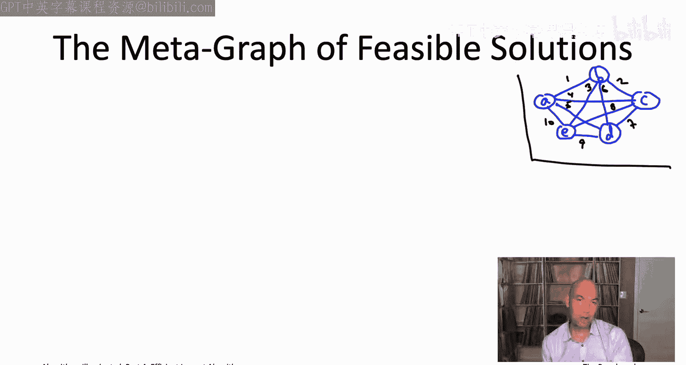
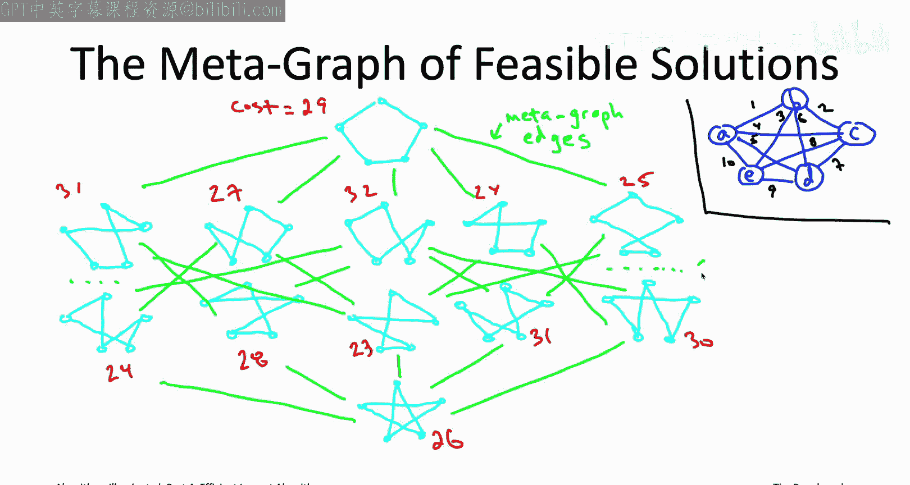
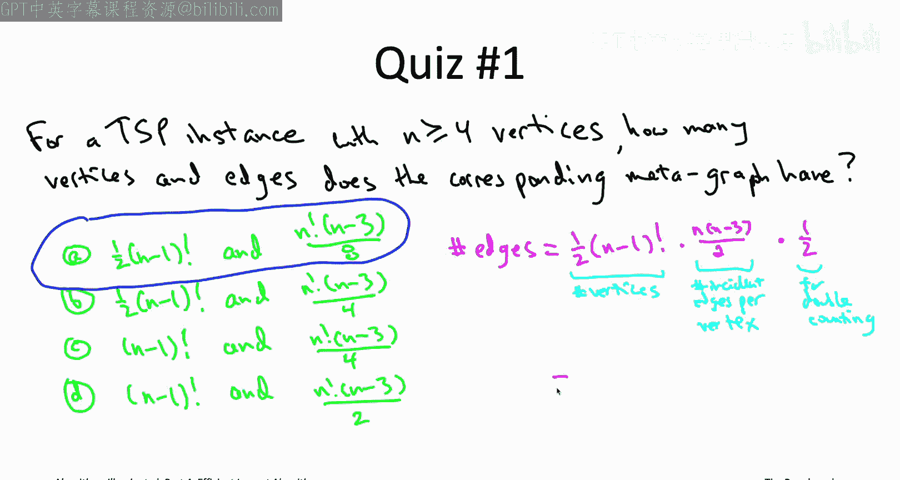
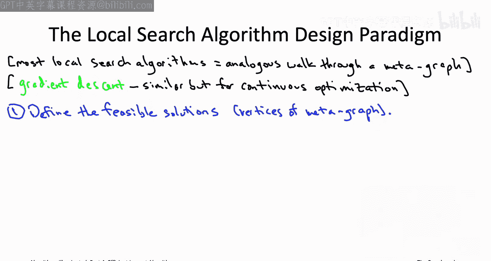
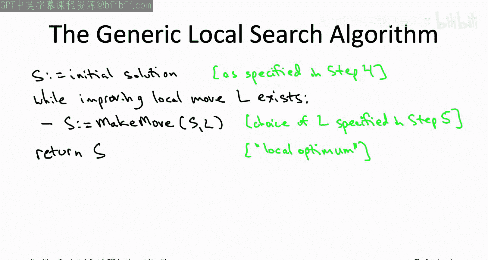

# 斯坦福大学《算法启蒙（第4册）：NP难｜Part 4 Algorithms for NP-Hard Problems》：16：局部搜索原理（第1部分）

在本节课中，我们将要学习局部搜索算法的基本原理。局部搜索是一种通过局部移动来探索可行解空间，并逐步改进目标函数值的算法范式。我们将通过一个具体的例子来理解其核心概念，并学习如何将其应用到不同的问题中。


上一节我们介绍了旅行商问题的2-opt启发式算法，本节中我们来看看如何将其抽象为一种通用的算法设计范式。

## 局部搜索的元图视角

让我们快速回顾上一节讨论的旅行商问题2-opt启发式算法。我们可以将2-opt算法视为在一个非常大的图中行走。这个图我们称之为**元图**。




为了解释元图，我们使用一个包含5个顶点的TSP实例作为例子。元图的顶点对应于该实例的所有旅行商环路。对于一个5顶点的实例，环路的数量是 `(n-1)! / 2 = 12`。因此，这个元图有12个顶点。


我将这12个环路排列成四行。最上面一行是周长环路，即最近邻启发式算法的输出。最下面一行是“补集”环路，它不包含周长环路的任何一条边，而包含所有其他五条边，形状类似一个星形。其他10个环路放在中间两行。

接下来，我为这12个环路标注它们的成本。

现在，我来定义元图的边。元图的边对应于**2-交换**操作。换句话说，如果两个环路可以通过一次2-交换相互转换，或者说它们共享五条边中的三条，那么它们在元图中就是相邻的。

例如，考虑最顶部的周长环路。在第二行中，有五个环路，它们恰好是我们在上一节运行2-opt算法时，第一次迭代中检查的五个相邻环路。也就是说，顶部环路的五个相邻环路正是第二行的五个环路。

底部的六个环路在某种意义上是对顶部六个环路的“反射”，我们只是切换了哪些边在内、哪些边在外。底部的环路（星形）与第三行的五个环路中的每一个都通过2-交换相连。

对于第二行和第三行中的其他环路，每个环路都应该有五条入射边。我已经以这样的方式排列了环路：这些额外的边将连接到另一行的环路上。例如，第二行中间的环路将与第三行中除了正下方那个之外的所有环路相邻。

这就是与旅行商问题实例相关联的元图的定义：元图的顶点对应于TSP实例的环路，当且仅当两个环路仅相差两条边时，它们在元图中相邻。



## 在元图中可视化2-opt算法

为什么我要介绍这个元图？因为我们可以用它来非常清晰地可视化2-opt算法。

在我们的运行示例中，我们从最近邻启发式算法的输出（顶部的环路）开始。2-opt算法的工作方式是进行一次2-交换，即在元图中沿着一条边“走”到一个相邻的环路。在示例中，有五个选项，其中三个环路的总成本严格更小（成本为27、24、25的环路）。

我们处理的是找到第一个改进的2-交换就执行的变体。这导致算法沿着从顶部环路出发的第二条边，到达成本为27的环路（第二行第二个）。我们在图中走了一步，得到了2-opt算法在示例中采用的第二个环路。

然后我们重复这个过程：从成本27的环路出发，再次检查五个相邻环路。我们发现有两个改进的2-交换（第三行的第一个和第三个环路）。如果我们取找到的第一个，那么我们将从成本27的环路走到成本24的环路。

在进行两次2-交换（即在元图中走两步）之后，我们到达了成本24的环路。再次检查相邻环路，发现没有改进的移动。实际上，只有一个更好的环路（成本23），但它与我们当前所在的环路在同一行，而根据我们绘制的图，同一行的两个环路并不相邻。所有相邻环路的成本都大于或等于24。这意味着2-opt算法将在此停止。

更一般地说，任何TSP实例上2-opt算法的任何一次执行，都可以被视为在一个合适的元图中进行类似的行走。顶点对应于环路，如果两个环路通过2-交换相连则相邻。2-opt算法所做的是沿着一条路径行走，从一个环路到另一个环路，每个环路的成本都严格小于前一个，直到无法继续为止。

## 元图的规模

让我们通过一个小测验来确保定义清晰。

**问题**：假设我给你一个至少有4个顶点（n ≥ 4）的TSP实例。这个元图有多少个顶点和边？

**正确答案是A**。

**顶点数**：元图的顶点对应于TSP实例的环路。环路的数量是 `(n-1)! / 2`。这就是元图的顶点数。

**边数**：计算图中边数的一种方法是遍历每个顶点，计算其入射边的数量，然后求和。最后除以2，因为每条边从两个端点各被计算了一次。

*   顶点数：`(n-1)! / 2`
*   每个顶点的入射边数：对于一个给定的环路，可以通过2-交换到达的相邻环路数量是 `n * (n-3) / 2`。
*   总边数 = `[ ( (n-1)! / 2 ) * ( n * (n-3) / 2 ) ] / 2 = n! * (n-3) / 8`




## 局部搜索的一般范式

现在，我想从旅行商问题和2-opt算法的具体案例研究出发，更一般地讨论局部搜索算法。

很酷的是，大多数局部搜索算法都可以像我们刚才看到的那样被看待——它本质上就是在可行解的元图中行走。


你甚至可以在可视化中添加第三个维度，其中某个可行解点的“高度”或“海拔”对应于该解的目标函数值。因此，在像我们刚才看的TSP这样的最小化问题中，这种行走总是向下的，走向海拔更低的可行解。如果是最大化问题，你就是在向上爬。实际上，局部搜索通常被称为**爬山法**，正是源于这种最大化问题的可视化：你在元图中一步步行走，总是走向更高点。


因此，大多数局部搜索算法都可以这样可视化：在可行解的元图中行走。不同的局部搜索算法主要区别在于它们对元图的选择。

*   显然，对于不同的问题，你会有不同的可行解（不同的顶点集）。
*   即使对于同一个问题，不同的局部搜索算法也可以对元图的边有不同的定义，即它们对哪些可行解在元图中相邻有不同的定义。

其次，不同的局部搜索算法在探索图的方式上也有所不同，我们将在下一个视频中详细讨论。

你也可能在连续优化（相对于我们这里讨论的离散优化问题）的背景下遇到局部搜索算法，其中最著名的是古老的**梯度下降**算法。它本质上也是爬山法，但搜索空间是欧几里得空间中的所有点，而不是有限的离散解集。梯度下降（或其随机变体）是现代机器学习（特别是监督学习，如训练神经网络）的核心工作算法。


## 局部搜索算法设计范式的六个步骤


现在，让我们详细阐述局部搜索算法设计范式的细节。如何将其应用到你自己的工作中遇到的问题？让我将其分解为六个步骤。

前三个步骤都涉及为你的应用定义合适的元图。

**步骤一：定义可行解（顶点）**
可行解应该对应于你关心的问题中的可行解。对于我们讨论的这类明确问题，答案通常是直接的。
*   TSP：可行解是环路。
*   最小化完工时间：可行解是可能的调度方案。
*   最大覆盖：可行解是从给定集合中选出的K个子集的集合。



**步骤二：定义目标函数**
要应用局部搜索，你需要明确你想要最大化或最小化的目标。同样，对于我们关注的问题，答案通常是显而易见的。
*   TSP：总成本。
*   最小化完工时间：完工时间。
*   最大覆盖：覆盖的元素数量。

**步骤三：定义局部移动（边）**
要完成元图的描述，你必须说明边是什么，即你认为哪些可行解是相邻的。元图的边正好对应于允许的局部移动。


这三个步骤是建模决策，你甚至需要在开始考虑实现局部搜索算法之前就做出这些决定。前两步基本上是精确定义问题（什么是允许的可行解，以及你想要优化什么），然后，在运行局部搜索之前，你必须说明局部搜索允许做什么（即允许的局部移动是什么）。

在完全定义了你的元图之后，你还需要做出几个更具算法性质的决策。

**步骤四：初始化**
你需要回答如何初始化局部搜索算法，即从哪个可行解开始这次元图行走？
例如，在我们的TSP案例研究中，我们通常考虑从最近邻启发式算法的输出开始。当然，我们也可以做出其他决定。

**步骤五：选择改进移动**
这是一个关于如何实现局部搜索算法细节的算法问题。正如我们在TSP示例中看到的，从一个可行解出发，可能有多个改进的局部移动可用，你需要决定实际执行哪一个。
例如，在我们的TSP运行示例中，我们总是选择找到的第一个改进的局部移动。


一旦你回答了所有这五个问题，你的局部搜索算法就基本确定了。你有了元图（由步骤一至三定义），知道了从哪里开始（步骤四的答案），并且知道了在众多可能的改进移动中如何选择每一步（步骤五的答案）。


## 通用局部搜索算法的伪代码

为了确保清晰，让我给你一个通用局部搜索算法的伪代码。在你按照范式做出步骤一至五的决策后，就可以运行这个算法。伪代码看起来就像TSP的2-opt算法，只是针对通用问题和通用的改进局部移动概念。

```pseudocode
初始化：从某个任意的可行解 S 开始
while (存在从 S 出发的改进局部移动) {
    根据步骤五的规则，选择一个改进局部移动
    对 S 执行该移动，得到新的可行解 S'
    令 S = S'
}
返回 S
```



首先，你从某个任意的可行解开始（步骤四就是确定如何初始化）。然后是一个主 while 循环：只要存在从当前解出发的改进局部移动（即能产生更优目标函数值的移动，对于最大化问题是更大，对于最小化问题是更小），你就继续执行。你执行一个改进的局部移动。从一个给定的可行解出发，可能有很多移动，但步骤五的要点就是解决这种歧义，决定选择哪一个。

最终，局部搜索会终止，因为目标函数值在每次迭代中都在改进。最后，你将得到一个解，从该解出发没有改进的局部移动（每个局部移动要么保持目标函数值不变，要么使其变差）。这种类型的解被称为**局部最优解**。局部最优解是指无法通过任何局部移动改进的解。

## 应用示例：定义元图

这个讨论可能感觉有些抽象。我们确实有TSP的2-opt案例研究，但我还是想花几分钟时间，给你一些关于步骤一至五如何具体运作的实例。

让我们从前三个步骤开始，即定义可行解的元图。我们不仅看TSP的运行示例，也看看另外两个我们设计过快启式算法的问题：最小化完工时间问题和最大覆盖问题。

**步骤一：可行解**
*   TSP：环路。数量为 `(n-1)! / 2`。
*   最小化完工时间：调度方案。如果有 n 个作业和 M 台机器，总共有 `M^n` 种不同的调度方案。
*   最大覆盖：从给定的 M 个子集中选出 K 个的集合。数量为 `C(M, K)`。

**步骤二：目标函数**
在我们的运行示例中，这没什么好说的：TSP是总成本，最小化完工时间是完工时间，最大覆盖是覆盖数量。

请注意，一旦你做出了前两个决定（元图的顶点是什么，以及目标函数值是什么），此时你已经知道了“圣杯”解（即实例的全局最优解）是什么。就像在我们5顶点的TSP示例中，成本为23的环路。

只有在我们回答了步骤三的问题、定义了允许的局部移动之后，我们才能谈论局部最优解。

**步骤三：局部移动**
我们已经看到了一个选择允许局部移动的例子，即TSP的2-opt启发式算法，其中局部移动对应于2-交换。

当我们讨论最小化完工时间或最大覆盖时，我们实际上并没有使用局部搜索，因此不需要定义允许的局部移动。但我们现在可以退一步说，假设我们确实想用局部搜索来处理这些问题，我们会怎么做？

*   **最小化完工时间**：可行解是调度方案。可能最简单的局部移动就是**重新分配一个作业**。你取一个在某台机器上的作业，将其重新分配到其他 `M-1` 台机器中的一台。这意味着，从每个调度方案出发，有 `n * (M-1)` 个不同的相邻调度方案（可通过局部移动到达）。
*   **最大覆盖**：可行解对应于选出的K个子集的集合。可能最简单的局部移动就是**交换**。如果你有一个当前的K个子集的集合，你会取出其中一个，并用一个不同的子集替换它，从而得到一个新的K个子集的集合，希望覆盖更多。这里，你有 K 种选择来决定取出哪个子集，有 `M-K` 种选择来决定放入哪个子集。因此，从每个可行解出发，有 `K * (M-K)` 个相邻解。

一旦你回答了步骤三，你现在就完全指定了你所关心问题实例的**局部最优解**是什么。

*   在我们运行的5顶点TSP示例中，我们有两个局部最优解：第三行的第一个和第三个环路。第一个不是全局最优解（全局最小值），但第三个是全局最小值。
*   在最小化完工时间的背景下，如果局部移动只是重新分配一个作业，那么局部最优解是指任何单个作业的重新分配都无法使完工时间变小。也就是说，每个作业的重新分配要么使完工时间保持不变，要么使其变大。
*   类似地，在最大覆盖中，如果我们使用交换作为局部移动，那么局部最优解是指一个K个子集的集合，其中用任何新子集替换现有子集都无法增加覆盖，要么覆盖保持不变，要么甚至变小。

我们在关于最小化完工时间和最大覆盖的测验中看到了许多可行解的例子。我鼓励你回顾一下我们看到的例子，并检查哪些实际上是局部最优的，哪些可以通过在其基础上进行进一步的局部搜索来改进。你会发现两种类型的例子。实际上，这触及了局部搜索一个非常直观的用途：作为**后处理步骤**，以进一步改进某些启发式算法（如贪心算法）的输出。例如，当我们运行Graham算法、LPT算法或最大覆盖算法时，我们没有这样做，但我们可以在最后附加一个后处理步骤，进行进一步的局部搜索，从而得到一个更好的解。当你在实践中实现这些算法时，可能需要考虑这一点。

本节课中我们一起学习了局部搜索算法的基本原理。我们了解到，局部搜索可以被视为在可行解构成的元图中行走，通过定义顶点（可行解）、边（局部移动）和目标函数来构建这个图。算法的执行过程就是从初始解出发，不断选择改进的局部移动，直到达到一个局部最优解。我们还探讨了如何将这一范式应用到不同的问题中，并指出了初始化策略和移动选择规则的重要性。理解这些核心概念是设计和应用有效局部搜索算法的关键。