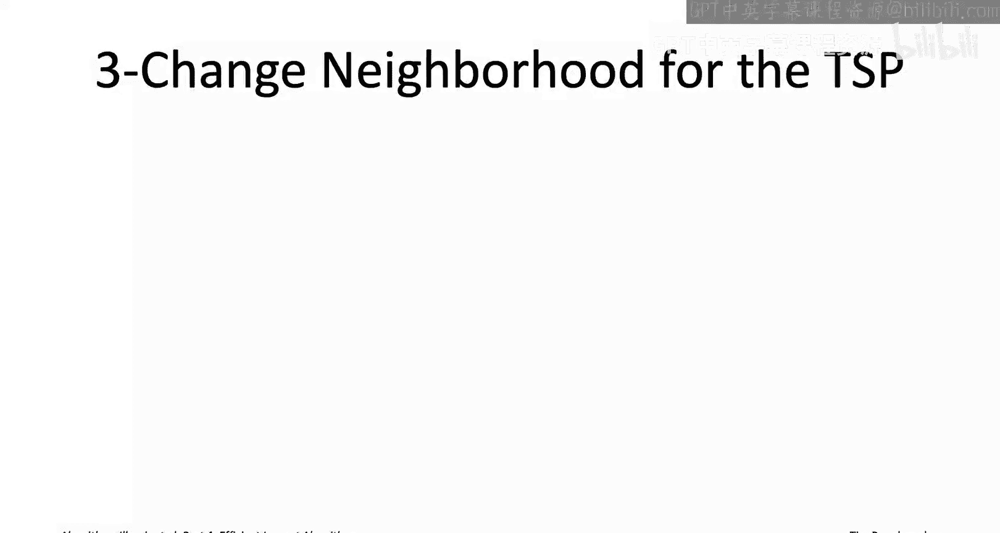
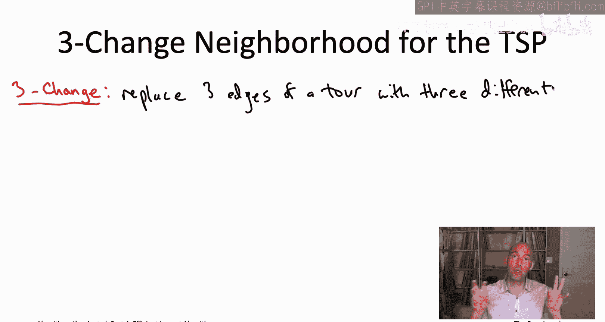
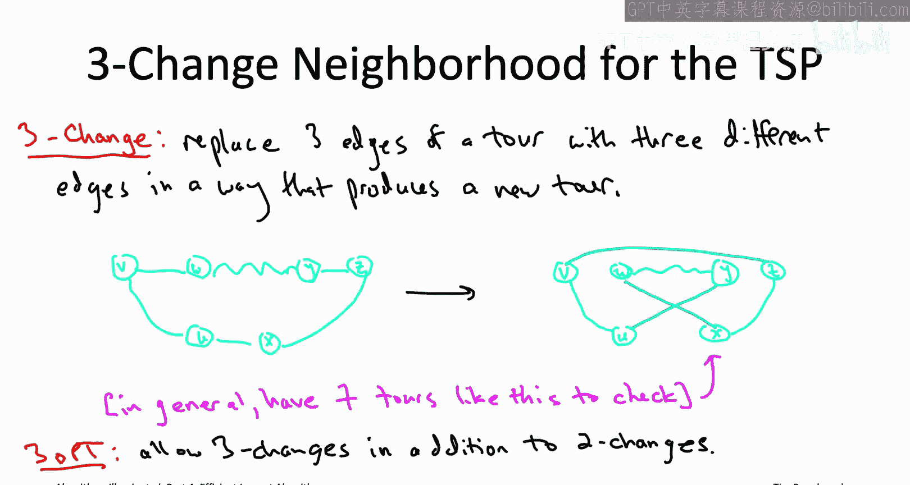
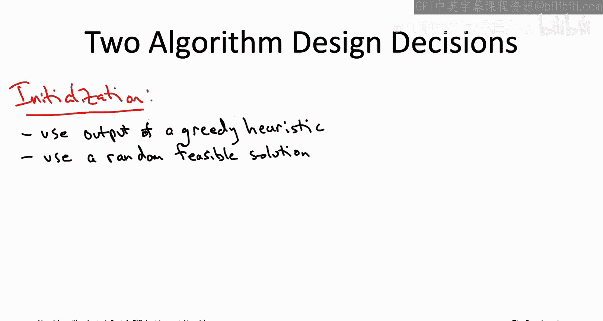
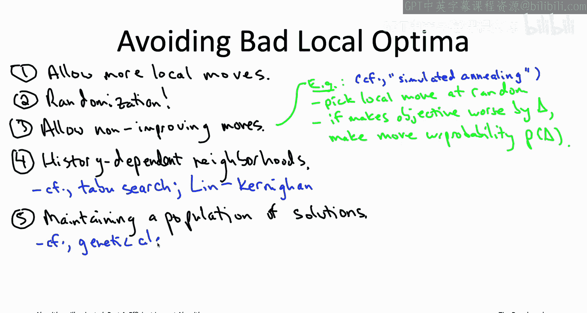

# 斯坦福大学《算法启蒙（第4册）：NP难｜Part 4 Algorithms for NP-Hard Problems》中英字幕：17：局部搜索原理（第二部分）

在本节课中，我们将继续学习局部搜索算法。我们将探讨如何将局部搜索应用于同一问题的不同方式，并深入讨论算法的具体实现细节，包括初始化、改进移动的选择以及如何避免陷入低质量的局部最优解。最后，我们将总结局部搜索算法的适用场景。

---

## 3️⃣ 邻域大小的选择

上一节我们介绍了局部搜索的基本框架和邻域的概念。本节中我们来看看，即使对于同一个问题（如TSP），也可以定义不同的邻域结构。

将局部搜索应用于同一问题有不同的方式。换句话说，即使你已经确定了问题（步骤1）和全局最优解的定义（步骤2），对于步骤3（定义邻域移动）也有多种合理的选择。为了说明这一点，让我们再次回到旅行商问题。

我们之前研究了允许的局部移动是“2-交换”，即移除两条边，然后重新加入两条边。但为什么一次只能交换两条边呢？为什么不尝试一次交换三条边，甚至更多条边呢？

让我们从“3-交换”启发式算法开始，即在每次局部搜索迭代中，从一条回路中移除三条边，然后重新加入三条边。

例如，我们可以看这个示意图中的浅蓝色回路。这里我标出了三条不同的边，它们具有不同的端点：边(v, w)、(y, z)和(u, x)。这三条边将被移除。移除后，我们仍然会得到从u到v的路径、从w到y的路径和从x到z的路径。但现在，我们以不同的方式重新连接这六个顶点，从而得到一条新的回路。图中显示的方式是：我们直接用一条边连接v和z，类似地连接w和x，以及u和y。正如你所见，这给了我们一条回路，并且它肯定与我们开始时的那条回路不同。

有趣的是，与“2-交换”不同，“2-交换”中无论移除哪对边，都唯一地决定了新回路的样子。而“3-交换”则不是这样。即使你已经确定了要移除哪三条边，实际上有七种不同的方式来重新连接这六个顶点，从而得到与开始时不同的回路。因此，当你在局部搜索算法中使用“3-交换”时，对于每一组三条边，你实际上有七种可能的“3-交换”方式。你的改进移动将是任何一种移除三条边并以某种方式重新连接成回路，从而使总成本下降的方式。

“3-交换”启发式算法的正式定义不难猜到。它与“2-交换”类似，只是除了允许“2-交换”外，还允许“3-交换”。

现在我们有了针对同一问题（TSP）的两种真正的局部搜索算法：`2-opt`启发式算法和`3-opt`启发式算法。它们都是局部搜索算法，但并不相同，因为在`3-opt`中，你可以使用更丰富的“3-交换”族来进行改进。让我们通过下一个测验来更好地理解这两种不同的局部搜索算法将如何进行比较。

---

### 测验：比较邻域图

固定旅行商问题的任意一个实例（即固定顶点和所有边的成本）。我们有这两种局部搜索算法`2-opt`和`3-opt`，每种算法都有自己的元图。

关于这些元图，下列哪些陈述是正确的？（注意：可能不止一个答案正确。）

1.  **A.** `3-opt`的元图包含`2-opt`元图的所有边。
2.  **B.** `2-opt`的元图包含`3-opt`元图的所有边。
3.  **C.** `2-opt`的每个局部最优解也是`3-opt`的局部最优解。
4.  **D.** `3-opt`的每个局部最优解也是`2-opt`的局部最优解。

正确答案是第一个（A）和最后一个（D）。

要理解原因，请记住`3-opt`启发式算法比`2-opt`启发式算法拥有更多的局部移动选项。`2-opt`只能使用“2-交换”，而`3-opt`可以使用“2-交换”，也可以根据需要选择使用“3-交换”。因为元图的边对应于允许的局部移动，而`3-opt`拥有更多的移动选项，所以它也拥有更多的边。这就是答案A正确的原因：如果你是`2-opt`元图H2中的一条边，那么你也是`3-opt`的一个允许的局部移动。

然后，如果你仔细想想，这意味着答案D也是正确的。因为如果你有一个顶点在元图H2中有一个具有更好目标函数值的邻居（即该顶点在H2中不是局部最优解），那么完全相同的这个局部移动、完全相同的这个邻居也表明该顶点在元图H3中也不是局部最优解。反过来，这意味着H3的每一个局部最优解肯定也是H2的局部最优解。

换句话说，如果你查看所有可能作为`3-opt`算法输出的回路（即所有它可能停滞的地方），这些回路也同样是`2-opt`算法可能停滞的地方。可能还有其他回路是`2-opt`的局部最优解（即没有改进的“2-交换”），但它们对于`3-opt`来说却不是局部最优解，因为存在改进的“3-交换”。

---

### 权衡：邻域大小的影响

当有人给你提供针对同一问题的多种算法时，你通常会想追问应该使用哪种算法以及在什么情况下使用。这正是我们在这里所做的。我向你展示了可以将局部搜索以多种方式应用于TSP。因此，如果你打算用局部搜索来攻击TSP（这是一个相当好的主意），你可能会问：允许“3-交换”有意义吗？还是我不应该费心？这其中有什么权衡？

老实说，对于局部搜索，这类问题通常最好通过经验来回答，即在你认为具有代表性的应用数据上尝试多种选项。但这个测验，特别是答案D，确实指出了更大邻域规模的一个普遍优势：**随着你允许越来越多的局部移动，局部最优解的数量会越来越少**。因此，局部搜索更不容易停滞在比全局最优解差很多的局部最优解上。

更大邻域规模的主要缺点是，它会减慢主循环中检查是否存在改进局部移动的速度。例如，在旅行商问题中，检查是否存在改进的“2-交换”需要**O(n²)**的时间（n为顶点数），而检查是否存在改进的“3-交换”则需要**O(n³)**的时间，因为存在立方数量级的潜在“3-交换”可能。

平衡大邻域规模利弊的一种启发式方法是：**在满足每次迭代目标运行时间的前提下，使用尽可能大的邻域规模**。例如，你可以设定每次迭代最多运行1秒或10秒，然后在这个预算内，使用你能承受的最大邻域，这样你就能拥有最少的糟糕局部最优解。

---

## 4️⃣ 算法决策：初始化与移动选择

现在我们已经非常透彻地讨论了应用局部搜索的建模决策（步骤1到3），让我们继续讨论步骤4和5中的算法决策，我们需要最终确定通用局部搜索算法的具体工作方式。具体来说，**如何初始化**？其次，**当存在多个改进移动时，如何从中选择**？

### 初始化策略

让我们从第一个问题开始：如何初始化？在我们的TSP例子中，我们已经暗示了一个自然的做法：**使用贪心启发式算法的输出进行初始化**，例如最近邻启发式算法。

这个想法不仅适用于TSP。例如，如果你想使用局部搜索来解决最小化完工时间问题，你可以用LPT（最长处理时间优先）算法输出的调度方案进行初始化。这样，你至少从一个完工时间最多比最小可能值高出33%的调度方案开始，经过局部搜索后只会变得更好。

同样，如果你想使用局部搜索解决最大覆盖问题，你可以用我们研究过的贪心算法的输出进行初始化。

贪心初始化通常值得尝试。实际上，第二个经常非常好的初始化想法是：**随机选择一个可行解**。

至少对于我们用作运行示例的问题来说，随机解的含义非常直接。例如，在TSP中，与其做任何贪心或聪明的操作，你实际上只需随机选择一个顶点的排列顺序，然后查看按该顺序访问顶点并返回起点的回路。在最小化完工时间问题中更简单：对于n个作业中的每一个，独立地、均匀随机地将其分配给M台机器中的一台。每个作业最初出现在每台机器上的概率相等，并且对所有n个作业独立进行。最大覆盖问题也是如此：可行解是所有K个子集的集合，所以你只需随机选择K个子集的集合。

---

### 为什么选择随机初始化？

如果你对此感到有点困扰，我表示理解。我们花了很大力气分析这些贪心算法，证明它们具有良好的近似正确性保证。为什么你要抛弃它们，转而做一些看似愚蠢和随机的事情呢？

但重要的是要认识到，**仅仅因为你从一个更好的解开始局部搜索，并不意味着局部搜索会终止于一个更好的解**。事实上，一个理想的初始化程序应该能快速找到一个不太差、同时又有很大局部改进空间的起始解。在许多情况下，随机解符合这个要求。

---

### 改进移动的选择规则

另一个算法决策是：正如我们所见，从一个给定的可行解出发，可能存在多个相互竞争的改进局部移动。为了使你的局部搜索算法完全确定，你需要说明你将使用哪一个。有几种方法，我们已经提到过几种。

1.  **第一个可行改进**：这是我们运行示例中所做的。你可以枚举所有可能的局部移动，一旦找到一个改进的移动，就采用它。如果你希望确保主`while`循环的每次迭代尽可能快，这个规则很有意义。因为如果你在枚举过程中早期找到了一个改进的局部移动，你就可以停止，直接进入下一个可行解重新开始。

2.  **最速下降（最佳改进）**：如果你希望优先考虑目标函数在迭代间的改进速度，而不是每次迭代的运行时间，你可以做一件不同的事：耐心地查看所有局部移动（例如在`2-opt`中查看所有大约n²个可能的“2-交换”），然后选择**能最大程度改进目标函数**的那个移动。

第二个规则肯定会比第一个规则带来更慢的每次迭代运行时间，但你可能会希望因为你在迭代间积极地推进目标函数，从而最终执行更少的迭代次数。

3.  **随机选择改进移动**：你可能想做的第三件事（我们之前没有提到），特别是如果你想鼓励你的局部搜索算法探索解空间，那就是在所有改进的局部移动中**随机选择一个**。

---

### 随机选择的意义

我理解，这第三条规则可能让你觉得它结合了前两条规则的缺点：它每次迭代可能像第二条规则一样慢，而目标函数的改进速度可能像第一条规则一样慢，这似乎很糟糕。但当我们开始讨论通过向局部搜索算法注入随机性并运行多次独立试验来避免局部最优解时，这条规则的意义就会更加明显。这第三条规则在这种背景下最有意义。

---

## 5️⃣ 局部搜索的性能与质量

那么性能如何呢？如果你运行一个局部搜索算法，你应该期望它运行得快吗？你应该期望它输出高质量的解吗？

对于许多局部搜索算法，答案和权衡基本上与我们已经在TSP的`2-opt`启发式算法中看到的相同。让我简要回顾一下那些特性。

首先，我们不用担心局部搜索会进入无限循环。这是因为它所考虑的每个可行解都严格优于前一个。如果你只有有限数量的可行解（就像我们讨论的所有应用一样），那么局部搜索最终必然会停止在一个局部最优解上。

和`2-opt`启发式算法一样，大多数局部搜索算法不幸地没有可证明的运行时间保证。会存在一些病态情况，它们需要非常多的迭代次数才能停止在一个局部最优解。有一些例外，有些局部搜索算法可以保证在多项式次数的迭代内停止，但它们确实是证明规律的例外。

好消息是，这实际上并不是将局部搜索应用于现实世界问题的太大障碍。这是因为在现实应用中出现的实例上，局部搜索往往收敛得非常快，在可容忍的时间内停止。就像`2-opt`一样，我们说过它通常需要超线性但亚二次方的迭代次数才能达到局部最优回路，这大致也是许多其他局部搜索算法的特征。

局部搜索在原则上可能需要很多次迭代才能停止在局部最优解，这并不那么重要的另一个原因是，**你总是可以提前停止算法**。你可以设置一个计时器，在一小时或一天后，当计时器响起时，你只需说：“嘿，局部搜索算法，把你找到的最近（也就是最好）的解给我。”

---

### 解的质量

让我们继续讨论你可以从局部搜索算法输出中期望的解的质量。和`2-opt`启发式算法一样，局部搜索算法通常**没有可证明的近似正确性保证**，不像我们在本章前三个贪心算法中看到的那样。同样，有一些例外，有些局部搜索算法确实有可证明的近似正确性保证，但它们再次是证明规律的例外。

好消息是，经验上局部搜索算法的表现似乎出奇地好。局部搜索返回一个相当好的局部最优解（不比全局最优解差太多）是非常常见的。也就是说，对于运行时间，你几乎永远不会在现实生活中看到局部搜索需要指数级迭代次数才能收敛的情况。但你肯定会在生活中看到局部搜索输出非常糟糕的局部最优解的情况。这确实可能发生，我们接下来将讨论如何调整局部搜索以最小化陷入这些糟糕局部最优解的机会。因此，局部搜索经常能给你一个高质量的解，但你不能指望它总是如此，它有时也会给出很差的解。

---

## 6️⃣ 避免低质量局部最优解的策略

低质量的局部最优解确实可能成为在实际应用中应用局部搜索的障碍。因此，了解你可以在基本局部搜索算法之上添加或注入的各种“附加功能”是非常值得的，目的是减少你最终陷入这些糟糕局部最优解的可能性。让我们看看几种可能的方法。

我们已经提到过的一件事是：如果你发现太多糟糕的解是局部最优的，**只需允许更多的局部移动**，其中一些解就会停止成为局部最优解。请记住，仅仅因为你是`2-opt`的局部最优解（没有改进的“2-交换”），你可能不是`3-opt`的局部最优解，因为可能存在改进的“3-交换”。一般来说，**增加局部移动的数量会减少局部最优解的数量**，因此你陷入任何糟糕局部最优解的可能性就更小。

---

### 注入随机性

但实际上，你应该尝试的第一件事，也是你能做的最简单、有时能产生巨大影响的事情，就是**向你的局部搜索算法中注入随机性**。

我们已经提到了两个非常容易注入随机性的地方：
1.  **初始化**：例如，不使用最近邻启发式算法来选择初始回路，而是均匀随机地选择一个初始回路。
2.  **改进移动的选择**：当在多个改进移动中进行选择时，你可以随机选择其中一个。

现在，一旦你有了一个随机化的局部搜索算法版本，这很棒，你可以开始探索局部最优解的空间。只需一遍又一遍地运行你的局部搜索算法，进行独立试验。运行它100次，你会得到100个局部最优解。其中会有一些重复，但一般来说，你会在不同的运行中看到不同的局部最优解。在大多数应用中，你只需要其中一个解是好的——即使99个都是糟糕的局部最优解，但有一个是好的，你就会使用那个。

如果你真的非常渴望向局部搜索算法注入更多随机性，你甚至可以**考虑以一定的概率允许算法采取使目标函数变差的移动**。

---

### 模拟退火思想

例如，这里有一个简单的方法（这大致对应于你可能听说过的“模拟退火”）。想象你处于某个可行解（例如在TSP中的某个旅行商回路）。

首先，你将均匀随机地选择一个局部移动（它可能改进也可能不改进目标函数）。例如，在TSP中，有大约 `n*(n-3)/2` 种不同的“2-交换”你可以做，你均匀随机地选择其中一个。

然后你说：好吧，如果我实际执行这个局部移动，目标函数会发生什么变化？

如果目标函数值保持不变或下降，那么没有理由不执行这个移动，直接执行它。

问题是，如果这是一个实际上会使目标函数变差的局部移动呢？现在，你将抛一枚硬币，并概率性地决定是否执行这个移动。

如果这个移动只使目标函数值变差一点点，那么你执行这个移动的概率将非常接近1（同样是为了随机探索）。但是，如果这个移动会使目标函数值变差很多，那么你实际有勇气执行这个局部移动的概率将非常低。

如果你不执行那个局部移动，你在下一次迭代中将停留在完全相同的可行解上，然后你将重新随机选择要考虑的局部移动。

需要指出的是，当你允许这种非改进移动时，局部搜索算法通常不会停止，它会永远运行下去。因此，这绝对是一种你需要在目标计算时间后中断的算法。

---

### 其他高级策略

你可以添加到局部搜索算法中的附加功能数不胜数。让我提一下至少在某些领域相当流行的两种类型。

1.  **历史依赖的邻域**：这个想法是，不是一劳永逸地固定允许的局部移动，而是允许的局部移动可以取决于局部搜索算法迄今为止的轨迹。你为什么要这样做？例如，你可能想禁止那些似乎部分逆转了前一步移动、撤销了你刚刚所做事情的局部移动。例如，在TSP背景下，你可能想排除使用与上一步具有某些相同端点的“2-交换”。如果你听说过“禁忌搜索”或“Lin-Kernighan”启发式算法，它们都与这个想法有关。历史依赖邻域最强烈的动机之一来自于前面提到的允许非改进移动的局部搜索算法，因为一旦你允许非改进的局部移动，你就必须担心循环问题，担心你的局部搜索没有进展，没有探索解空间的不同部分。因此，历史依赖的邻域可以特别有效地防止局部搜索立即回到它刚才所在的地方。

2.  **种群方法**：虽然我们目前讨论的局部搜索算法在整个执行过程中只维护一个可行解，但也有一种变体是**维护一个可行解的种群**。对于某个参数K（至少为2），算法将始终维护K个可行解。算法的每次迭代现在负责从K个旧解生成K个新解，例如，只保留当前K个解中最好的K个邻居，或者通过组合当前解对来产生新解。如果你听说过“遗传算法”或“束搜索”，它们都是基于这种思想。

---

## 7️⃣ 何时使用局部搜索？

作为已经学习到《算法详解》第4部分第20章的人，你了解了很多算法设计范式，而我现在又给了你另一个。因此，你应该问我的问题是：**什么时候应该首先尝试局部搜索？** 让我给你一个列表，说明为什么你可能想使用局部搜索。如果你的应用程序符合其中几条，我会建议你尝试一下。

1.  **计算能力不足时**：当你没有足够的计算能力来最优地解决问题时，局部搜索是相关的。例如，可能是一个NP难问题，且实例规模相当大。也就是说，当你致力于使用快速启发式算法方法时，你应该考虑局部搜索。

2.  **不追求严格的理论保证时**：可证明的保证并不是局部搜索算法的强项。正如我们所讨论的，在许多情况下，你无法证明它们保证快速停止（因为存在你永远不会看到的病态例子），你也无法一般性地证明解的质量保证（因为即使从经验上，你也会看到局部搜索算法输出非常低质量解的情况）。第二个观点的一个例外是，我们提到过你可以将局部搜索作为使用其他启发式算法后的后处理步骤。因此，如果你开始的启发式算法具有近似正确性保证（就像我们在本章研究的前三个贪心算法），那么你在最后加上局部搜索不仅会使结果更好，而且你继承了为局部搜索生成起始解的启发式算法的近似正确性保证。但总的来说，如果你在寻找可证明的运行时间保证和可证明的正确性属性，这通常不会是你首先寻找的设计范式。

3.  **需要快速实现原型时**：局部搜索算法的一个优点是，至少在它们最基本的版本中，它们相当简单，很容易编码实现。因此，如果你需要一个问题的快速而粗糙的启发式算法，局部搜索通常是一个好的起点。请注意，为了榨取局部搜索的所有可能性能，你通常需要进行大量实验，这实际上可能需要相当多的时间。但仅仅是为了让基本版本启动和运行，这是一个相对容易的实现项目。

4.  **作为其他算法的改进步骤**：正如我们提到的，局部搜索一个几乎无需动脑的用途是改进你可能从其他启发式算法获得的解。只要你有额外的计算时间可以投入来使问题变得更好，为什么不使用局部搜索看看效果如何呢？

5.  **需要“随时”算法时**：局部搜索算法的另一个不寻常的好处是，你可以在任何时候停止它们，它们是“随时”算法。很多算法不是这样的。例如，稍后当我们谈到混合整数规划求解器时，如果你在五分钟后终止，它不会给你任何有用的东西，而局部搜索算法会。

6.  **其他高级求解器不适用时**：说到混合整数规划和可满足性问题的先进求解器（我们将在几节课后更详细地讨论），它们可能是实践中处理NP难问题时局部搜索最激烈的竞争对手。如果你处于这些求解器对你有效的情况下，那么很好，使用它们。如果你能以它们能处理的格式指定你的问题，并且你的实例足够小或结构足够好，它们可以解决它们到最优性，那就更好了。因此，当这些求解器对你不起作用时，局部搜索就变得真正相关。原因之一可能是你的输入太大，求解器无法处理，而局部搜索是一种更简单的算法，有潜力扩展到更大的输入规模。第二个原因可能是你的优化问题有点奇怪，例如你不能以非常简单的方式写出目标函数（这是混合整数规划求解器所期望的）。注意，局部搜索需要关于你目标函数的信息非常少，你只需要能够对给定的可行解高效地评估目标函数。如果你能做到这一点，你就可以运行局部搜索，而先进的求解器对目标函数格式的要求要严格得多。

---

### 实验是关键

这些是应用程序的一些特征，如果你看到它们，你的脑海中应该亮起一盏灯，你会说：嗯，这看起来像是局部搜索是一个好技术的经典场景。

关于这个话题我要说的最后一件事是：**为了从局部搜索算法设计范式中获得最大收益，实验至关重要**。正如我们所看到的，局部搜索不仅仅是一种算法，它实际上是整个算法集合，你可以加入无数的附加功能。哪些附加功能是正确的，将取决于你应用程序的细节。因此，我强烈建议你获取一些具有代表性的应用实例，编写一堆不同版本的局部搜索，看看哪一个效果最好，然后使用它。

---

## 总结

本节课中我们一起学习了局部搜索算法的更多高级主题。我们探讨了如何通过定义更大的邻域（如“3-交换”）来减少局部最优解的数量，并分析了其利弊权衡。我们详细讨论了算法的具体决策：包括使用贪心或随机策略进行初始化，以及在多个改进移动中选择“第一个可行改进”、“最速下降”或“随机选择”等规则。我们认识到局部搜索通常缺乏严格的理论保证，但在实践中往往表现良好。为了应对可能陷入低质量局部最优解的问题，我们介绍了注入随机性（如随机初始化和随机选择移动）、允许非改进移动（模拟退火思想）、使用历史依赖邻域（如禁忌搜索）以及维护解种群（如遗传算法）等高级策略。最后，我们总结了局部搜索的适用场景：当问题规模大、需要快速启发式方案、作为其他算法的后处理步骤，或者当问题形式特殊、其他高级求解器不适用时，局部搜索是一个强有力的工具。要充分发挥其潜力，必须结合具体问题进行充分的实验和调优。

