# 算法启蒙（第4册）：NP难｜Part 4 Algorithms for NP-Hard Problems：19：贝尔曼-赫尔德-卡普算法求解TSP（第二部分）🚀

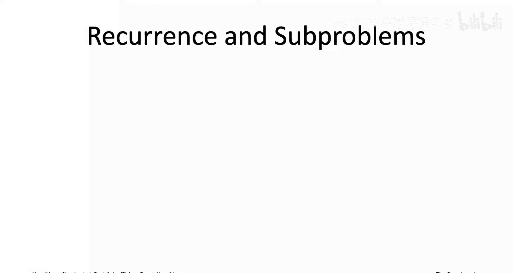

在本节课中，我们将学习如何利用动态规划思想，为旅行商问题设计一个比暴力穷举更高效的精确算法。我们将深入理解贝尔曼-赫尔德-卡普算法的核心思想、子问题定义、递推关系以及算法实现细节。

## 概述

上一节我们通过一个思维实验，分析了最优TSP路径的结构。本节我们将基于这个结构，正式定义子问题，建立递推关系，并最终构建出完整的动态规划算法。

## 最优路径的结构与子问题定义

从上一节的测验中，我们得知了最优解的结构。如果你告诉我有一条从顶点1到顶点j、恰好访问每个顶点一次的最小成本路径，那么我知道这条路径只有n-2种可能的样子。一旦你告诉我倒数第二个顶点k，即路径的最后一段是(k, j)，我就知道路径的前缀部分必须是：从1出发，到k结束，并且恰好访问顶点集V - {j}中所有顶点一次的最小成本路径。这正是子问题`P'`所最优求解的。

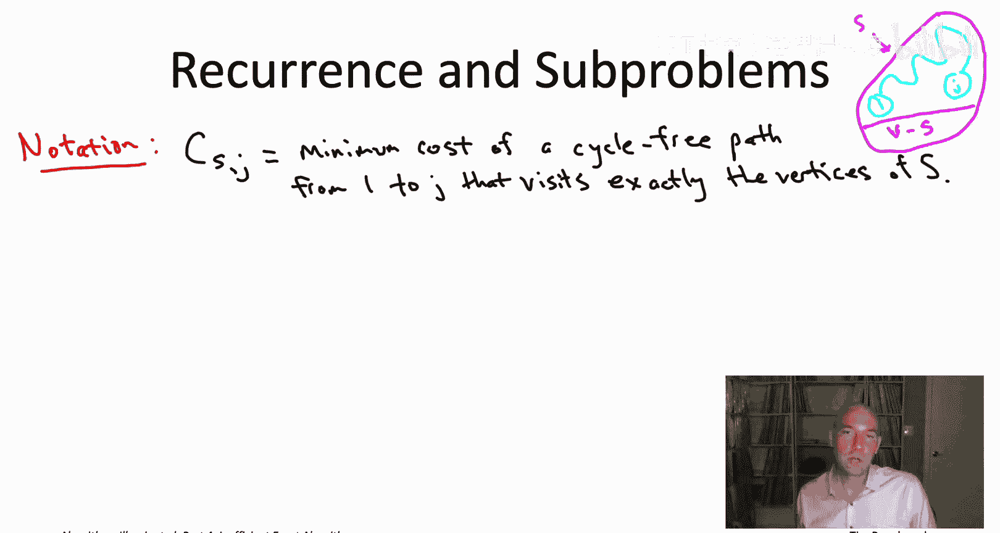

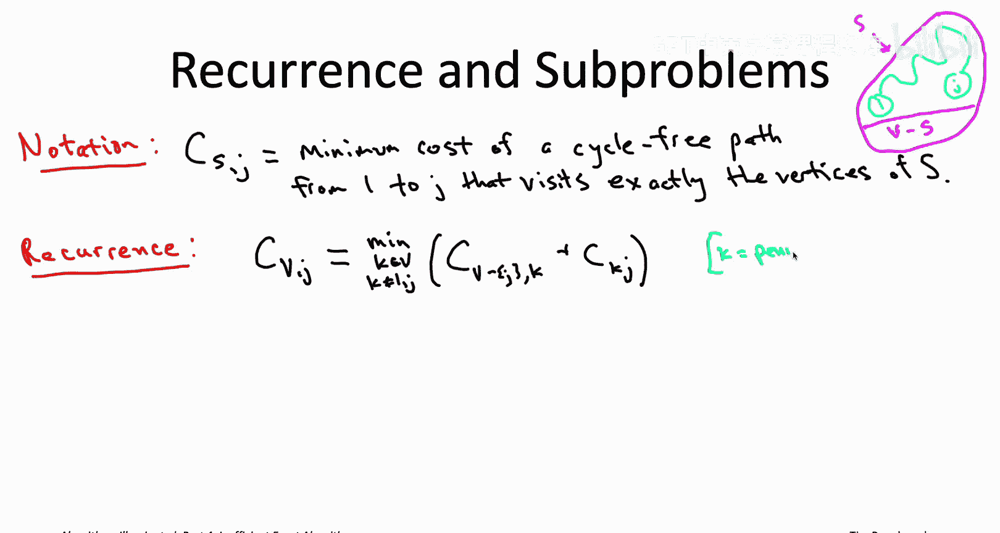

既然我们理解了从1到j的路径只有这n-2种可能性，我们就可以写出一个递推式，用这n-2个更小的最优解的成本来表达原最优解的成本。

为了简洁地描述递推式，我们引入一些符号。用`C(S, j)`表示满足以下四个属性的路径的最小成本：
1.  路径从顶点1开始。
2.  路径在顶点j结束。
3.  路径是无环的，即不重复访问任何顶点。
4.  路径恰好访问集合S中的每个顶点一次。

例如，幻灯片右上角的图示中，外部的洋红色圆圈代表所有顶点，顶部集合是S，底部是其他顶点V - S。浅蓝色路径表示它恰好访问S中的每个顶点一次。我们的符号`C(S, j)`就是计算任何类似路径的最小成本。

从测验中我们学到，一旦知道了k，我们就知道路径的其余部分：路径前缀必须是从1到k、无环且恰好访问顶点集S - {j}中所有顶点的最小成本路径。当然，原始路径最终到达j，还需要支付从k到j的那条边的成本。

因此，递推关系可以写作：
`C(V, j) = min_{k ∈ V, k ≠ 1, j} [ C(V - {j}, k) + cost(k, j) ]`

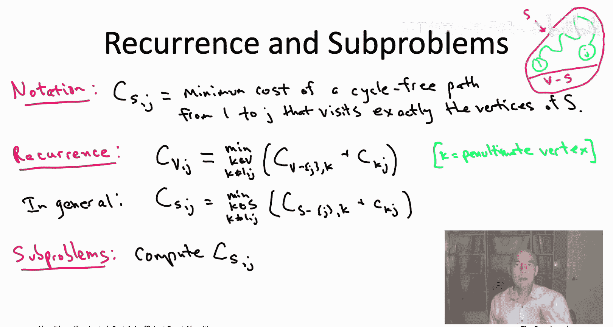

如果你更喜欢递归地思考动态规划，这基本上是说：为了解决原始问题，你需要进行n-2次递归调用，计算这些不同子问题的最优解，然后从这n-2个递归调用返回的解中选出最好的一个。当然，递归会继续下去，你需要解决右侧这些更小的子问题。如何解决呢？只需对更小的顶点集再次应用完全相同的递推式。

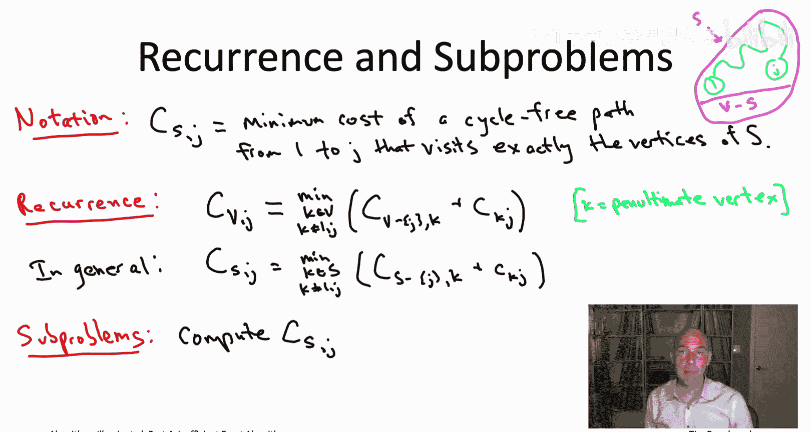

更一般地，如果我们在这个方程中用任意顶点子集S替换V，我们会得到完全相同的递推关系：
`C(S, j) = min_{k ∈ S, k ≠ 1, j} [ C(S - {j}, k) + cost(k, j) ]`

用文字描述：如果你给我看一条最优路径，它恰好访问顶点集S，从1出发，到达j，并且是无环的。如果你告诉我这条路径的倒数第二个顶点，我就知道S必须是什么样子：它将是一个子路径，现在它访问S中除最后一个端点j外的所有顶点，并且以无环的方式恰好访问其他顶点S - {j}一次，同时从1走到k。这就是适用于任何顶点子集S的递推式的一般版本。

这现在确切地告诉了我们子问题应该是什么。基本上，我们需要为每一个可能出现在这些递推式中的项准备一个子问题。因此，对于顶点子集S的每一种选择，以及对于最后一个顶点j的每一种选择，我们都需要一个单独的子问题来计算`C(S, j)`。

## 子问题的范围与数量

那么，我们需要考虑哪些项呢？哪些S和j的选择实际上有意义？记住，S是路径应该访问的顶点集合，而路径应该从顶点1开始，所以集合S最好包含顶点1。同样记住，j是路径的终点，所以S最好也包含端点j。因此，对于每个j的选择，以及每个同时包含顶点1和该端点j的S的选择，你都会有一个这样的项。

坏消息是，这有很多子问题，是指数级的。因为有n个顶点，所以有2^n个不同的顶点子集。这里的S不能是任意顶点子集，有一些温和的约束，但你仍然需要担心指数级数量的不同S，再加上还有另一个线性于n的j的选择数量。

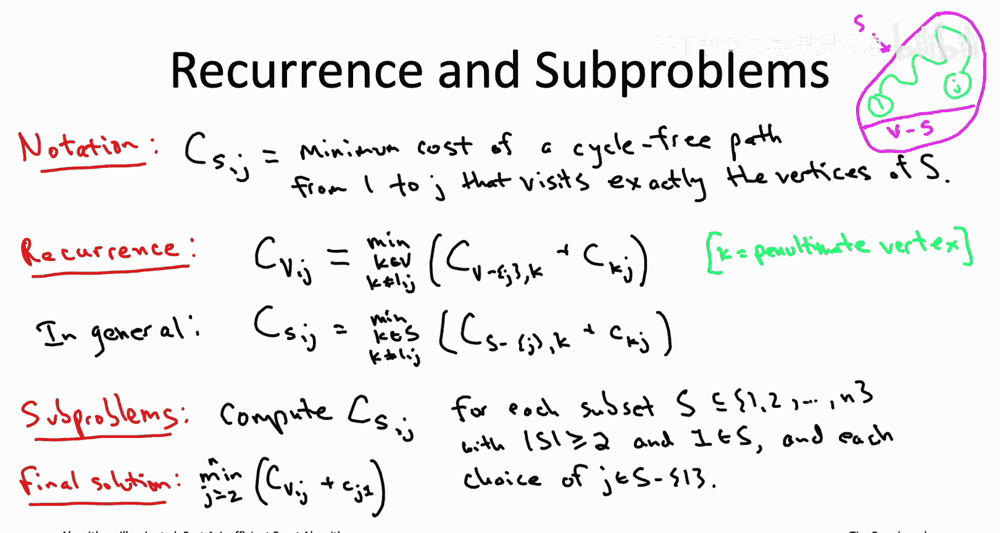

这很糟糕，因为存在指数级的子问题。但请记住，我们预料到了这一点。如果TSP是NP难的，那么如果我们打算应用动态规划，就需要预期在某个地方出现指数级的东西，要么是子问题的数量，要么是解决每个子问题所需的时间，要么是后处理步骤。回顾我们见过的许多例子，额外的复杂性似乎总是出现在子问题的数量上。所以我们实际上预料到会看到指数级的数量，这告诉我们可能走对了路。

我还想指出，虽然是指数级，但它比n!要好得多。它更像是2^n，而不是n!。节省的来源在于，这些子问题不关心访问顶点集S的顺序。它追踪路径访问了哪些顶点子集，但不追踪访问它们的顺序。这就是为什么阶乘消失了，被简单的指数函数2^N所取代。

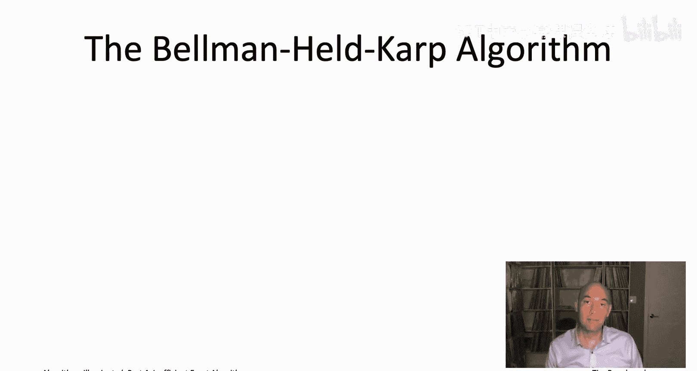

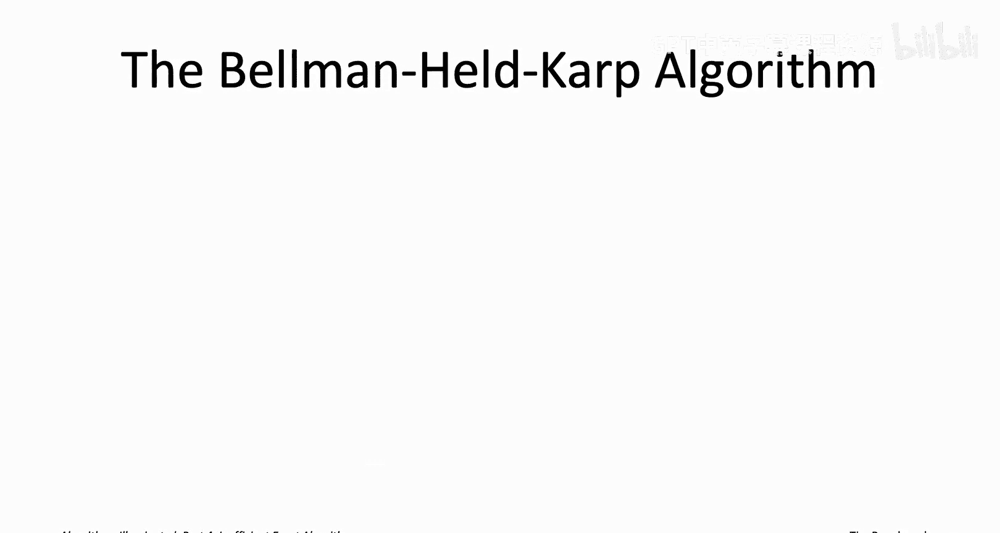

## 算法框架与伪代码

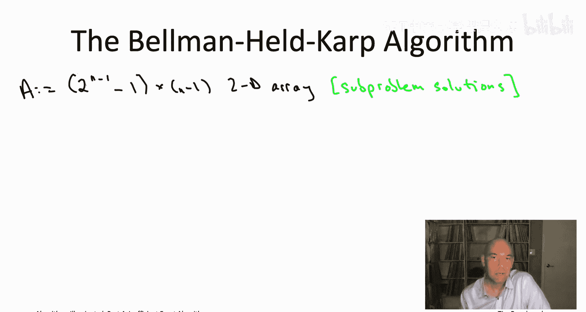

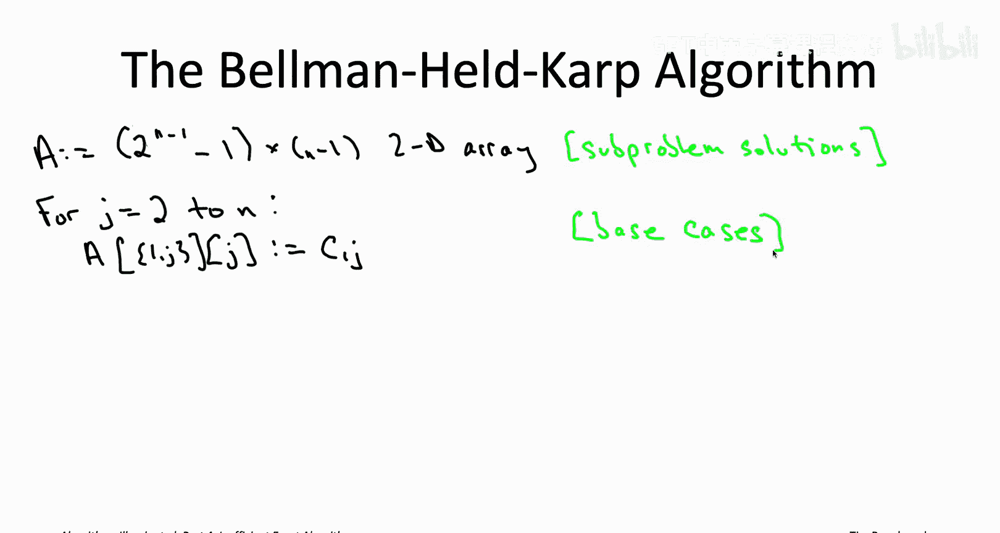

我们几乎把所有事情都理顺了。我们通过思考最优解必须是什么样子的思维实验得出了子问题，这引导我们得到了递推式。现在我们只需要系统地从小到大解决所有这些子问题。根据路径访问的顶点数量（即集合S的大小），有一个非常自然的从小到大的顺序。记住，动态规划还有一个最终要素：你需要能够从子问题解中提取最终解。最常见的情况是，原始问题本身就是其中一个子问题。但这里不是，我们想要一个环游，而这里所有的子问题都在计算路径。不过，我们可以对环游访问的最后一个顶点的n-1种选择进行穷举搜索，然后直接代入我们最大的子问题解的值。

所有要素就位后，动态规划算法就水到渠成了。我们首先解决基本情况或最小的子问题，这对应于只有两个顶点（顶点1和某个其他顶点）的顶点子集S。然后我们将继续使用递推式解决下一个更大的子问题，即访问三个顶点的路径，然后是大小为4的子集，接着是5，等等。一旦我们处理完所有的子问题，我们将使用最后的方程来计算最终解。这个算法有时被称为贝尔曼-赫尔德-卡普算法，由贝尔曼以及赫尔德和卡普在1962年独立提出。

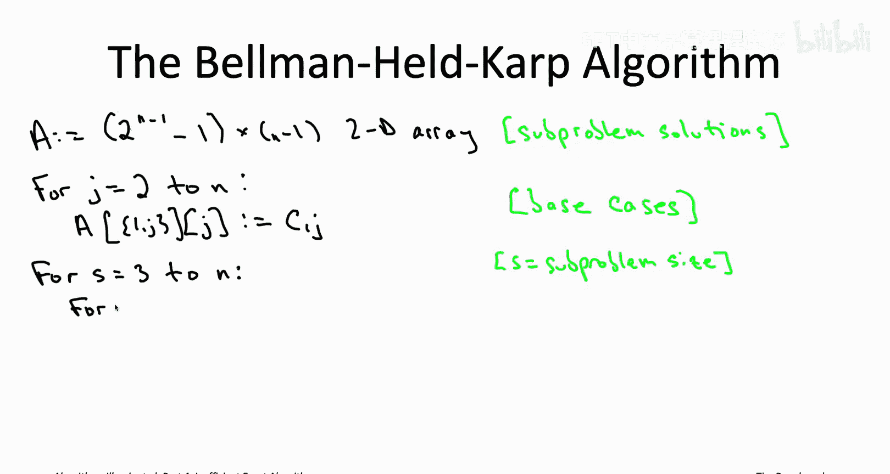

以下是算法的伪代码实现：

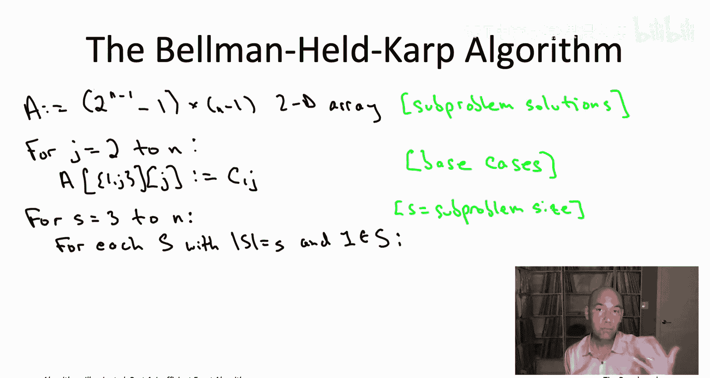

我们首先初始化一个数组，用于记录所有子问题的解。子问题由两个不同的参数参数化：S和j。所以它将是一个二维数组。S的选择大约有指数级数量（精确地说是2^(n-1) - 1），而j最多有n-1种选择（除顶点1外的所有顶点）。

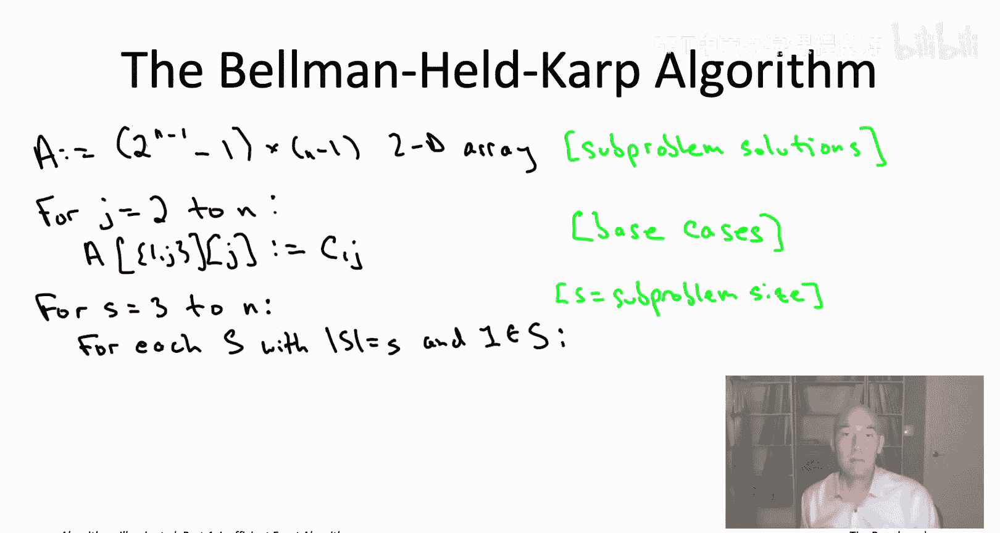

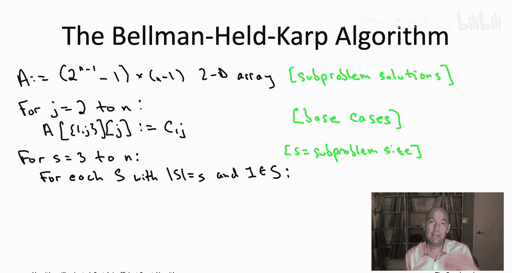

基本情况对应于大小为2的顶点子集。它必须包含顶点1，然后会有某个其他顶点j，而j也是端点的唯一选项。那么从1到j且只访问1和j的最短路径必须是直接的单跳路径。其成本就是对应边的成本。

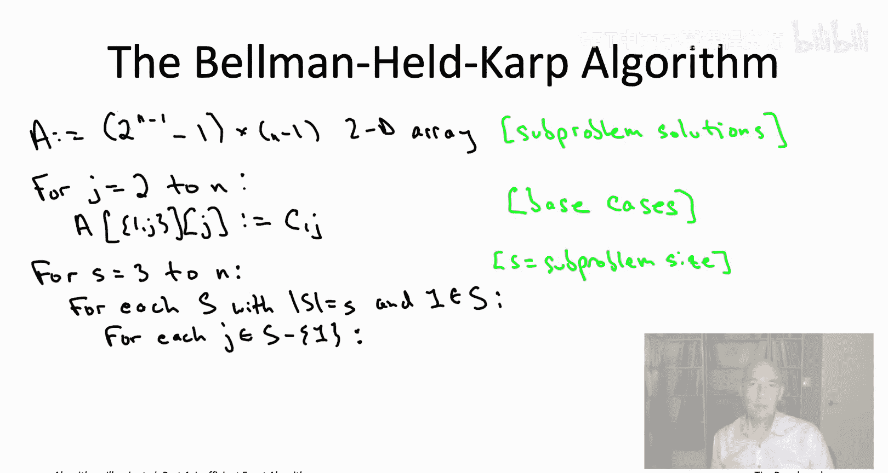

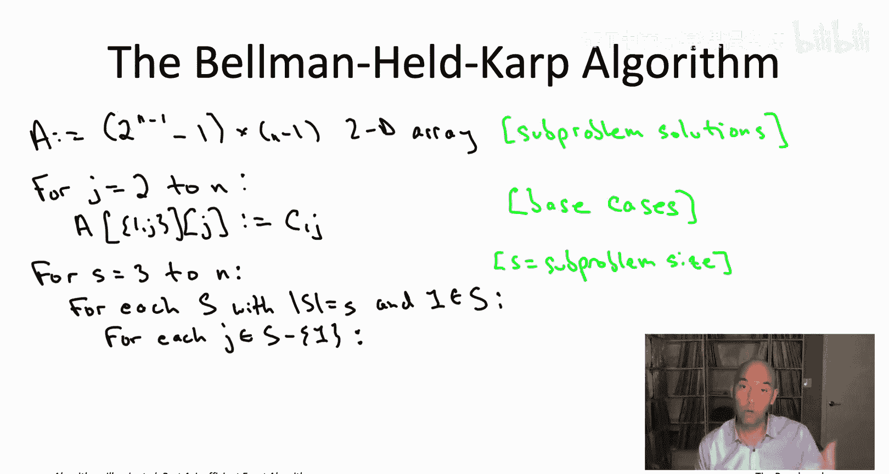

现在我们系统地解决所有子问题，从较小的子问题到较大的子问题。这里问题规模的自然概念是路径应该访问的顶点数量，即集合S的基数。所以我们从大小为3的子集开始，然后处理大小为4的，等等，直到S等于所有n个顶点。

现在我们有两个嵌套的for循环，循环遍历参数S和j的选择。由于j应该从集合S中选取，首先开始循环遍历当前大小的所有子集（大小为s）是合理的。

然后，对于给定的子集S，我们知道所有j的选择：它是S中除顶点1外的每个顶点。

现在，在这个内部循环的迭代中，实际上对应一个特定的子问题：计算`C(S, j)`。我们知道如何计算：只需使用递推式。它实际上就是对最优路径访问S中顶点时倒数第二个顶点k的所有选择进行穷举搜索。

一旦这三个for循环完成，我们就解决了所有的子问题。然后我们知道，最终解可以直接从最大的子问题（S等于V）中计算出来。

当你为动态规划算法编写伪代码时，总是要做的一个完整性检查是：当你计算子问题解数组中的一个条目时，你要确保在左手边，你在右手边需要的数组中的所有条目都已经计算好，因此可以用于常数时间查找。我们在这里看到情况确实如此。

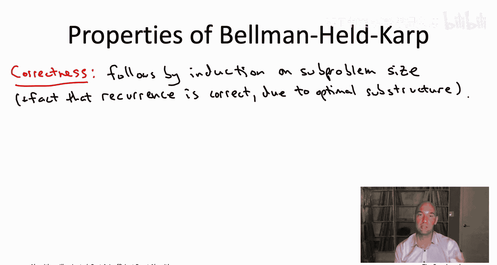

在递推式的右手边，我们总是在查找比S少一个顶点的集合的值，即更小的子集。所有这些都将在最外层for循环的前一次迭代中计算好。

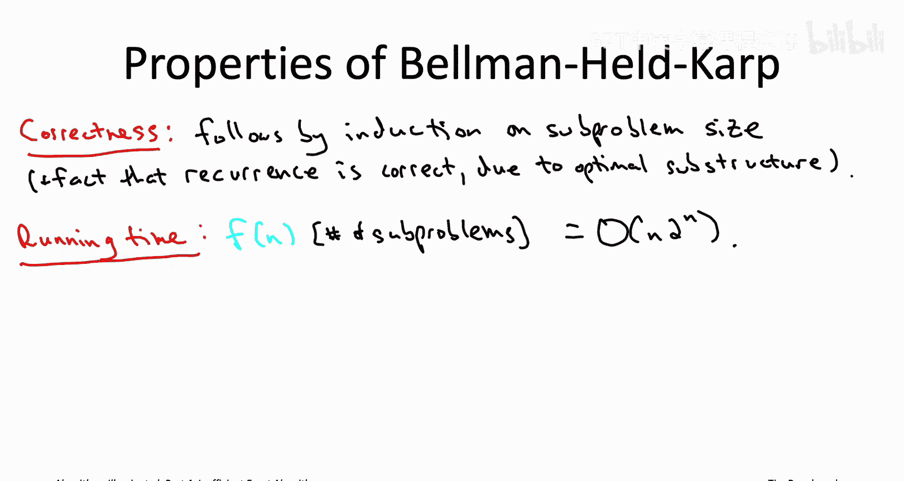

## 算法分析与总结

以上就是用于旅行商问题的贝尔曼-赫尔德-卡普动态规划算法。和往常一样，当我们介绍一个算法时，我们应该考虑它在正确性和运行时间方面的属性。正确性不是那么有趣，它只是动态规划算法的标准论证，你已经见过很多次了：通过对子问题规模进行归纳来论证，在归纳步骤中每个子问题都得到正确解决。为什么这是正确的？正确性来自于递推式的正确性，并且我们正确地填写了子问题的答案。为什么递推式是正确的？这可以追溯到我们一开始的最优子结构：我们观察到给定子问题的最优解只能有少数几种可能性，而递推式明确地对那少数几种可能性进行了穷举搜索，因此它必然计算出最优解。

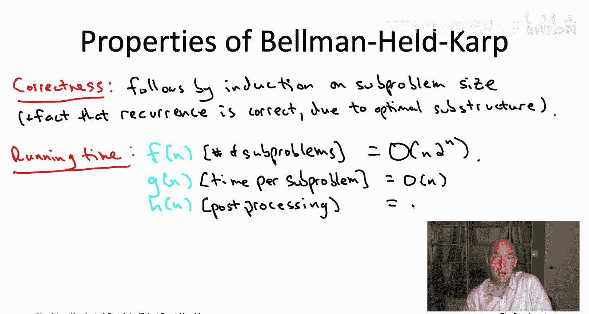

对于运行时间，我们可以回到对动态规划算法的通用分析，我们只需计算子问题的数量，乘以每个子问题的时间，再加上后处理的工作量。

首先，有多少个子问题？这就是我们之前所说的f(n)。嗯，对于集合S有大约2^n种选择（比这个少一点，但大致是2^n），而对于第二个参数j，最多有n-1种选择。这意味着我们最多需要处理大约2^n * n个不同的子问题。

其次，解决每个子问题需要多少时间？这只是对倒数第二个顶点k的所有可能选择进行穷举搜索。在任何时候，k最多有n种可能的选择。所以填写每个数组条目将需要线性量的工作。

最后是后处理步骤，我们之前称之为h(n)。这里不是常数时间查找，而是伪代码的最后一行，我们对n-1种可能性进行穷举搜索。每种情况都可以在常数时间内评估，所以后处理（即最后一行）也将是O(n)。

在这个后处理的分析中，我假设你满足于只计算最优旅行商环游的总成本，而不是环游本身。但和动态规划中一样，正如你希望已经多次看到的，通过回溯填好的子问题数组，总是可以重建最优解本身。如果你以正确的方式实现这个算法，在正向传递中缓存适当的东西，你实际上可以在线性时间O(n)内重建最优环游本身。我鼓励你在私下里思考一下。

记住，动态规划算法运行时间界限的公式就是f * g + h，在这种情况下计算为n^2 * 2^n。

在这个运行时间分析中有一个细节需要注意：我假设你可以生成具有给定大小s的S子集的数量，其时间与这类子集的数量成正比。如果你仔细想想，这类子集的数量正好是C(n-1, s-1)，因为你知道顶点1必须在里面。这可以实现，我鼓励你思考在具体实现中如何做到。你可以使用递归枚举，或者如果你真的想深入研究，可以查找一种叫做Gosper's hack的方法。

我们应该如何看待这个运行时间呢？嗯，心情复杂。一方面，它比穷举搜索好得多。能够显著超越穷举搜索（原本是n!）是非常令人满意的。根据斯特林近似，n!大约是(n/e)^n。这比2^n指数级地大，而这里我们只得到2^n乘以一个多项式（n^2）。所以一方面，看到你已经花费大量时间掌握的动态规划范式的又一个杀手级应用，能够击败一个超级基础问题的穷举搜索，这是非常令人满意的。

坏消息是，这个运行时间仍然不是那么好。穷举搜索算法也许最多能处理规模为15左右的问题（如果你幸运的话）。如果我们有一个运行时间为2^n的算法，你可以处理到大约40。这是n^2 * 2^n，你将能够处理更多像n=30这样的输入。所以与穷举搜索相比，我们能够处理的问题规模大约翻了一倍，这很好。但是，如果你有一个比这更大的旅行商问题，比如有数百或数千个顶点，你将无法使用这个动态规划算法。在那里，你将不得不求助于上一章讨论的启发式算法，或者你可以尝试使用最先进的混合整数规划求解器（我们将在本章后面讨论）。所以接下来我们将继续讨论动态规划在另一个问题上的应用：在网络中寻找长路径。它将再次允许我们大致将能够处理的问题规模翻倍，但实际上在生物学应用中，能够处理的问题规模翻倍对于获得有意义的结果至关重要。我们将在下一个视频中讨论这个问题。