# 算法启蒙（第4册）：NP难｜Part 4 Algorithms for NP-Hard Problems：20：颜色编码（第一部分）

在本节课中，我们将学习一种名为“颜色编码”的技术，用于在图中寻找一条长路径。这是一种结合了动态规划和随机化的巧妙方法，尤其适用于在生物网络中检测有意义的结构。

## 概述：从生物网络到图论问题

图在算法研究中无处不在，因为它很好地平衡了表达能力和可处理性。我们可以高效地对图进行搜索、计算连通分量、寻找最短路径等操作。图的应用领域也非常广泛，从道路网络到万维网，再到社交网络。

在本节中，我们将看到另一个应用实例：将动态规划与随机化相结合，用于检测生物网络中的有意义结构。让我们开始吧。

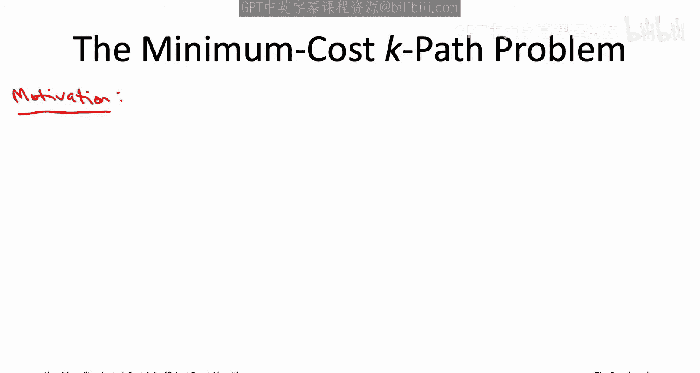

## 问题背景：蛋白质相互作用网络

在深入问题定义之前，我们先了解一下其背后的生物学动机。

细胞中的大部分工作由蛋白质（即氨基酸链）完成，而这些蛋白质通常协同作用。例如，一系列蛋白质可能将细胞膜产生的信号传递给调控DNA转录为RNA的蛋白质。理解这些信号通路以及它们如何因基因突变而改变，是开发新药对抗疾病的重要步骤。

蛋白质之间的相互作用很自然地可以建模为一个图，称为蛋白质-蛋白质相互作用网络（PPI网络）。这个图的顶点对应蛋白质，任何一对被认为会相互作用的蛋白质之间都有一条边。

最简单（也可能是你首先想寻找的）通路类型是线性通路，它对应于PPI网络中的一条路径。

## 问题定义：最小成本K路径问题

在PPI网络中寻找线性通路的问题，可以转化为**最小成本K路径问题**。这里的K路径指的是图中一条简单的（即无环的）路径，它包含 `K-1` 条边，因此访问 `K` 个不同的顶点。

形式化地，最小成本K路径问题的输入包含以下熟悉的成分：
*   一个无向图 `G`。
*   图中每条边 `e` 都有一个实数值的边成本 `c_e`。
*   一个目标路径长度，即一个正整数 `K`。

输出则是一条K路径。在所有图中可能的K路径中，我们希望找到总成本（即路径中 `K-1` 条边的成本之和）最小的那条。如果输入图 `G` 中根本不存在任何K路径，算法需要正确地报告这一事实。

回到生物学动机，边成本反映了嘈杂生物数据中不可避免的不确定性。更高的边成本意味着对相应蛋白质对确实相互作用的置信度更低。缺失的边实际上具有正无穷的成本。在PPI网络中，最小成本K路径对应于给定长度的最可信的线性通路。

在实际例子中，路径长度 `K` 可能在10到20之间，而图的顶点数 `n` 可能达到数千甚至数万。

## 问题的NP难性质

在本书的这个阶段，你不会惊讶地听到这是一个**NP难问题**。实际上，这或多或少是旅行商问题（TSP）的推广。既然TSP是NP难的，那么这个更一般的问题肯定也是NP难的。

## 初步尝试：动态规划

我们如何解决最小成本K路径问题呢？我们可以通过类比来推理。我们刚刚在之前的视频中学习了旅行商问题，这两个问题感觉非常相似。主要区别在于，最小成本K路径问题中你有一个目标路径长度 `K`，而在TSP中你寻找的是一个长度为 `n-1` 再加一条边的回路。

这种强烈的相似性表明，也许我们应该用同样的方法来解决这个问题，即使用动态规划。甚至在动态规划中，我们为什么不直接使用在TSP中效果很好的那种子问题呢？

换句话说，我们将再次使用一个由两个参数索引的子问题族：
*   一个参数是路径的终点 `v`。
*   另一个参数是顶点子集 `S`，即这条路径访问过的顶点集合。

那么，对应于选择 `S` 和 `v` 的子问题的定义就是：计算**任何**以 `v` 结束、且恰好访问了集合 `S` 中所有顶点的路径的最小可能成本。与TSP的一个小区别是，这里的K路径可以从任何地方开始，不必像顶点1那样从一个指定顶点开始。

我们为每个合理的 `S` 选择（由于我们讨论的是K路径，我们只需要关心大小不超过 `K` 的集合 `S`）以及从集合 `S` 中选出的每个顶点 `v` 设置一个这样的子问题。

如果我们成功解决了所有这些子问题，那么我们就完成了。因为所有对应于大小为 `K` 的集合 `S` 的最大子问题中，最好的（成本最低的）那个子问题的解就是答案，即图中K路径的最小成本。

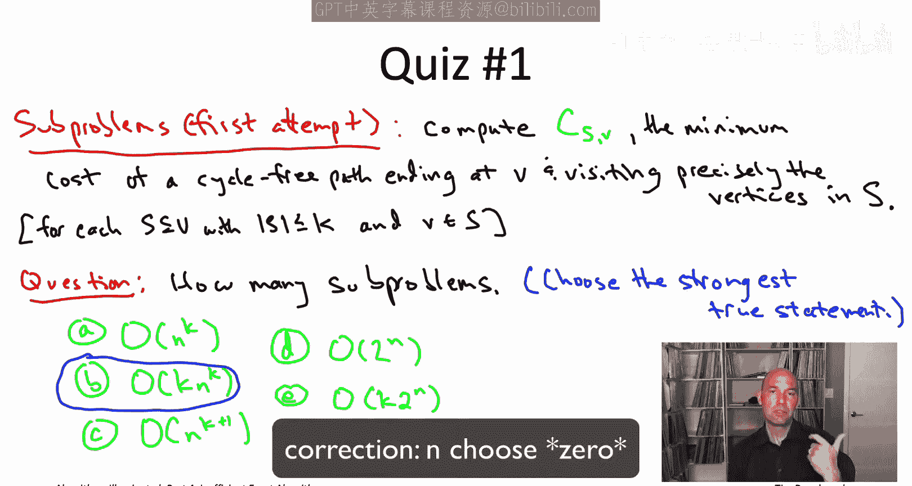

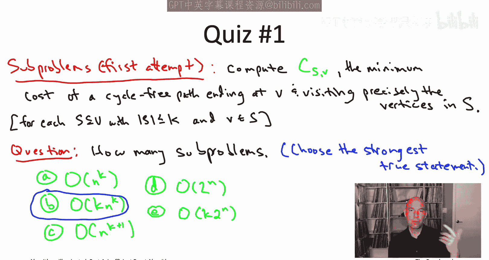

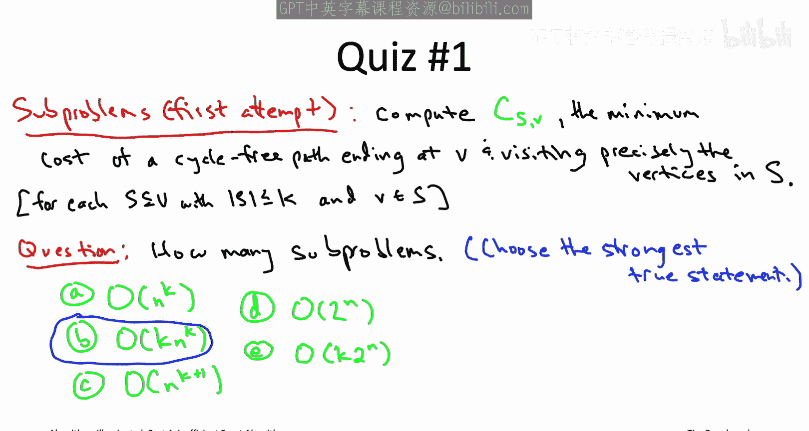

## 子问题数量分析

现在，我们来分析一下这些候选子问题的数量。

以下是关于子问题数量的几个选项：
*   `O(n^K)`
*   `O(K * n^K)`
*   `O(K * 2^n)`
*   `O(2^n)`

正确答案是第二个：`O(K * n^K)`。

这个界限是两个参数的乘积，分别对应索引子问题的两个参数：
*   `K` 来自于所有不同的 `v` 的选择。对于一个给定的 `S`，最多有 `K` 个 `v` 的选择，这就是 `K` 的由来。
*   `n^K` 来自于合理的 `S` 选择的数量，即大小不超过 `K` 的子集数量。这包括空集（`C(n,0)`）、单顶点集合（`C(n,1)`）、顶点对（`C(n,2)`），一直到恰好包含 `K` 个顶点的子集（`C(n,K)`）。

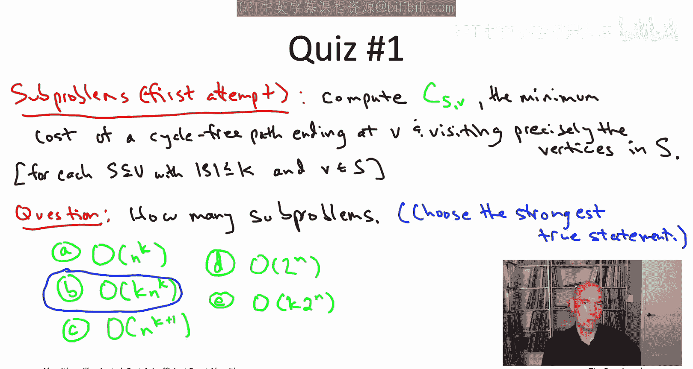

这个由 `K+1` 个二项式系数组成的和是 `O(n^K)`。当 `K` 很小时（这正是我们感兴趣的情况），子集数量确实是 `n^K` 的常数倍。

## 与穷举搜索的比较

我们应该如何看待这个界限？看起来这很像旅行商问题中的情况：当时我们有 `n * 2^n` 个子问题，`n` 对应终点的选择，`2^n` 对应子集的选择；这里我们有类似的形式，`K` 对应终点的不同选择，`n^K` 对应大小不超过 `K` 的子集的不同选择。这看起来很不错。

但我们需要将其与穷举搜索进行比较。

以下是关于穷举搜索运行时间的几个选项：
*   `O(K * n^K)`
*   `O(K * 2^n)`
*   `O(n^K)`
*   `O(2^n)`

这个测验的答案是第一个：`O(K * n^K)`，这是最直接版本的穷举搜索的运行时间。最简单的穷举搜索并不显式地枚举路径，而是枚举 `K` 个顶点的有序元组（例如顶点17，接着顶点4，接着顶点23等）。一旦你有了 `K` 个顶点的列表，你可以在线性时间内检查它是否是图中的一条路径。如果是，你记录下它的成本，然后记住在所有最终对应K路径的元组中看到的最小成本。有 `n^K` 种选择来构成这些 `K` 元组，检查每个元组需要 `O(K)` 的工作量。

这个测验带来了麻烦。它表明我们完全不应该对第一个测验中得到的子问题数量界限感到高兴，因为子问题数量的界限是 `O(K * n^K)`，与穷举搜索的运行时间完全相同。与TSP不同（在TSP中，那些子问题让我们相对于穷举搜索从 `n!` 加速到更接近 `2^n`），在这里我们根本没有得到加速。无论是穷举搜索还是动态规划，运行时间都将是 `n^K` 乘以某个多项式因子。对于我们所讨论的图类型（比如至少有1000个顶点），这完全是一个无用的算法，当 `K=5` 时就已经如此了。这简直是一场灾难，我们没有超越穷举搜索，我们需要新的思路。

## 引入颜色编码技术

为什么我们使用了这么多子问题？这是因为通过参数 `S`，我们跟踪了路径迄今为止访问过的确切顶点集合。由于最多有 `K` 个顶点，这意味着大约有 `n^K` 种可能的访问历史。我们从TSP的解决方案中继承了这个想法，即跟踪路径迄今为止访问过的确切子集。

我们在TSP中为什么要这样做？因为当我们有一个较小子问题的解（一条路径），并想通过在其末尾添加一条边来将其扩展为一个较大子问题的最优解时，我们需要确保这条边不会访问路径之前访问过的顶点，否则就会形成一个环。因此，跟踪路径迄今为止访问过的确切顶点是为了确保我们永远不会重复访问一个顶点。

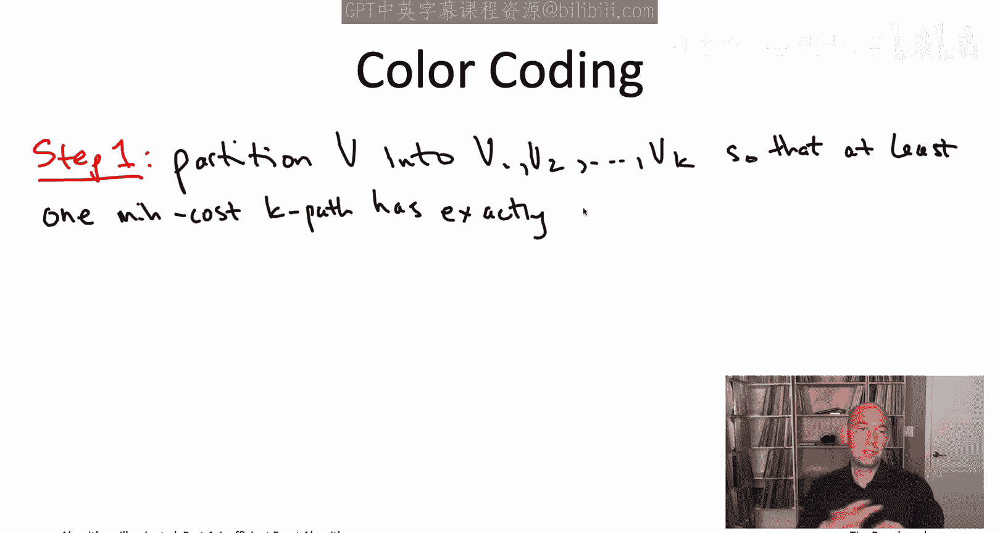

这对于最小成本K路径问题听起来也很重要，因为我们仍然要求路径是无环的。但你可能会想，我们能否跟踪比路径迄今为止访问过的整个顶点子集更少的信息呢？

答案是肯定的，我们可以使用一种称为**颜色编码**的巧妙想法。

颜色编码分为两个步骤。第一步是**顶点划分**步骤。我们有一个顶点集 `V` 和目标路径长度 `K`。在第一步中，我们将顶点集分成 `K` 个不同的组。

这项技术之所以被称为颜色编码，是因为我们可以将这种分组视为为每个顶点分配一种颜色。例如，`V1` 是红色顶点，`V2` 是绿色顶点，`V3` 是蓝色顶点，`V4` 是黄色顶点。

我稍后会告诉你我们如何进行这种顶点划分。我们需要的主要性质是：**某个最优解**（即某条最小成本K路径）应该具有这样的属性：在这种着色（划分）下，它是**全色的**。也就是说，它的 `K` 个顶点中的每一个都应该有不同的颜色，或者换句话说，这条最优K路径的 `K` 个顶点应该属于不同的组。

例如，我们可能有一条全色路径，从 `V2` 开始，前进到 `V3`，然后到 `V1` 中的一个顶点，最后以 `V4` 中的一个顶点结束。

颜色编码的第二步解决了最小成本K路径问题，但有一个转折：你只想寻找**全色路径**。也就是说，在给定顶点划分（着色）的图中，在所有全色K路径中，你的责任是计算成本最小的那条。

请注意，全色路径自动就是K路径（自动包含 `K` 个顶点），但反之则不成立。存在不是全色的K路径。例如，一条从 `V4` 开始并结束于 `V4`，完全跳过 `V2` 的路径。

如果我们能成功执行这两个步骤，我们肯定就解决了我们关心的问题——原始的最小成本K路径问题。因为毕竟第二步计算的是最小成本全色路径，而第一步确保了最小成本全色路径实际上是原始图 `G` 中的最小成本K路径。

## 解决全色路径问题

现在让我们讨论并解决最小成本全色路径问题。

与之前类似，我们给定一个无向图，边具有实数值成本，但现在我们还额外给定一个将顶点集划分为 `K` 个组 `V1` 到 `VK` 的划分（或者，可以将其视为用 `K` 种颜色对顶点进行着色）。

我们的责任是，在图中所有全色路径（即恰好包含每个组中一个顶点的路径）中，计算成本最小的那条。如果图中没有全色路径，我们应该正确地报告这一事实。

为什么这个全色约束有帮助？它为什么能让我们设计出更快的算法？

请记住，在原始的最小成本K路径问题中，我们之所以有 `n^K` 个子问题，是因为我们跟踪了路径迄今为止访问过的确切顶点。在全色情况下，你获得的最大节省在于：**你不需要记住迄今为止看到的顶点的身份，只需要记住迄今为止看到的顶点的颜色**。正如我们将看到的，子问题将不是由顶点子集索引，而是由**颜色子集**索引。虽然大小不超过 `K` 的顶点子集大约有 `n^K` 个，但颜色子集只有 `2^K` 个。`2^K` 比 `n^K` 要好得多。

继续到子问题的形式化定义，我需要一个快速的术语。一个 **S-路径**（这里 `S` 表示颜色的子集，即 `{1,2,...,K}` 的子集）指的是一条访问的顶点颜色恰好都在集合 `S` 中（`S` 中的每种颜色恰好一个顶点），并且不访问任何颜色不在 `S` 中的顶点的路径。

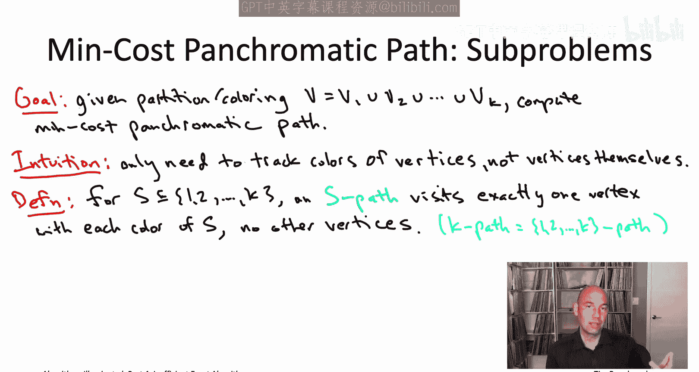

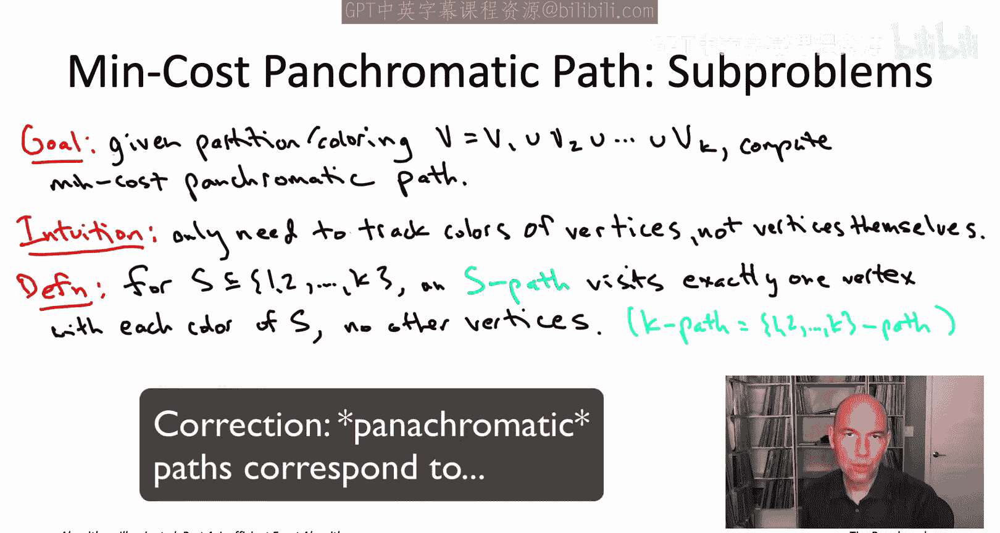

例如，如果 `S` 对应红色、黄色和蓝色，那么一条S-路径就是一条恰好访问一个黄色顶点、一个红色顶点和一个蓝色顶点的路径。

请注意，K路径正好对应于 `S` 为所有颜色集合（即 `{1,...,K}`）时的S-路径。

与我们的第一次尝试和TSP类似，子问题将由两个参数索引。第二个参数是路径访问的最后一个顶点 `v`。但正如我们所说，我们不会跟踪路径访问了哪些确切顶点，只会跟踪它访问了哪些颜色。因此，对于每个颜色子集 `S` 的选择和每个终点 `v` 的选择，都有一个子问题。子问题的任务是计算任何是S-路径（即访问的顶点颜色恰好都在 `S` 中）并且以顶点 `v` 结束的路径的最小成本。

## 动态规划递推关系

这些子问题的最优解如何由更小子问题的最优解构成？这里的情况将与TSP中完全一样。

考虑一个子问题的最优解。对于某个 `v` 和某个颜色集 `S`，看看以顶点 `v` 结束的最小成本S-路径，称其为路径 `P`。像往常一样，我们考虑这个最优解所做的最后决策，即最后一步跳跃，比如从某个顶点 `w` 到顶点 `v`。我们所期望的是，一旦你知道了最后一步跳跃，一旦你知道了倒数第二个顶点 `w`，那么路径的前缀应该对于适当的更小子问题是最优的。事实上，由于我们在TSP中看到的完全相同的原因，情况确实如此。

这个子问题是什么？显然，这个路径前缀 `P'` 现在以顶点 `w` 结束，所以这将是那个参数的值。此外，我们知道它访问的颜色应该是原始路径 `P` 访问的颜色减去 `v` 的颜色。在这个图示中，我展示了 `v` 是黄色的，所以这个前缀路径 `P'` 对于颜色子集 `S - {黄色}` 和终点 `w` 将是最优的。

如果你想正式证明这一点，可以像过去多次那样进行反证：假设 `P'` 实际上不是其子问题的最优解，假设存在一条更好的路径 `P''`，成本更低。那么你可以取 `P''`，在其末尾加上最后一步跳跃 `(w, v)`，得到一条成本比 `P` 更小的新路径，因此将是比 `P` 本身更好的 `P` 子问题的解。但这不可能发生，因为我们是从最优解 `P` 开始的。

这意味着，一旦你知道最优解的最后一步跳跃（倒数第二个顶点 `w`），你知道路径的其余部分必须是什么样子，那么只有非常有限数量的候选者竞争成为子问题的最优解。因此，我们的递推关系将只是对倒数第二个顶点 `w` 的可能性进行穷举搜索。对于连接到顶点 `v` 的每条边，都会有一个可能的 `w` 选择。

这个递推关系看起来几乎与我们在旅行商问题中得到的递推关系完全相同，这并不奇怪，因为我们是通过完全相同的推理得出的。唯一的区别是，这里颜色子集替代了原来的顶点子集。

## 算法伪代码

像往常一样，有了动态规划，一旦你找到了正确的子问题和连接它们解的递推关系，你就完成了，算法几乎可以自己写出来。

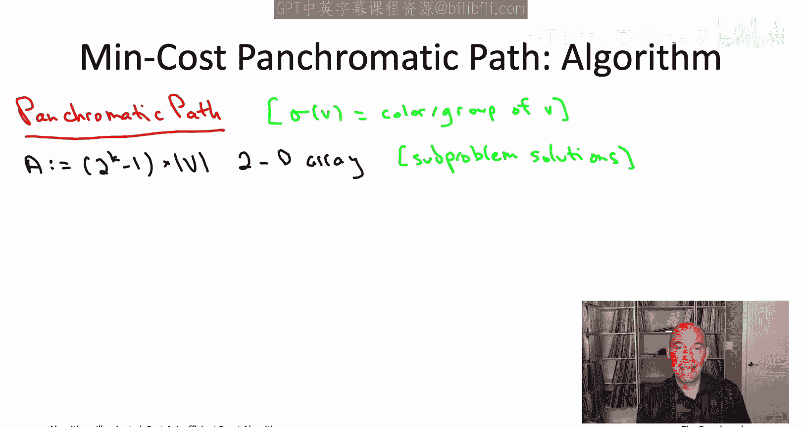

我们将这个算法称为 `PanchromaticPath`。这个算法除了图和边成本外，还给定一个着色（或顶点划分）。我将使用符号 `σ(v)` 表示分配给顶点 `v` 的颜色，这也是输入的一部分。

像往常一样，我们从子问题数组 `A` 开始。它是二维的，反映了索引我们子问题的两个参数。第一个参数是颜色子集，我们需要处理任何非空的颜色子集，所以有 `2^K - 1` 种 `S` 的选择。然后有 `n` 种终点 `v` 的选择（这里 `n` 是顶点数）。

接下来我们处理基本情况。子问题的大小对应于 `S` 中颜色的数量。基本情况是最小的子问题，即 `S` 的大小为1，只包含一种颜色。因此，对于每种可能的颜色 `i` 和每个可能的终点 `v`，我们都有一个子问题。

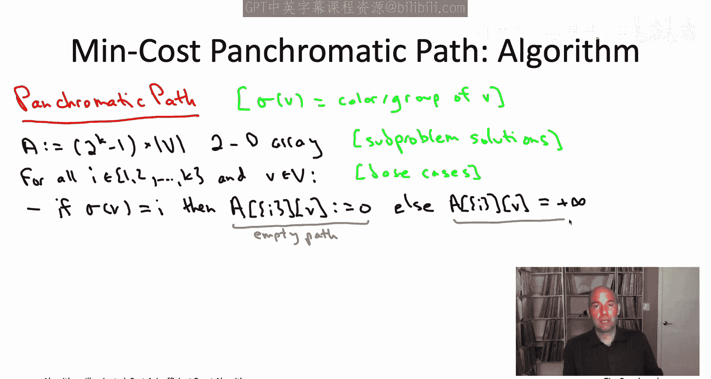

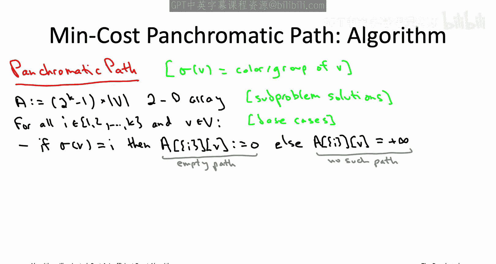

例如，这个子问题要求的是：一条恰好访问一个红色顶点（没有其他顶点）并以顶点17结束的路径的最小成本长度。这里有两种情况：要么顶点17恰好是红色的，那么空路径符合要求，成本为零；要么顶点17不是红色的（比如是绿色的），那么就不存在这样的路径，子问题的解是正无穷。

现在，我们系统地解决所有子问题，从小到大。我们将有一个外层的 `for` 循环来跟踪子问题的大小 `s`（即当前正在查看的集合 `S` 中的颜色数量）。然后我们有另一个 `for` 循环，枚举具有目标大小 `s` 的颜色子集。接着我们还有另一个 `for` 循环，搜索第二个参数，即所有可能的终点 `v` 的选择。

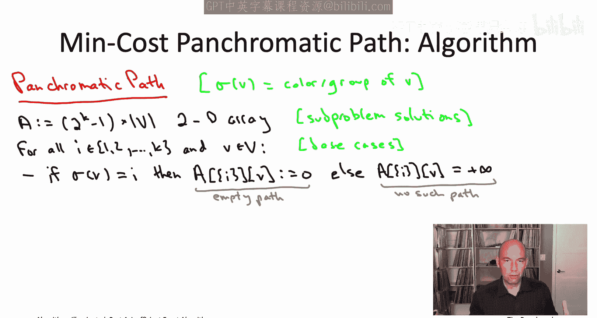

一旦你指定了所有这些，我们就知道我们在讨论哪个子问题（`S`, `v`），然后我们只需调用递推关系来计算解。

最后一步是从我们最大子问题的解中提取最终解。你会注意到有 `n` 个不同的最大子问题，每个 `v` 的选择对应一个。那个子问题的解对应于恰好以顶点 `v` 结束的最小成本全色路径。在问题陈述中，我们并不关心路径在哪里结束，所以我们想穷举搜索 `n` 个 `v` 的选择，并返回这些子问题解中最好的那个。

## 算法属性分析

这就是全色路径问题的伪代码。该算法计算任何全色路径（一条恰好有 `K` 个顶点，每种颜色恰好出现一次的路径）的最小成本。

让我们讨论一下算法的属性。

首先是正确性。像动态规划通常那样，正确性通过归纳法得出，基于子问题的大小。对于归纳步骤，你必须论证，假设你已经正确解决了所有更小的子问题，那么你就能正确解决一个子问题。这实际上就是证明递推关系的合理性，而证明递推关系合理性是通过我们的最优子结构推理来完成的。我们展示了子问题的最优解只能是有限数量候选者中的一个，我们的递推关系穷举搜索了所有这些候选者，其中最好的那个必定是最优解。因此，递推关系的正确性推动了归纳步骤，进而推动了 `PanchromaticPath` 算法的正确性。

像动态规划通常那样，我刚刚向你展示了基本版本，它只完成了通过子问题解数组的前向传递。如果你只关心知道最小成本全色路径的值，这个算法就可以了，但它不会给出路径本身。不过像往常一样，添加一个后处理重建步骤很简单，该步骤通过数组回溯并给出最小成本全色路径，这将是线性时间，甚至在线性于路径长度 `K` 的时间内完成。

运行时间分析更有趣一些，希望能让你愉快地回想起我们对贝尔曼-福特算法的运行时间分析。

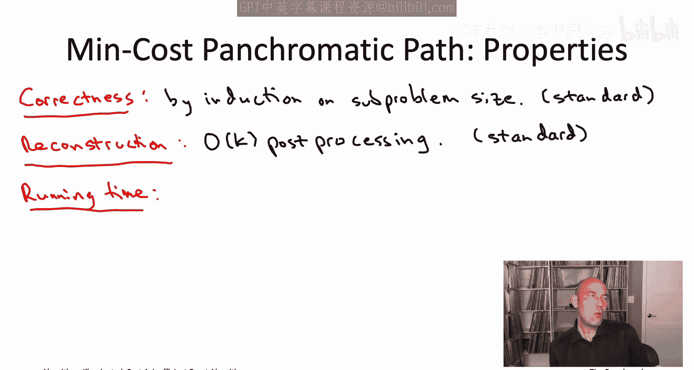

解决单个子问题需要多少时间？比如对应于颜色子集 `S` 和终点 `v` 的子问题。递推关系必须对最优解的所有可能的最后一步跳跃进行穷举搜索，因此对于连接到 `v` 的每条边 `(w, v)`，都有一个候选者。换句话说，递推关系必须搜索的不同情况的数量（每个情况使用常数时间）是顶点 `v` 的度数（即关联边的数量）。这就是三重 `for` 循环中单次迭代的运行时间。

现在让我们退一步，固定前两个 `for` 循环中的参数（子问题大小和该大小的特定集合 `S`），问一下在第三个 `for` 循环中解决那 `n` 个子问题总共花了多少时间。每个子问题的解决时间与该顶点的度数成正比，因此解决所有这些 `n` 个子问题将与所有顶点的度数之和成正比。

你可能知道无向图中所有顶点度数之和的另一个名称：`2m`，即边数 `m` 的两倍。因为在无向图中，每条边恰好为其两个端点的度数各贡献1，所以所有边上的贡献总和正好等于 `2m`。

这意味着，对应于特定颜色子集 `S` 的所有子问题的运行时间是线性时间，即 `O(m)`，其中 `m` 是图中的边数。为了精确，你可能需要写成 `O(m + n)`，以防图是不连通的，但我们先忽略这一点。我们就说解决对应于特定颜色子集 `S` 的所有子问题需要 `O(m)` 时间。

那么总运行时间就只是 `S` 的选择数量乘以 `O(m)`。当然，颜色子集 `S` 有 `2^K` 种选择，这给了我们最终的运行时间：`2^K * m`。

## 运行时间评估

我们应该如何看待这个运行时间？可能心情复杂。一方面，看到运行时间中有一个指数因子 `2^K`（`K` 是颜色数）是令人遗憾的。但另一方面，我们正在处理NP难问题的精确算法，所以我们必须预期某个地方会出现某种指数。再仔细想想，实际上我们大大超越了穷举搜索。记住，对于这些K路径问题，你必须枚举所有大小为 `K` 的顶点有序元组，大约有 `n^K` 个。因此，我们的运行时间不是按 `n^K` 缩放，而是按 `2^K` 缩放。对于我们感兴趣的那种参数选择（`K` 可能在10到20，`n` 可能在数百或数千），这是一个巨大的、巨大的差异，相对于穷举搜索是巨大的节省。

但最后一点坏消息是：这实际上并不是我们最初要解决的问题。我们最初想解决的是最小成本K路径问题。而我们展示的是，有了这个奇怪的额外约束（全色约束），加上这个转折，我们可以比穷举搜索快得多地解决问题。但是这个子程序如何用于我们真正关心的问题（没有全色约束的最小成本K路径）呢？

这就需要随机化登场了，我们将在下一部分介绍。

## 总结

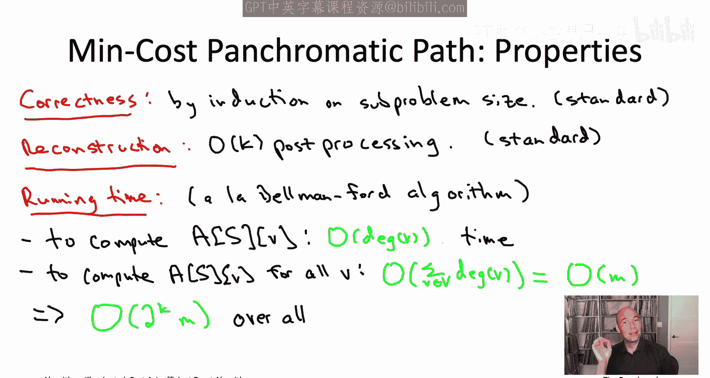

本节课中，我们一起学习了颜色编码技术的第一部分。我们首先了解了最小成本K路径问题的生物学背景和定义，认识到它是一个NP难问题。我们尝试使用动态规划直接解决，但发现子问题数量与穷举搜索相当，没有优势。接着，我们引入了颜色编码的核心思想：通过将顶点划分为 `K` 个颜色组，并将问题转化为寻找最小成本**全色路径**。我们详细设计了解决全色路径问题的动态规划算法，其运行时间为 `O(2^K * m)`，相对于 `O(n^K)` 的穷举搜索是一个巨大的改进。然而，这依赖于一个关键前提：我们需要一种方法对顶点进行着色，使得某条最优K路径恰好是全色的。如何实现这一步，我们将在下一部分探讨。