# 斯坦福大学《算法启蒙（第4册）：NP难｜Part 4 Algorithms for NP-Hard Problems》：21.2：颜色编码（第二部分）

在本节课中，我们将要学习颜色编码算法的第一步：如何对图的顶点进行随机着色，以及如何通过多次独立试验来提高找到最优路径的概率。

上一节我们介绍了如何通过动态规划在给定着色方案下找到最小成本的全色路径。本节中我们来看看如何生成一个有效的着色方案。

## 随机着色与成功概率

颜色编码方法的第一步，是使用K种颜色对图的顶点进行着色，其中K是我们寻找的目标路径长度。目标是让图中某个最小成本的K路径变成全色的，即对于某个最优路径，其每个顶点都获得一种不同的颜色。

核心问题在于，当我们完全不知道最小成本的K路径是什么样子时，我们该如何做到这一点？毕竟，这正是我们首先要寻找的目标。

因此，我们需要从工具箱中拿出另一个工具：随机化。我们希望一个均匀随机着色——即每个顶点独立地、等概率地被赋予K种颜色之一——能有不错的机会将一条最优K路径变成全色的。如果情况如此，并且我们足够幸运，那么我们就可以使用我们刚刚设计的动态规划子程序来相对高效地恢复那条路径。

在接下来的测验中，让我们思考一下，在均匀随机着色下，一条给定的K路径变成全色的概率是多少。

正确答案是第四个选项，答案D：**K! / K^K**。

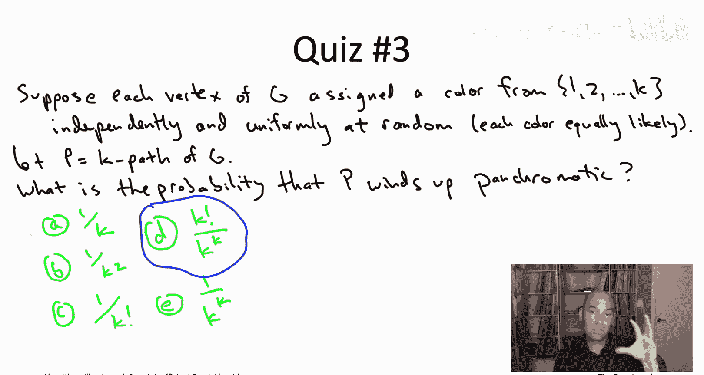

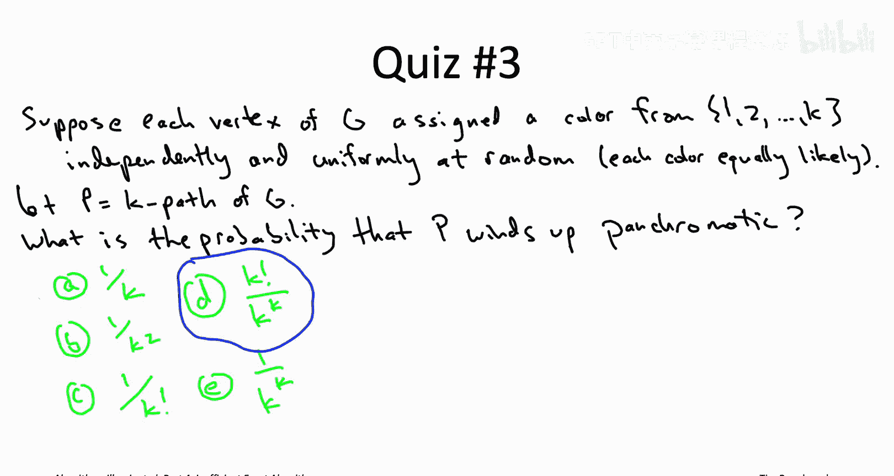

让我们从可能发生的情况总数开始分析。我们有一条K路径P，它有K个不同的顶点。它的每个顶点都将从1到K中随机均匀地分配一种颜色。这意味着路径P的第一个顶点有K种可能的结果，第二个顶点也有K种可能，依此类推，直到第K个顶点。因此，这条路径P的K个顶点总共有 **K^K** 种可能的着色方案，并且根据定义，每种方案出现的概率恰好是 **1 / K^K**。

第二个问题是关于分子：在这K^K种可能性中，有多少种会使路径P变成全色的？答案是 **K!**。原因如下：想象我们首先选择哪个顶点获得颜色1（比如红色）。有K种选择来决定哪个顶点变成红色。接下来，我们想确定哪个顶点是绿色的。它必须是剩下的K-1个未着色顶点之一。所以绿色顶点的选择数是K-1。然后，对于黄色顶点，我们有K-2种选择，依此类推，直到最后一种颜色只剩下1种选择。因此，总共有 **K!** 种着色方案能使路径P变成全色的。

## 概率分析与斯特林近似

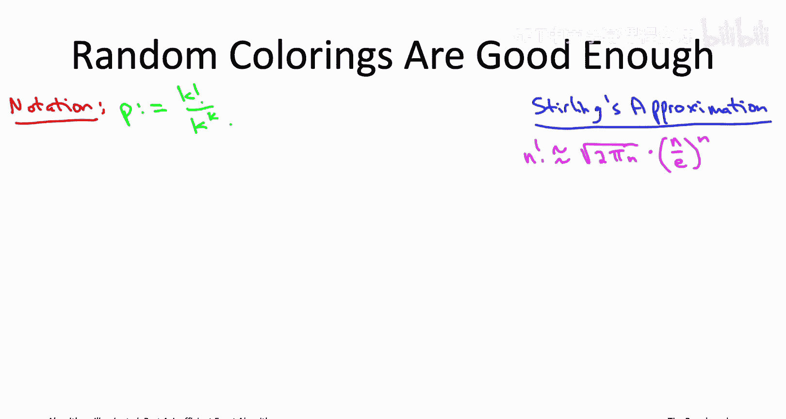

我们应该如何解释这个答案？K! 和 K^K 都随着K的增长而快速增长，它们的比值看起来如何？

让我们用 **p** 表示这个比值。我们如何感受它的大小？在分子中，我们有K!。记得在几个视频之前，我展示了一个非常好的阶乘函数近似：斯特林近似。当时在讨论旅行商问题（TSP）的背景下，我只是想说明2^n时间算法比n!时间算法快多少。但在这里，斯特林近似将扮演更直接的角色。让我提醒你它说的是什么。

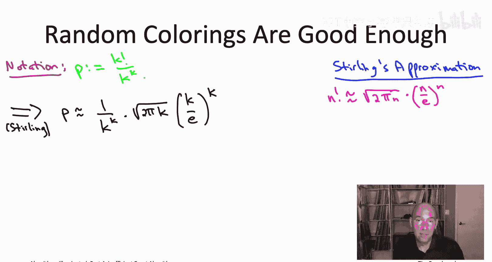

斯特林近似指出，n! 可以很好地近似为 **(n/e)^n * √(2πn)**，其中e是2.718...。之前我们满足于注意到对于即使不大的n值，(n/e)^n也比2^n大得多。但在这里，让我们实际代入这个阶乘近似公式来简化我们的比值p。

我们将对分子应用斯特林近似，其中n由K扮演。注意到两个K^K项会相互抵消，我们可以将这个表达式简化如下：

这看起来相当糟糕。我们的单次试验成功概率p——即使用均匀随机着色将给定K路径变成全色路径的概率——随着K的增加呈指数级快速下降。你可以看到分母中有e^K。事实上，即使只代入K=7，这个概率也已经小于1%，这有点令人沮丧。

## 多次试验与成功保证

然而，谁说过我们只能进行一次均匀随机着色呢？随机算法可以做不同的事情，我们运行的次数越多，效果越好。因此，我们可以进行大量独立的随机试验，不断尝试不同的着色方案，不断调用我们的动态规划子程序来计算最小成本的全色路径。在所有试验中，我们只需记住看到过的所有全色路径中最好的那条。

我们只需要幸运一次。只要我们的随机着色中有一次成功地将一条最优K路径变成全色的，我们的动态规划子程序就保证能找到它。

所以问题不在于单次实验成功的概率是多少，而在于我们需要进行多少次试验，才能以至少（例如）99%的概率保证至少有一次试验成功。

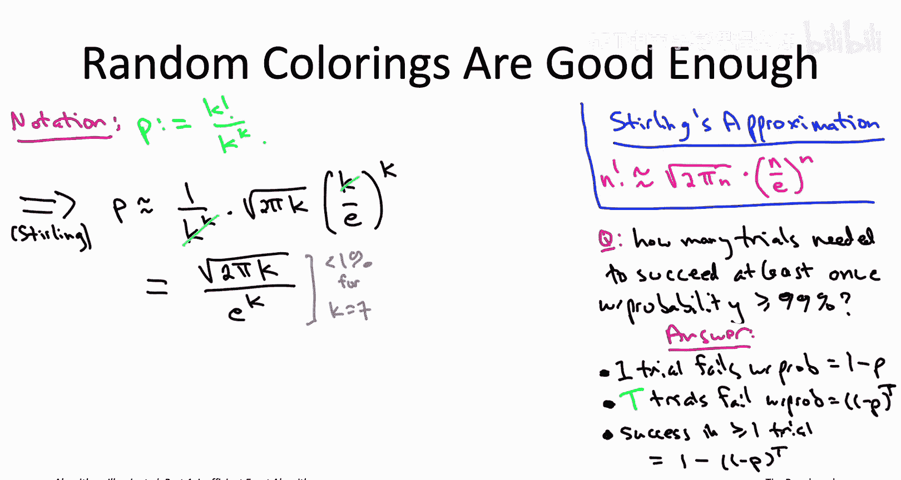

这里有一个非常清晰的答案。让我们逐步构建它。从一次试验开始。一次试验成功的概率是p（很小），失败的概率是1-p（很大）。我们不会只进行一次试验，我们将进行T次独立的随机试验。T是一个我们可以选择的参数。我们想知道需要将T设置多大才能达到我们的目标。

如果一次试验失败的概率是1-p，第二次试验失败的概率也是1-p，依此类推。所有这些试验都是独立的，因此概率相乘。这意味着所有T次试验都失败的概率是 **(1-p)^T**。如果这种情况没有发生，即并非所有T次试验都失败，那么至少有一次成功了，而这正是我们关心的。因此，至少一次试验成功的概率将是 **1 - (1-p)^T**。

这个表达式 **1 - (1-p)^T** 可能看起来有点乱。为了简化，让我们回忆一下几个视频前实际出现过的内容：线性函数 **1-x** 和指数函数 **e^{-x}** 之间的密切关系。我们之前在讨论最大覆盖和影响力最大化的神奇量 **1 - (1 - 1/k)^k** 为何收敛到63.2%时提到过这一点。当时我们利用了当x接近0时，1-x和e^{-x}非常接近这一事实。这里我们将使用 **e^{-x} 总是大于等于 1-x** 这一事实。1-x是一个线性函数，而e^{-x}是一条在零点与其相切的曲线。

因此，如果我们特别代入x = p，那么从这个图中我们发现 **1-p ≤ e^{-p}**。现在这就容易处理多了。我们有 **(e^{-p})^T**，这简化为 **e^{-pT}**。这意味着，我们至少一次试验成功的概率至少是 **1 - e^{-pT}**。

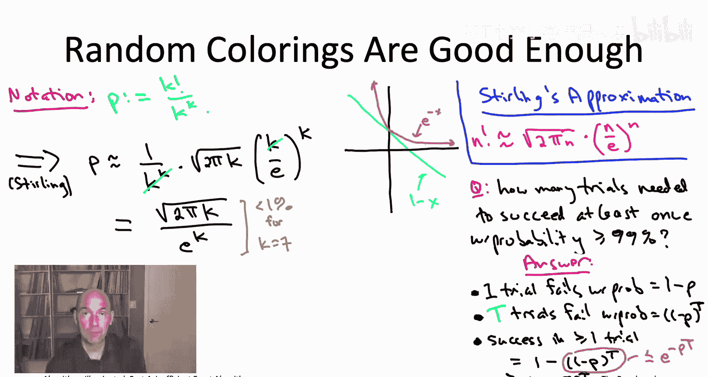

这里真正重要的是，所有试验都失败的概率随着T的增加而迅速减小，当我们进行越来越多的独立随机试验时，这个概率呈指数级下降。

回到我们最初的问题：我们需要将T设置多大？需要多少次试验才能以至少99%的概率成功？这意味着失败概率最多为1%。我们要做的是，将我们得到的这个失败概率上界 **e^{-pT}** 设置为一个参数δ，这里δ将是0.01。

现在我们可以求解试验次数T作为δ的函数。我们发现，只要我们至少进行 **T ≥ (1/p) * log(1/δ)** 次试验，其中δ是我们愿意容忍的失败概率，那么这么多次试验就足以让我们以至少 **1-δ** 的概率获得至少一次成功。例如，如果单次试验的成功概率p是1%，那么1/p项将变成因子100。如果我们设δ为0.01（即我们希望99%的成功率），那么这会将100乘以大约5，告诉你进行500次试验就可以了，你几乎总能在其中至少一次试验中成功。

在颜色编码的背景下，我们使用这些均匀随机着色将K路径变成全色，我们知道单次试验的成功概率p是 **√(2πK) / e^K**（这是我们从斯特林近似得到的）。因此，在所需的试验次数中，这个值会被取倒数。所以我们需要进行的试验次数——在我们可能至少有一次成功（即给定的K路径变成全色）之前，需要实验均匀随机着色的次数——将是 **(e^K / √(2πK)) * log(1/δ)**。

这看起来可能很庞大，是指数级于K的试验次数。但别忘了，在我们的动态规划子程序中，我们已经花费了指数级于K的时间。所以这个指数级于K的试验次数只会与那个时间相乘，我们将得到大致相同类型的运行时间。

## 算法伪代码与运行时间分析

为了确保清楚所有部分是如何组合在一起的，让我向你展示伪代码。

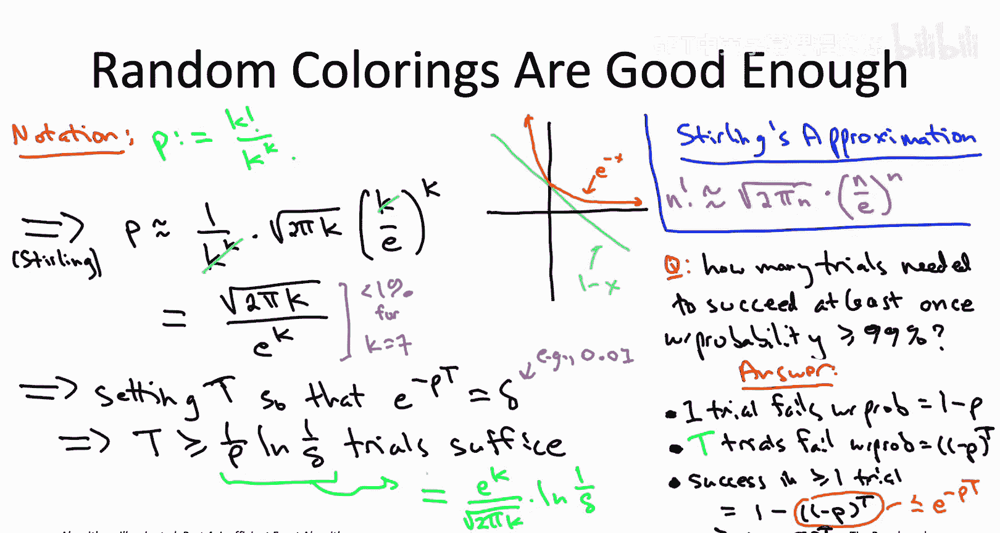

算法做的第一件事是计算需要多少次随机试验，这就是我们在上一张幻灯片中刚刚算出的：**T = (e^K / √(2πK)) * log(1/δ)**，其中δ是用户提供的失败概率。

然后，我们将运行T次独立的随机试验。每次试验，我们选取一个全新的均匀随机着色。每次试验，我们调用我们的全色路径子程序，为那个特定的着色找到最小成本的全色路径。然后，我们只需记住在所有试验中看到过的最佳路径。

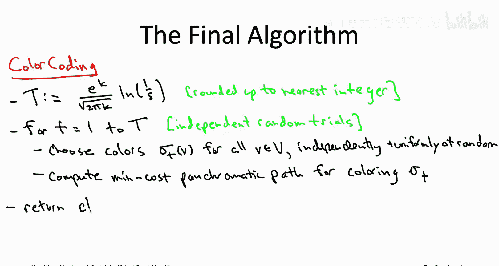

这就是颜色编码算法。它进行大量独立的随机试验，在每次独立试验中，它尝试对顶点进行均匀随机着色。

每次试验可能成功，也可能失败。成功意味着至少一条最小成本的K路径变成了全色的，在这种情况下，动态规划子程序将找到该路径或某个同等优秀的路径。失败意味着这种着色实际上没有将图中任何一条最小成本的K路径变成全色的，从而将它们全部从子程序的考虑范围内移除。在失败的情况下，子程序可能返回正无穷（如果该着色确实导致没有任何全色路径），或者如果子程序返回一条全色路径，它也不可能是最小成本的，因为没有任何最小成本路径是全色的，所以它将是原图中一条成本严格更高的K路径。

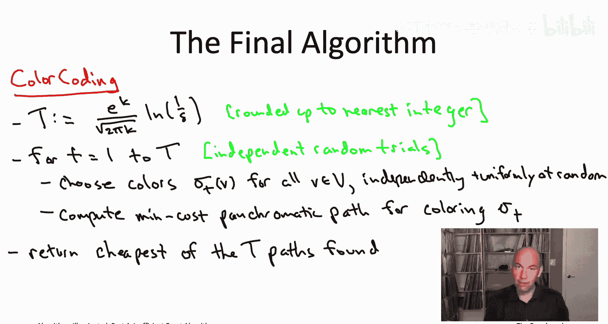

但关键是，我们只需要这些试验中的一次成功。只要至少有一次我们成功地对顶点进行着色，使得某条最小成本的K路径变成全色的，那么这个算法就是正确的。当然，我们已经选择了试验次数T，使得成功概率恰好是我们想要的：至少 **1-δ**。

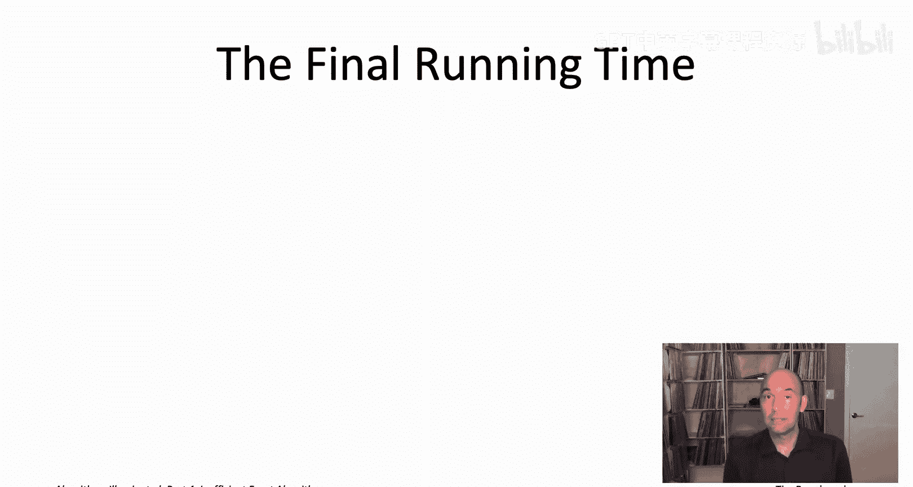

算法的运行时间如何？算法所做的几乎就是运行这些T次独立的随机试验。因此，运行时间就是试验次数T乘以每次试验的运行时间。

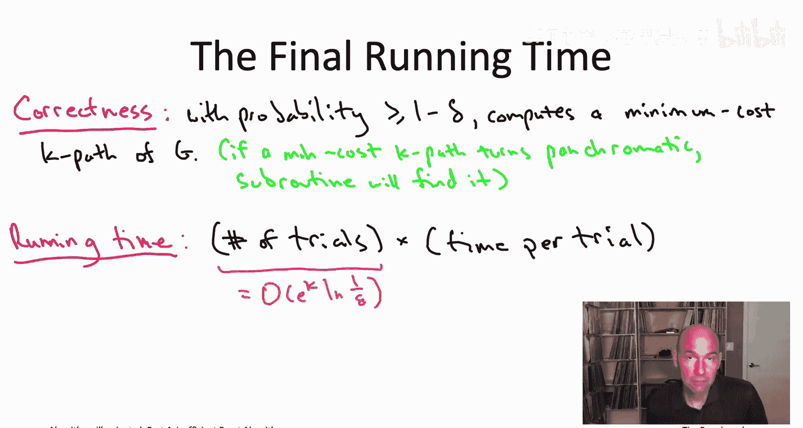

我们明确计算了试验次数：**(e^K / √(2πK)) * log(1/δ)**。让我们稍微宽松地处理上界，忽略那个√K因子，直接将试验次数称为 **O(e^K * log(1/δ))**。

每次试验的时间完全由调用动态规划子程序计算最小成本全色路径所主导。如果你还记得，通过类似贝尔曼-福特风格的论证，该算法的运行时间是 **2^K * M**，其中M是图中的边数。

将两者相乘，我们得到运行时间为 **(2e)^K * M * log(1/δ)**，其中δ是用户提供的失败概率。

我们应该如何看待这个运行时间？它远远优于穷举搜索。记住，穷举搜索需要枚举所有有序的K元组顶点，其规模大约是 **n^K**。而这里我们有一个运行时间上界，其规模是 **常数^K**。这个常数不像以前那么小，现在常数大约是5.5，但对于我们讨论的n和K值（例如K=10或20，n=几百或几千），**5.5^K** 远远优于 **n^K** 的运行时间。对于K=5，n^K就已经基本无用了。

## 固定参数算法与应用意义

这类算法有一个特殊的名称：用于NP难问题的精确算法，其运行时间虽然当然是指数级的，但指数依赖的方式相当受限，即指数依赖仅取决于衡量实例难度的特定参数。在K路径问题中，参数就是K。你寻找的路径越长，问题通常就越难。那些仅在参数上具有指数依赖性，而在输入规模上为多项式时间的算法，被称为**固定参数算法**。如果你想知道更多，鼓励你进行网络搜索了解这个术语。

这个特定的固定参数算法在实际应用中产生了相当大的影响。记得在本节开始时，我们谈到了在蛋白质-蛋白质相互作用网络中寻找长线性路径的应用，即在生物网络中寻找有意义的结构。在颜色编码出现之前，最先进的技术在K值很小（可能K大约为10）时就会陷入困境。随着颜色编码的发明（甚至可以追溯到2007年左右），当时的计算机使用这种算法，允许计算生物学家在拥有数千个顶点的PPI网络中找到长度高达20的线性路径。这确实使他们能够比以前更深入地理解这些生物网络的结构。

## 总结与下节预告

本节课中我们一起学习了颜色编码算法的核心思想：通过随机着色将寻找K路径的问题转化为寻找全色路径的问题，并利用动态规划高效求解。我们分析了单次随机着色成功的概率 **p ≈ K! / K^K**，并利用斯特林近似得到 **p ≈ √(2πK) / e^K**。为了以高概率（如99%）成功，我们需要进行 **T = O(e^K * log(1/δ))** 次独立试验。算法的总运行时间为 **O((2e)^K * M * log(1/δ))**，这比穷举搜索的 **O(n^K)** 有了巨大改进，属于固定参数可处理算法，并在计算生物学等领域得到了成功应用。

这就结束了我们对颜色编码算法以及更一般的、具有可证明运行时间界限优于穷举搜索的NP难问题精确算法的讨论。在本章（第21章）的剩余部分，我将讨论不一定具有可证明运行时间界限优于穷举搜索，但在应用中解决NP难问题可能非常有效的尖端技术：混合整数规划和可满足性求解器。我们下次再开始讨论这些内容。

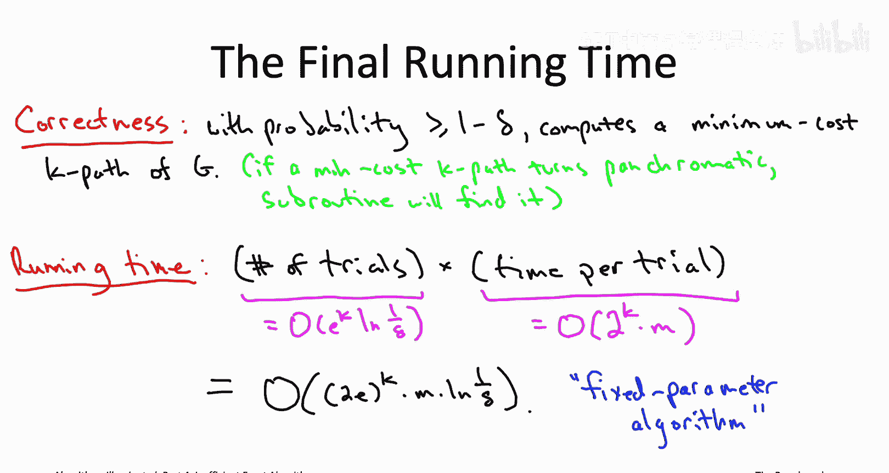

