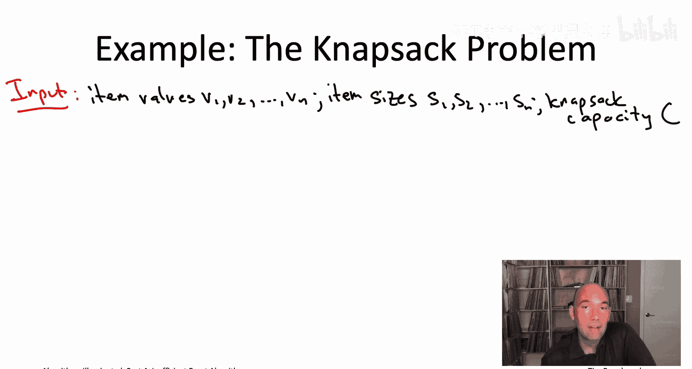
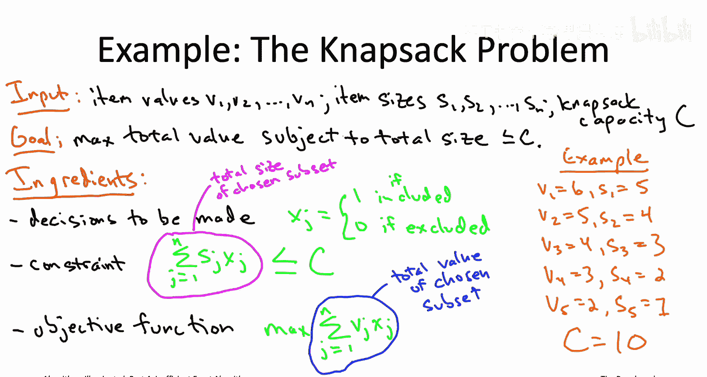
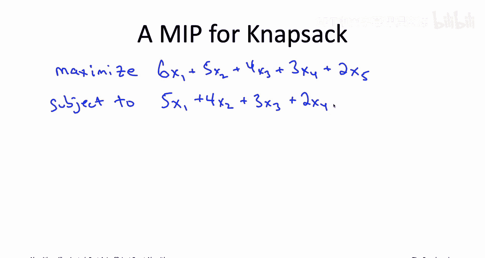
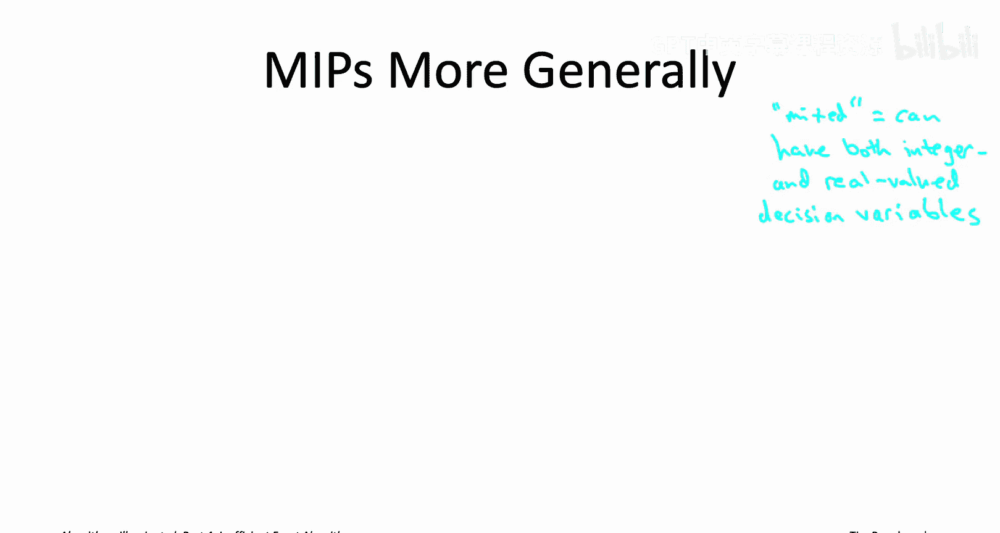
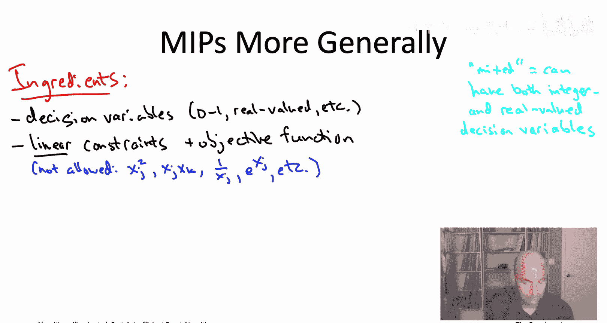
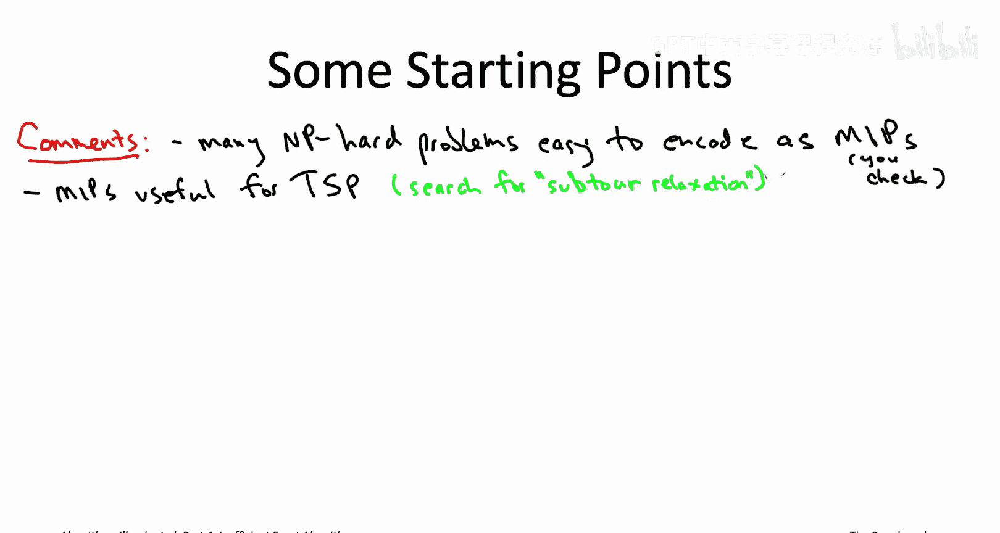
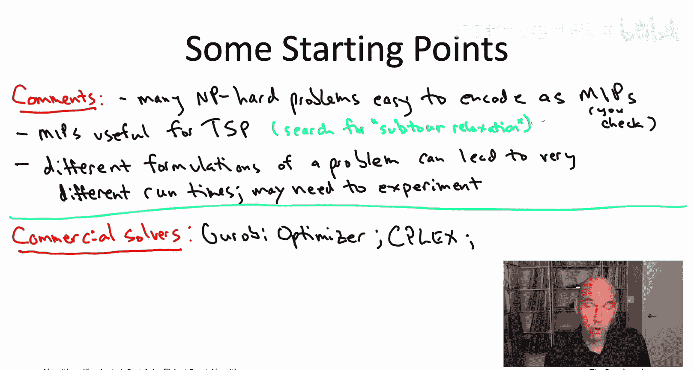

# 算法启蒙（第4册）：NP难｜Part 4 Algorithms for NP-Hard Problems：23：混合整数规划求解器 🧮

在本节课中，我们将要学习一种被称为“混合整数规划求解器”的半可靠“魔法黑盒”。这是一种非常通用的工具，可以将许多离散优化问题表述为一种特殊形式，并尝试求解。

## 从背包问题看MIP

上一节我们介绍了求解NP难问题的思路，本节中我们来看看如何将具体问题转化为混合整数规划。让我们通过一个老朋友——背包问题，来初步感受一下这个过程。

### 背包问题回顾

首先，让我们回顾一下背包问题的定义。输入包含 `2n + 1` 个正整数：有 `n` 件物品，每件物品有一个价值和一个尺寸，最后一个数字 `C` 是背包的容量。目标是选择一个物品子集，使得子集的总价值尽可能高，同时满足子集的总尺寸不超过背包容量。

问题的规范明确了三件事：需要做出的决策、必须遵守的约束条件，以及需要优化的目标函数。

### 决策变量

我们需要为每件物品 `i` 做出一个二元决策：是否将其包含在子集中。一种方便的数值编码方式是使用 `0-1` 变量。我们引入变量 `x_i`：
- `x_i = 1` 表示物品 `i` 被包含在子集中。
- `x_i = 0` 表示物品 `i` 被排除在子集外。

### 约束条件

背包问题只有一个约束：所选物品的总尺寸不得超过容量 `C`。用我们引入的决策变量 `x_i` 可以很容易地用算术表达这个约束。物品 `i` 如果被包含，则贡献其尺寸 `s_i`；如果不被包含，则贡献 `0`。因此，所选物品的总尺寸可以表示为：
`∑_{j=1}^{n} s_j * x_j`

### 目标函数

我们想要最大化所选物品的总价值。与总尺寸类似，总价值也可以很容易地用决策变量表示：
`∑_{j=1}^{n} v_j * x_j`

### 第一个混合整数规划

至此，你已经看到了你的第一个混合整数规划。为了确保清晰，让我们具体写出幻灯片右侧这个五物品实例的MIP。

以下是该实例的MIP描述：
- **目标函数**：最大化 `6*x1 + 5*x2 + 4*x3 + 3*x4 + 2*x5`
- **约束条件**：`5*x1 + 4*x2 + 3*x3 + 2*x4 + 1*x5 ≤ 10`
- **变量定义**：`x1, x2, x3, x4, x5 ∈ {0, 1}`

像这样简单的描述，可以直接输入到一个被称为混合整数规划求解器的“魔法黑盒”中。例如，使用领先的商业求解器（如Gurobi Optimizer），你只需将上述数学描述翻译成文本文件输入，它就能在瞬间告诉你最优解。对于这个例子，最优解是 `x1 = 0`, `x2 = x3 = x4 = x5 = 1`，即排除第一件物品，选择其他四件。

当然，这只是一个玩具示例。通常，当你使用MIP求解器时，你处理的是更大的实例，这时你会希望编写程序自动生成输入文件，或者直接通过求解器的API进行交互。

## 混合整数规划概述

现在，让我们更一般地讨论混合整数规划，而不仅仅是背包问题。

### “混合”的含义

你可能会好奇“混合”指的是什么。这里的“混合”指的是求解器可以容纳不同类型的决策变量。到目前为止，我们只使用了二元变量（0或1）。更一般地，它们可以处理在一定范围内取整数值的变量，甚至在一定范围内取实数值的变量。因为可以混合实数值和整数值变量，所以被称为混合整数规划。

### 相关术语

需要注意的是，我所说的MIP有时也被称为其他名称。MIP确实是一个常用术语，但有些作者会称之为**整数线性规划**，以强调其线性方面（我们稍后会讨论）。还有些作者直接称之为**整数规划**，省略了“混合”。

### 线性规划：一个特殊且重要的子类

混合整数规划有一个非常有趣的特殊情况，即没有整数值或0-1决策变量，所有决策变量都是实数值。这种特殊类型的MIP被称为**线性规划**。最先进的求解器在线性规划上表现得非常出色。事实上，任何时候你使用求解器解决混合整数规划，在底层，求解器很可能正在求解成千上万个线性规划来辅助计算。并非巧合的是，线性规划问题是多项式时间可解的，而一般的混合整数规划是NP难的。因此，线性规划是混合整数规划中一个仍然非常强大、表达力丰富但相当易处理的特殊子类。

## 如何指定一个MIP

一般来说，指定一个MIP与我们讨论过的三个要素相同：
1.  **识别决策变量**：明确需要做出哪些决策。
2.  **说明约束条件**：明确必须遵守哪些限制。
3.  **定义目标函数**：明确你想要优化什么。

### 线性限制

一个非常重要的限制是：**约束条件和目标函数都必须是决策变量的线性函数**。

“线性”是什么意思？让我们回顾一下背包问题的整数规划。你会注意到，在目标函数和约束条件中，我们只是将决策变量乘以常数（如6、5、4），然后将它们相加，没有做任何其他操作。这就是“线性”的含义。

例如，不允许出现像 `x_j^2`（非线性）、`x_j * x_k`（非线性）、`1 / x_j`（非线性）或 `log(x_j)`（非线性）这样的表达式。约束条件和目标函数必须能够表示为决策变量乘以常数因子后的和。

最新的MIP求解器确实也能容纳有限类型的非线性项（如某些二次项），但当只有线性约束和目标函数时，它们通常运行得更快。这也是我们在这里关注的重点。

### MIP的正式定义

现在，我可以为你正式定义混合整数规划问题。基本上，你被给定一个MIP的描述，你的工作就是在遵守约束条件的前提下找到最优解。

目标函数是线性的，你所能做的只是选择如何缩放不同的决策变量。因此，输入仅包含线性函数的系数：每个决策变量 `x_j` 对应一个系数 `c_j`。类似地，对于每个约束（与背包问题不同，MIP中完全可以有多个约束），也需要指定其线性系数。你还需要为每个约束指定一个右侧值。

例如，在背包问题中：
- `c_j` 成为物品价值（目标函数中的系数）。
- 我们只有一个约束（`m = 1`），该约束的系数等于物品尺寸（不等式约束的左侧）。
- 右侧值 `b` 就是背包容量 `C`。

因此，一个通用的混合整数规划如下：
- 告诉你决策变量是什么以及它们允许取哪些值。
- 通过系数告诉你一个线性目标函数。
- 告诉你 `m` 个约束，同样是线性的，同样通过其系数指定。

MIP算法或MIP求解器的职责就是计算这个非常通用的优化问题的最优解。在所有允许的决策变量赋值方式中，在所有满足所有给定约束的方式中，找到具有最佳目标函数值的那个。如果你想最大化目标，你就需要找到满足所有约束且目标函数值尽可能高的变量赋值。

## MIP的表达能力与应用

即使有约束条件和目标函数的线性限制，将NP难优化问题表述为混合整数规划也**可能出奇地容易**。我们在讨论背包问题时已经看到了一个例子。

为了进一步阐述这一点，想象我们有一个更难的背包问题，称为**二维背包问题**。现在，每件物品 `j` 除了价值 `v_j` 和尺寸 `s_j` 外，还有第三个参数：重量 `w_j`。除了背包容量 `C` 外，现在还有一个对总重量的类似限制 `W`。目标仍然是最大化所选物品的总价值，但受限于两个约束：总尺寸不超过 `C`，且总重量不超过 `W`。

虽然你可以用动态规划解决二维背包问题，但将其表述为MIP同样简单：只需在我们已有的MIP中添加第二个约束即可。

不仅仅是背包问题，许多你熟悉的问题，例如：
- 最大权独立集问题
- 最小带宽问题
- 最大覆盖问题

都很容易编码为混合整数规划。如果你想尝试用MIP求解器解决这些问题，完全可以一试。

混合整数规划也是**精确求解旅行商问题**的业界标准方法，尽管其应用比上述例子要复杂得多。如果你想了解更多关于如何将MIP应用于旅行商问题，建议你搜索“子环消除约束”。

### 表述方式的重要性

不仅许多问题可以自然地编码为混合整数规划，事实上，许多问题可以**以多种不同的方式**编码为混合整数规划。而且，表述方式的选择可能影响巨大。即使使用相同的求解器，不同的MIP表述也可能导致性能差异达到一个数量级或更多。

这意味着，如果你第一次尝试使用MIP求解器解决问题失败了，并不一定意味着这项技术不适用。可能只是意味着你需要尝试用其他方式将问题编码为MIP，以获得可接受的求解器性能。

## 如何开始使用MIP求解器

既然你已经跃跃欲试，想将这种半可靠的“魔法黑盒”——MIP求解器——应用到你关心的问题上，那么应该从哪里开始呢？

让我简要介绍一下在录制本视频时（2020年）的业界现状。不幸的是，**商业求解器和非商业求解器之间存在巨大的性能差距**，因此我将分别针对这两种情况给出建议。

### 商业求解器

目前，大多数专家会告诉你，**Gurobi Optimizer** 是最稳定可靠和健壮的求解器。如果你要选择一个亚军，你可能会选择 **CPLEX**（它在某些方面是Gurobi的前身）或 **FICO Xpress**。

好消息是，如果你与大学有关联（是学生或教职工），你可以为这些求解器获取免费的学术许可证，尽管通常仅限于研究和教育用途。

### 非商业求解器

对于那些只能使用非商业求解器的人，如果你四处询问推荐，以下是你可能经常听到的四个名字（各种首字母缩写）：
1.  **SCIP**
2.  **CBC** 求解器
3.  **MIPCL**
4.  **GNU Linear Programming Kit (GLPK)**

CBC和MIPCL求解器的许可协议比其他两个更宽松；其他两个仅限非商业使用免费。

### 建模语言

如果你开始认真对待这些MIP求解器，另一件你可能想了解的事情是：你可以将“为你的问题构建MIP模型”和“将你构建的模型以特定求解器要求的语法描述出来”这两个任务分离开。这可以通过使用**高级的、求解器无关的建模语言**来实现。

一个很好的例子是基于Python的 **CVXPY**。如果你选择使用这类建模语言，好处是你可以轻松地尝试该语言支持的所有求解器，以找出哪种求解器在你关心的输入类型上表现最好。你的高级规范会被自动编译成求解器期望的任何格式。

本节课中我们一起学习了混合整数规划求解器这一强大的工具。我们了解了如何将优化问题（如背包问题）表述为MIP，理解了MIP的基本构成（决策变量、线性约束、线性目标函数）以及“混合”和“线性”的含义。我们还探讨了MIP强大的表达能力，以及商业与非商业求解器的选择。最后，我们提到了使用高级建模语言可以方便地尝试不同求解器。

这涵盖了我想要告诉你的关于MIP求解器这种半可靠“魔法黑盒”的全部内容。还有另一种类型的此类“黑盒”——可满足性求解器，我将在下一个视频中介绍。