# 算法启蒙（第4册）：NP难｜Part 4 Algorithms for NP-Hard Problems：21.5：可满足性求解器 🧩

在本节中，我们将简要介绍可满足性（SAT）求解器的世界。这是我们将要讨论的第二种“半可靠魔法盒”。上一节我们介绍了用于优化问题的混合整数规划求解器，而本节中我们来看看用于可行性检查问题的SAT求解器。

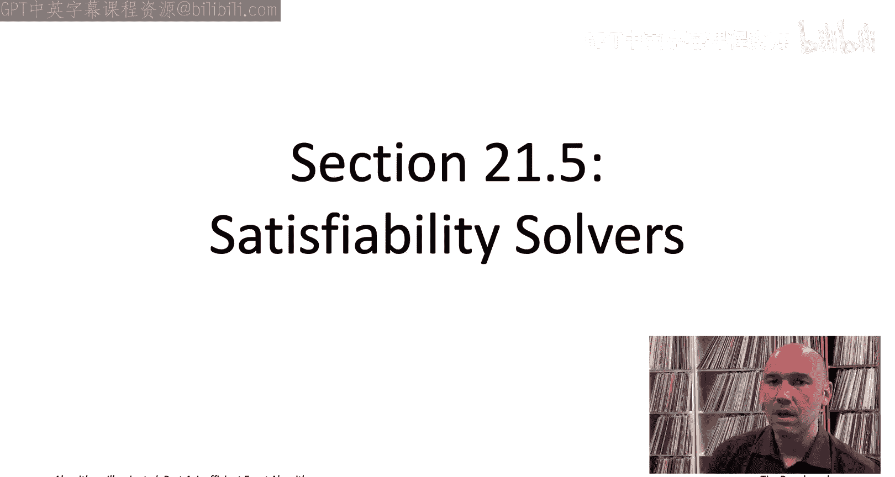

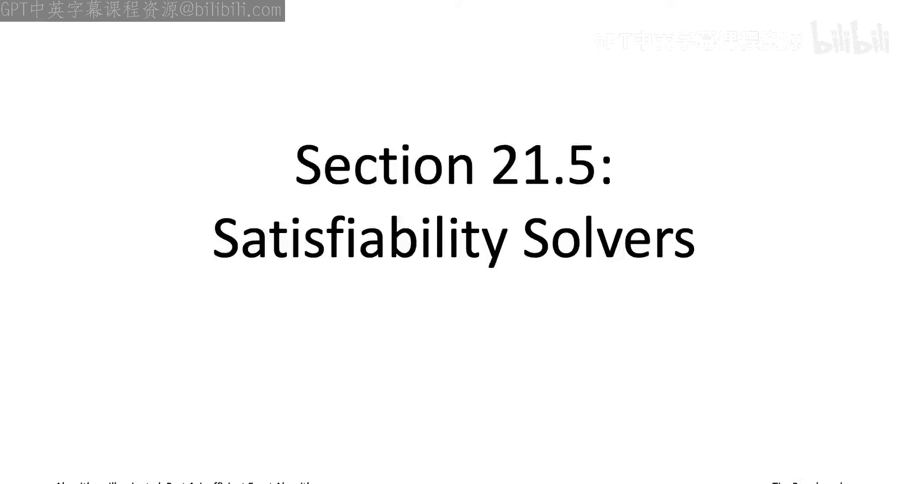

## 概述

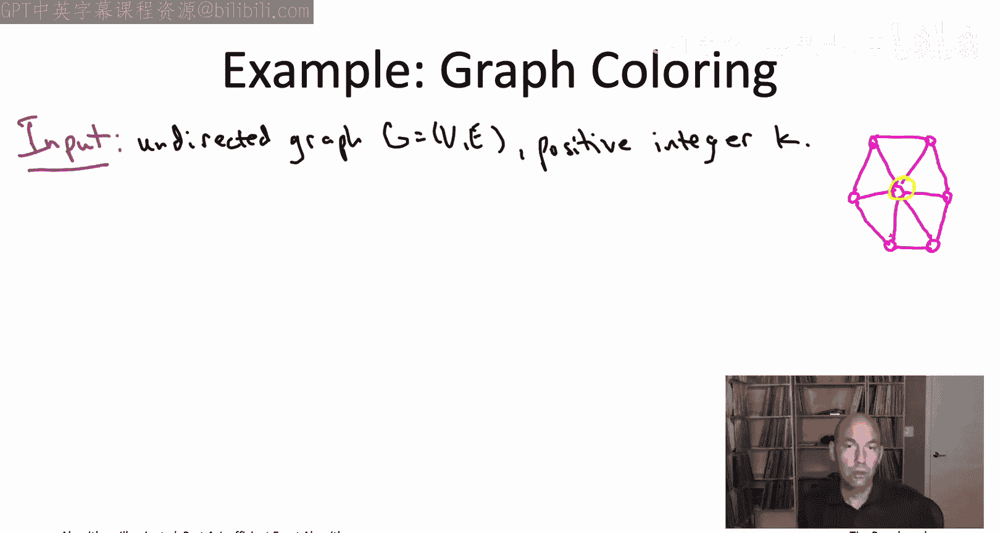


SAT求解器用于解决可满足性问题。这类问题通常不涉及优化某个数值目标函数，而是关注于判断一组约束条件是否能同时被满足，并可能找到一个可行的解。许多应用中的问题可以自然地编码为SAT问题。


## 图着色问题 🎨

图着色问题是图论中最古老的问题之一。输入是一个无向图和一个正整数K。目标是用K种颜色为图的顶点着色，使得每条边的两个端点颜色不同。这被称为K着色。


例如，考虑一个有六个辐条的轮图（共七个顶点）。当K=3时，该图是三着色的。我们可以将中心节点涂成黄色，然后在周边交替使用蓝色和绿色。

然而，对于有五个辐条的轮图，它就不是三着色的，实际上需要四种颜色。中心节点涂成黄色后，周边五个节点都必须使用非黄色（即蓝色或绿色）。但尝试交替使用蓝绿两色时，第五个节点会与相邻节点冲突，因此必须引入第四种颜色。

图着色问题不仅仅是理论问题，它有实际应用，例如课程安排（将课程分配到教室）和高风险的FCC激励拍卖案例。

## 从逻辑到SAT：基本概念 🔧

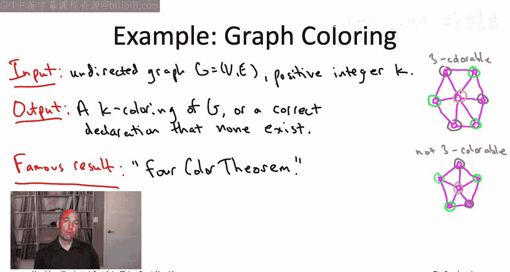

与混合整数规划求解器处理数值优化问题不同，SAT求解器基于逻辑形式。其决策变量是布尔变量，只能取真（True）或假（False）两个值。

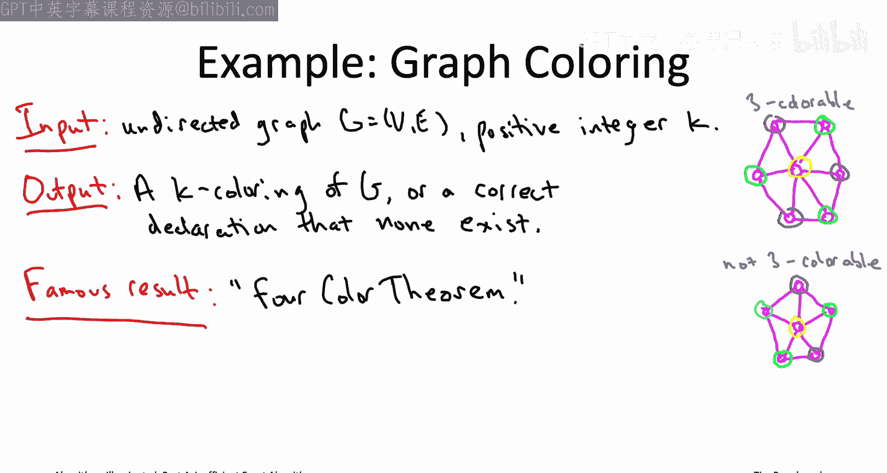


一个真值指派是为每个决策变量分配一个值（真或假）。对于n个变量，有2^n种可能的真值指派。

约束条件（在SAT中常被称为子句）用于限定哪些真值指派是可行的。我们将使用一种看似简单但表达能力强大的约束形式：文字的析取。

*   **文字**：一个决策变量（如 `Xi`）或其否定（如 `¬Xi`）。
*   **析取**：逻辑“或”运算（用符号 `∨` 表示）。例如，`X1 ∨ ¬X2 ∨ X3` 表示 `X1` 为真，**或** `X2` 为假，**或** `X3` 为真。只要至少一个文字为真，整个析取式就为真。

一个包含K个文字的析取式很容易满足，在涉及变量的2^K种赋值中，只有一种（即所有文字的请求都被违背）会使其为假。


## SAT问题定义 📝

SAT问题的输入是：
1.  **变量列表**：n个布尔决策变量 `X1, X2, ..., Xn`。
2.  **约束列表**：m个约束，每个约束都是一个或多个文字的析取式。

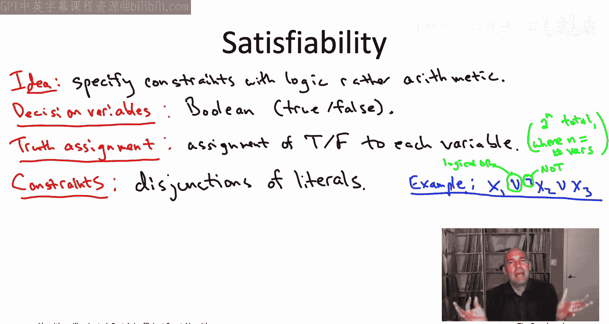


SAT求解器的任务是：
*   找到一个满足所有m个约束的真值指派。
*   或者，如果不存在这样的真值指派（即实例不可满足），则正确报告这一事实。

SAT问题是理论计算机科学中最核心的问题之一。


## 将图着色编码为SAT问题 💻

如何将看似需要K种颜色的图着色问题，编码为只使用布尔变量的SAT问题呢？技巧在于为每个顶点创建K个布尔变量。

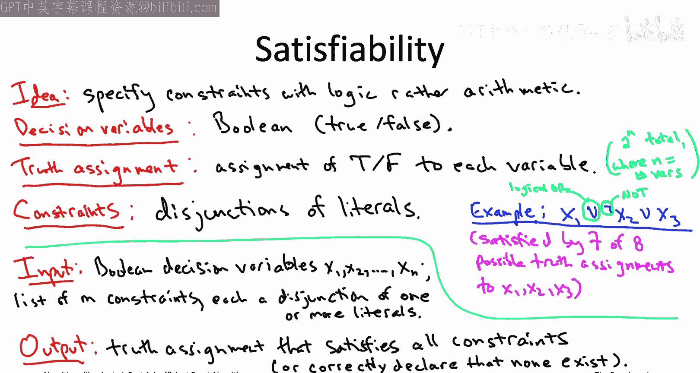

**变量定义**：
对于每个顶点 `v` 和每种颜色 `i` (1 ≤ i ≤ K)，创建一个布尔变量 `X_{v,i}`。
*   **语义**：`X_{v,i} = True` 表示顶点 `v` 被赋予颜色 `i`。

**约束定义**：
我们需要两类约束来确保得到一个合法的K着色。

以下是构建约束的步骤：

1.  **每个顶点至少获得一种颜色**：
    对于每个顶点 `v`，添加一个约束：`X_{v,1} ∨ X_{v,2} ∨ ... ∨ X_{v,K}`。这确保了顶点 `v` 至少有一个颜色变量为真。

2.  **相邻顶点颜色不同**：
    对于每条边 `(v, w)` 和每种颜色 `i`，添加一个约束：`¬X_{v,i} ∨ ¬X_{w,i}`。这个析取式要求 `X_{v,i}` 和 `X_{w,i}` 不能同时为真，即顶点 `v` 和 `w` 不能同时被着色为 `i`。

通过这两组约束，我们可以保证得到的真值指派对应一个合法的图着色（尽管一个顶点可能有多个颜色变量为真，但我们可以任意选择其中一个作为其颜色，这不会影响着色的合法性）。


## 使用SAT求解器 🧰

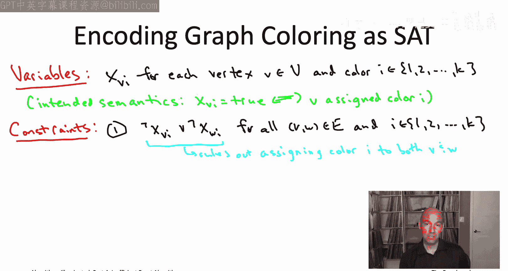

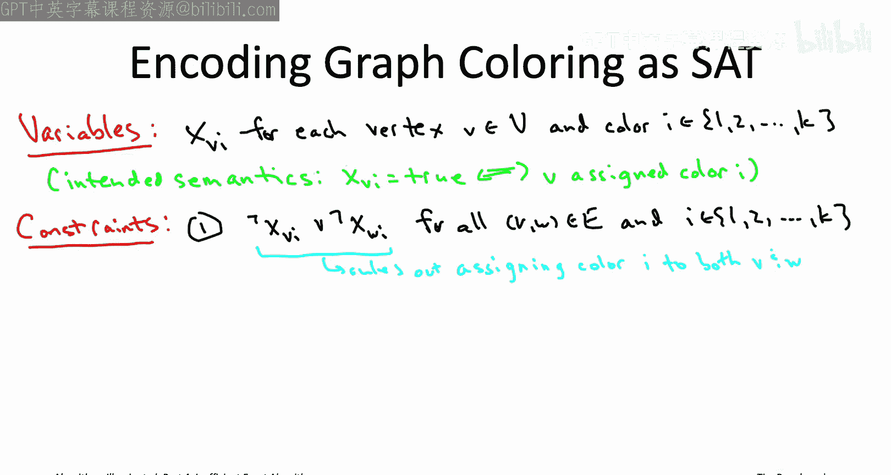

将问题编码为SAT后，我们可以将其输入到SAT求解器中。输入通常采用一种标准格式（如DIMACS CNF格式）。

例如，对于一个三角形图（三个顶点的完全图）的2着色问题，其SAT编码的输入文件可能如下所示：

```
p cnf 6 9
1 2 0
3 4 0
5 6 0
-1 -3 0
-1 -5 0
-3 -5 0
-2 -4 0
-2 -6 0
-4 -6 0
```

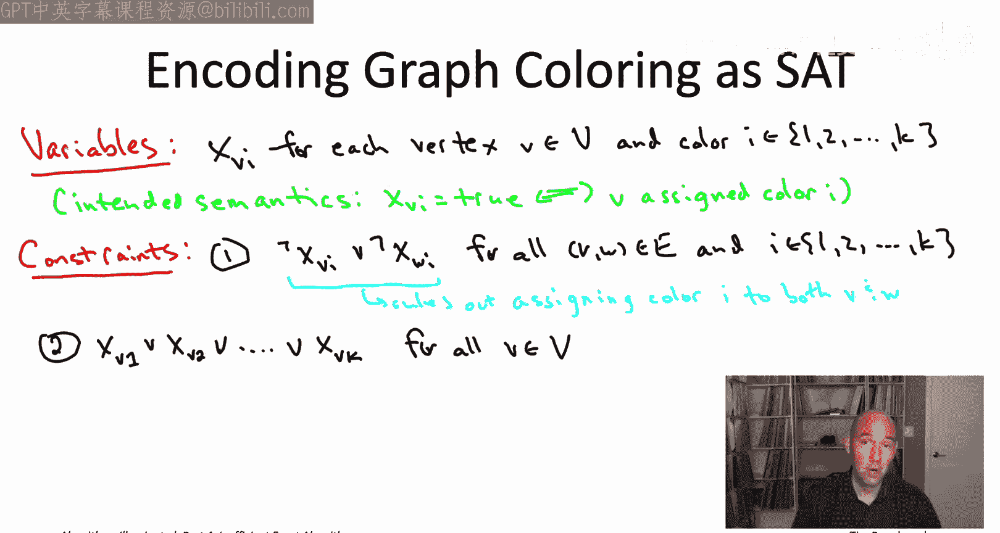

*   第一行 `p cnf 6 9` 表示有6个变量和9个子句。
*   正数表示变量，负数表示变量的否定。
*   每行以0结束，表示一个子句的终止。
*   前三个子句对应“每个顶点至少一种颜色”的约束。
*   后六个子句对应“相邻顶点颜色不同”的约束。

将这个文件输入到如 **MiniSAT** 这样的求解器，它会迅速返回该图是否是2着色的（对于三角形，答案是否定的）。

## SAT求解器生态与工具 🏆

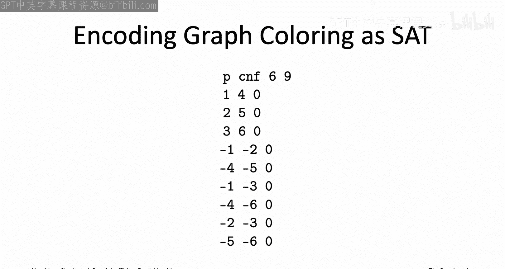

SAT求解器领域的一个特点是开源生态非常活跃。全球的研究人员定期举办SAT竞赛，比较各自求解器的性能。许多优秀的求解器都是开源的。


*   **入门推荐**：**MiniSAT** 性能良好，易于使用，且采用宽松的MIT许可证。
*   **进阶工具**：**可满足性模理论（SMT）求解器**（如微软的 **Z3**）扩展了SAT的能力，可以处理更丰富的理论（如算术、数组等）。Z3同样免费且开源。


## 总结

本节课中我们一起学习了可满足性（SAT）求解器。我们了解到：

1.  SAT求解器是用于解决可行性问题的“半可靠魔法盒”，它基于逻辑而非算术。
2.  **SAT问题的核心**是寻找一组布尔变量的赋值，以满足一组由文字析取构成的约束。
3.  许多实际问题（如图着色）可以**编码**为SAT问题。关键的编码技巧包括使用多个布尔变量表示多值选择，并用析取子句表达问题约束。
4.  编码完成后，问题可以输入到如 **MiniSAT** 这样的**求解器**中自动求解。
5.  SAT求解器领域拥有活跃的**开源社区**和定期竞赛，推动了工具的快速发展。


至此，我们已经完成了对处理NP难问题各种策略的探讨：从妥协于正确性的启发式算法和局部搜索，到妥协于运行时间的精确算法（如动态规划），再到本章介绍的两种“魔法盒”——混合整数规划求解器和可满足性求解器。你现在已经具备了多种工具来尝试解决实践中遇到的NP难问题。


接下来的章节将解决另一个关键问题：如何判断一个问题是NP难的，从而避免为寻找其多项式时间精确算法而浪费时间。