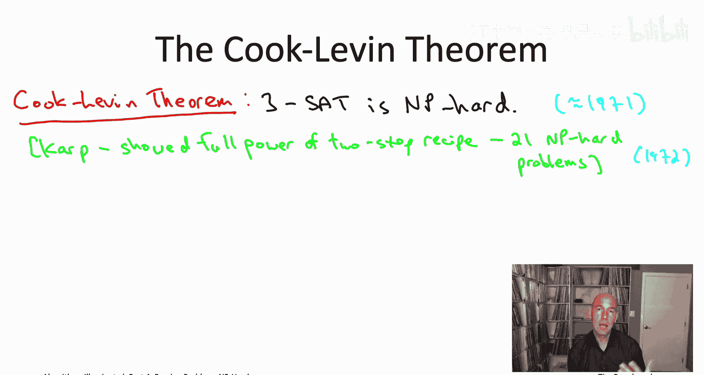
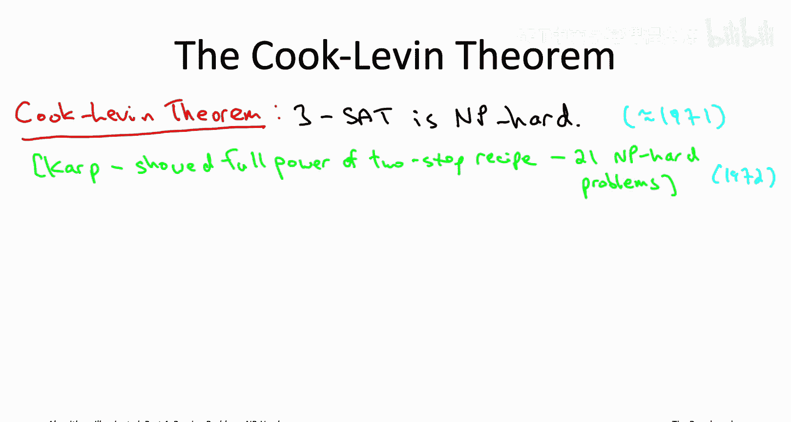
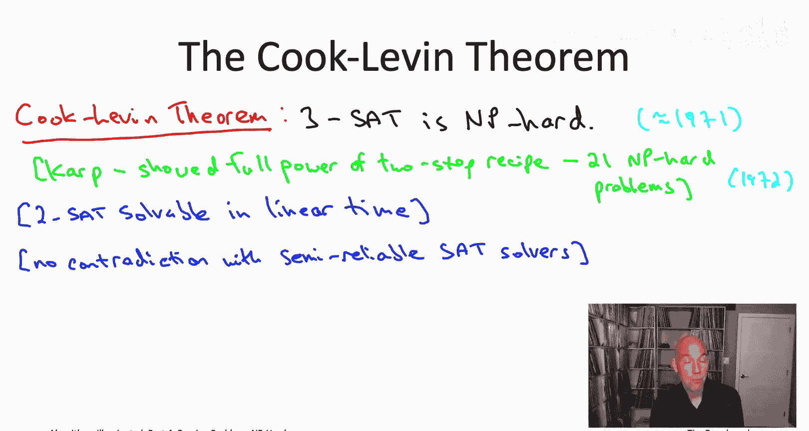
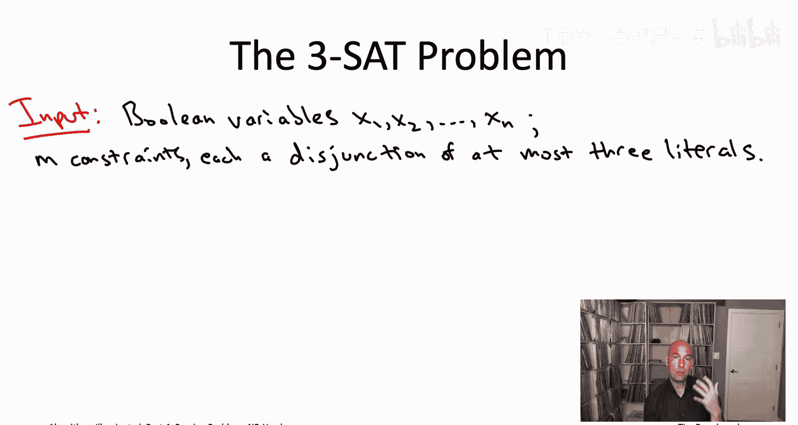
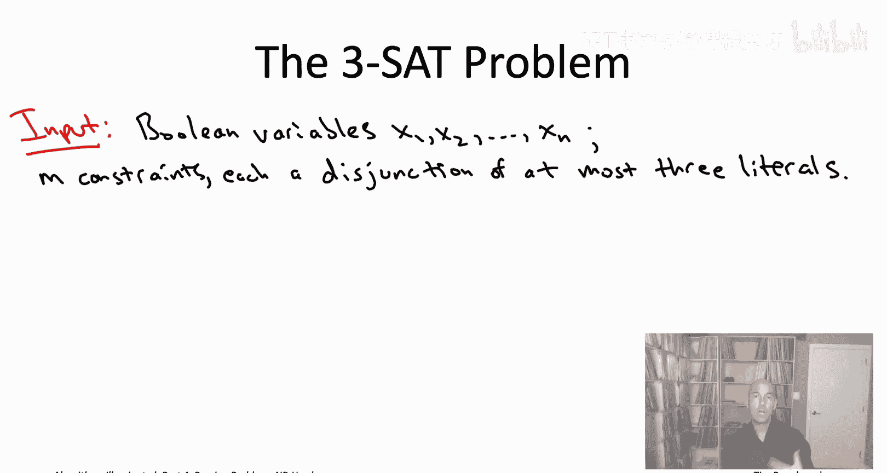
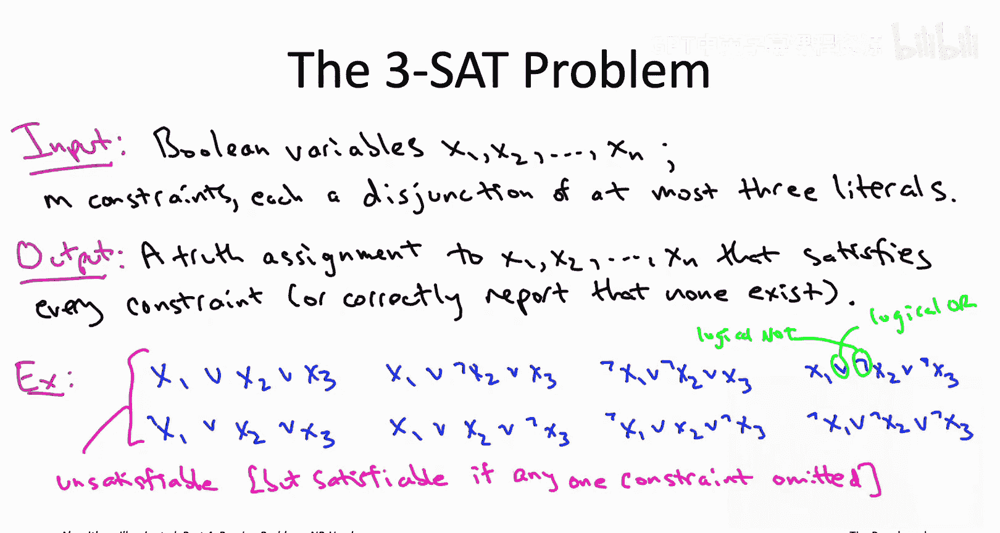

# 算法启蒙（第4册）：NP难｜Part 4 Algorithms for NP-Hard Problems：22.2：3-SAT与库克-列文定理 🧩

在本节课中，我们将学习3-SAT问题以及计算机科学中一个极其重要的定理——库克-列文定理。该定理首次证明了一个问题是NP难的，为后续通过归约证明其他问题的NP难性奠定了基础。

## 库克-列文定理的提出与意义

上一节我们介绍了证明问题NP难性的两步法。如果反复应用这个方法，你将积累成千上万个NP难问题。但这个过程最初是如何开始的？第一个NP难问题从何而来？答案来自计算机科学中最著名和最重要的成果之一：库克-列文定理。

库克-列文定理的形式化陈述很简单：看似无害的3-SAT问题（即每个析取子句中最多包含三个文字的可满足性问题）实际上是一个NP难问题。

这个定理由斯蒂芬·库克和列昂尼德·列文独立证明。他们大约在1971年分别于多伦多和莫斯科完成了证明。由于历史原因，列文的工作在西方被广泛认知较晚，因此早期教科书常称之为“库克定理”，但两人都应获得荣誉。

他们不仅证明了3-SAT是NP难的，还暗示了可能有许多其他问题也是NP难的。这个预言在1972年由理查德·卡普实现，他直接受到库克工作的启发。卡普通过反复应用我们讨论过的两步法，展示了NP难性的全部威力。

以下是关于证明者及其贡献的要点：
*   卡普最初的21个NP难问题列表，包含了本章将讨论的许多问题，这清楚地表明NP难性是阻碍许多不同领域（如旅行商问题）在众多著名问题上取得进展的根本障碍。
*   库克和卡普分别于1982年和1985年获得了ACM图灵奖（计算机科学领域的最高荣誉，相当于诺贝尔奖）。
*   列文的工作后来才得到充分认可，他于2012年获得了克努特奖。

## 为什么是“3”-SAT？

你可能会好奇“3-SAT”中的“3”从何而来。该问题定义为每个析取子句中最多包含三个文字。选择“3”的原因是，这是使该问题成为NP难的最小数字。

相比之下，2-SAT问题（每个子句最多包含两个文字）实际上可以在线性时间内解决。有几种方法可以做到，其中一种是通过归约到计算某个有向图的强连通分量问题。

## SAT求解器与库克-列文定理的关系

在之前的视频中，我们在SAT求解器的背景下讨论过可满足性问题。SAT求解器是半可靠的“魔法黑盒”，在实践中确实能成功解决一些SAT问题。

需要明确的是，SAT求解器的半可靠性与库克-列文定理并不矛盾。库克-列文定理指出，你不可能拥有一个保证快速且正确的算法来解决3-SAT问题。而SAT求解器提供的并非保证正确且快速的算法，它们提供的是有时正确且快速的算法，这并非同一回事。

## 本章的立足点与证明思路

在本章中，我们不会深究库克-列文定理为何成立，也不会探讨其证明细节，我们将直接接受它作为已知事实。

我们的计划是站在这些巨人的肩膀上，假设3-SAT是一个NP难问题，然后通过归约生成另外18个NP难问题。如果你好奇如何像库克-列文定理那样从头开始证明一个问题的NP难性，我们将在下一章（第23章）对应的视频中讨论证明背后的高层次思路。我认为这个证明值得至少了解一次，但几乎没有人记得库克-列文定理的具体细节。大多数计算机科学家满足于作为该定理的“受教育用户”，像我们在本章中一样，将其与其他NP难问题一起用作工具，来证明你所关心的问题是NP难的。

## 3-SAT问题的精确定义

为了结束本视频，让我们确保所有人都完全清楚3-SAT问题到底是什么。如果你看过之前关于SAT求解器的视频，这里不会有新内容，但如果你没看过，我希望确保你确切知道我们在讨论什么问题。

3-SAT问题的输入由变量和约束组成，两者形式都非常简单。

所有决策变量都必须是布尔变量，因此它们只能取真或假值。给定n个布尔变量的集合，总共就有 `2^n` 种可能的真值赋值（即每个变量赋值为真或假的可能组合）。

我们将处理的唯一约束是文字的析取。一个文字要么是一个决策变量 `Xi`，要么是其否定 `¬Xi`。

析取就是逻辑或运算。`A ∨ B` 为真，当且仅当A为真，或B为真，或两者都为真。

在我们讨论SAT求解器时，我们允许文字的析取包含任意数量的文字。对于3-SAT问题，它是特殊情况，我们限制每个约束最多包含三个文字。

目标正如你所料：在这 `2^n` 种可能的真值赋值中，我们想知道是否存在任何一种赋值能同时满足所有约束（所有最多包含三个文字的析取子句）。如果没有这样的赋值，我们希望算法报告这一事实；如果存在满足的真值赋值，我们希望算法能直接返回一个给我们。

例如，考虑以下八个约束。需要明确一下符号：出现在每对文字之间的 `∨` 代表逻辑或，这正是析取的含义。而出现在变量前面的倒L符号 `¬` 表示否定。因此，在右上角的约束中，有 `¬x2` 和 `¬x3`。

如果输入是这三个变量 `x1, x2, x3` 以及这八个子句（每个包含三个文字），那么这将是一个不可满足的3-SAT实例。确实不存在满足的真值赋值。对于三个布尔变量，有八种可能的真值赋值，而这八个约束中的每一个恰好排除了那八种可能赋值中的一种。所以没有赋值剩下，因此它是不可满足的。

另一方面，如果我们删除这八个约束中的任何一个，我们将得到一个可满足的3-SAT实例，因为那样只会禁止七个对三个变量的赋值，还会剩下一个满足的赋值。

通常，当存在一个真值赋值满足所有约束时，我们称该实例为**可满足的**，否则称之为**不可满足的**。

## 总结

本节课中我们一起学习了库克-列文定理，它给出了我们的第一个NP难问题：**3-SAT是NP难的**。基于这个事实，通过归约，我们将把NP难性传播到其他18个问题。在下一个视频中，让我们来具体了解所有这些问题和归约将是怎样的。