# 算法启蒙（第4册）：NP难｜Part 4 Algorithms for NP-Hard Problems：22.5：有向哈密顿路径问题是NP难的 🧩

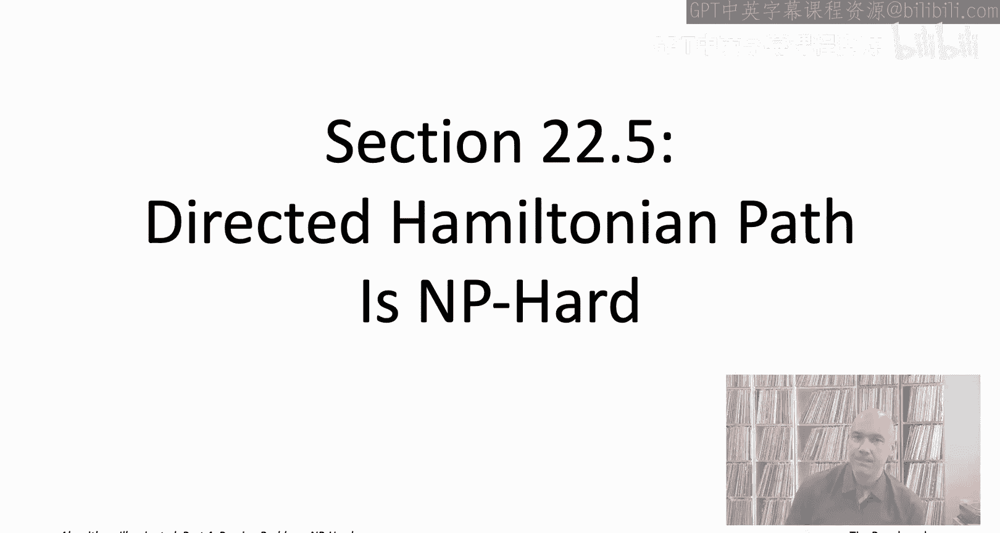

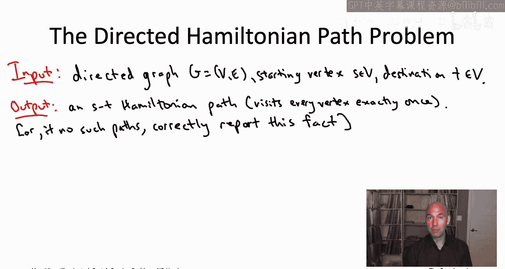

在本节课中，我们将学习如何将一个已知的NP难问题（3SAT）归约到有向哈密顿路径问题，从而证明后者也是NP难的。我们将详细讲解归约的构造过程、工作原理以及正确性证明。

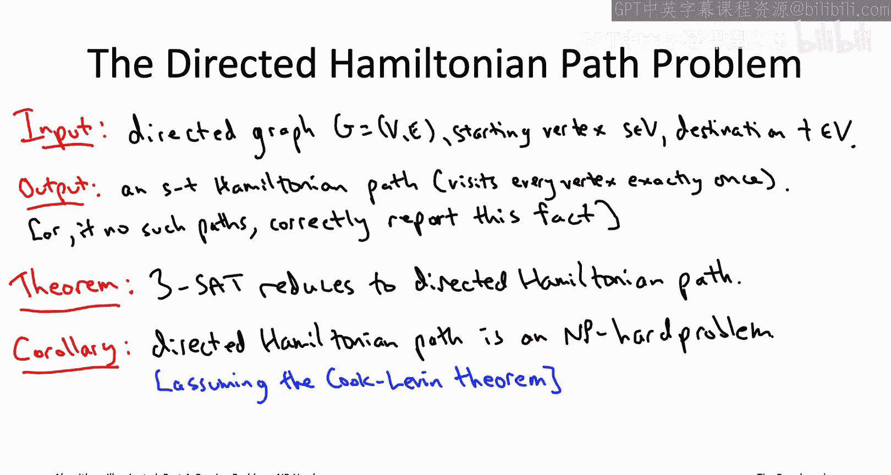

---

## 概述

我们将从3SAT问题出发，构造一个有向图。这个构造的核心思想是：利用图中的“钻石”结构序列来编码对布尔变量的赋值，并通过添加额外的“约束顶点”来确保只有满足所有子句的赋值才能对应图中的哈密顿路径。通过这种构造，我们将证明，原始3SAT实例是可满足的，当且仅当构造出的有向图存在一条从起点S到终点T的哈密顿路径。

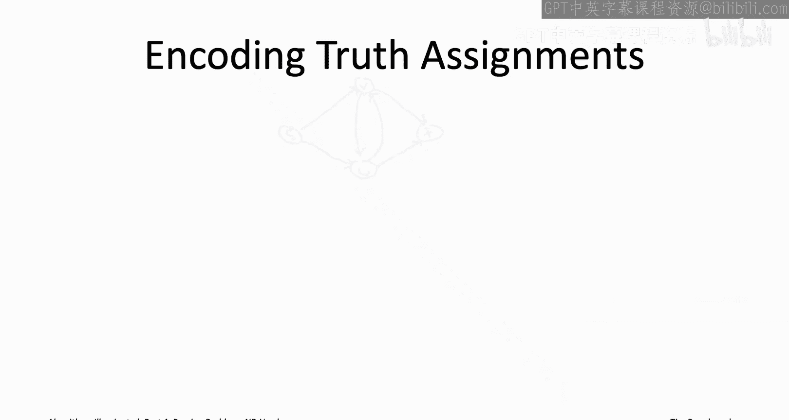

---

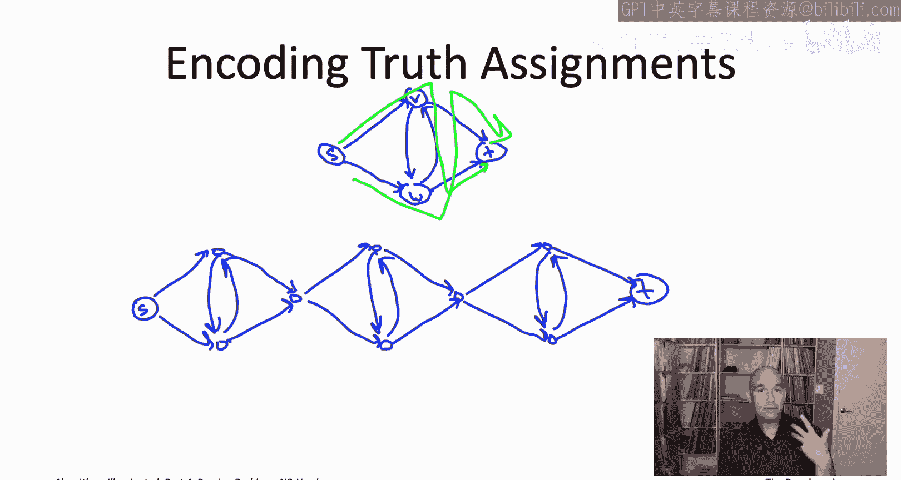

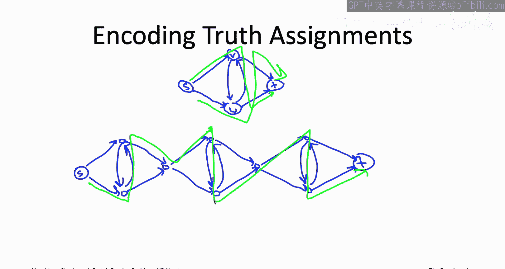

## 问题定义

首先，让我们明确两个问题的定义。

### 3SAT问题
*   **输入**：一个包含n个布尔变量和m个子句的布尔公式，每个子句是三个文字（变量或其否定）的析取（`OR`）。
*   **输出**：一个满足所有子句的变量赋值（如果存在），否则报告“不可满足”。

### 有向哈密顿路径问题
*   **输入**：一个有向图 `G=(V, E)` 以及两个指定的顶点 `s`（起点）和 `t`（终点）。
*   **输出**：一条从 `s` 到 `t` 的路径，该路径恰好访问图中的每个顶点一次（即一条 `s-t` 哈密顿路径），或者报告这样的路径不存在。

我们的目标是展示：**如果存在一个解决有向哈密顿路径问题的“黑盒”算法，那么我们就可以利用它来解决3SAT问题**。

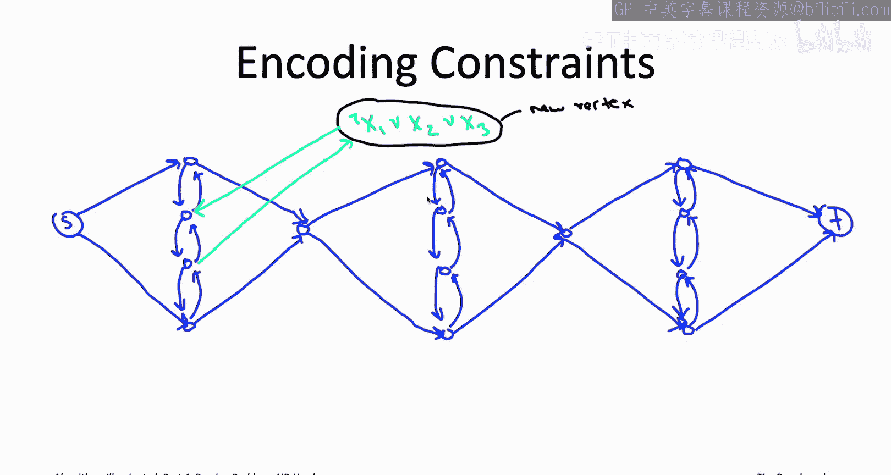

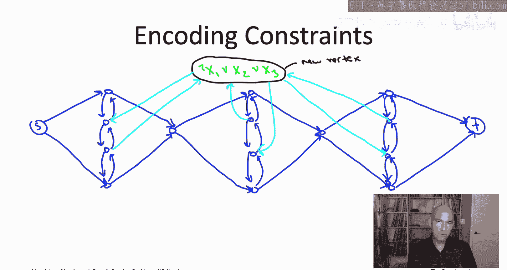

---

## 归约构造思路

上一节我们介绍了归约的基本概念。本节中，我们来看看如何具体地将一个3SAT实例转化为一个有向图实例。

归约的核心是构造一个特殊的有向图。这个图的主体由一串“钻石”单元连接而成，每个钻石对应一个布尔变量。哈密顿路径在遍历每个钻石时，必须选择“向上”或“向下”走，这个选择将被解释为对相应变量的赋值（例如，向下=`True`，向上=`False`）。

然而，仅仅编码赋值是不够的，我们还需要强制路径对应的赋值满足所有子句。为此，我们将为每个子句添加一个“约束顶点”。通过精心设计从钻石内部到约束顶点的边，我们确保：**只有当路径在某个钻石中选择了满足该子句所要求的方向时，它才能“绕道”访问对应的约束顶点，并顺利返回原路径**。这样，一条能够访问所有顶点（包括所有约束顶点）的哈密顿路径，必然对应一个满足所有子句的赋值。

---

## 构造详解

以下是构造有向图 `G` 的具体步骤。

### 1. 创建变量钻石链
对于3SAT实例中的每个变量 `x_i`（共n个），我们创建一个钻石结构。这些钻石从左到右连接，形成一个“项链”。第一个钻石的左顶点是起点 `s`，最后一个钻石的右顶点是终点 `t`。
每个钻石有两条内部路径：一条“向上”路径，一条“向下”路径。我们将每条内部路径细分为 `2m + 1` 段，从而引入 `2m` 个内部顶点。这些顶点将被用于连接约束顶点。

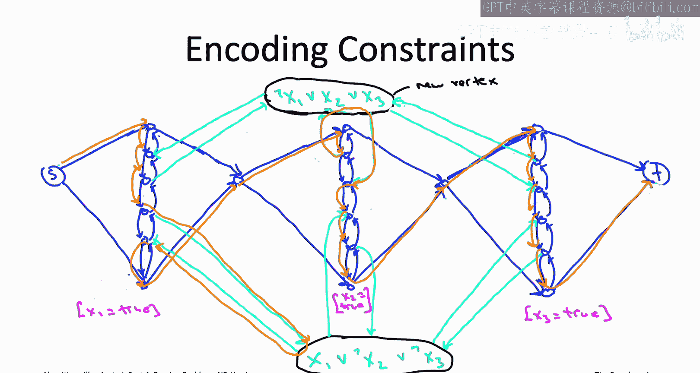

**公式化描述**：
*   总钻石数：`n`
*   每个钻石内部路径上的顶点数：`2m`（为约束预留）
*   起点 `s` 和终点 `t` 各一个顶点。
*   每个钻石除内部路径外，还有顶部、底部和左右连接点，共约 `3` 个顶点。
*   约束顶点数：`m`
*   图 `G` 的总顶点数约为 `2n*m + m + 3n + 2`。

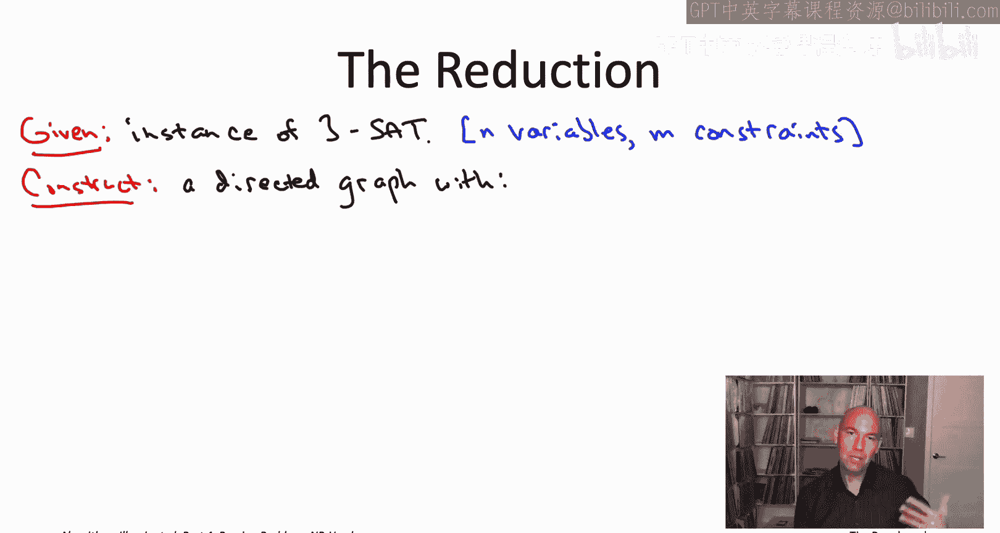

### 2. 添加约束顶点及边
对于第 `j` 个子句（共m个），我们添加一个约束顶点 `C_j`。
对于子句中的每个文字（例如 `x_i` 或 `¬x_i`）：
*   如果文字是 `x_i`（要求 `x_i = True`），则在第 `i` 个钻石的“向下”路径上，选择预留給第 `j` 对约束的**上方顶点**，添加一条边**从该顶点指向 `C_j`**，并添加另一条边**从 `C_j` 指向该对的下方顶点**。
*   如果文字是 `¬x_i`（要求 `x_i = False`），则在第 `i` 个钻石的“向上”路径上，选择预留給第 `j` 对约束的**下方顶点**，添加一条边**从该顶点指向 `C_j`**，并添加另一条边**从 `C_j` 指向该对的上方顶点**。

这样设计的目的是：只有当哈密顿路径按照子句要求的方向（`True`对应向下，`False`对应向上）遍历对应的钻石时，它才有可能在途中“绕道” `C_j` 顶点并返回，而不重复或遗漏任何顶点。

---

## 归约的执行过程

基于上述构造，我们可以描述整个归约算法：

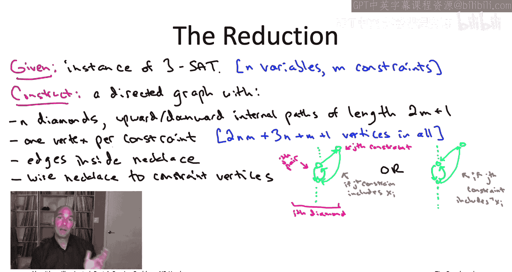

1.  **输入**：一个3SAT公式 `φ`，包含n个变量和m个子句。
2.  **构造**：根据 `φ`，按照上述步骤构造有向图 `G`，并指定起点 `s` 和终点 `t`。
3.  **调用子程序**：将 `(G, s, t)` 输入到假定的“有向哈密顿路径问题”求解算法（黑盒）中。
4.  **输出转换**：
    *   **情况A**：如果黑盒返回一条 `s-t` 哈密顿路径 `P`，则根据 `P` 遍历每个钻石的方向（上/下）提取出一个变量赋值 `A`。将此赋值 `A` 作为3SAT的解返回。
    *   **情况B**：如果黑盒报告不存在 `s-t` 哈密顿路径，则报告3SAT公式 `φ` 不可满足。

---

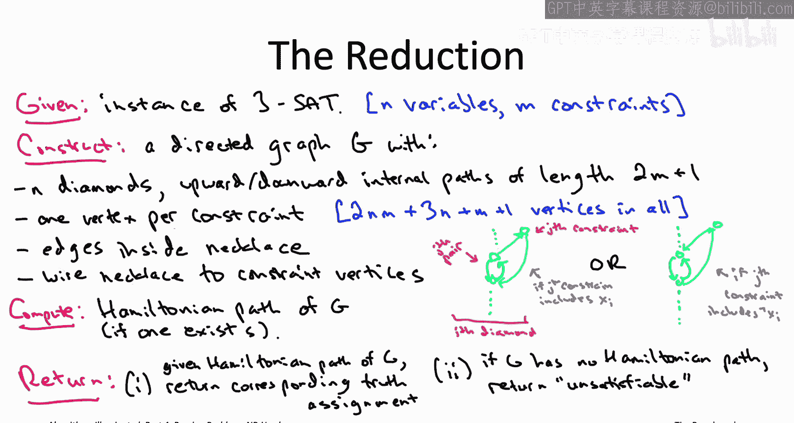

## 正确性证明

我们需要证明这个归约是正确的：即原始3SAT实例 `φ` 是可满足的，当且仅当构造的图 `G` 存在一条 `s-t` 哈密顿路径。

### 关键观察
1.  任何 `G` 中的哈密顿路径都必须按顺序遍历所有钻石。
2.  在遍历每个钻石时，路径必须完整地走完一条内部路径（全部向上或全部向下），不能混合。
3.  路径只能在遍历某个钻石的内部路径时，“绕道”访问一个约束顶点并立即返回，不能从约束顶点跳到其他钻石。
4.  根据边的构造方式，只有当路径在钻石 `i` 中选择了满足子句 `j` 所要求的方向时，才有可能从该钻石访问约束顶点 `C_j`。

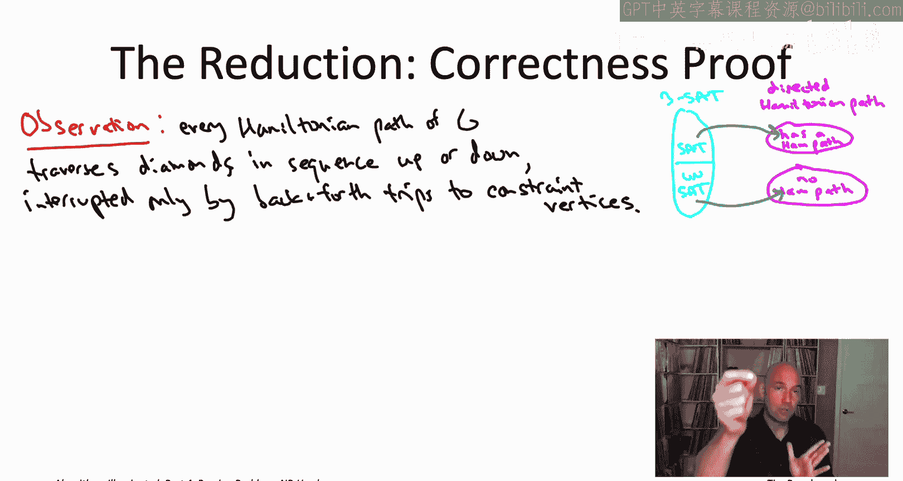

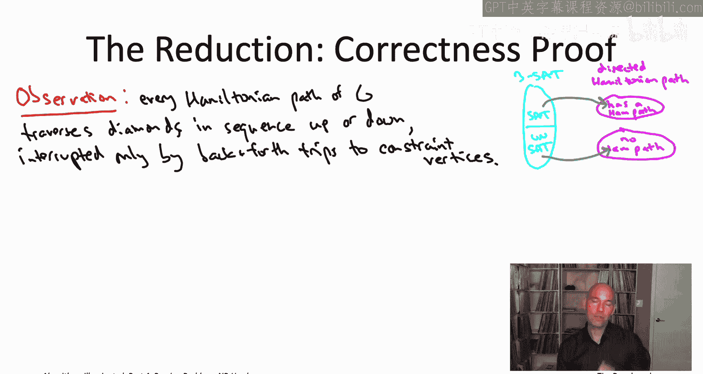

### 证明（⇒）如果 `φ` 可满足，则 `G` 有哈密顿路径。
设 `A` 是 `φ` 的一个满足赋值。我们可以构造一条哈密顿路径 `P`：
*   `P` 从 `s` 开始。
*   对于每个变量 `x_i`，如果 `A(x_i) = True`，则 `P` 在钻石 `i` 中走**向下**路径；如果为 `False`，则走**向上**路径。
*   对于每个子句 `C_j`，由于 `A` 满足它，至少有一个文字被满足。选择第一个这样的文字对应的钻石 `i`。当 `P` 遍历到钻石 `i` 中预留給约束 `j` 的那对顶点时，让它绕道访问顶点 `C_j` 并返回，然后继续完成钻石 `i` 的遍历。
*   `P` 最终到达 `t`。
容易验证，`P` 恰好访问每个顶点一次，是一条哈密顿路径。

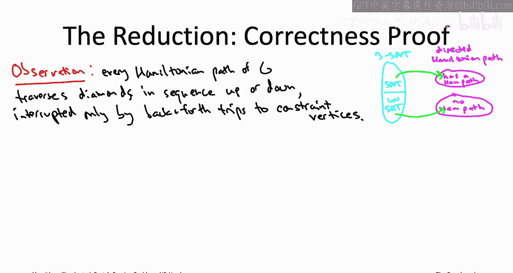

### 证明（⇐）如果 `G` 有哈密顿路径，则 `φ` 可满足。
设 `P` 是 `G` 中的一条 `s-t` 哈密顿路径。
1.  根据观察1和2，`P` 定义了一个对每个变量的赋值 `A`（向下=`True`，向上=`False`）。
2.  `P` 必须访问所有约束顶点 `C_j`。根据观察3和4，`P` 访问某个 `C_j` 的唯一方式是，当它遍历某个钻石 `i` 时，其方向恰好满足了子句 `C_j` 中对变量 `x_i` 的要求。
3.  因此，对于每个子句 `C_j`，赋值 `A` 都至少满足其中一个文字。这意味着 `A` 满足整个公式 `φ`。

综上，归约是正确的。

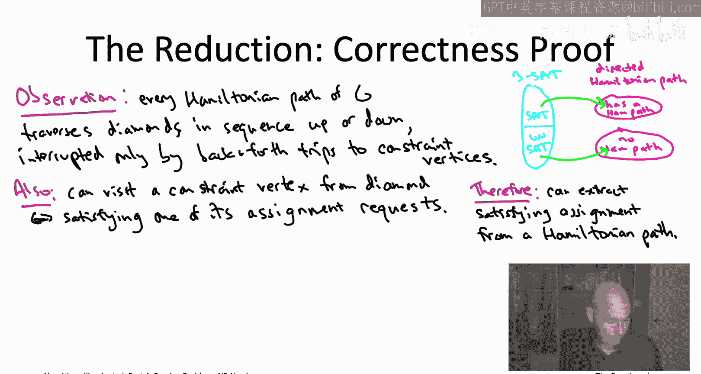

---

## 总结

本节课中我们一起学习了如何将3SAT问题归约到有向哈密顿路径问题。
1.  我们首先回顾了3SAT和有向哈密顿路径问题的定义。
2.  然后，我们详细阐述了归约的构造思想：用钻石链编码变量赋值，用约束顶点强制满足子句。
3.  接着，我们逐步讲解了如何具体构造对应的有向图 `G`，包括创建钻石、细分路径以及添加约束边。
4.  最后，我们严格证明了归约的正确性，展示了 `φ` 可满足性与 `G` 存在哈密顿路径之间的等价关系。

由于3SAT是NP难的（由Cook-Levin定理保证），而我们的归约是多项式时间内完成的，因此我们得出结论：**有向哈密顿路径问题是NP难的**。这个结果为证明其他更复杂的问题（如下一讲将要介绍的旅行商问题）的NP难性奠定了基础。