# 算法启蒙（第4册）：23.1：积累计算难解性证据 🧩

在本节课中，我们将学习如何为一个计算问题（例如旅行商问题）的难解性积累证据。核心思想是，通过证明大量其他问题都能“归约”到该问题，从而表明如果该问题存在多项式时间算法，那么所有这些问题也都能被高效解决。这反过来为该问题的内在难解性提供了强有力的证据。

---

## 从旅行商问题说起

上一节我们介绍了NP难问题的概念及其算法意义。本节中，我们来看看如何为一个具体问题（如旅行商问题）的难解性构建坚实的证据。

考虑旅行商问题（TSP）。早在1967年，Jack Edmonds就猜想不存在解决TSP的多项式时间算法。时至今日，我们仍不知道这个猜想是否正确。如果我们要采纳“TSP是难解的”这一工作假设，该如何为此积累证据呢？

许多杰出的研究者在过去70年里尝试并失败，这固然是间接证据。但我们能否做得更好，积累更强的证据呢？


---

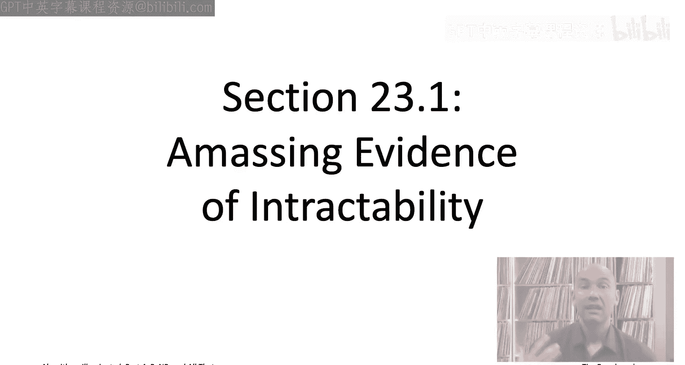

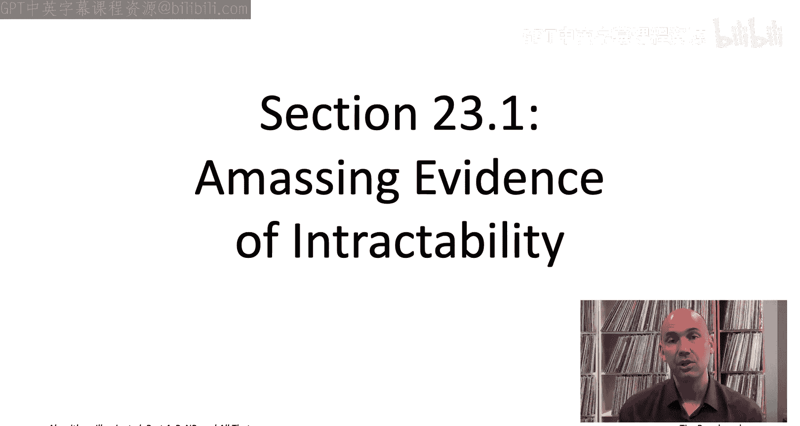

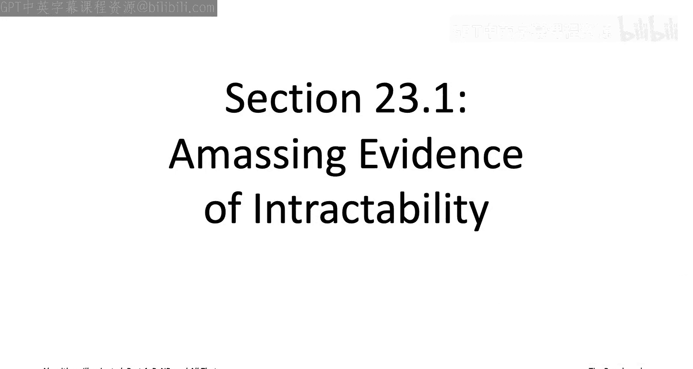

## 核心策略：大规模归约

关键思想在于证明：一个针对TSP的多项式时间算法，不仅能解决TSP这一个未解问题，还能自动解决**成千上万**个其他未解问题。

我们可以通过以下两步为TSP的难解性积累证据：
1.  首先，确定一个庞大的计算问题集合，我们称之为集合 **C**。
2.  其次，证明集合 **C** 中的**每一个**问题都能归约到旅行商问题。


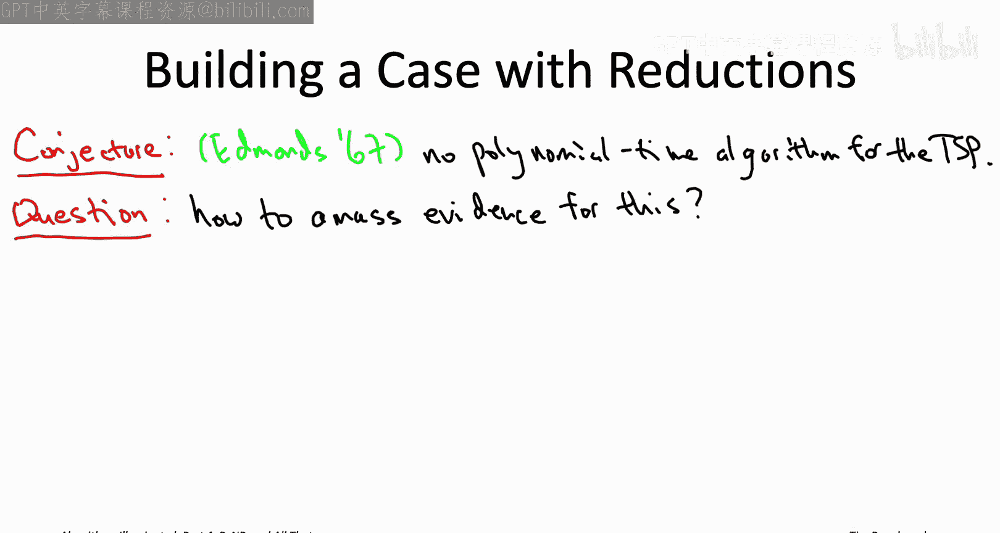

这样，一个针对TSP的多项式时间算法，就能自动转化为解决集合 **C** 中所有问题的算法。反之，如果集合 **C** 中哪怕只有一个问题是难解的（即不存在多项式时间算法），也足以证明TSP同样是难解的。


**注意**：集合 **C** 越大，即你能归约到TSP的问题越多，你为TSP难解性构建的证据就越强。因此，我们希望 **C** 尽可能大。

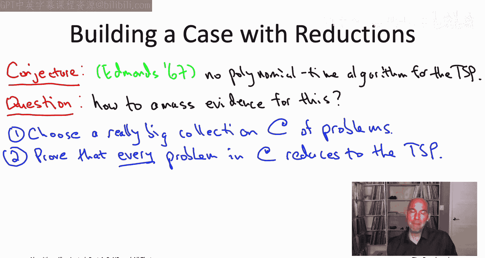

---

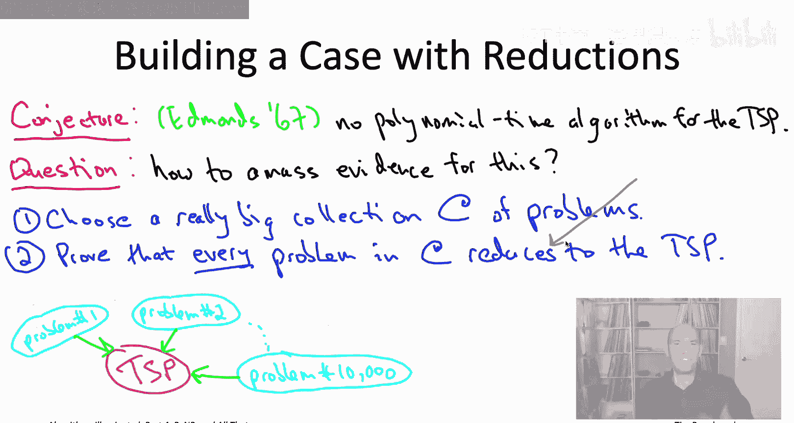

## 归约的定义

我们一直并将继续使用以下定义：如果问题A能通过**仅调用多项式次**解决问题B的子程序，外加**多项式量级**的额外计算工作来解决，那么问题A就**归约**到问题B。

用公式表示，若存在多项式时间算法，使得：
```
解决A的算法 = 多项式次调用“解决B的黑盒” + 多项式时间的额外计算
```
则称 **A ≤ₚ B**。

这种归约专门用于我们的目的（关注算法意义），它能将计算可行性从一个问题传递到另一个问题，反之亦然，也能传递计算难解性。这类归约有一个特定名称：**库克归约**（Cook Reduction），也称为多项式时间图灵归约。

---


## 选择归约集合的挑战

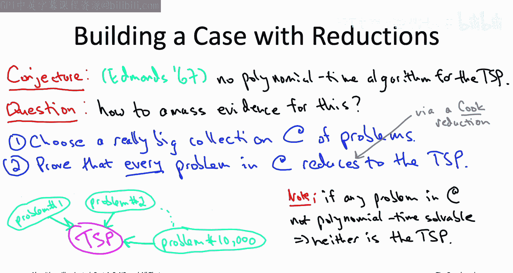

我们是否应该选择所有计算问题作为集合 **C** 呢？这过于雄心勃勃。尽管TSP很难，但世界上存在比TSP**困难得多**的计算问题，它们不可能归约到TSP。

有些问题甚至是**不可判定**的，这意味着无论给予多少时间，计算机都无法解决它们。最著名的例子是**停机问题**：给定一段程序（例如一千行Python代码），判断它最终会停止还是陷入无限循环。艾伦·图灵在1936年证明，不存在解决一般性停机问题的有限时间算法。

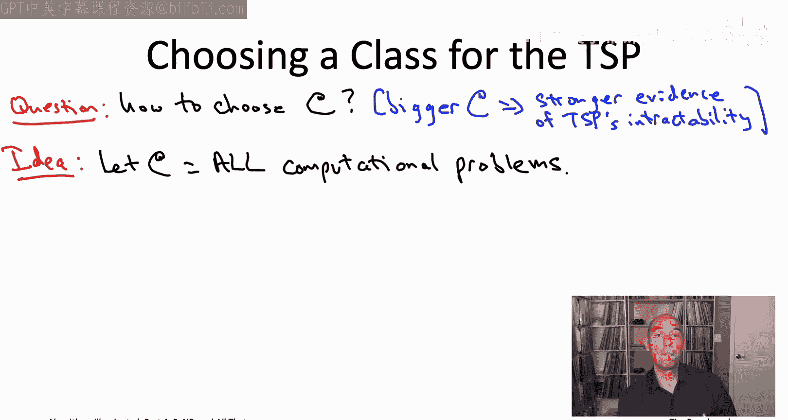


图灵1936年的论文之所以重要，有两点原因：
1.  他引入了**图灵机**这一形式化数学模型，定义了计算机能做什么。
2.  通过定义计算机的能力，他得以研究其局限性，并精确证明了计算机无法解决停机问题。

因此，从计算机科学诞生的第一天起，我们就深刻认识到计算机的局限性和解决困难计算问题时妥协的必要性。

---

## 重新思考集合 C


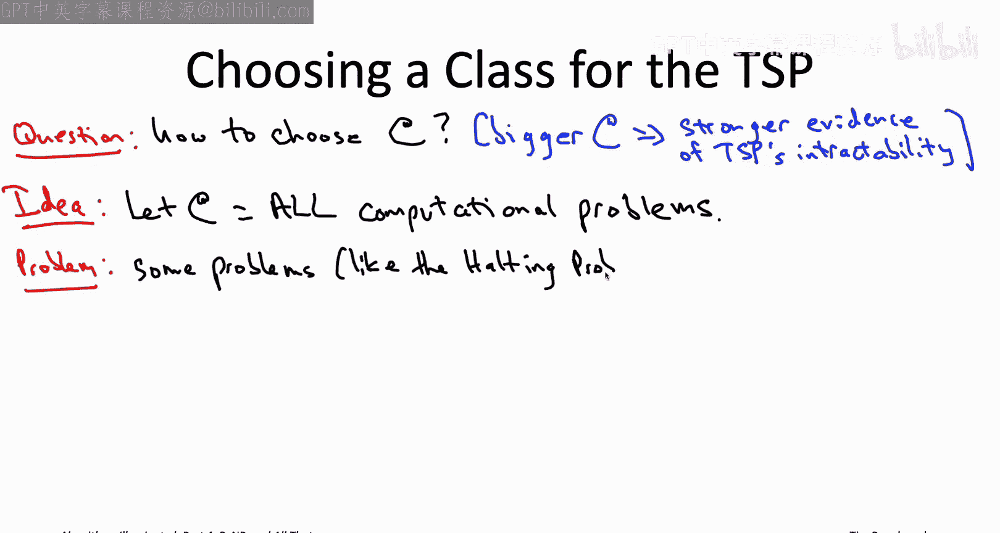

经过关于停机问题的讨论，TSP似乎不再那么“糟糕”了。我们虽然不知道如何在多项式时间内解决TSP，但肯定知道如何在有限（尽管是指数级）时间内通过穷举搜索解决它。这意味着停机问题**不可能**归约到TSP，因为如果存在这样的归约，将产生一个解决停机问题的有限算法，而这已被证明不存在。


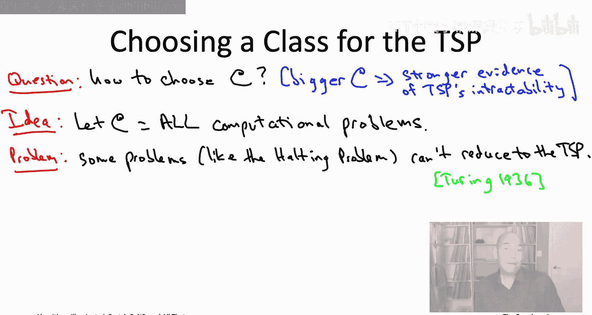

让我们回到绘图板：必须确定要将哪些问题归约到TSP。我们希望集合 **C** 尽可能大，但现在已经明白不能包含所有问题。

如果限制TSP无法涵盖像停机问题这类问题的原因，在于TSP本身可以通过朴素的穷举搜索解决，那么我们或许至少可以将集合 **C** 定义为**所有同样能通过朴素穷举搜索很好解决的问题**。这些是可能合理归约到TSP的问题。

这听起来合理，但“所有同样能通过朴素穷举搜索很好解决的问题”在数学上究竟意味着什么？我们能否给出一个形式化的数学定义？

答案是肯定的。在下一个视频中，我们将开始为这个形式化的数学定义奠定基础。


---

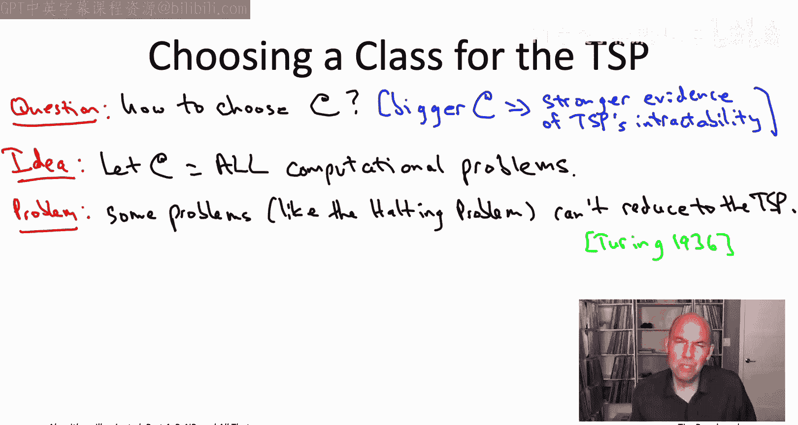

## 本节总结


本节课中，我们一起学习了如何为计算问题的难解性积累证据：
*   核心策略是证明一个庞大的问题集合 **C** 都能归约到目标问题（如TSP）。
*   我们回顾了**库克归约**的正式定义。
*   我们认识到集合 **C** 不能包含所有问题，特别是那些**不可判定**的问题（如停机问题）。
*   因此，合理的思路是将 **C** 定义为在某种意义下与TSP“难度相当”的问题集合，即那些可能通过类似穷举搜索方式解决的问题。

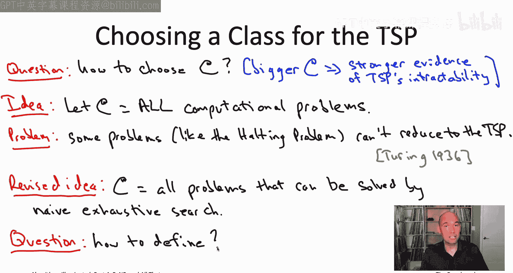


这为我们接下来形式化定义**NP类**和**NP难**概念做好了准备。