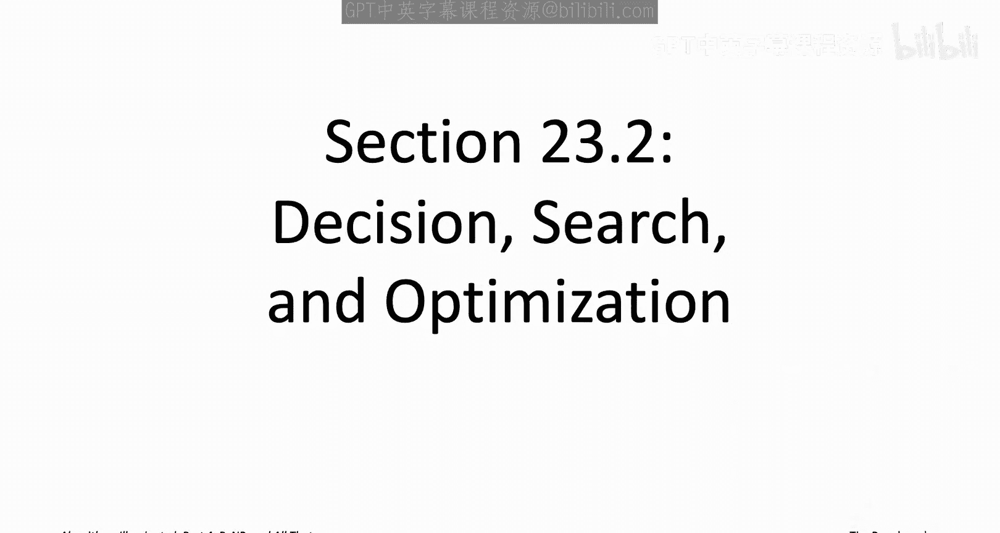
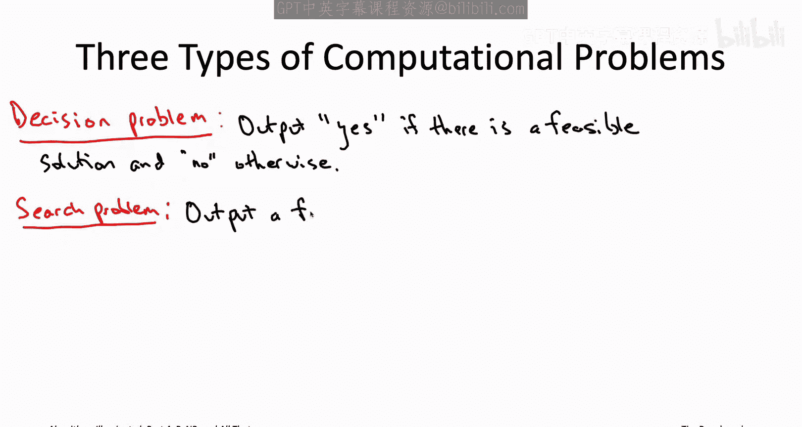
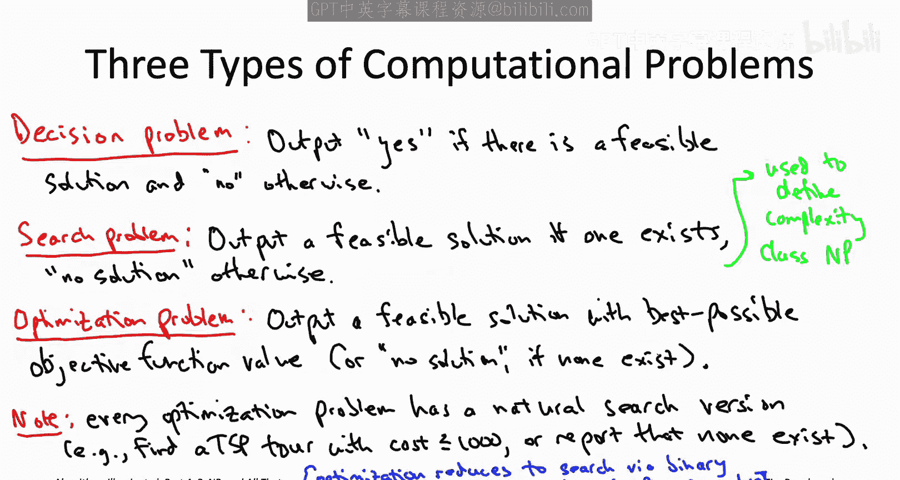

# 算法启蒙（第4册）：NP难｜Part 4 Algorithms for NP-Hard Problems：23.2：决策、搜索与优化问题 🧩

在本节中，我们将学习计算问题的三种主要类型：决策问题、搜索问题和优化问题。理解这些分类是正式定义NP复杂性类的基础。我们将探讨每种问题的特点、区别以及它们之间的相互联系。

---

## 三种计算问题类型 📝

在正式定义“可通过朴素穷举搜索解决的问题”（即NP类）之前，让我们先回顾并分类迄今为止所研究的计算问题的不同输入输出格式。

以下是三种不同类型的计算问题，它们似乎按复杂度递增的顺序排列。

### 1. 决策问题

决策问题是指算法仅需输出一个二元答案（是或否）的问题。

例如，3-SAT问题的决策版本。输入与往常一样，是一个3-SAT实例（即一组最多包含三个文字的析取子句）。对于决策版本，算法只需判断该实例是否可满足，并回答“是”（可满足）或“否”（不可满足）。决策版本不负责在解存在时实际生成一个满足赋值。

决策问题在构建计算复杂性理论时非常方便，但在实际应用中，它们是我们将要讨论的三种问题中最不常见的一种。通常，应用需要的是一个可行的解决方案，而不仅仅是知道它是否存在。

相应地，在整个视频系列中，我们只见过一个决策问题，那是在介绍证明问题为NP难的两步法时。在那个归约中，我们将有向哈密顿路径问题归约到了“无环最短路径问题”。如果你回顾那个归约，我们实际上使用的是有向哈密顿路径的决策版本。因此，算法仅根据图中是否存在哈密顿路径来输出“是”或“否”。

### 2. 搜索问题

接下来是搜索问题，这类问题在实际应用中确实会出现。

在这里，算法的职责是：给定一个实例，要么返回一个可行解，要么正确报告不存在可行解。我们在这个视频系列中已经见过几个搜索问题：SAT和3-SAT是典型版本，我给你一组文字的析取子句，你必须报告一个满足的真值赋值，或者正确报告不存在这样的赋值。图着色也是一个搜索问题，你需要展示一个K着色方案，或者正确报告它不可K着色。类似地，我们在前一章用于NP难归约的哈密顿路径版本也是搜索问题，要么报告一条哈密顿路径，要么正确报告不存在。子集和问题，现在想来，也是一个搜索问题。

### 3. 优化问题

我们在这个视频系列中讨论的大多数问题都是优化问题。

优化问题的算法不仅需要判断是否存在可行解，而且如果至少存在一个可行解，它还需要负责返回最好的那个。在优化问题中，你还需要指定一个要最大化或最小化的目标函数。算法需要在所有可行解中，返回一个具有最佳可能目标函数值的解。如果不存在可行解，算法应像往常一样正确报告这一事实。

我们一直在研究几个不同的优化问题，例如：旅行商问题（你想要一个最小成本的环游）、背包问题（你想要一个最大价值的可行解），以及类似的最小割、最大覆盖和影响力最大化问题。

所有三种类型的问题都涉及“可行解”的概念，其具体含义因问题而异。有时它对应于满足赋值，有时可能对应于哈密顿路径或旅行商环游等。对于优化问题，目标函数也是问题特定的，例如最小化总成本或最大化总价值等。

---

## 复杂性类与问题类型的关系 🔗

正如我们将在本章中讨论的，复杂性类通常只关注这三种类别中的一种问题，以避免类型检查错误。

因此，在下一个视频中正式定义复杂性类NP时，它将定义为一类搜索问题。我需要提醒你，大多数复杂性理论和算法书籍都根据决策问题而非搜索问题来定义复杂性类NP。他们这样做是因为这对于发展复杂性理论更为方便。我之所以不这样做，是因为决策问题与我们在这个视频系列中关注的自然算法问题距离更远。

不过，你其实不必担心这种区别。因为NP难度的所有算法含义，包括P是否不等于NP猜想是真是假，无论你根据决策问题还是搜索问题来定义复杂性类NP，所有这些都完全保持不变。

---

## 优化问题与搜索问题的转换 🔄

现在，你可能会担心，将复杂性类NP的定义限制在搜索问题上，会把像旅行商问题这样的优化问题排除在外，而这些显然是我们非常关心的问题。

但不用担心，优化问题有一个自然的搜索版本。例如，你可以通过以下方式将旅行商问题转化为搜索问题：输入除了像往常一样指定一个带边成本的图外，还指定一个目标函数值。因此，搜索问题可以是：例如，如果存在成本不超过1000的旅行商环游，请给我一个；否则，正确报告不存在质量如此高的环游。或者在背包问题中，你可以说：给我返回一个总价值至少为10,000的物品集合，或者正确报告不存在这样的物品子集。

一般来说，你可以通过指定目标函数值T，并询问是否存在目标函数值至少与T一样好的可行解，从而将优化问题转化为搜索问题。

优化问题的搜索版本只会更容易。如果你能解决优化问题，你当然能解决它的搜索版本。但实际上，也存在相反方向的归约。例如，对于旅行商问题，如果我给你一个能高效解决搜索版本的黑盒子子程序，该程序以TSP实例和目标环游成本作为输入，要么返回一个成本不超过目标的环游，要么正确报告不存在这样的环游，那么我可以在一个循环中反复使用这个子程序，对目标函数值T进行二分搜索，从而计算出最小成本的旅行商环游。因此，给定一个能解决搜索版本的黑盒子，我实际上也能解决优化问题。

当然，这通常不是你在实践中处理优化问题的方式。一般来说，对于优化问题，你会希望像我们在本书系列中一直做的那样直接解决它。但仅就本章的目的而言，我们只是试图弄清楚哪些问题是多项式时间可解的，哪些似乎不是，因此没有理由区分搜索版本和优化版本。其中一个多项式时间可解当且仅当另一个也是；类似地，其中一个NP难当且仅当另一个也是。

---

## 总结 📚

在本节课中，我们一起学习了计算问题的三种主要类型：决策问题、搜索问题和优化问题。我们明确了它们的定义、区别以及在实际应用和理论分析中的角色。特别地，我们了解到优化问题可以自然地转化为等价的搜索问题，并且对于判断计算复杂性的目的，这两者在多项式时间可解性和NP难度上是等价的。有了这些预备知识，现在我们知道当前的重点将完全放在搜索问题上，我们已准备好在下个视频中正式定义复杂性类NP。