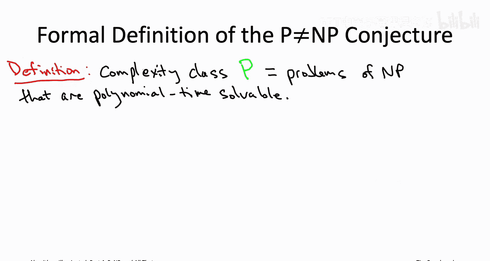
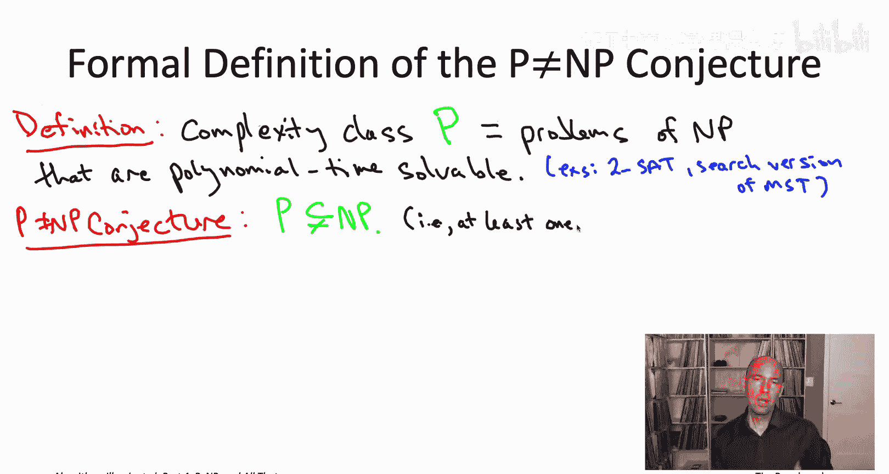
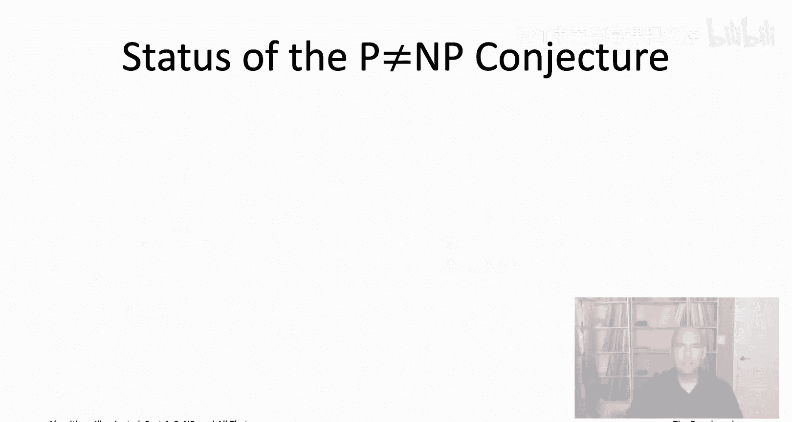
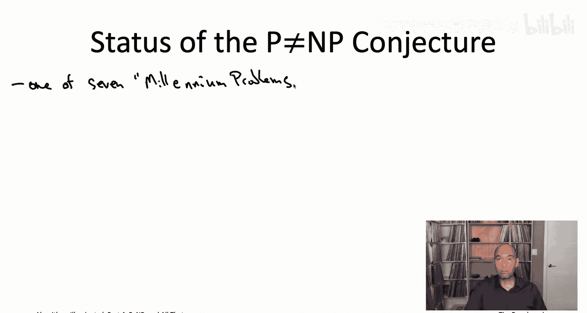
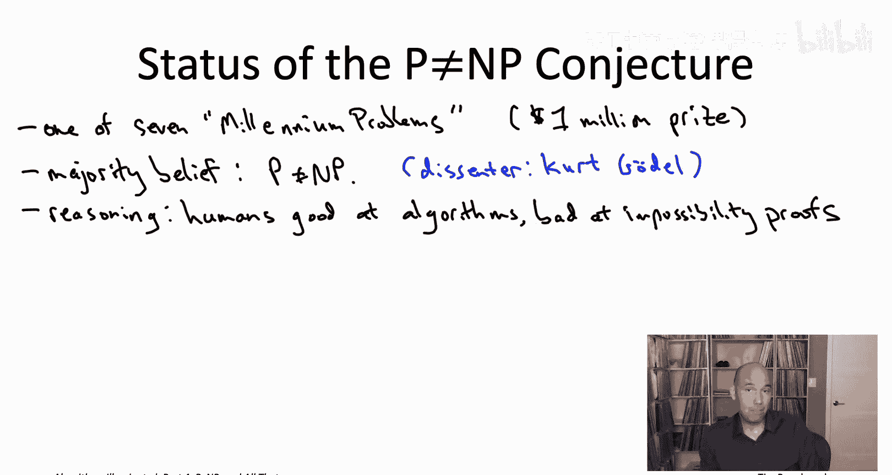
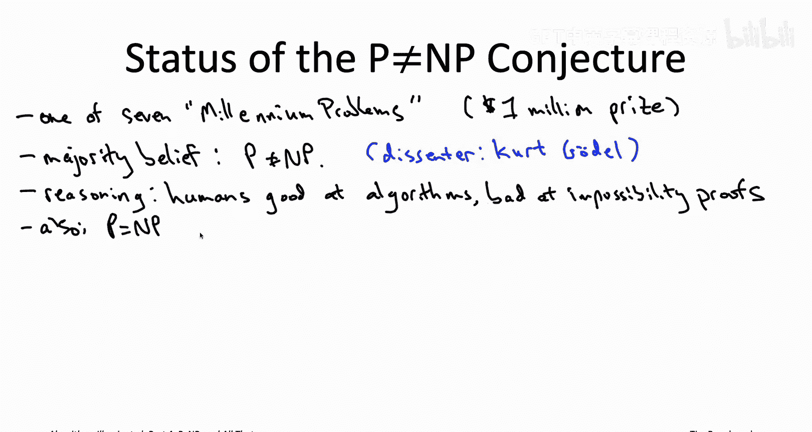
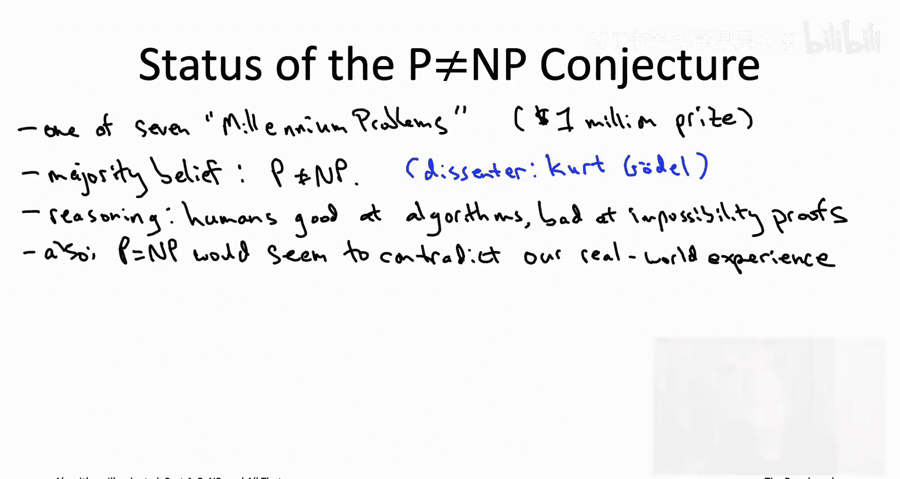
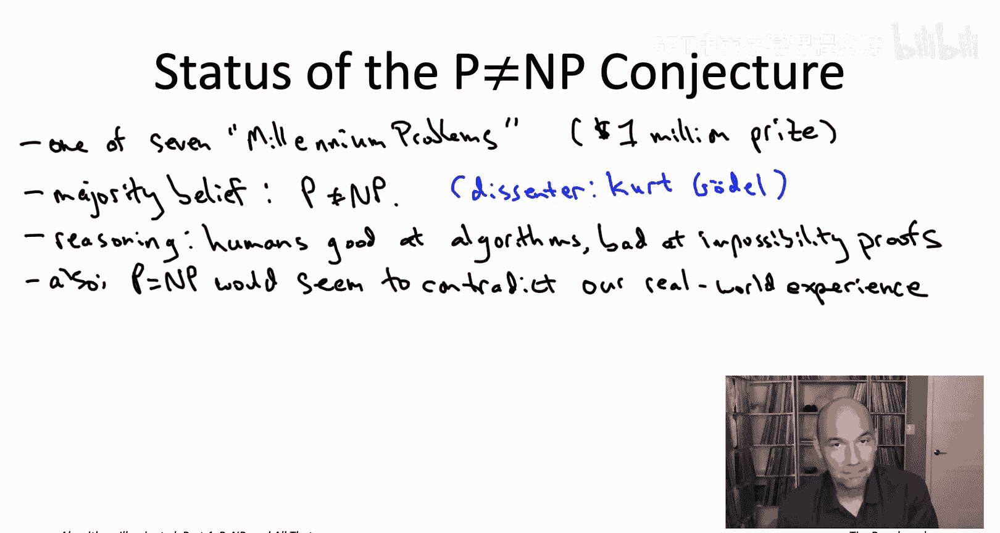
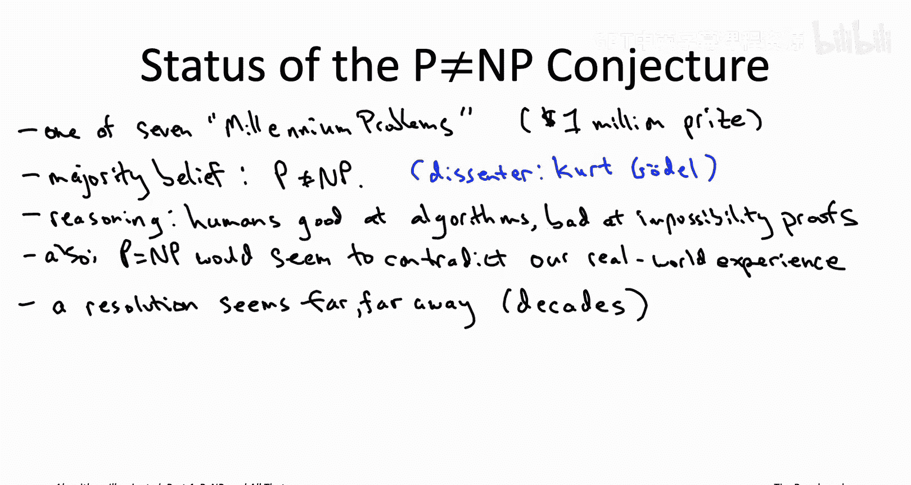
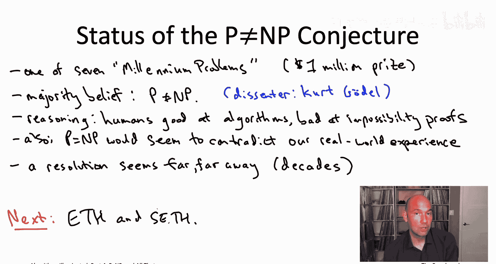

# 算法启蒙（第4册）：NP难｜Part 4 Algorithms for NP-Hard Problems：23.4：P != NP 猜想 🧩

在本节课中，我们将要学习计算机科学中最著名、最深奥的开放性问题之一：P 不等于 NP 猜想。我们将正式定义 P 类和 NP 类，并探讨这个猜想的意义、现状及其对计算世界可能产生的影响。

## P 与 NP 的正式定义

在之前的视频中，我们曾非正式地介绍过 P 不等于 NP 猜想。它意味着，**验证**一个计算任务的解决方案，可能比**从头开始寻找**一个解决方案要**根本性地容易**。现在，我们终于可以正式定义这个猜想了。

我们知道，在 P 不等于 NP 猜想中，NP 代表那些**具有高效可验证解**的搜索问题。那么，P 又代表什么呢？P 是 NP 的一个子集，特指那些**不仅解可高效验证，而且本身就能在多项式时间内被解决**的问题。

以下是 P 类问题的例子：
*   **2SAT问题**：每个约束条件是最多两个文字的析取。我们知道这个问题可以在多项式时间（甚至是线性时间）内解决，例如通过将其归约到计算有向图的强连通分量。
*   **最小生成树问题**：需要注意的是，P 和 NP 讨论的都是搜索问题。因此，严格来说，属于 P 类的是最小生成树问题的**搜索版本**，即给定一个图和一个目标值，找到一个总权重不超过该值的生成树。

所以，P 不等于 NP 猜想中的 P 和 NP 含义如下：
*   **NP**：所有具有高效可验证解的搜索问题。
*   **P**：NP 中那些可以在多项式时间内解决的子集。

## 猜想的内容与两种可能性

那么，这个猜想具体说了什么？它断言这两个集合**并不相同**。根据定义，P 是 NP 的子集。因此，该猜想等价于说这个包含关系是**严格的**。换句话说，猜想认为至少存在一个 NP 类中的问题（即解可高效验证），但**无法**在多项式时间内解决。

如下图所示，宇宙可能处于两种状态之一，我们尚不知道是哪一种。

**可能性一：P ≠ NP（猜想为真）**
如果 P 不等于 NP 猜想成立，那么情况就如左图所示。P 类（如 2SAT、最小生成树搜索问题）是 NP 类的一个**真子集**。这意味着存在一些像 3SAT 或旅行商问题搜索版本这样的“困难”问题，它们虽然解可高效验证，但无法在多项式时间内解决。

**可能性二：P = NP（猜想为假）**
如果 P 等于 NP，情况就如右图所示，两个集合完全重合。这意味着，只要一个问题的解可以高效验证（即属于 NP），那么它就**一定**能在多项式时间内被解决。在这种情况下，所有 NP 问题，包括 3SAT 和旅行商问题，都将变得容易解决。

## NP难问题的意义

上一节我们介绍了 P 与 NP 关系的两种可能性。本节中我们来看看，如果找到了某个 NP 难问题的多项式时间算法，意味着什么。

这里有一个精确的数学陈述：**如果你为任何一个 NP 难问题找到了多项式时间算法，那么你就否证了 P 不等于 NP 猜想。**

为什么？原因如下：
1.  假设你有一个 NP 难问题（例如旅行商问题 TSP）。
2.  根据定义，NP 难意味着 **NP 中的每一个问题**都可以归约到该问题。
3.  归约会传递可解性。因此，如果你对 TSP 有一个多项式时间算法，那么这个算法经过归约转换后，就能为 **NP 类中的所有问题**提供多项式时间解法。
4.  这恰恰意味着 **P = NP**，从而否证了 P ≠ NP 的猜想。

## 猜想的现状与重要性

现在，让我们来谈谈 P 不等于 NP 猜想的当前状况。这个猜想被公认为是计算机科学乃至整个数学领域最深奥的开放性问题之一。

例如，在 2000 年，克莱数学研究所提出了七个“千禧年大奖难题”，并为每个问题的解决者设立了一百万美元的奖金。P 与 NP 问题就是这七个问题之一。

截至本视频录制时（2020年），七个难题中只有一个被解决，即**庞加莱猜想**，它在 2006 年被格里戈里·佩雷尔曼证明。值得一提的是，佩雷尔曼后来拒绝了这笔奖金。

尽管无人确知猜想真假，但学界普遍持有一种观点：
*   **主流观点**：绝大多数（约 90% 以上）理论计算机科学家相信 **P ≠ NP**。

这种信念主要源于两点：
1.  **人类的算法设计经验**：人类似乎非常擅长为可高效解决的问题设计算法。如果像旅行商问题这样的难题真的存在高效算法，以人类迄今展现的算法设计智慧却仍未发现它，这令人惊讶。
2.  **与现实体验的契合**：我们的日常经验告诉我们，**检查**一个解决方案通常比**从头构思**一个方案要容易得多（例如解一个困难的数独）。如果 P = NP，则意味着解决难题所需的“创造力”可以被高效自动化，这与我们的直觉相悖。

## 如果 P = NP 会怎样？

那么，如果大家都错了，P 实际上等于 NP 呢？这一点其实有两种可能的情形，但讨论得并不充分：

**情形一：实用的多项式时间算法**
如果 NP 中的所有问题都能通过**实际可用的、快速的**算法解决，那将是一个影响极其深远、但可能性较低的场景。它意味着现代密码学的终结，因为基于大数分解、离散对数等难题的加密体系将被瞬间攻破。

**情形二：理论上的多项式时间算法**
另一种可能性稍高的场景是，存在一种**仅在理论上**满足多项式时间复杂性，但过于复杂或缓慢而**无法在现实世界中实现和使用**的算法。如果这样，P = NP 将几乎没有实际影响，只是表明“多项式时间可解”这个定义过于宽泛，未能准确捕捉我们真正关心的“在实际中可高效解决”这一概念。

## 总结与展望

本节课中，我们一起学习了 P 不等于 NP 猜想。我们正式定义了 P 类（多项式时间可解）和 NP 类（解可多项式时间验证），并理解了该猜想断言 P 是 NP 的真子集。我们探讨了猜想的两种可能性、NP 难问题与猜想的关系，以及学界的主流观点。最后，我们还分析了如果 P = NP 可能出现的不同场景。

从历史来看，1956 年哥德尔曾推测过相当于 P = NP 的观点，而 1967 年埃德蒙兹则提出了相当于 P ≠ NP 的猜想。谁是对的呢？随着时间推移，尽管研究方法不断丰富，但解决这个猜想的希望似乎反而变得更加渺茫。我们必须做好准备，这个问题的答案可能在未来很长一段时间内——数年、数十年，甚至更久——都不会揭晓。

在下一个视频中，我们将继续探讨未被证明的猜想，研究两个比 P ≠ NP 更强版本的猜想：**指数时间假说**及其**强版本**。