# 算法启蒙（第4册）：NP难｜Part 4 Algorithms for NP-Hard Problems：23.6：NP完全性 🎯

在本节课中，我们将学习NP完全性的概念。这是NP难问题中一个更精确、更强大的子类。我们将了解什么是NP完全问题，它与NP难问题的区别，以及如何证明一个问题是NP完全的。

---

## 概述：什么是NP完全性？ 🤔

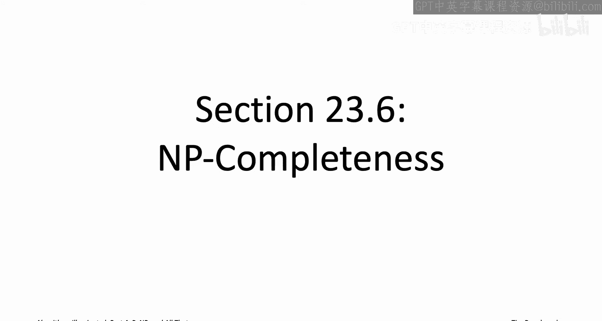

上一节我们介绍了NP难问题的正式定义。本节中，我们来看看一个更具体的概念：NP完全性。

NP完全性本质上是NP难性的一种特定形式。例如，3SAT问题是一个NP难问题。这意味着，如果你有一个解决3SAT问题的多项式时间算法，你就可以通过归约，自动地为NP复杂性类中的所有问题（即所有具有高效可验证解的问题）构建多项式时间算法。

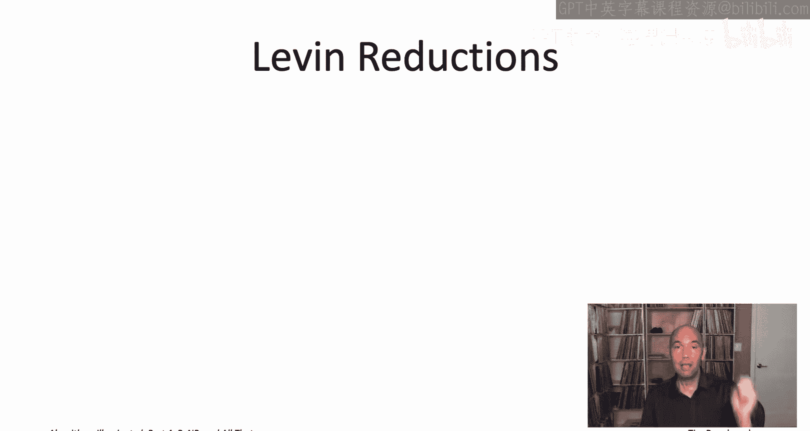

但事实上，对于3SAT和我们见过的大多数其他NP难问题，我们可以给出一个更精确的说法：它们是**NP完全**的。这意味着，一个高效的3SAT子程序不仅足以解决NP中的所有问题，而且实际上，**NP中的每一个问题都只是3SAT问题的一个“薄薄伪装”的特殊情况**。换句话说，像3SAT这样的NP完全问题具有**普遍性**，因为它们同时编码了NP复杂性类中的每一个问题。这听起来非常神奇，事实也确实如此。

---

## 11归约：定义“薄薄伪装” 👥

当我们说一个问题A是另一个问题B的“薄薄伪装”版本时，我们是什么意思呢？我们可以通过使用**11归约**来使这个概念数学化。

11归约是库克归约的一个特例（库克归约是我们整个视频系列中一直在使用的归约）。直观地说，11归约只被允许做最小限度的工作：它只能调用问题B的子程序**一次**。除此之外，它唯一能做的就是预处理其输入，以便将其输入给B，并对B的输出进行后处理，以作为其最终解决方案返回。

让我们重新绘制通常的示意图，以反映11归约施加的新限制。首先需要说明，11归约只在讨论一对**搜索问题**时才有意义。我们考虑将某个搜索问题A归约到另一个搜索问题B，例如搜索版本的TSP。

与库克归约不同，库克归约可以调用其子程序任意多项式次数，并可以任意使用这些调用的结果。而11归约的限制则严格得多：
1.  它只允许调用子程序**一次**。
2.  它必须以非常特定的方式使用子程序的输出。

对于搜索问题，子程序要么返回问题B实例的一个可行解，要么报告无解。11归约中的“蓝盒子”必须直接复制这个答案：
*   如果子程序报告无解，则“蓝盒子”必须报告其原始问题A的实例无可行解。
*   如果子程序返回一个可行解，则11归约必须通过多项式时间的后处理，将其转换为原始问题A实例的一个可行解。

---

## 我们之前的归约是11归约吗？ 🔍

我们已经在整个视频系列中看到了很多归约。现在你应该问的问题是：我们真的使用了库克归约的全部能力吗？还是我们无意中使用的本来就是11归约？

答案是：从技术上讲，我们并不总是进行11归约，但从本质上讲，我们确实是这样做的。

11归约只针对一对搜索问题定义。回顾我们见过的归约，许多都涉及优化问题。然而，如果你回顾那些归约，例如旅行商问题的NP难性证明，如果你看的是旅行商问题的**搜索版本**（即给定一个目标成本T），那么该归约就变成了一个11归约。

我们在第22章中进行的四个主要归约中的第二个，就是一个非常清晰的11归约例子：从3SAT问题到有向哈密顿路径问题的归约。我们给定一个3SAT实例，构造一个有向图，将其输入给有向哈密顿路径子程序。如果子程序说没有哈密顿路径，我们就报告没有可满足的赋值；如果它给出了一条哈密顿路径，我们就从中提取出一个可满足的赋值。这是一个典型的11归约。

再次强调，如果你回顾整个视频系列中的归约，并考虑所有讨论过的优化问题的搜索版本，我们看过的所有归约实际上都是11归约。

---

## 卡普归约：决策问题的11归约 📝

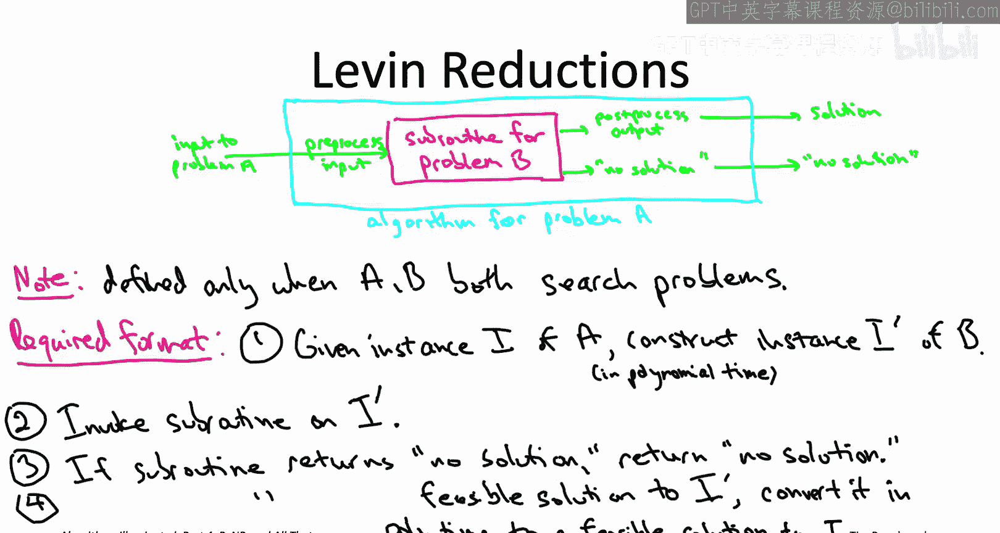

现在你已经了解了库克归约及其特例11归约。还有第三种归约需要简要提及，因为你在任何复杂性理论书籍和许多算法书籍中都可能看到它，即**卡普归约**（有时也称为多一归约或映射归约）。

卡普归约基本上就是11归约，但针对的是**决策问题**而非搜索问题。在决策问题中，算法只需报告“是”或“否”，而不需要实际构造一个可行解。因此，对于决策问题，示意图变得更加简单：子程序（“洋红色盒子”）只回答“是”或“否”；“蓝盒子”只是复述这个答案。

任何主要讨论决策问题（而非我们这里讨论的搜索问题）的书籍，都会使用卡普归约而非11归约。本系列视频之所以使用搜索问题，是因为从算法角度来看，它们更自然。

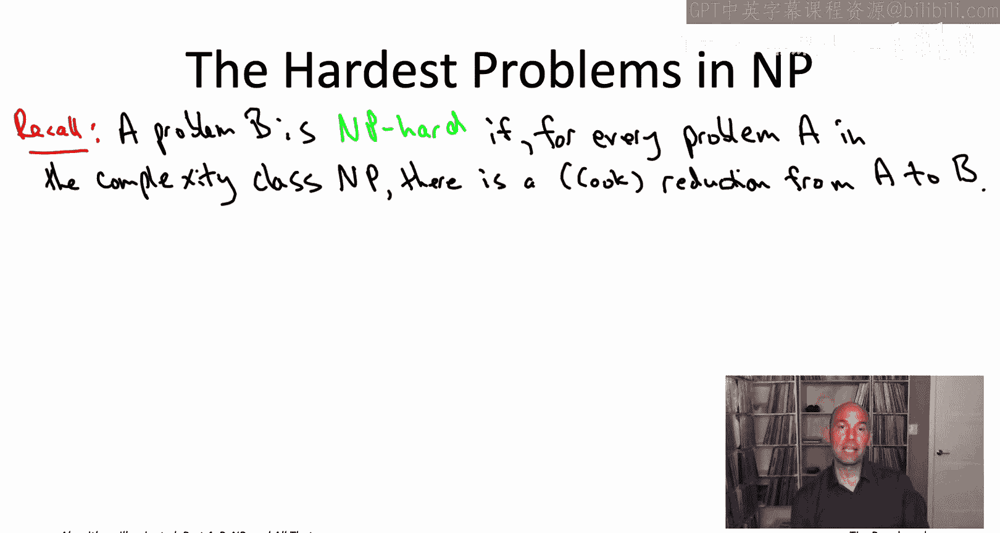

---

## NP完全问题的正式定义 🧠

我们现在准备正式定义**NP完全问题**——NP类中最难的问题，它们同时将所有其他具有高效可验证解的问题编码为自己的特例。

NP完全性最好被视为NP难性的一种特定类型。让我先提醒你一下我们三个视频前最终得到的NP难问题的正式定义：

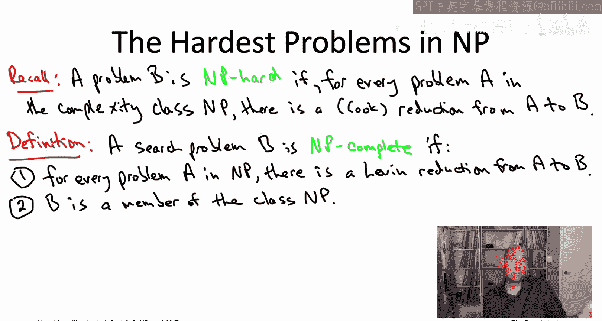

一个问题是**NP难的**，如果对于NP中的每一个问题A（即每一个具有高效可验证解的搜索问题），都存在一个从A到B的归约（在本系列中，我们一直使用库克归约）。这意味着，如果给定一个解决B的多项式时间子程序，你将自动获得解决NP类中所有问题的多项式时间算法。

要成为**NP完全的**，问题B必须满足一些额外的属性：
1.  **属于NP**：首先，只有搜索问题才有资格成为NP完全的。因此，虽然优化版本的TSP是NP难的，但它不是NP完全的。而搜索版本的TSP确实是NP完全的。所以，NP完全性只指代搜索问题。
2.  **NP难性（通过11归约）**：不仅B在算法上足以解决NP中的所有问题，而且实际上NP中的所有问题都只是B的“薄薄伪装”版本。我们通过11归约来表达“薄薄伪装”。因此，对于NP完全性，我们要求从每一个NP问题到B都存在一个**11归约**（而不仅仅是库克归约）。

第一个条件要求问题B同时编码了NP中的所有问题。第二个条件确保我们可以将NP完全问题解释为NP类中最难的问题，因此我们要求B本身确实是NP的成员（即B是一个具有高效可验证解的搜索问题）。

---

## 定义辨析与重要性 ⚠️

NP完全问题的这个定义是计算机科学整个历史上最重要的定义之一。需要明确的是，如果你查阅其他书籍，可能会看到略有不同的NP完全性定义，这可能会造成混淆。

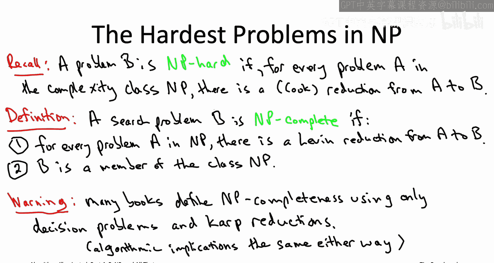

我们这里处理的是**搜索问题**（算法需要在解存在时返回一个可行解）和**11归约**。而在许多书籍中，他们使用**决策问题**（只需报告解是否存在）和**卡普归约**（决策问题的11归约类比，甚至不需要后处理步骤，只需复述“是”或“否”的答案）。

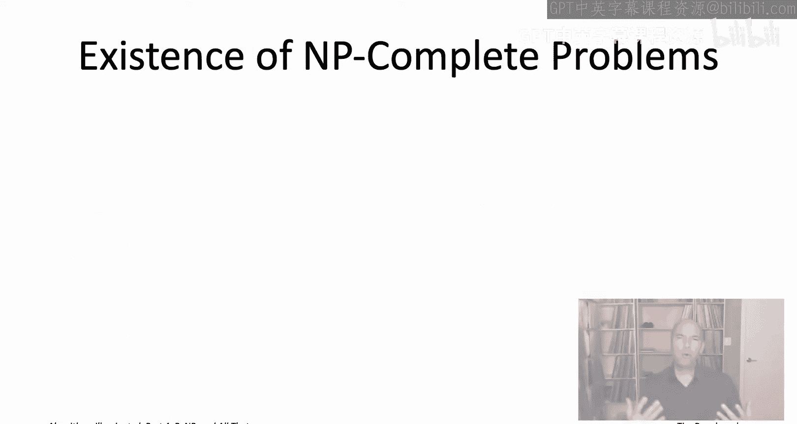

我提到这些是为了避免混淆。除非你全职投入复杂性理论研究，否则如果你主要关注算法方面，不必担心存在多种问题类型和归约类型。就理论对如何处理不同问题的指导意义而言，无论你使用哪种定义，其算法含义是完全相同的。

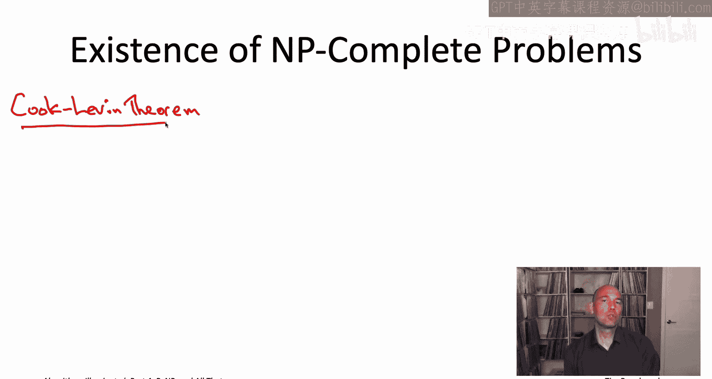

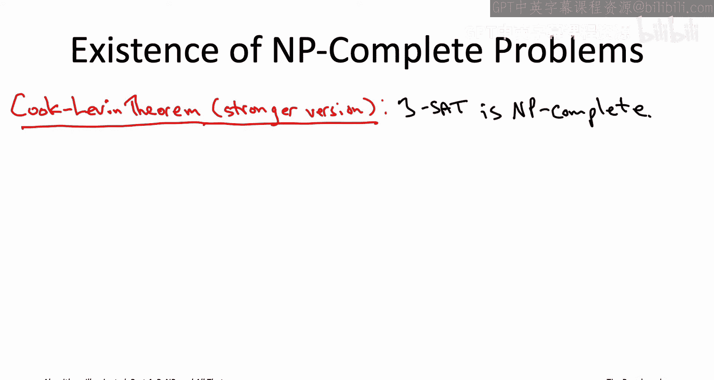

---

## NP完全问题真的存在吗？存在！ ✅

NP完全问题的定义非常酷：一个具有高效可验证解的单一问题，同时编码了所有此类问题。NP完全问题真的可能存在吗？这有点令人惊讶。

答案是：**存在**。事实上，我们之前已经接触过的一个定理——**库克-莱文定理**——证明了这一点。当我第一次展示这个定理时，我简化了它，说它证明了3SAT问题是NP难的。实际上，它证明了更强的东西：**3SAT问题实际上是NP完全的**。

原因在于，如果你回顾几讲前给出的库克-莱文定理证明草图，那个归约正是一个典型的11归约。它从一个抽象的NP问题A归约到3SAT问题，构造的3SAT实例使得其可满足赋值与问题A实例的可行解一一对应。然后，它只调用一次假定的3SAT子程序，并根据结果直接复制答案或进行后处理转换。这就是为什么库克-莱文定理实际上证明了3SAT是NP完全的。

一旦我们有了一个NP完全问题（如3SAT），我们就可以站在巨人的肩膀上，使用归约来生成更多的NP完全问题。

---

## 证明NP完全性的三步法 📋

这意味着，我们有一个非常简单的三步法来证明一个问题是NP完全的，其精神与我们证明问题NP难的两步法非常相似。

以下是三步法：
1.  **证明属于NP**：首先，证明你试图证明的目标问题B确实属于NP类（即它是一个具有高效可验证解的搜索问题）。这是NP完全性的前提条件。
2.  **选择已知的NP完全问题A**：选择一个已知的NP完全问题作为起点，例如3SAT。
3.  **使用11归约从A归约到B**：使用一个**11归约**（而不是更一般的库克归约）将问题A归约到你的目标问题B。

如果你能完成这三步，那么你的问题B就是NP完全的。

---

## NP完全问题的普遍性 🌍

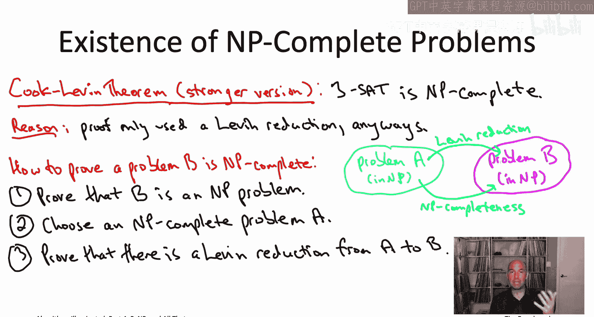

这个简单的三步法已经被应用了无数次。因此，我们现在知道有成千上万个自然问题是NP完全的，包括来自工程、生命科学和社会科学各个领域的问题。

例如，我们讨论过的几乎所有优化问题的**搜索版本**，包括TSP、背包问题、最大覆盖、最小生成树等，实际上都不仅是NP难的，而且是**NP完全的**。

如果第22章中的所有NP完全问题还不够，你可以查阅我之前提到的加里和约翰逊的经典著作，那里有数百个NP完全问题的更多例子。

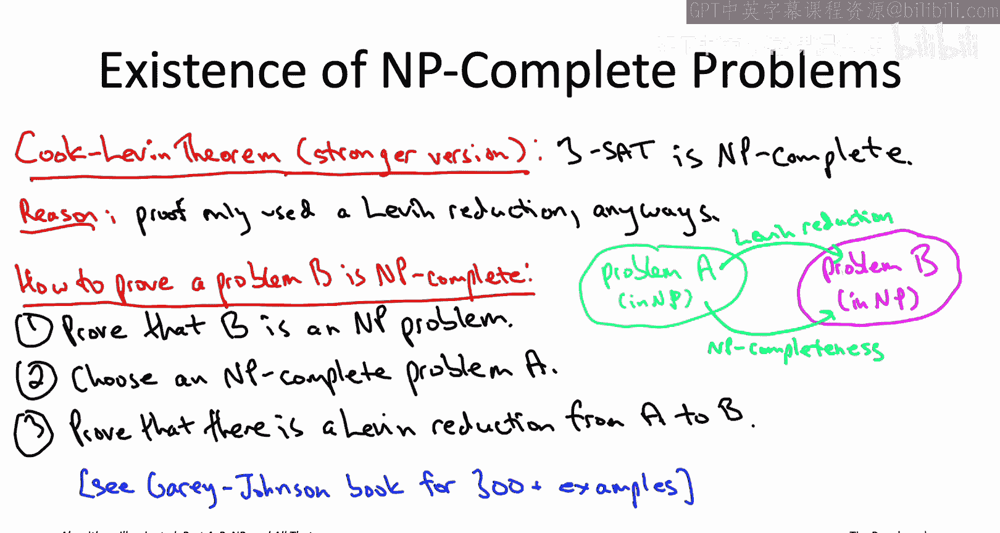

---

## 总结 🎓

本节课中，我们一起学习了NP完全性的核心概念。我们了解到：

*   NP完全性是NP难性的一种更强形式，要求从NP中**所有**问题到该问题都存在**11归约**。
*   **11归约**是一种限制严格的归约，只允许调用一次子程序，并直接复制或简单转换其输出。
*   NP完全问题本身必须**属于NP类**（即具有高效可验证解）。
*   **库克-莱文定理**证明了第一个NP完全问题（3SAT）的存在。
*   利用已知的NP完全问题（如3SAT）和**11归约**，可以通过**三步法**证明其他问题是NP完全的。
*   成千上万个实际问题被证明是NP完全的，这凸显了该概念在理论和实践中的核心重要性。

理解NP完全性，使我们能更精确地把握计算难题中最难的那一类，并为探索算法设计与复杂性理论的深层联系奠定了基础。