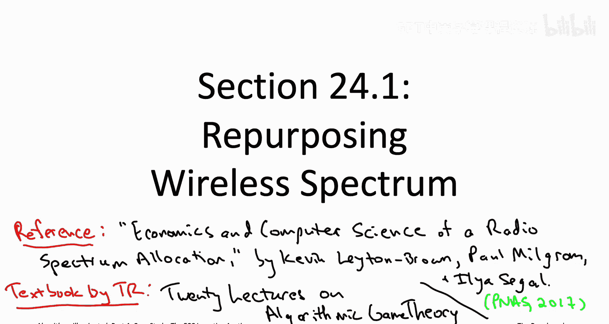
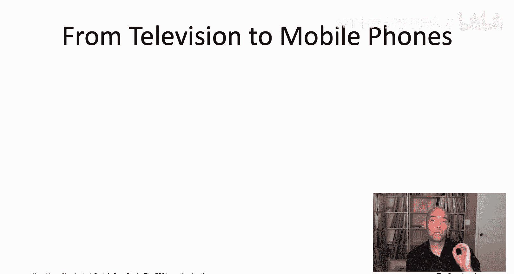
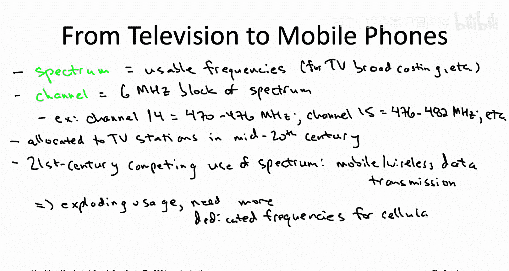

# 算法启蒙（第4册）：NP难｜Part 4：NP难问题的算法：24.1：无线频谱的重新分配 📡

在本节课中，我们将学习一个关于NP难问题的实际案例研究。我们将看到，NP难并非一个纯粹的学术概念，它在解决现实世界的高风险经济问题时，会真实地制约我们计算上的可行选择。具体来说，我们将探讨美国联邦通信委员会（FCC）如何设计并实施一项名为“激励拍卖”的复杂算法，以重新分配宝贵的无线频谱资源。这个案例将展示我们之前学到的算法工具箱如何被整合运用来解决一个极其复杂的实际问题。

## 背景与动机 📺

上一节我们介绍了NP难问题的普遍性。本节中，我们来看看一个具体的、由NP难问题主导的现实世界挑战：无线频谱的重新分配。

无线频谱是一种稀缺的公共资源。在20世纪50年代，电视在美国迅速普及，电视节目完全通过无线电波进行空中传输。为了协调各电视台的传输并防止干扰，美国联邦通信委员会（FCC）将可用的广播频率（即频谱）划分为多个区块，每个区块称为一个“频道”，每个频道宽6兆赫兹（MHz）。

以下是关于电视频道划分的一些关键事实：
*   **频道与频率**：例如，“频道14”实际上指的是470 MHz到476 MHz之间的频率。下一个频道15则占用476 MHz到482 MHz，以此类推。
*   **频道类型**：频道14及以上的属于特高频（UHF）频道，起始于470 MHz。此外还有甚高频（VHF）频道，它们占用较低的频率，例如频道7-13使用174-216 MHz，频道2-6使用54-88 MHz。

在20世纪中叶，电视在频谱使用上没有太多竞争者，因此一大块宝贵的频谱被预留给了无线电视广播。然而，时间快进到21世纪，移动电话与基站之间交换的所有数据同样通过无线电波在空中传输。例如，在2020年，美国Verizon用户的下载数据可能使用746-756 MHz的频率，上传使用777-787 MHz的频率。

你可以注意到，这些用于移动数据的频率（700 MHz范围）高于我们之前讨论的电视频道频率（600 MHz及以下）。这不是偶然，而是为了避免干扰。为蜂窝数据预留的频谱部分与为无线电视预留的频谱部分并不重叠。

## 频谱需求的变迁 📶

随着移动和无线数据使用量在21世纪爆炸式增长，对专用频率的需求也急剧增加。然而，并非所有频率都适用于无线通信，因此频谱成为一种稀缺资源，现代技术对其需求如饥似渴。

另一方面，电视虽然仍然重要，但通过空中广播的“无线电视”已远不如20世纪中叶那样普及。事实上，大约85%-90%的美国家庭完全依赖有线电视（通过电缆传输，无需空中频谱）或卫星电视（使用高得多的频率）。因此，将最有价值的频谱“地产”继续留给无线电视，在20世纪中叶是合理的，但在21世纪初则不再那么合理。

## FCC激励拍卖的目标 🎯

为了反映过去70年来频谱需求的转变，截至2020年，一项重大的频谱重新分配工作已接近完成。具体来说，在美国，自2020年7月13日之后，全国范围内将不再有任何电视台在原有的最高频段（频道38至51，对应频率614-698 MHz）上进行广播。

这项重新分配工作规模巨大：
*   所有原在这些频道上广播的电视台，要么切换到较低频道，要么完全停止无线传输（可能仍通过有线和卫星电视广播）。
*   总计有175家电视台交还了广播许可证并停止无线广播，同时约有1000家电视台需要切换频道。

清理出这14个频道（38-51）释放了84 MHz的频谱。这些频谱被重新组织并授予电信公司（如T-Mobile、AT&T和Comcast），用于在未来几年建设新一代无线网络（例如5G网络）。

经过重组后，原来的频道38-51变成了7个独立的5 MHz频段对（用于下载和上传），中间有保护间隔以避免干扰。这整个操作引出了一系列复杂的问题。

以下是需要回答的关键问题列表：
*   在原有的所有电视台中，哪些应该停止无线广播？
*   对于那些继续广播的电视台，哪些需要切换频道？它们的新频道应该是什么？
*   对于那些交还许可证的电视台，适当的补偿应该是多少？
*   在完成重组并创建了7个频段对之后，哪些电信公司有幸获得它们？它们应该为此支付多少费用？

这些问题都需要由“FCC激励拍卖”来回答。本质上，这是一个用于进行频谱重新分配的、庞大而复杂的算法。它严重依赖于我们在本系列课程中学到的、用于应对NP难问题的算法工具箱。

从下一个视频开始，我们将详细讨论这个算法是如何实际工作的。

## 总结 📝

本节课中，我们一起学习了NP难问题在现实世界中的一个重要应用案例：无线频谱的重新分配。我们回顾了电视广播频谱的历史，了解了21世纪移动数据爆炸带来的频谱需求变化，并引出了美国FCC为重新分配频谱（特别是清理出频道38-51）所面临的复杂挑战。这些挑战涉及资源分配、补偿和定价等一系列难题，其解决方案——FCC激励拍卖——是一个综合性的复杂算法。在接下来的课程中，我们将深入探讨这个算法是如何巧妙运用我们已学的算法技术来解决这些NP难问题的。