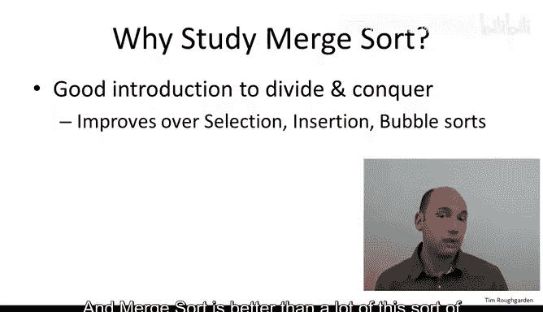
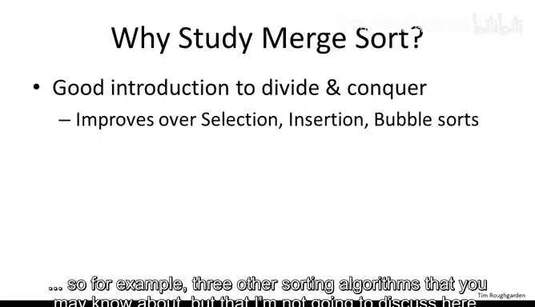
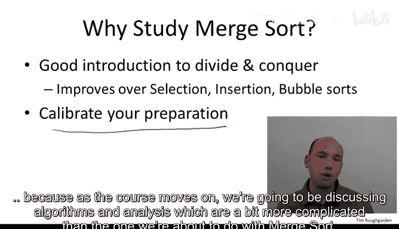
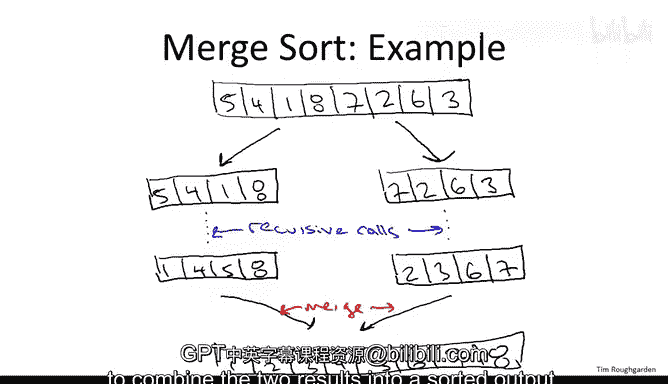

# 005：归并排序动机与示例 🧩

在本节课中，我们将学习如何分析一个算法。我们将通过回顾著名的归并排序算法，并给出其运行所需操作次数的数学上精确的上界，来首次体验算法分析的过程。

## 概述

归并排序是一个古老但高效的排序算法，它完美地体现了“分治”这一算法设计范式。我们将探讨其工作原理，分析其性能，并理解为何它在许多场景下优于更简单的排序算法。

## 为何从归并排序开始？

尽管归并排序的历史可以追溯到1945年，但它至今仍在实践中被广泛使用，是许多编程库中的标准排序算法。选择它作为起点的原因如下：

*   **分治范式的典范**：归并排序清晰地展示了如何将问题分解为子问题、递归求解并合并结果。
*   **性能优势**：相比选择排序、插入排序和冒泡排序等具有**O(n²)** 性能的简单算法，归并排序能提供更好的运行时间。
*   **校准预备知识**：对归并排序的讨论有助于你判断自己的背景知识是否与本课程的预期受众水平相符。
*   **分析方法的引入**：对归并排序的分析将自然引出本课程分析算法的一般方法，包括最坏情况分析、渐进分析和递归树方法。

## 排序问题

归并排序旨在解决经典的排序问题。

**输入**：一个包含n个任意顺序数字的数组。
**目标**：输出一个数组，其中的数字按从小到大的顺序排列。

例如，对于输入数组 `[5, 4, 1, 8, 7, 2, 6, 3]`，目标是得到输出数组 `[1, 2, 3, 4, 5, 6, 7, 8]`。为简化讨论，我们假设数组中的元素互不相同。

## 归并排序工作原理

归并排序是一个递归算法。其核心思想是分治：
1.  **分**：将数组分成两半。
2.  **治**：递归地对每一半进行排序。
3.  **合**：将两个已排序的半部分合并成一个完整的已排序数组。

让我们通过一个示例来可视化这个过程。考虑输入数组 `[5, 4, 1, 8, 7, 2, 6, 3]`。

首先，算法将数组分成左半部分 `[5, 4, 1, 8]` 和右半部分 `[7, 2, 6, 3]`。通过递归调用，左半部分被排序为 `[1, 4, 5, 8]`，右半部分被排序为 `[2, 3, 6, 7]`。

最后，通过一个名为 **“合并”** 的过程，将这两个已排序的子数组合并成最终的排序结果 `[1, 2, 3, 4, 5, 6, 7, 8]`。合并操作通过遍历两个子数组，按顺序选取元素来高效地完成。

## 总结

本节课我们一起学习了归并排序算法的动机和基本示例。我们了解到归并排序是分治算法设计范式的典型代表，它通过递归地将问题分解、求解并合并，实现了比简单排序算法更优的性能。在接下来的章节中，我们将深入探讨其具体的伪代码实现和运行时间的详细分析。