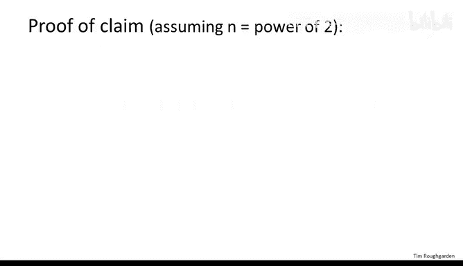
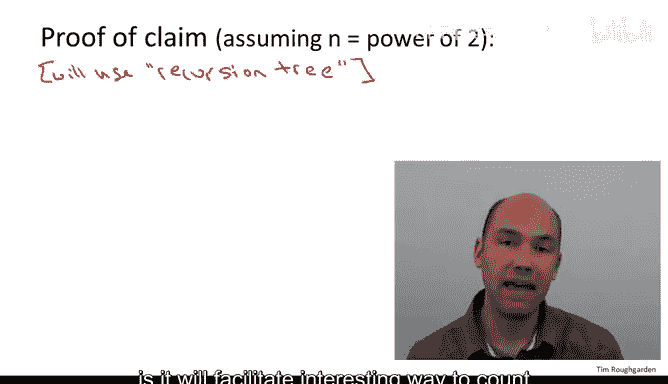
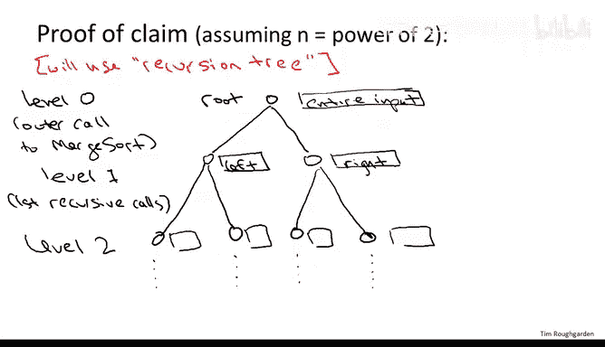
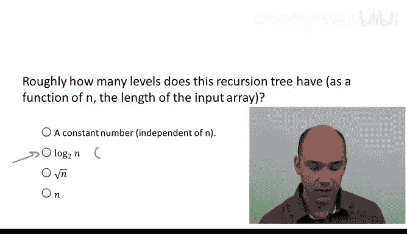
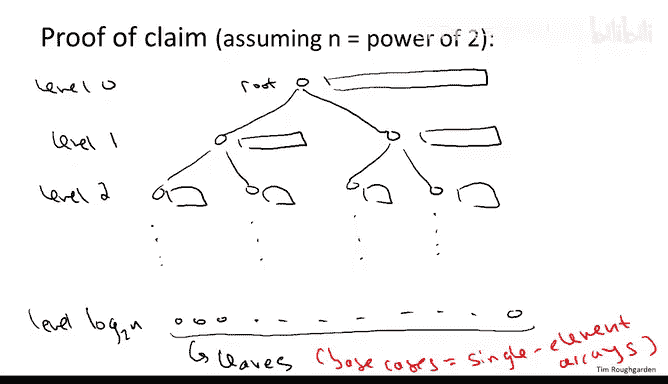
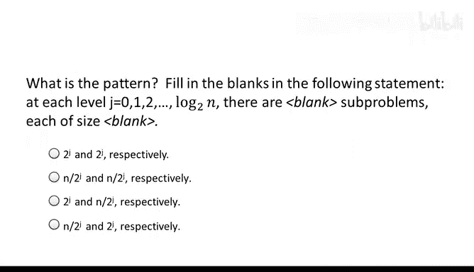
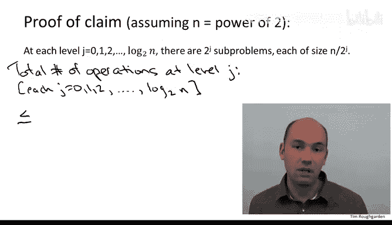
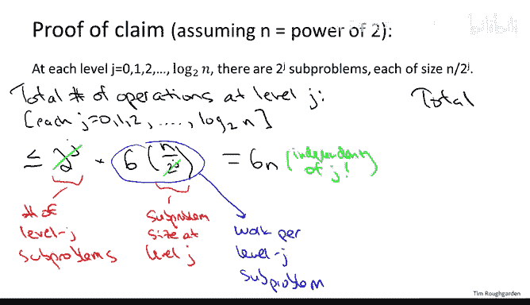
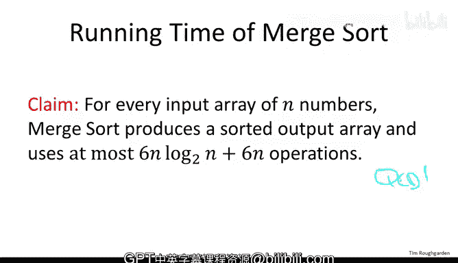

# 007：归并排序分析 📊

在本节课中，我们将对归并排序算法进行运行时间分析，特别要证明递归分治的归并排序算法比插入排序、选择排序和冒泡排序等简单排序算法性能更优。具体目标是数学论证以下结论：对包含 n 个数字的数组进行排序，归并排序最多执行常数乘以 n log n 次操作，即最多执行 **6n log n + 6n** 行代码。

## 递归树方法 🌳

为了证明上述结论，我们将使用递归树方法。该方法的核心思想是将递归归并排序算法完成的所有工作以树状结构表示，其中每个节点的子节点对应其进行的递归调用。这种树状结构有助于以有趣的方式统计算法的总工作量，并极大简化分析过程。

具体来说，递归树的结构如下：

在树的第 0 层，我们有一个根节点，对应归并排序的最外层调用。由于归并排序每次递归会进行两次调用，因此该树是二叉树。根节点处理整个输入数组。

在第 1 层，有两个子问题，分别对应输入数组的左半部分和右半部分。每个第 1 层的递归调用又会进行两次递归调用，分别处理原始输入数组的四分之一，形成第 2 层的四个子问题。此过程持续进行，直到递归达到基本情况，即数组大小为 0 或 1。

现在，我们提出一个问题：在递归树的底部，即对应基案例的叶子节点，位于哪一层？

正确答案是第二项。递归树的层数基本与输入数组大小的对数成正比。原因是每深入一层递归，输入大小就减半。从最外层的 n 开始，第一层递归处理大小为 n/2 的数组，第二层处理大小为 n/4 的数组，依此类推，直到数组大小不超过 1。因此，递归层数正是将 n 除以 2 直到结果不超过 1 所需的次数，这正是以 2 为底的 n 的对数定义。

由于第一层是第 0 层，最后一层是第 log₂n 层，总层数为 **log₂n + 1**。

这里假设 n 是 2 的幂，这并非大问题，分析可轻松扩展到 n 不是 2 的幂的情况，但这样我们无需考虑分数，log₂n 为整数。

## 逐层工作量计算 🔢

现在回到递归树，我们重新绘制它。在树的底部，即叶子节点，对应基案例，当 n 是 2 的幂时，这些基案例恰好是单元素数组。

以这种方式组织归并排序的工作量，允许我们逐层统计工作量，这是一种特别方便的方法，可以计算所有执行的代码行数。

为了更详细地理解，我们需要识别一个特定模式。首先，在递归树的第 J 层，有多少个不同的子问题？其次，对于第 J 层的每个子问题，输入大小是多少？

正确答案是第三项。在第 J 层，恰好有 **2ᴶ** 个不同的子问题。因为归并排序每次调用自身两次，所以每层子问题数量翻倍。同时，输入大小每次递归减半，因此经过 J 层后，每个子问题处理的数组长度为 **n / 2ᴶ**。

现在，我们利用这个模式实际计算归并排序执行的所有代码行数。关键思想是逐层统计工作量。明确地说，第 J 层的工作量是指该层 **2ᴶ** 个归并排序实例完成的工作，不包括它们各自的递归调用，也不包括树中更低层递归完成的工作。

回顾归并排序算法，它只有三行代码：两次递归调用和一次合并子程序调用。在第 J 层，我们不计算递归调用，只计算合并子程序的调用。我们已经知道，合并子程序在大小为 m 的输入上最多需要 **6m** 行代码。

固定第 J 层，我们知道子问题数量为 2ᴶ，每个子问题的大小为 n / 2ᴶ，并且知道合并子程序在此类输入上的工作量。我们只需乘以 6，然后相乘，得到第 J 层所有子问题的总工作量。

具体计算如下：从第 J 层的子问题数量 2ᴶ 开始，每个子问题的输入大小为 n / 2ᴶ。合并子程序在大小为 n / 2ᴶ 的数组上最多执行 6 * (n / 2ᴶ) 行代码。因此，第 J 层的总工作量是子问题数量乘以每个子问题的工作量：

**工作量 ≤ 2ᴶ * 6 * (n / 2ᴶ) = 6n**

有趣的是，我们得到了一个与层数 J 无关的上界 **6n**。这意味着在根节点（第 0 层）我们最多执行 6n 次操作，在第 1 层也最多执行 6n 次操作，第 2 层也是如此，依此类推。

这种现象发生的原因在于两种竞争力量之间的完美平衡：一方面，子问题数量随着递归树层数增加而翻倍；另一方面，每个子问题的工作量随着层数增加而减半。这两者相互抵消，得到了与层数无关的上界 6n。

## 总工作量计算 📈

既然我们得到了每层工作量的上界，那么计算归并排序的总工作量就变得非常简单。我们只需将层数乘以每层的上界。已知层数为 **log₂n + 1**（包括第 0 层到第 log₂n 层），每层上界为 6n。

因此，总工作量上限为：

**总工作量 ≤ (log₂n + 1) * 6n = 6n log₂n + 6n**

这正是我们最初声称的上界：归并排序最多执行 **6n log₂n + 6n** 次操作。

## 总结 🎯

本节课中，我们一起学习了归并排序算法的运行时间分析。通过递归树方法，我们逐层统计了算法的工作量，并证明了其时间复杂度上界为 **O(n log n)**。这一结果表明，随着输入规模 n 的增大，归并排序的性能远优于插入排序、选择排序等简单迭代排序算法。我们使用的主要工具是递归树，它帮助我们清晰地看到子问题数量与规模的平衡，从而简化了计算过程。