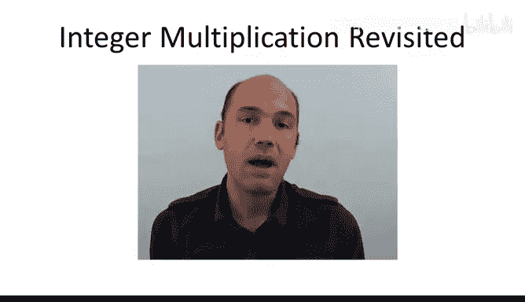
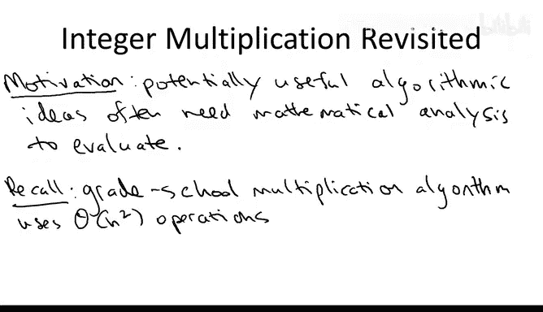
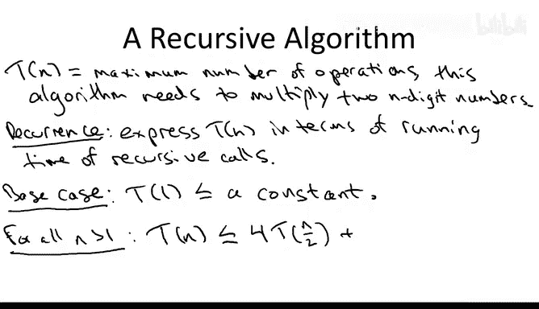
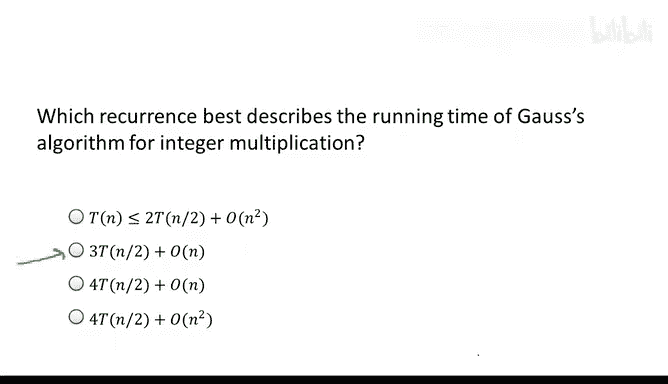
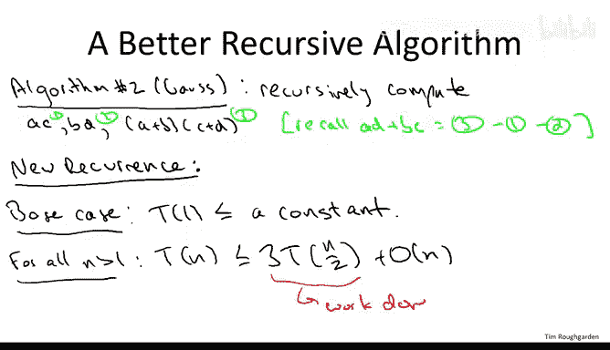

# 019：主方法动机 🎯

在本节课中，我们将学习**主方法**。主方法是一个通用的数学工具，用于分析分治算法的运行时间。我们将从介绍其动机开始，然后给出其形式化描述，并通过六个示例进行讲解。最后，我们将用三节课的时间讨论主方法的证明，特别强调其三种情况的概念性解释。

需要说明的是，本节课的数学内容比前两节稍多，但这并非为了数学而数学。我们的努力将换来这个强大工具——主方法——的回报。它具有很强的预测能力，能为我们提供关于哪些分治算法可能运行得更快、哪些可能更慢的指导。事实上，一个新的算法思想通常需要数学分析来正确评估，本节课就是这一普遍现象的一个例证。

## 动机示例：整数乘法

作为一个动机示例，考虑计算两个n位数相乘的问题。回想我们最初的课程，我们都学过迭代的小学乘法算法，该算法需要的基本操作（单数字的加法和乘法）数量随着数字位数n呈**二次方**增长。

另一方面，我们也讨论了一种使用分治范式的有趣递归方法。分治法需要识别更小的子问题。对于整数乘法，我们需要识别想要相乘的更小的数字。因此，我们采用显而易见的方式，将两个数字各自分解为左半部分和右半部分的数字。为方便起见，我假设数字位数n是偶数，但这并不重要。

将X和Y这样分解后，我们可以展开乘积并观察结果。让我们把这个表达式框起来，称之为**星号表达式**。

我们从一个显而易见的递归算法开始，即直接计算星号表达式。星号表达式包含四个涉及n/2位数的乘积：AC、AD、BC和BD。因此，我们进行四次递归调用来计算它们，然后以自然的方式完成计算，即根据需要补零并将这三个项相加得到最终结果。

我们使用所谓的**递归式**来分析此类递归算法的运行时间。为了引入递归式，让我先定义一些符号：**T(n)**。这是我们真正关心的量，即我们想要上界的量。具体来说，它表示这个递归算法在最坏情况下相乘两个n位数所需的操作次数。这正是我们想要上界的量。

递归式只是用更小数字的T值来表达T(n)的一种方式，即用其递归调用所做的工作来表达算法的运行时间。

每个递归式都有两个组成部分。首先，它有一个**基础情况**，描述没有进一步递归时的运行时间。在这个整数乘法算法中，像大多数分治算法一样，基础情况很简单：当输入变小（这里是一位数）时，运行时间只是常数——你只需将两个数字相乘并返回结果。我将其表示为：**T(1) ≤ 常数**。我不打算具体说明这个常数是多少，你可以认为它是1或2，这对后续内容并不重要。

递归式的第二个组成部分是重要部分，它描述了不在基础情况下、进行递归调用时的一般情况。你只需将运行时间写成两部分：首先是递归调用所做的工作，其次是当前在此处所做的工作（递归调用之外的工作）。在这个递归整数乘法算法中，正如我们讨论的，恰好有四次递归调用，每次调用处理一对n/2位数。这给出了**4 * T(n/2)**。在递归调用之外，我们做的工作是将递归调用的结果补零并相加。可以验证，小学加法实际上以位数n的线性时间运行。因此，递归调用之外的工作量是线性的，即**O(n)**。

综合起来，我们得到该算法的递归式：
*   **基础情况**：T(1) ≤ 常数
*   **一般情况**：T(n) ≤ 4T(n/2) + O(n)

## 高斯算法与改进的递归式

现在让我们转向第二个更巧妙的整数乘法递归算法，它可以追溯到高斯。高斯的洞见是意识到，在我们试图计算的星号表达式中，实际上我们只关心三个基本量，即表达式中三个项的系数。这让我们希望也许可以用**三个**递归调用而不是四个来计算这三个量。事实上，我们可以。

我们像以前一样递归计算A*C和B*D。然后我们计算(A+B)与(C+D)的乘积。一个非常巧妙的事实是，如果我们给这三个乘积编号为1、2和3，那么我们关心的最终量——10^(n/2)项的系数，即AD+BC——恰好是第三个乘积减去前两个乘积。这就是新算法。

新的递归式是什么？基础情况显然和以前完全一样。那么问题在于，一般情况如何变化？正确的答案是第二个选项：与第一个递归式相比，唯一的变化是递归调用的数量从四个减少到三个。

有几个快速说明。首先，当我说有三个递归调用，每个处理n/2位数时，我有点不严谨。因为当你取和A+B和C+D时，它们可能实际上有n/2+1位。但我们可以忽略这一点，仍然称每个递归调用处理n/2位数。通常，额外的+1在最终分析中并不重要。其次，我忽略了递归调用之外线性工作的具体常数因子。实际上，在高斯算法中，这个常数因子比具有四个递归调用的朴素算法要大一些，但它只是一个常数因子，在大O表示法中会被忽略。

因此，高斯算法的递归式是：
*   **基础情况**：T(1) ≤ 常数
*   **一般情况**：T(n) ≤ 3T(n/2) + O(n)

## 对比与未知

让我们看看这个递归式，并将其与另外两个递归式进行比较，一个更大，一个更小。首先，正如我们注意到的，它与朴素递归算法的前一个递归式的区别在于少了一个递归调用。我们不知道这两种递归算法的运行时间是多少，但我们应该确信这个算法（高斯算法）肯定只会更好。另一个对比点是归并排序。想想归并排序算法的递归式会是什么样子。它几乎与此相同，只是把3换成2。归并排序进行两次递归调用，每次处理一半大小的数组，在递归调用之外，它做线性工作，即归并子程序。我们知道归并排序的运行时间是**O(n log n)**。所以高斯算法会更差，但我们不知道差多少。

因此，虽然我们对这个算法的运行时间可能或多或少有一些线索，但老实说，我们**并不知道**高斯递归整数乘法算法的运行时间到底是什么。这并不明显，我们目前对此没有直觉，我们不知道这个递归式的解是什么。但它将是接下来我们要处理的通用主方法的一个特例。

## 总结

本节课中，我们一起学习了引入**主方法**的动机。我们通过**整数乘法**的例子，回顾了朴素分治算法和高斯改进算法的递归式，并对比了归并排序的递归式。我们发现，对于高斯算法，我们得到了递归式 **T(n) ≤ 3T(n/2) + O(n)**，但目前我们无法直观判断其解。这引出了对一种通用分析工具的需求，即**主方法**，它将在接下来的课程中帮助我们解决这类问题。