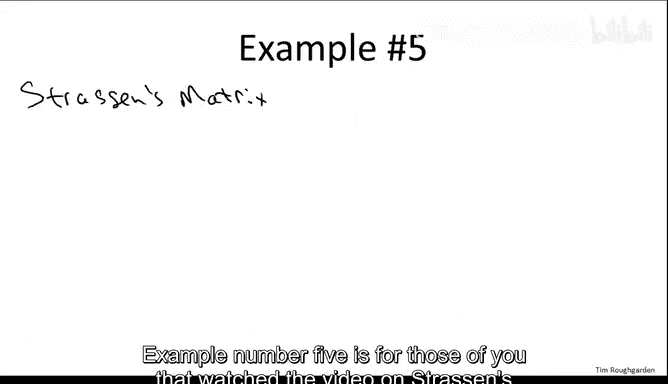
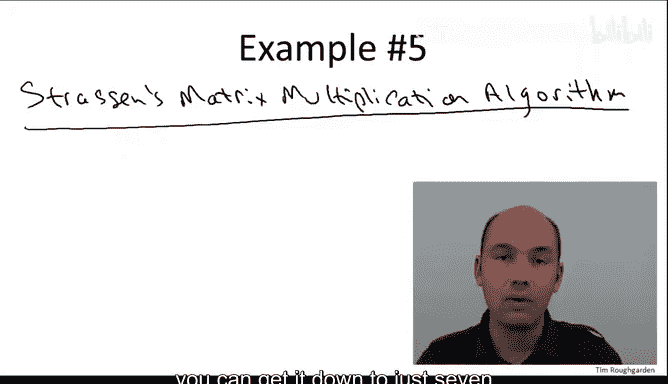
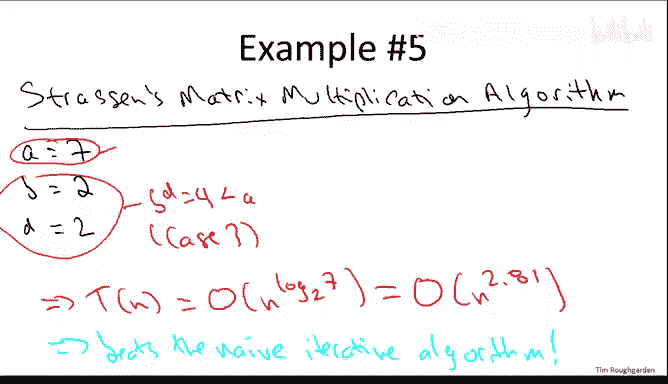
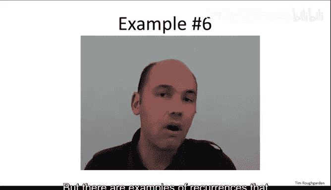
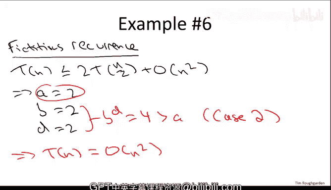

# 021：主方法应用示例 🧮

在本节课中，我们将通过六个不同的具体示例，学习如何应用主方法（Master Method）来分析递归算法的运行时间。我们将回顾主方法的核心公式，并通过实例理解其三种不同情况的适用场景。

## 主方法回顾

上一节我们介绍了主方法的基本概念，本节中我们来看看如何具体应用它。主方法适用于特定格式的递归式，该格式由三个常数 **A**、**B** 和 **D** 参数化。

*   **A** 表示递归调用的次数，即需要解决的子问题数量。
*   **B** 表示子问题规模相对于原问题规模的缩小因子。
*   **D** 表示在递归调用之外所做工作的运行时间的指数。

递归式的形式为：
`T(n) ≤ A * T(n/B) + O(n^D)`

给定一个符合此格式的递归式，其运行时间由以下三种情况之一决定，具体取决于 **A** 与 **B^D** 之间的关系：

1.  若 **A = B^D**，则 `T(n) = O(n^D * log n)`。
2.  若 **A < B^D**，则 `T(n) = O(n^D)`。
3.  若 **A > B^D**，则 `T(n) = O(n^(log_B A))`。

主方法初看可能有些难以理解，因此让我们通过一些具体示例来掌握其应用。

## 示例一：归并排序 ✅

我们从已知运行时间的算法开始。以下是归并排序的参数识别过程：

*   **A (递归调用次数)**：归并排序进行两次递归调用，因此 `A = 2`。
*   **B (规模缩小因子)**：每次递归处理原数组的一半，因此 `B = 2`。
*   **D (合并步骤的指数)**：合并步骤是线性时间的，因此 `D = 1`。

接下来，我们判断属于哪种情况：
`A = 2`，`B^D = 2^1 = 2`。两者相等，属于**情况一**。

根据情况一的公式，运行时间为 `O(n^D * log n) = O(n^1 * log n) = O(n log n)`。这与我们已知的结果一致，验证了主方法的正确性。

## 示例二：二分查找 🔍

现在，我们来看二分查找算法。以下是其参数识别过程：

*   **A (递归调用次数)**：二分查找每次只进行**一次**递归调用（进入左半部分或右半部分），因此 `A = 1`。
*   **B (规模缩小因子)**：每次递归处理原数组的一半，因此 `B = 2`。
*   **D (比较步骤的指数)**：每次递归调用前只进行一次常数时间的比较，因此 `D = 0`。

接下来，我们判断属于哪种情况：
`A = 1`，`B^D = 2^0 = 1`。两者相等，属于**情况一**。

根据公式，运行时间为 `O(n^D * log n) = O(n^0 * log n) = O(log n)`。这再次确认了二分查找的对数时间复杂度。

## 示例三：整数乘法（朴素递归） ➗

我们来看一个更复杂的例子：未使用高斯技巧的递归整数乘法算法。以下是其参数识别过程：

*   **A (递归调用次数)**：该算法对四个 `n/2` 位数的乘积进行递归计算，因此 `A = 4`。
*   **B (规模缩小因子)**：每次递归处理原数字位数的一半，因此 `B = 2`。
*   **D (组合步骤的指数)**：通过补零和加法进行组合，这是线性时间操作，因此 `D = 1`。

接下来，我们判断属于哪种情况：
`A = 4`，`B^D = 2^1 = 2`。由于 `A > B^D`，属于**情况三**。

根据情况三的公式，运行时间为 `O(n^(log_B A)) = O(n^(log_2 4)) = O(n^2)`。这与我们小学所学的迭代算法复杂度相同，说明朴素的递归分治并未带来改进。

## 示例四：整数乘法（使用高斯技巧） ✨

现在，我们应用高斯技巧来优化上述算法，将递归调用次数从4次减少到3次。以下是更新后的参数：

*   **A (递归调用次数)**：优化后只需三次递归调用，因此 `A = 3`。
*   **B (规模缩小因子)**：规模缩小因子不变，`B = 2`。
*   **D (组合步骤的指数)**：组合步骤的复杂度不变，`D = 1`。

接下来，我们判断属于哪种情况：
`A = 3`，`B^D = 2^1 = 2`。仍然满足 `A > B^D`，属于**情况三**。

运行时间为 `O(n^(log_B A)) = O(n^(log_2 3)) ≈ O(n^1.59)`。这显著优于 `O(n^2)`，展示了巧妙的分治策略如何提升算法效率。

## 示例五：斯特拉森矩阵乘法 🧮

斯特拉森矩阵乘法算法是分治法的另一个经典应用。以下是其参数识别过程：

*   **A (递归调用次数)**：通过巧妙计算，将递归调用次数从8次减少到7次，因此 `A = 7`。
*   **B (规模缩小因子)**：每次递归处理原矩阵规模的一半（在维度上），因此 `B = 2`。
*   **D (组合步骤的指数)**：组合步骤涉及矩阵的加法和减法，对于 `n x n` 矩阵是 `O(n^2)` 操作，因此 `D = 2`。

接下来，我们判断属于哪种情况：
`A = 7`，`B^D = 2^2 = 4`。由于 `A > B^D`，属于**情况三**。

运行时间为 `O(n^(log_B A)) = O(n^(log_2 7)) ≈ O(n^2.81)`。这优于朴素矩阵乘法的 `O(n^3)` 复杂度。

## 示例六：触发情况二的虚构示例 ⚖️

前面的例子涵盖了情况一和情况三。为了完整起见，我们构造一个触发**情况二**的示例。考虑以下递归式：
`T(n) = 2T(n/2) + O(n^2)`

以下是其参数识别过程：

*   **A (递归调用次数)**：`A = 2`。
*   **B (规模缩小因子)**：`B = 2`。
*   **D (组合步骤的指数)**：组合步骤是平方时间的，因此 `D = 2`。

接下来，我们判断属于哪种情况：
`A = 2`，`B^D = 2^2 = 4`。由于 `A < B^D`，属于**情况二**。

根据情况二的公式，运行时间为 `O(n^D) = O(n^2)`。这个结果有些反直觉：虽然递归结构类似归并排序，仅将合并步骤从线性改为平方，但总运行时间并非 `O(n^2 log n)`，而仅仅是 `O(n^2)`。这表明整个算法的运行时间主要由最外层（递归树根节点）的合并工作所主导。

## 总结 📝

本节课中，我们一起学习了如何应用主方法分析六种不同的递归算法。我们首先回顾了主方法的三种情况及其判定条件。随后，我们逐步分析了归并排序、二分查找、两种整数乘法算法、斯特拉森矩阵乘法以及一个虚构示例，识别了各自的 **A**、**B**、**D** 参数，并确定了所属情况，从而得出了它们的渐近运行时间上界。

通过这些实例，我们验证了主方法是一个强大而便捷的工具，能够快速分析符合其格式的递归算法的复杂度，无需展开复杂的递归树或进行代入法证明。关键在于准确识别算法中的递归调用次数、问题规模缩小因子以及递归外工作的复杂度指数。