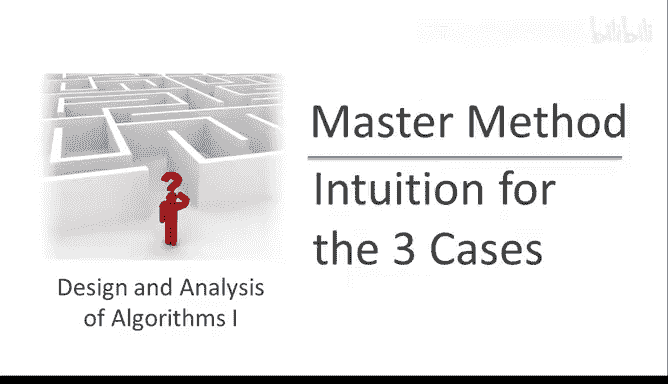
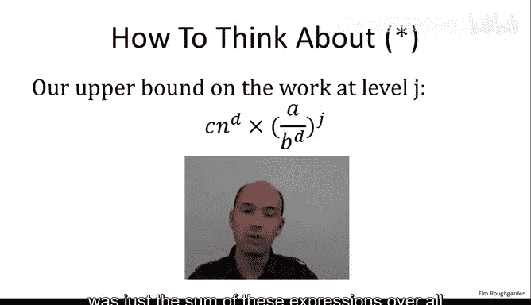
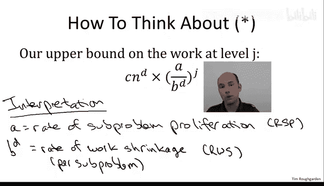
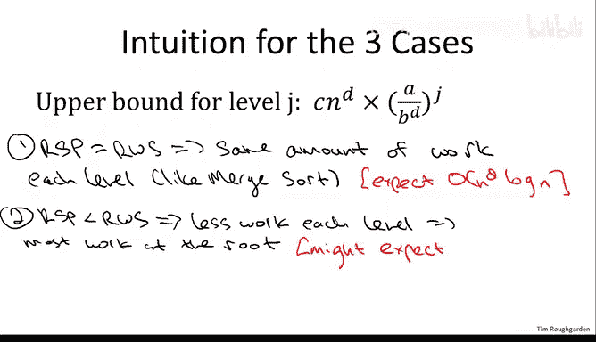
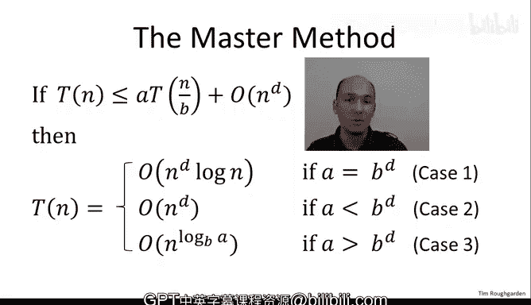

# 023：主定理三种情况的直观解释 🧠

在本节课中，我们将深入理解主定理证明的直观部分。我们将探讨递归算法运行时间背后的“拉锯战”，并解释为何会自然产生三种不同的情况。通过理解子问题增殖率与工作量缩减率之间的竞争关系，我们可以直观地预测每种情况下的算法运行时间。

---

在上一节视频中，我们通过递归树方法分析了分治算法的运行时间上界，并得到了一个复杂的表达式。本节中，我们将不再进行具体计算，而是专注于解读这个表达式，为其赋予实际意义，并理解这种解读如何自然地引出主定理的三种情况，同时为我们将看到的运行时间提供直觉。

### 递归树中的关键表达式

回顾上一节，我们通过聚焦于递归树的特定层级 `J` 来界定算法完成的工作量。我们计算了该层级的子问题数量 `A^J` 乘以每个子问题的工作量 `C * (N / B^J)^D`，从而得到了表达式：`C * N^D * (A / B^D)^J`。

我们最终得到的表达式 `*` 是这个量在所有对数级别 `J` 上的总和。尽管这个表达式看起来很复杂，但我们可能走对了方向，因为主定理的三种情况正是由 `A` 与 `B^D` 的比较关系决定的，而在这个表达式中，我们恰好看到了比值 `A / B^D`。

让我们深入探讨，理解为何这个比值对分治递归算法的性能至关重要。

### 算法性能的“拉锯战” ⚔️

主定理本质上描述的是两种对立力量之间的“拉锯战”：一种是“善”的力量，一种是“恶”的力量，它们分别对应着 `B^D` 和 `A` 这两个量。

*   **参数 `A`（恶的力量）**：`A` 代表算法进行的递归调用次数，即递归树中一个节点的子节点数量。从根本上说，`A` 衡量的是随着递归深度增加，**子问题增殖的速率**。它是下一层子问题数量比上一层多的倍数。
*   **参数 `B^D`（善的力量）**：`B` 是输入规模随递归层级 `J` 缩小的因子。`D` 是递归调用外所做工作关于输入规模的指数（例如，线性工作 `D=1`，二次工作 `D=2`）。我们真正关心的是每个子问题工作量的缩减程度，这正是 `B^D`。因此，`B^D` 代表了**工作量缩减的速率**。

因此，主定理的三种情况对应着这场“拉锯战”的三种可能结果：平局、恶的力量获胜（`A > B^D`）以及善的力量获胜（`B^D > A`）。

为了更好地理解，请思考递归树中每层工作量的变化趋势：随着层级加深，每层总工作量是增加、减少还是保持不变？

### 每层工作量的变化趋势 📈📉

以下是关于每层工作量变化的陈述，其中第三个是错误的：

1.  如果子问题增殖速率 `A` **小于** 工作量缩减速率 `B^D`，则随着递归树层级加深，完成的工作量**减少**。
2.  如果子问题增殖速率 `A` **大于** 工作量缩减速率 `B^D`，则随着递归树层级加深，完成的工作量**增加**。
3.  如果子问题增殖速率 `A` **等于** 工作量缩减速率 `B^D`，则随着递归树层级加深，完成的工作量**可能增加也可能减少**。
4.  如果子问题增殖速率 `A` **等于** 工作量缩减速率 `B^D`，则递归树每一层完成的工作量**相同**。

让我们逐一分析：
*   **陈述1为真**：善的力量（工作量缩减）压倒了恶的力量（子问题增殖），因此每层工作量递减。
*   **陈述2为真**：原因正好相反，恶的力量获胜，每层工作量递增。
*   **陈述3为假**：根据 `A` 与 `B^D` 的比较关系，我们可以明确得出工作量是递增还是递减的结论。
*   **陈述4为真**：这是善与恶力量的完美平衡。子问题在增殖，但每个子问题的工作量以完全相同速率缩减，两者抵消，导致每层工作量相同。这正是我们分析归并排序时遇到的情况。

### 从直觉到运行时间预测 🔮

总结一下，主定理的三种情况对应于子问题增殖与工作量缩减之间战斗的三种可能结果：平局、子问题增殖更快、或工作量缩减更快。

*   **情况1（平局）**：速率完全相同，相互抵消。那么递归树每一层的工作量应该相同。在这种情况下，我们可以轻松预测运行时间：我们知道有对数数量的层级，每层工作量相同，并且我们知道根节点的工作量（由递归式给出，渐近为 `N^D`）。因此，对于 `log N` 层，每层做 `N^D` 的工作，我们期望运行时间为 `N^D * log N`。
*   **情况2（工作量缩减更快）**：每个子问题的工作量缩减速度超过了子问题的增殖速度。那么随着递归层级的加深，工作量越来越少。最坏的情况（工作量最大的层级）出现在**根层级**。最简单的可能结果是根层级的工作量主导了整个算法的运行时间（其他层级的影响只差一个常数因子）。如果这个最简单的结果成立，我们期望运行时间与根节点的工作量成正比，即 `N^D`。
*   **情况3（子问题增殖更快）**：子问题增殖如此迅速，以至于超过了每个子问题工作量的节省。工作量随着递归层级增加而增加。这里最坏的情况将出现在**叶子节点**，那一层的工作量将比其他任何层级都多。同样，如果最简单的可能结果成立，也许叶子节点的工作量（在常数因子内）主导了算法的运行时间。由于叶子节点对应基本情况，每个叶子做常数工作量，因此我们期望运行时间在最简单的情况下与递归树中**叶子节点的数量**成正比。

---

### 本节总结 📝

在本节中，我们一起学习了：
1.  递归树本质上分为三种类型：每层工作量相同的树、工作量随层级递减（根节点最坏）的树、以及工作量随层级递增（叶子节点最坏）的树。
2.  正是子问题增殖速率 `A` 与工作量缩减速率 `B^D` 之间的比值，决定了我们面对的是哪一种递归树。
3.  我们基于直觉对三种情况下的运行时间做出了预测：对于情况1，我们相当确信是 `N^D log N`；对于情况2，我们希望是 `N^D`；对于情况3，我们希望它与叶子节点数量成正比。

现在，让我们用主定理的正式陈述来检验这些直觉。在三种情况中，前两种与我们的直觉完全吻合：情况1是 `Θ(N^D log N)`，情况2（根节点最坏）确实是 `Θ(N^D)`。然而，情况3仍然存在一个谜团：我们的直觉说它应该与叶子节点数量成正比，但定理给出的却是 `Θ(N^{log_B A})` 这个有趣的公式。

在下一节视频中，我们将揭开这个联系的神秘面纱，并为这些断言提供一个正式的证明。