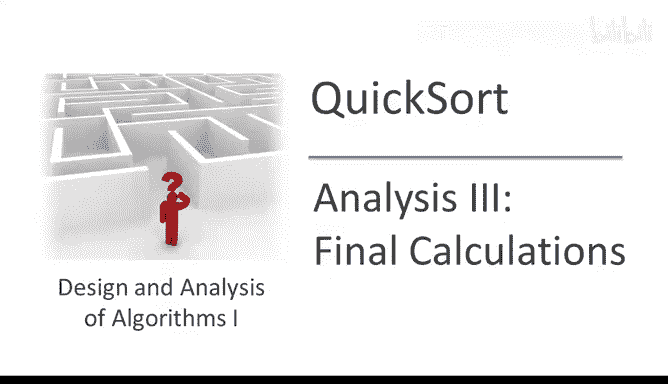
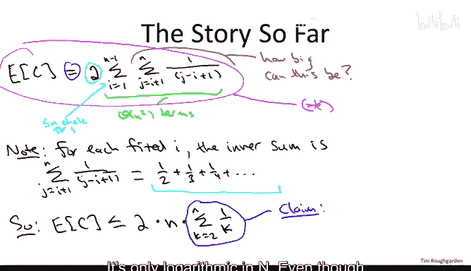
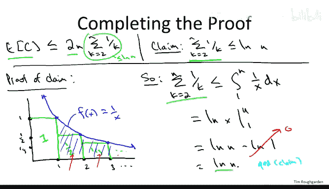

# 031：最终计算 📊

在本节课中，我们将完成对随机化快速排序算法的平均运行时间分析。我们将整合前几节的结果，通过一个巧妙的数学技巧，最终证明其平均运行时间为 **O(n log n)**。

---

## 回顾与目标

上一节我们介绍了如何将快速排序的总比较次数 **C** 分解为一系列指示随机变量 **X_ij** 的和，并精确计算了任意一对元素被比较的概率。本节中，我们来看看如何将这些结果结合起来，完成最终的计算。

我们证明的目标是：对于长度为 **n** 的任意输入数组，随机化快速排序（每次随机均匀选择枢轴元素）的平均运行时间是 **O(n log n)**。

## 精确的期望表达式

基于之前的分析，我们得到了一个完全精确的表达式，用于描述快速排序的平均比较次数 **E[C]**：

**E[C] = Σ_{i=1}^{n-1} Σ_{j=i+1}^{n} 2 / (j - i + 1)**

这个双重求和精确地计算了所有可能的元素对 (i, j) 被比较的概率（即 2/(j-i+1)）之和。到目前为止，我们的推导没有任何近似。

## 从双重求到单重求和

我们的目标是证明 **E[C] = O(n log n)**。直接观察双重求和，其项数高达 **O(n²)** 量级，但每一项的值很小。为了得到一个紧致的上界，我们需要更巧妙地处理这个求和。

思路是固定外层求和中的索引 **i**，然后分析内层求和的最大可能值。

*   对于固定的 **i**，内层求和为：**Σ_{j=i+1}^{n} 1 / (j - i + 1)**
*   当 **j** 从 **i+1** 增加到 **n** 时，分母 **(j - i + 1)** 从 **2** 增加到 **(n - i + 1)**。因此，内层求和是形如 **1/2 + 1/3 + 1/4 + ... + 1/(n-i+1)** 的调和数部分和。
*   在所有可能的 **i** 中，当 **i=1** 时，这个内层求和达到最大值：**1/2 + 1/3 + ... + 1/n**。

因此，我们可以对原始表达式 **E[C]** 进行放缩（上界估计）：

**E[C] = Σ_{i=1}^{n-1} Σ_{j=i+1}^{n} 2 / (j - i + 1) ≤ Σ_{i=1}^{n} 2 * [Σ_{k=2}^{n} 1/k]**

这里，我们做了两处宽松处理以简化计算：
1.  将外层求和上限从 **n-1** 放宽到 **n**。
2.  用最大的内层和（即 **Σ_{k=2}^{n} 1/k**）来统一上界所有内层和。

于是，问题简化为证明：

**E[C] ≤ 2n * [Σ_{k=2}^{n} 1/k]**

并且关键是要证明这个调和和 **Σ_{k=2}^{n} 1/k** 的大小仅为 **O(log n)**。

## 证明调和和为 O(log n)

以下是证明调和数 **H_n = Σ_{k=1}^{n} 1/k** 的增长速度约为 **log n** 的经典方法。

我们可以通过几何图形来直观理解并证明其上界。

考虑函数 **f(x) = 1/x** 在区间 **[1, n]** 上的积分。这个积分代表了曲线下的面积。

现在，观察从 **k=2** 到 **n** 的和 **Σ 1/k**。每一项 **1/k** 可以看作是一个宽度为 **1**、高度为 **1/k** 的矩形的面积（该矩形的x轴范围是 **[k-1, k]**）。

将这些矩形从左到右排列，你会发现函数 **f(x) = 1/x** 的曲线恰好经过每个矩形右上角的顶点。由于曲线是凸的，在区间 **[k-1, k]** 上，曲线 **f(x)** 始终位于矩形顶部之下。因此，从 **x=1** 到 **x=n**，曲线下的面积 **∫_{1}^{n} (1/x) dx** 严格大于从 **k=2** 开始的这些矩形面积之和。

用数学公式表达：

**Σ_{k=2}^{n} 1/k ≤ ∫_{1}^{n} (1/x) dx**

计算这个积分：

**∫_{1}^{n} (1/x) dx = ln(x) |_{1}^{n} = ln(n) - ln(1) = ln(n)**

因此，我们得到：

**Σ_{k=2}^{n} 1/k ≤ ln(n)**

这就证明了调和和的上界是自然对数 **ln(n)**，即 **O(log n)**。

## 完成定理证明

将上述结果代入我们对 **E[C]** 的上界估计中：

**E[C] ≤ 2n * [Σ_{k=2}^{n} 1/k] ≤ 2n * ln(n)**

所以，随机化快速排序的**期望比较次数** **E[C] = O(n log n)**。

由于快速排序的（平均）运行时间主要由比较操作主导，并且其实现是原地进行的（只需常数额外空间），因此我们可以得出结论：随机化快速排序的**期望运行时间**也是 **O(n log n)**。

---

## 总结

本节课中我们一起学习了快速排序算法平均情况分析的收官步骤。
1.  我们首先回顾了之前得到的精确期望表达式。
2.  接着，我们通过将双重求和放缩为单重求和，简化了问题。
3.  然后，我们利用积分作为上界，巧妙地证明了关键调和和 **Σ 1/k** 为 **O(log n)**。
4.  最终，我们整合所有步骤，严格证明了随机化快速排序的平均运行时间为 **O(n log n)**，并且常数因子较小（约为 **2**）。这从数学上完整解释了为何快速排序在实践中如此高效。