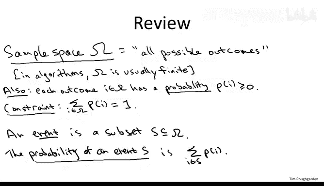
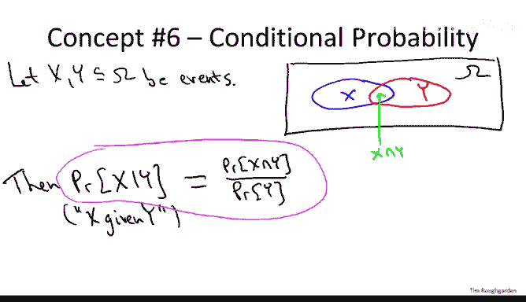
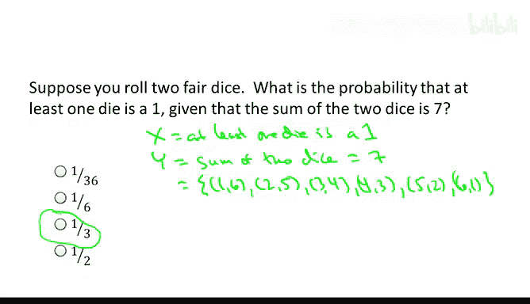
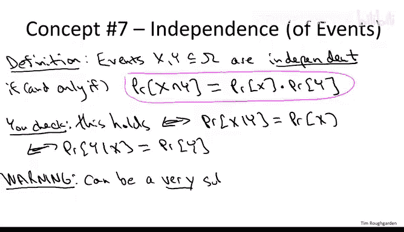
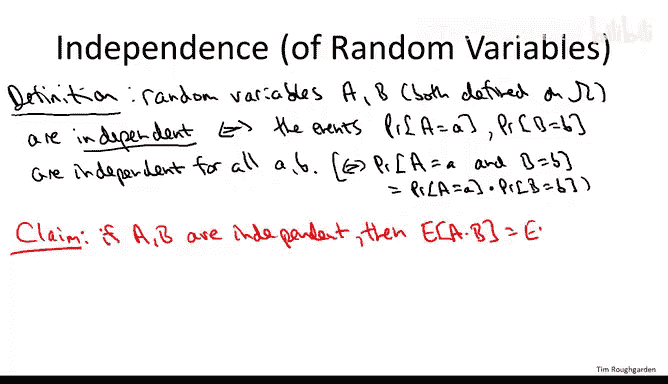
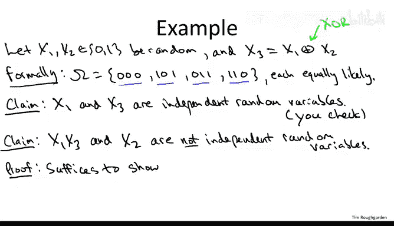

# 033：概率论回顾 II

## 概述

在本节课中，我们将继续学习概率论的基础知识。我们将重点介绍两个紧密相关的核心概念：**条件概率**与**独立性**。理解这些概念对于分析某些随机算法至关重要。

---

## 样本空间与事件回顾

在开始新内容之前，我们先快速回顾一下上一节的核心概念。**样本空间**（Ω）代表了随机过程所有可能结果的集合。每个结果都有一个已知的概率 **P(i)**，且所有结果的概率之和为 1。

**事件**（例如事件 X 或 Y）仅仅是样本空间的一个子集。一个事件的概率就是该事件包含的所有结果的概率之和。

---

## 条件概率

上一节我们介绍了概率的基本概念，本节中我们来看看**条件概率**。条件概率讨论的是在已知另一个事件发生的情况下，某个事件发生的概率。

设 X 和 Y 是同一样本空间中的两个事件。我们可以用文氏图来思考：Ω 代表所有可能发生的事，X 和 Y 是其中的两个区域，它们可能有交集，也可能没有。

我们想要定义的是：在已知事件 Y 发生的情况下，事件 X 发生的概率，记作 **P(X | Y)**。

其定义非常直观：既然已知 Y 发生，我们就把关注范围缩小到 Y 这个区域。在这个新世界里，我们关心的是 Y 中有多大比例也被 X 占据。因此，条件概率的公式定义为：

**P(X | Y) = P(X ∩ Y) / P(Y)**

---

### 条件概率示例

为了确保您理解条件概率的定义，我们来看一个掷两个骰子的经典例子。

**问题**：已知两个骰子的点数之和为 7，求至少有一个骰子点数为 1 的概率。

**解答**：
1.  定义事件：
    *   X：至少有一个骰子点数为 1。
    *   Y：两个骰子点数之和为 7。
2.  事件 Y 包含 6 种等可能的结果：(1,6), (2,5), (3,4), (4,3), (5,2), (6,1)。
3.  事件 X ∩ Y 是同时满足“和为7”和“至少有一个1”的结果，即 (1,6) 和 (6,1)，共 2 种。
4.  根据定义计算：
    *   P(X ∩ Y) = 2/36
    *   P(Y) = 6/36
    *   P(X | Y) = (2/36) / (6/36) = **1/3**

因此，在已知点数和为7的条件下，至少有一个骰子为1的概率是三分之一。

---

## 事件的独立性

理解了条件概率后，我们自然可以引出**独立性**的概念。两个事件 X 和 Y 是独立的，当且仅当下面的等式成立：

**P(X ∩ Y) = P(X) * P(Y)**

这个定义有一个更直观的解释：事件 X 和 Y 独立，当且仅当 **P(X | Y) = P(X)**。也就是说，知道 Y 发生与否，完全不影响 X 发生的概率。对称地，也有 **P(Y | X) = P(Y)**。

**重要警告**：独立性是一个微妙的概念，直觉常常会出错。即使是专业的研究人员，也常常因为误用对独立性的直觉而犯错。一个实用的经验法则是：除非两个变量在构造上明显独立（例如算法中明确设定的独立随机选择），否则在分析时应先假设它们是相关的。

---

## 随机变量的独立性

之前我们讨论了事件的独立性，现在将其推广到随机变量。随机变量是从样本空间到实数的函数。

两个随机变量 A 和 B 是独立的，意味着对于它们取任意值的组合，相应的事件都是独立的。非正式地说，知道其中一个变量的值，不会给你任何关于另一个变量值的信息。

形式上，A 和 B 独立当且仅当对任意值 a, b，都有：
**P(A=a 且 B=b) = P(A=a) * P(B=b)**

---

### 独立随机变量的期望乘积

独立性的一个非常有用的性质是关于期望的。对于两个**独立**的随机变量 A 和 B，它们的乘积的期望等于它们期望的乘积：

**E[A * B] = E[A] * E[B]**

**请注意**：这个性质**仅当**随机变量独立时才成立。这与期望的线性性质（E[A+B] = E[A] + E[B]）不同，线性性质不需要任何前提条件。

**推导简述**：
E[A*B] = Σ_a Σ_b (a * b * P(A=a 且 B=b))
由于独立性，P(A=a 且 B=b) = P(A=a) * P(B=b)
因此，E[A*B] = (Σ_a a * P(A=a)) * (Σ_b b * P(B=b)) = E[A] * E[B]

---

## 综合示例：辨析独立与依赖

让我们通过一个具体的例子，将上述概念串联起来，并展示判断独立性有时并不直观。

**设定**：定义三个随机变量 X1, X2, X3。
*   X1 和 X2 是独立的，各自以 1/2 的概率取 0 或 1。
*   X3 由 X1 和 X2 决定：**X3 = X1 XOR X2**（异或运算：两者相同时为0，不同时为1）。

样本空间有四个等可能的结果：
(X1, X2, X3) = (0,0,0), (1,0,1), (0,1,1), (1,1,0)

---

以下是关于独立性的两个论断：

**论断一：X1 和 X3 是独立的。**
这或许有些反直觉，因为 X3 部分依赖于 X1。但检查所有结果：(X1, X3) 取值为 (0,0), (1,1), (0,1), (1,0)，每种组合概率均为 1/4。这就像两个独立的公平硬币投掷，因此它们独立。

**论断二：随机变量 (X1 * X3) 和 X2 是**不**独立的。**
我们将通过反驳“期望乘积性质”来证明。如果它们独立，则应有 E[(X1*X3) * X2] = E[X1*X3] * E[X2]。
1.  计算右边：
    *   由于 X1 和 X3 独立（论断一），E[X1*X3] = E[X1] * E[X3] = (1/2) * (1/2) = 1/4。
    *   E[X2] = 1/2。
    *   因此右边 = (1/4) * (1/2) = **1/8**。
2.  计算左边 E[X1 * X3 * X2]：
    *   查看样本空间：在四种结果中，X1 * X3 * X2 的值分别为 0, 0, 0, 0。
    *   因此，E[X1 * X3 * X2] = **0**。
3.  由于 0 ≠ 1/8，期望乘积性质不成立，所以 (X1*X3) 和 X2 **不是**独立的。

这个例子说明，即使变量间存在某种关系，独立性也可能以非平凡的方式出现或消失，必须严格依据定义或性质进行判断。

---

## 总结

本节课中我们一起学习了概率论回顾的第二部分。我们深入探讨了**条件概率**的定义与计算，并在此基础上引出了**事件**和**随机变量**的**独立性**概念。我们特别强调了独立性的微妙性，以及一个关键性质：对于独立随机变量，**乘积的期望等于期望的乘积**。最后，通过一个综合示例，我们练习了如何辨析变量间的独立与依赖关系。掌握这些概念是分析复杂随机算法的基础。