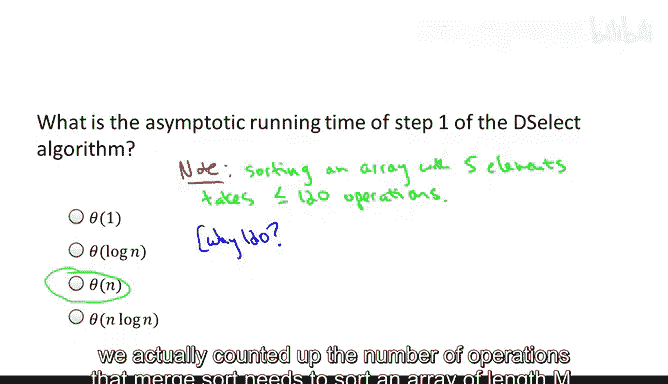
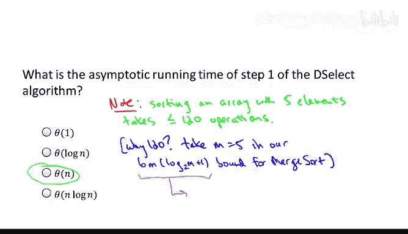
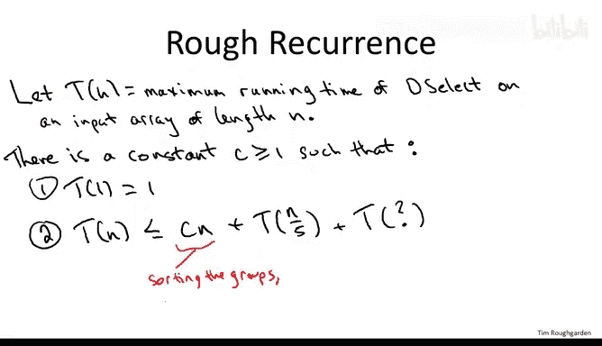
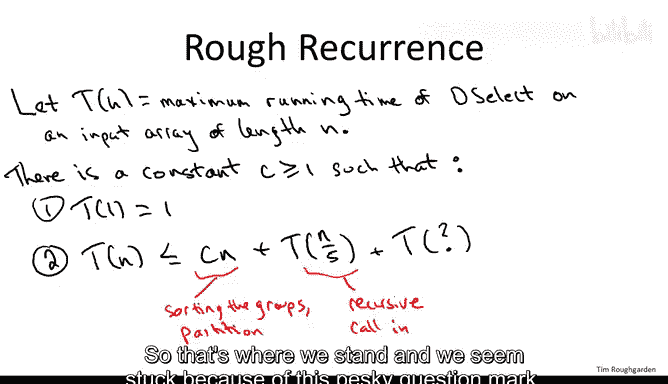
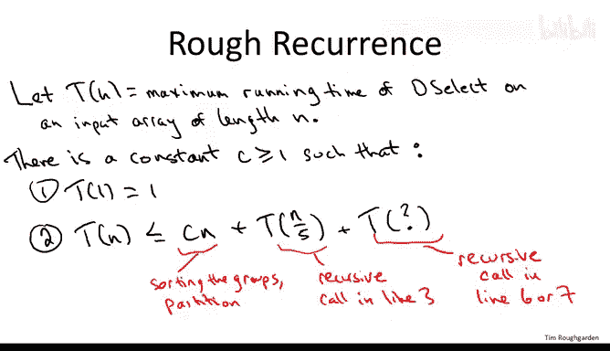
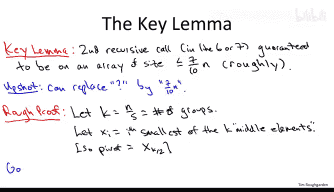
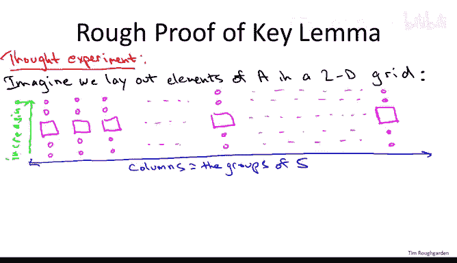
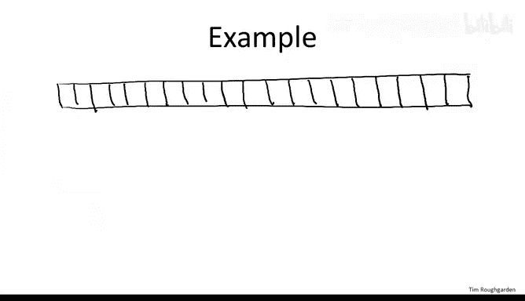
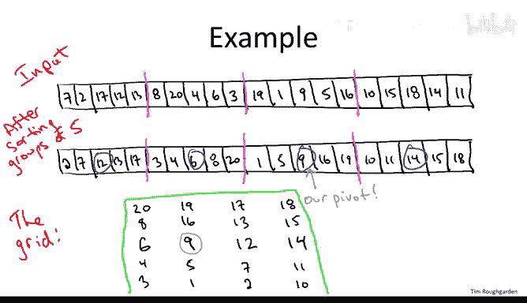

# 037：确定性选择算法分析 I（进阶可选）🔍

在本节课中，我们将要学习如何分析确定性选择算法。我们将证明，该算法在任何可能的输入上都能在线性时间内运行。我们将从回顾算法开始，逐步分析其各个步骤的时间复杂度，并最终证明其线性时间性能。

---

## 算法回顾

上一节我们介绍了确定性选择算法的基本思想。本节中，我们来看看算法的具体步骤。该算法基于随机选择算法，但通过一个精心设计的子程序来选择枢轴元素，以确保其质量。

算法的核心是 `choose_pivot` 子程序，它本质上实现了一个两轮淘汰赛：

1.  **第一轮比赛**：将输入数组分成若干组，每组包含五个元素。对每组进行排序（例如使用归并排序），并选出每组的中位数（即第三大的元素）作为“第一轮胜者”。
2.  **第二轮比赛**：将所有第一轮胜者复制到一个新数组 `C` 中，然后递归调用选择算法本身，找出数组 `C` 的中位数。这个中位数就是最终的枢轴元素 `p`。

选定枢轴后，算法像随机选择算法一样进行分区，并根据目标元素与枢轴的相对位置，递归地在左侧或右侧子数组中继续查找。

---

## 步骤一：排序小组的时间分析

首先，我们来分析算法中看似最耗时的部分：对每组五个元素进行排序。以下是关键点：

*   排序一个包含五个元素的数组只需要常数时间。例如，使用归并排序，其操作数上限约为 **120** 次。
*   这个常数 **120** 来源于归并排序的公式。对于长度为 `m` 的数组，归并排序的操作数约为 `6m * (log₂ m + 1)`。代入 `m = 5`，`log₂ 5 < 3`，得到 `6 * 5 * (3 + 1) = 120`。
*   总共有 `n/5` 个这样的小组。因此，步骤一的总操作数最多为 `120 * (n/5) = 24n`，这显然是 **O(n)**，即线性时间。

所以，尽管涉及排序，但由于每组规模极小且组数是线性的，这一步的整体开销是线性的。

---

## 建立递归式

现在，让我们分析整个七行算法。我们采用分析确定性分治算法的标准范式：建立递归式。递归式 `T(n)` 表示算法在长度为 `n` 的输入上的最大操作数，它由两部分组成：递归调用在更小子问题上的工作，以及本地（非递归）部分的工作。

以下是逐行分析：

1.  **排序小组**：如上所述，时间为 **Θ(n)**。
2.  **复制胜者到数组 C**：显然是线性时间 **Θ(n)**。
3.  **递归调用选择算法找中位数**：这是在数组 `C` 上进行的，`C` 的长度为 `n/5`。因此，这部分时间是 **T(n/5)**。
4.  **分区**：与快速排序一样，分区操作是线性时间 **Θ(n)**。
5.  **常数时间操作**：可忽略。
6.  **根据情况递归查找**：这里有一个递归调用，但其输入规模未知，取决于分区后子数组的大小。我们暂时将其记为 **T(?)**。

综合以上，我们得到递归式：

**T(n) ≤ T(n/5) + T(?) + c*n** （对于某个常数 c）

当 `n = 1` 时，`T(1) = 1`（常数时间）。

我们分析的关键障碍在于那个未知的 `T(?)`。

---

## 关键引理：枢轴的质量保证

为了替换掉 `T(?)`，我们需要理解枢轴 `p` 的质量。以下引理至关重要：

**引理**：通过上述两轮淘汰赛选出的枢轴 `p`，能保证将数组分割为至少 **30-70** 的比例（或更好）。也就是说，至少有 **30%** 的元素小于 `p`，也至少有 **30%** 的元素大于 `p`。

这意味着，无论我们在第6或7行进行哪一侧的递归，递归调用的输入规模最多是原数组的 **70%**。因此，我们可以用 **T(0.7n)** 来替换 `T(?)`（为简化分析，忽略细微的加减常数）。

**证明思路**：
为了证明这个引理，我们进行一个思维实验。将 `n` 个元素排列成一个网格：

*   每列代表一个五人小组，共 `n/5` 列。
*   每列内，元素从下到上按从小到大排列。因此，中间行（第三行）的元素就是各组的“第一轮胜者”（中位数）。
*   各列从左到右，按其中位数（第一轮胜者）的值从小到大排列。

设 `k = n/5`，令 `x_i` 为第 `i` 小的中位数。那么，我们的枢轴 `p` 就是 `x_{k/2}`（即所有中位数的中位数）。

现在考虑网格中位于 `p` **左下方**（西南方向）的所有元素：
*   由于列按中位数排序，`p` 左侧所有列的中位数都小于 `p`。
*   由于每列内从上到下递增，这些列中位于 `p` 所在行以下的两个元素也必然小于其中位数，从而小于 `p`。
因此，整个西南区域（至少 `(k/2) * 3 ≈ (n/5)/2 * 3 = 0.3n` 个元素）都小于 `p`。

对称地，`p` **右上方**（东北方向）的所有元素都大于 `p`，数量也至少为 **0.3n**。

这就证明了枢轴 `p` 至少能将数组划分为 **30-70** 的比例。

---

## 当前进展与下一步

至此，我们证明了选择枢轴的子程序能保证产生一个相当好的分割。这允许我们将递归式更新为：

**T(n) ≤ T(n/5) + T(0.7n) + c*n**

然而，证明引理本身需要付出代价——它依赖于一个递归调用 `T(n/5)`。一个自然的问题是：为了获得好的分割而付出的这个额外递归代价，是否会抵消掉分割带来的好处，从而无法实现线性时间？

我们似乎还没有完全赢得胜利。在下一节中，我们将完成这个递归式的求解，最终证明 **T(n) = O(n)**，即确定性选择算法确实在线性时间内运行。

---

本节课中我们一起学习了确定性选择算法的结构，并分析了其关键步骤的时间复杂度。我们证明了用于选择枢轴的子程序虽然涉及递归和排序，但其本地操作是线性时间的。更重要的是，我们通过一个巧妙的网格论证，证明了该子程序能保证选出的枢轴至少产生 **30-70** 的分割。这为我们最终证明算法的线性时间复杂度奠定了关键基础。在下一讲中，我们将完成最后的分析。