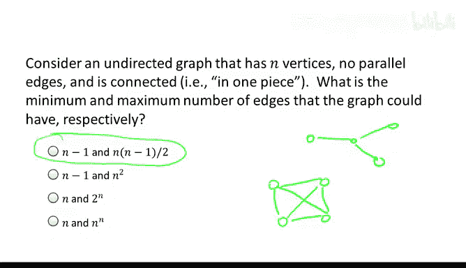
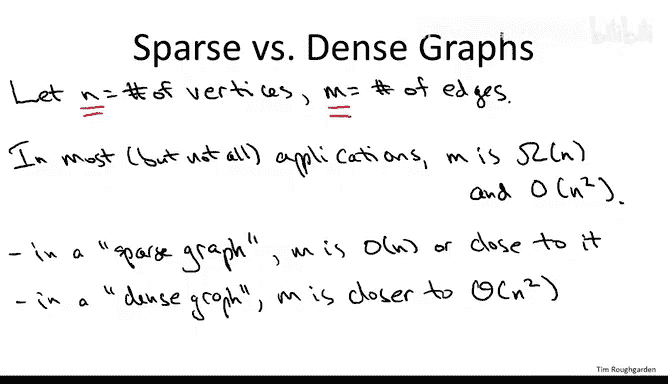
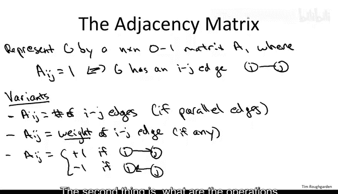
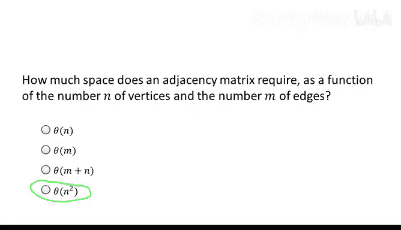
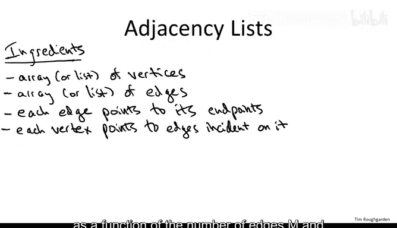
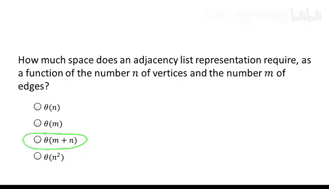
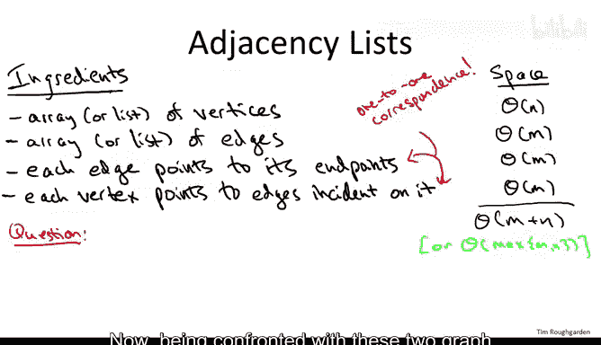

# 041：图表示方法 📊

在本节课中，我们将学习图论的基础知识，特别是如何衡量图的大小以及如何表示图。这些是讨论图算法之前必须掌握的基本概念。

## 图的基本概念

图由两个基本要素构成。首先，是我们讨论的对象集合，这些对象可以称为顶点，也可以称为节点。其次，我们使用边来表示对象之间的成对关系。边可以是无向的，此时它们是无序对；边也可以是有向的，从一个顶点指向另一个顶点，此时它们是有序对，我们称之为有向图。

## 图的规模

当我们讨论图的大小或图算法的运行时间时，需要明确输入规模的含义。与数组不同，数组只有一个长度参数，而图有两个不同的参数控制其大小：顶点数和边数。通常，我们用 **N** 表示顶点数，用 **M** 表示边数。

接下来，我们通过一个思考题来理解边数 **M** 如何依赖于顶点数 **N**。

### 思考题：边数的范围

考虑一个无向图，它有 **n** 个顶点，没有平行边（即任意一对顶点之间最多只有一条边）。同时，假设图是连通的（即图是一个整体，不能分成两个没有边连接的部分）。对于这样的图，其边数 **M** 的最小可能值和最大可能值是多少？

**正确答案是第一个选项**。一个连通无向图的最少边数是 **n - 1**。一个没有平行边的无向图的最大边数是 **n * (n-1) / 2**，也就是 **n 选 2**。

**为什么最少需要 n-1 条边？**
想象一下逐条添加边。初始时，图有 **n** 个孤立的顶点，即 **n** 个独立部分。每添加一条边，最多能将两个独立部分融合成一个。因此，要将 **n** 个部分减少到 **1** 个部分，至少需要添加 **n-1** 条边。树状图正好达到这个下界。

**为什么最多是 n 选 2 条边？**
显然，边数最多的情况是完全图，即每对顶点之间都有一条边。由于没有平行边且边是无序的，最多有 **n 选 2** 种可能的边。

## 稀疏图与稠密图

了解了边数如何随顶点数变化后，我们来讨论稀疏图和稠密图的区别。区分这两个概念很重要，因为某些数据结构和算法更适合稀疏图，而另一些则更适合稠密图。

为了精确描述，我们使用标准符号：
*   **N** 表示图的顶点数。
*   **M** 表示图的边数。

从之前的思考题我们知道，在大多数应用中（假设图连通且无平行边），边数 **M** 至少是 **N** 的线性函数（至少为 **N-1**），最多是 **N** 的二次函数（最多为 **N 选 2**）。

虽然实践中人们对这个术语的使用有些宽松，但基本概念是：
*   **稀疏图**：边数更接近下界，即接近线性。
*   **稠密图**：边数更接近上界，即接近二次。

通常，如果边数超过 **N** 乘以某个对数项，我们倾向于认为它是稠密图。

## 图的表示方法

接下来，我们讨论图的两种表示方法。本课程主要使用第二种，但第一种邻接矩阵也值得简要了解。

### 邻接矩阵

邻接矩阵是一种直观的想法，用一个矩阵来表示图中的边。

首先描述无向图的情况。矩阵用大写 **A** 表示，是一个 **n x n** 的方阵，其中 **n** 是图的顶点数。矩阵元素 **A[i][j]** 的含义是：当且仅当顶点 **i** 和 **j** 之间存在边时，其值为 **1**。这里假设顶点被命名为 **1, 2, 3, ..., n**。

邻接矩阵可以很容易地扩展以适应平行边、边权重或有向边：
*   对于平行边，可以让 **A[i][j]** 表示顶点 **i** 和 **j** 之间的边数。
*   对于边权重，可以让 **A[i][j]** 表示边 **i-j** 的权重。
*   对于有向图，如果弧从 **i** 指向 **j**，可以设 **A[i][j] = +1**；如果从 **j** 指向 **i**，可以设 **A[i][j] = -1**。

我们可以从多个维度评估一种数据结构或表示方法，其中两个重要的维度是：所需的资源量（此处指空间）以及数据结构支持的操作。

**邻接矩阵的空间需求是多少？**

答案是 **n²**，这与边的数量 **M** 无关。这是存储一个 **n x n** 矩阵最直接的方式。虽然对于稀疏图可以使用稀疏矩阵技巧来优化，但基本思想就是存储 **n²** 个条目。每个条目只需存储一个比特位来表示边是否存在，因此常数因子很小，但空间复杂度仍然是顶点数的二次方。这对于稠密图（**M** 接近 **n²**）是合适的，但对于稀疏图（**M** 接近线性）则非常浪费。

### 邻接表

邻接表是本课程将主要使用的表示方法，它包含几个组成部分。

首先，将顶点和边作为独立的实体进行跟踪，因此需要为每个实体维护一个数组或列表。

其次，我们希望这两个数组能以明显的方式相互引用：给定一个顶点，我们希望知道它涉及哪些边；给定一条边，我们希望知道它的端点是什么。

具体来说：
1.  每条边将有两个指针，分别指向它的两个端点（对于有向图，则区分头顶点和尾顶点）。
2.  每个顶点将指向所有包含它的边（对于无向图，这很明确；对于有向图，通常顶点跟踪所有以它为尾的边，即所有可以从该顶点出发经过一条边到达的边。也可以额外存储一个数组来跟踪指向它的边，但这会增加存储开销）。

**邻接表的空间需求是多少？**

正确答案是第三个选项：**Θ(M + N)**，我们可以将其视为图大小的线性空间。

我们来分别计算这四个组成部分的空间：
1.  **顶点列表**：存储 **n** 个顶点，每个顶点需要常数空间，因此空间为 **Θ(n)**。
2.  **边列表**：存储 **m** 条边，每条边需要常数空间，因此空间为 **Θ(m)**。
3.  **边的端点指针**：每条边有两个指针指向其端点，每个指针是常数空间，因此总空间为 **Θ(m)**。
4.  **顶点指向边的指针**：这看起来可能让人担心，因为一个顶点可能涉及很多边。但是，请注意，每个这样的指针（顶点指向某条边）都对应着第3类中的一个指针（那条边指回该顶点）。因此，第4类指针的总数与第3类指针的总数相同，也是 **Θ(m)**。

将四部分相加，我们得到 **Θ(n) + Θ(m) + Θ(m) + Θ(m) = Θ(m + n)**。这也可以认为是 **Θ(max(M, N))**。因此，邻接表的空间复杂度与图的“成分”数量（顶点数加边数）成正比，这正是我们期望的。

## 如何选择表示方法

面对这两种图表示方法，你可能会问：应该记住并使用哪一种？

答案通常是：**视情况而定**。这取决于两个因素：图的密度（即 **M** 与 **N** 的关系）以及你需要支持的操作类型。

鉴于本课程的内容以及我心中的应用场景，我可以给出一个明确的答案：**在本课程中，我们将主要关注邻接表**。

原因有二：
1.  **操作需求**：本课程涉及的大多数图原语（如图搜索）非常适合用邻接表实现。进行图搜索时，你到达一个节点，沿着出边前往另一个节点，如此继续。邻接表是进行图搜索的完美工具。邻接矩阵虽然对某些图操作很好，但不是本课程的重点。
2.  **图密度与应用**：如今，许多图原语的动机来自于海量网络。例如，万维网可以被有效地视为一个有向图，其中顶点是单个网页，有向弧对应从一个页面指向另一个页面的超链接。万维网图的顶点数保守估计约有 **10¹⁰**（100亿）个。这接近当前计算机能力的极限，但仍在极限之内。如果使用邻接矩阵，**N²** 将达到 **10²⁰**，这远远超出了任何可行范围。而邻接表呢？万维网中顶点的平均出度大约是10，因此边数大约是 **10¹¹**，邻接表的空间开销与此成正比。这虽然也极具挑战性，但仍在当前技术的能力范围内。因此，使用邻接表表示，我们可以在像万维网图这样的大规模稀疏图上进行非平凡的计算。

---

**本节课总结**

在本节课中，我们一起学习了图论的基础知识。我们明确了图的规模由顶点数 **N** 和边数 **M** 两个参数描述，并探讨了边数在连通无向图中的取值范围（**N-1** 到 **N选2**）。我们区分了稀疏图和稠密图的概念。重点介绍了两种图的表示方法：邻接矩阵和邻接表，分析了它们的空间复杂度分别为 **Θ(N²)** 和 **Θ(M + N)**。最后，我们得出结论，基于本课程的操作需求和典型应用（大规模稀疏图），邻接表将是主要使用的表示方法。