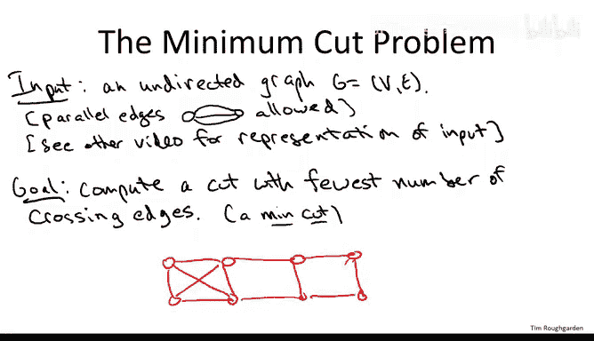
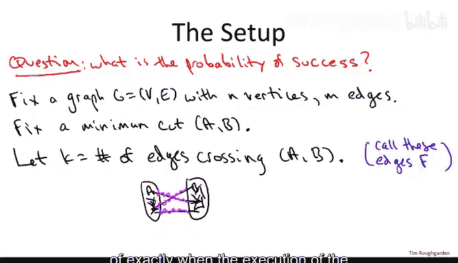
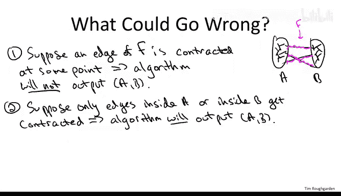
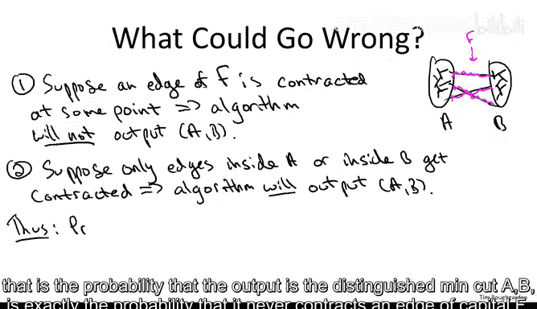
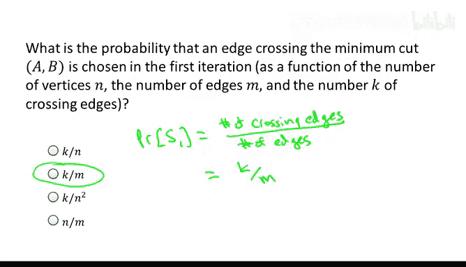
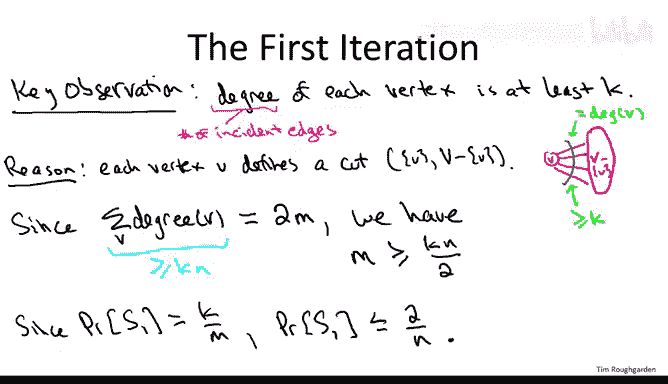
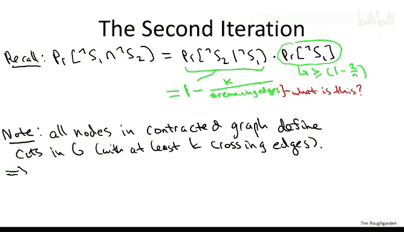
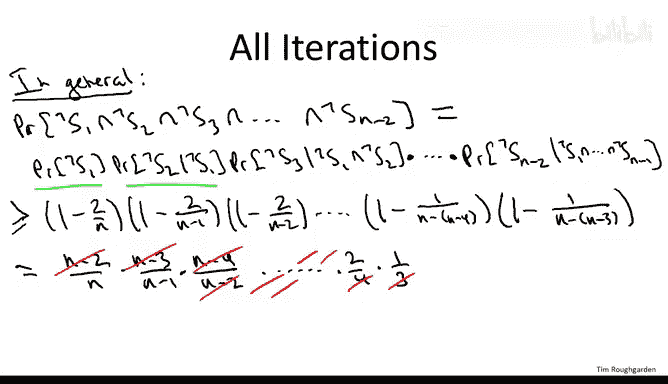
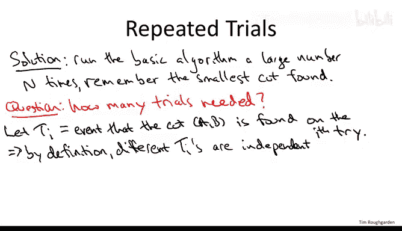
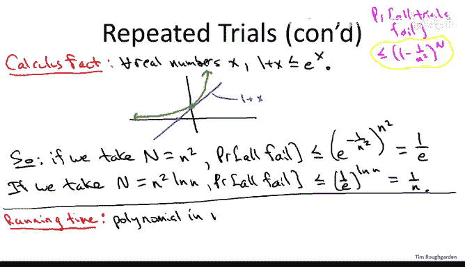

# 043：收缩算法分析 📊



在本节课中，我们将要学习如何分析卡格尔提出的随机收缩算法，以计算无向图的最小割。我们将精确计算该算法成功的概率，并探讨如何通过重复运行来显著提升成功率。

---

## 收缩算法回顾

上一节我们介绍了最小割问题。本节中我们来看看收缩算法的具体分析。

我们被给定一个无向图作为输入，图中可能包含平行边。目标是计算所有可能的割中，拥有最少交叉边数量的那个割。

例如，在下图中，最小割是 `{A, B}`，因为它只有两条交叉边。




卡格尔提出的随机收缩算法基于随机采样。算法包含 `n-2` 次迭代，每次迭代将顶点数减少一个。我们从 `n` 个顶点开始，最终减少到两个顶点。减少顶点数的方法是将两个顶点**收缩**或**融合**在一起。

以下是选择收缩哪对顶点的方法：
*   我们从剩余的边中**均匀随机**地选择一条边。
*   如果选中的边端点是 `U` 和 `V`，我们将 `U` 和 `V` 合并成一个**超节点**。
*   如果合并产生了自环，我们会在继续之前删除它们。



经过 `n-2` 次迭代后，只剩下两个顶点。这两个顶点自然地定义了一个割：一个超节点对应原始图中被融合到该超节点的顶点集合 `A`，另一个超节点对应集合 `B`。



## 成功概率的定义

本视频的目标是回答以下问题：算法输出特定最小割 `(A, B)` 的概率是多少？

我们首先建立基本符号：
*   固定一个输入的无向图 `G`。
*   用 `n` 表示顶点数，`m` 表示边数。
*   固定一个特定的最小割 `(A, B)`。如果图有多个最小割，我们只关注这个特定的割 `(A, B)`，并仅当算法输出这个特定割时才将其定义为成功。
*   用 `k` 表示最小割的大小，即跨越割 `(A, B)` 的边数。
*   将这 `k` 条跨越边记为集合 `F`。

## 算法何时成功？

为了清晰理解算法何时成功，我们需要思考算法执行过程中可能出错的地方。



假设在某个迭代中，我们选择了集合 `F` 中的一条边进行收缩。由于这条边的一个端点在 `A`，另一个在 `B`，收缩操作会将 `A` 中的一个节点和 `B` 中的一个节点融合在一起。这意味着在算法最终输出的割中，这两个节点将位于割的同一侧，因此输出不会是期望的割 `(A, B)`。

反之，如果在所有 `n-2` 次迭代中，算法从未收缩 `F` 中的任何边，那么 `A` 中的顶点始终只与 `A` 中的顶点融合，`B` 中的顶点也始终只与 `B` 中的顶点融合。最终，所有 `A` 中的节点被归入一个超节点，所有 `B` 中的节点被归入另一个超节点，算法输出的正是期望的最小割 `(A, B)`。

**总结**：收缩算法成功输出割 `(A, B)`，当且仅当它从未选择集合 `F` 中的边进行收缩。

因此，成功概率等于算法在所有迭代中均未收缩 `F` 中任何边的概率。

## 分析成功概率

我们将成功概率定义为事件 `¬S1 ∩ ¬S2 ∩ ... ∩ ¬S_{n-2}` 的概率，其中 `S_i` 表示在第 `i` 次迭代中“搞砸”（即收缩了 `F` 中的边）。



我们将分步分析这个概率。

### 第一步：分析第一次迭代

首先，我们分析在第一次迭代中不搞砸的概率。

在第一次迭代中，我们从所有 `m` 条边中均匀随机选择一条边。集合 `F` 中有 `k` 条“危险”边。因此，第一次迭代搞砸的概率是 `k/m`。

为了得到一个用顶点数 `n` 表示的更有用的界限，我们做一个关键观察：在原始图 `G` 中，每个顶点的度数至少为 `k`。这是因为每个顶点本身定义了一个割（该顶点在一侧，其余 `n-1` 个顶点在另一侧），而任何割的交叉边数至少为 `k`，所以该顶点的度数（即该割的交叉边数）至少为 `k`。

利用图论中的握手引理：所有顶点的度数之和等于 `2m`。由于每个度数至少为 `k`，我们有：
```
sum(度数) >= k * n
```
因此：
```
2m >= k * n  =>  m >= (k * n) / 2
```
结合第一次迭代失败概率 `P(S1) = k/m`，我们得到：
```
P(S1) = k/m <= k / ((k * n) / 2) = 2/n
```
所以，第一次迭代成功的概率至少为 `1 - 2/n`。



### 第二步：分析前两次迭代

现在，我们分析在前两次迭代中都不搞砸的概率。

根据条件概率，这等于第一次迭代成功的概率乘以在第一次成功条件下第二次迭代也成功的概率。

我们已经知道第一次成功的概率至少为 `1 - 2/n`。

对于第二次迭代，在已知第一次未收缩 `F` 中边的条件下，图中仍有 `k` 条危险边。我们需要计算此时选中危险边的概率。这个概率是 `k / (剩余边数)`。

为了得到下界，我们需要剩余边数的下界。类似于第一步的推理，在收缩一次后的图中，每个剩余节点（超节点）仍然对应原始图中的一个割，因此其度数至少为 `k`。此时图中剩余 `n-1` 个顶点。再次应用握手引理，剩余边数至少为 `(k * (n-1)) / 2`。

因此，在第一次成功的条件下，第二次迭代失败的概率至多为：
```
k / (剩余边数) <= k / ((k * (n-1)) / 2) = 2/(n-1)
```
所以，在第一次成功的条件下，第二次成功的概率至少为 `1 - 2/(n-1)`。



### 推广到所有迭代

我们可以将上述模式推广到所有迭代。在第 `i` 次迭代时，图中剩余 `n-i+1` 个顶点。每个顶点的度数仍至少为 `k`，因此剩余边数至少为 `(k * (n-i+1)) / 2`。在之前所有迭代均未收缩 `F` 中边的条件下，第 `i` 次迭代失败的概率至多为 `2/(n-i+1)`，成功的概率至少为 `1 - 2/(n-i+1)`。

因此，算法最终成功（即从未收缩 `F` 中任何边）的概率至少为以下乘积：
```
P(成功) >= (1 - 2/n) * (1 - 2/(n-1)) * (1 - 2/(n-2)) * ... * (1 - 2/3)
```
其中最后一项对应倒数第二次迭代（当剩余3个顶点时）。

将 `1 - 2/x` 重写为 `(x-2)/x`，上述乘积变为：
```
P(成功) >= [(n-2)/n] * [(n-3)/(n-1)] * [(n-4)/(n-2)] * ... * [1/3]
```
观察这个乘积，分子和分母的项会大量抵消。最终，只剩下分子中最小的两项（1 和 2）以及分母中最大的两项（n 和 n-1）：
```
P(成功) >= (2 * 1) / (n * (n-1)) = 2 / (n(n-1))
```
为了简化，我们可以用一个更宽松但更简洁的下界：
```
P(成功) >= 1 / n^2
```
**结论**：对于具有 `n` 个顶点的图，收缩算法输出特定最小割 `(A, B)` 的概率至少为 `1/n^2`。

## 通过重复试验提升成功率



虽然 `1/n^2` 的成功概率看起来不高，但请注意，图中总共有指数级数量的割。随机猜测一个割的成功概率约为 `1/2^n`，相比之下 `1/n^2` 要好得多。它是一个多项式倒数，这意味着我们可以通过**重复独立运行**算法来显著降低失败概率。

设我们独立运行算法 `N` 次。定义事件 `T_i` 为第 `i` 次运行成功。我们关心的是所有 `N` 次运行都失败的概率。

由于每次运行独立，且单次失败概率至多为 `1 - 1/n^2`，因此所有运行都失败的概率至多为：
```
P(全部失败) <= (1 - 1/n^2)^N
```
为了分析这个上界，我们使用一个有用的微积分事实：对于所有实数 `x`，有 `1 + x <= e^x`。令 `x = -1/n^2`，则 `1 - 1/n^2 <= e^{-1/n^2}`。

因此：
```
P(全部失败) <= (e^{-1/n^2})^N = e^{-N / n^2}
```
现在，我们可以选择重复次数 `N` 来使失败概率变得任意小。

*   如果令 `N = n^2`，则 `P(全部失败) <= e^{-1} ≈ 0.37`。成功概率提升到了约63%。
*   如果令 `N = n^2 * ln(n)`，则 `P(全部失败) <= e^{-ln(n)} = 1/n`。失败概率降到了 `1/n`，对于大的 `n` 来说已经非常小。

**总结**：通过运行算法 `O(n^2 log n)` 次，我们可以将成功概率从 `1/n^2` 提升到接近1。这是一种通用的**概率放大**技术。

## 关于运行时间的说明

收缩算法本身并不复杂，但按照我们描述的方式（运行 `O(n^2 log n)` 次，每次至少需要查看所有边 `O(m)`），总运行时间是 `O(m * n^2 log n)`，这是一个多项式时间，但比本课程中将看到的大部分算法都要慢。

需要指出的是，存在更优化的实现方式（例如，利用之前运行的信息来指导后续搜索），可以大幅减少运行时间，但这些内容超出了本课程的范围。



---

本节课中我们一起学习了如何分析随机收缩算法的成功概率。我们推导出单次运行找到特定最小割的概率至少为 `1/n^2`，并展示了如何通过重复独立运行 `O(n^2 log n)` 次，将算法的整体失败概率降低到可忽略的水平。这体现了随机算法中通过重复试验进行概率放大的强大技巧。