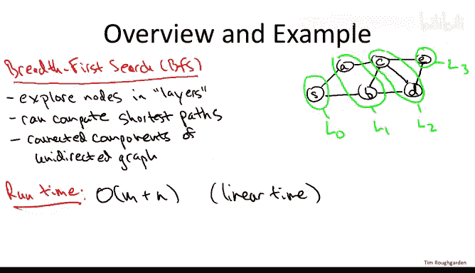
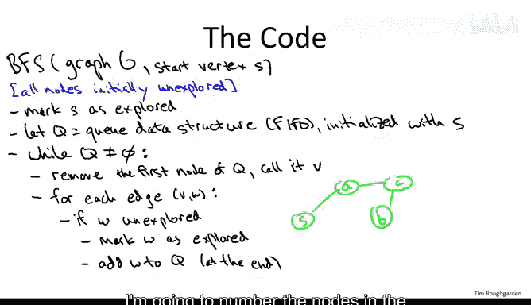
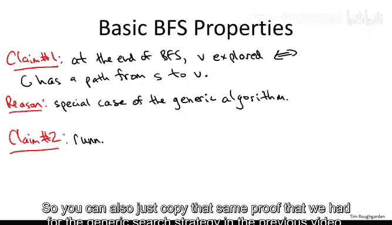
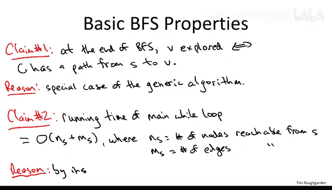

# 046：广度优先搜索-BFS-基础 🚀

在本节课中，我们将深入探讨图搜索的第一个具体策略——广度优先搜索，并了解其应用。

## 概述

我们将学习广度优先搜索的基本原理、线性时间实现方法，以及如何用它来计算最短路径和图的连通分量。核心在于，BFS能够系统地、无重复地探索图中的节点。



## BFS的直观理解与应用

上一节我们介绍了图搜索的通用概念，本节中我们来看看广度优先搜索的具体思路。

BFS从给定的起点开始，按“层”系统地探索图的节点。起点本身构成第0层（L0）。然后，探索起点的所有邻居，这些邻居构成第1层（L1）。接着，探索L1中所有节点的、且未被归入前几层的邻居，这些节点构成第2层（L2），以此类推。

以下是BFS可以完成的任务：
*   **计算最短路径**：在无权图中，从起点到某个节点的最短路径长度，恰好等于该节点所在的层数。
*   **计算连通分量**：对于无向图，BFS可以找出所有互相连通的节点集合，即图的各个“部分”。

我们的目标是实现线性时间复杂度，即 **O(m + n)**，其中 `n` 是节点数，`m` 是边数。

## BFS的线性时间实现 🛠️



理解了BFS的分层思想后，我们来看看如何用代码高效地实现它。

算法的输入是图 `G`（可以是无向图或有向图）和起点 `s`。为了避免重复探索，我们需要一个布尔数组来标记每个节点是否已被访问。初始时，所有节点均标记为“未探索”。

实现的关键是使用一个**队列**数据结构。队列遵循“先进先出”原则，支持在常数时间内从队首移除元素、在队尾添加元素。

以下是BFS算法的伪代码描述：

```python
BFS(Graph G, start vertex s):
    # 初始化
    mark all vertices as unexplored
    mark s as explored
    initialize an empty queue Q
    Q.enqueue(s)  # 将起点放入队列

    # 主循环
    while Q is not empty:
        v = Q.dequeue()  # 从队首取出一个节点
        for each edge (v, w) incident to v:  # 遍历v的所有邻居w
            if w is unexplored:
                mark w as explored
                Q.enqueue(w)  # 将新发现的节点放入队尾
```

让我们通过一个例子来理解代码的执行过程。假设我们有下图，起点为 `S`。节点旁边的数字表示它们被探索（标记）的顺序。


1.  初始：`S` 被标记，放入队列 `Q = [S]`。
2.  循环1：取出 `S`。检查其邻居 `A` 和 `B`，两者均未探索，于是标记并依次加入队列。`Q = [A, B]`。`A` 和 `B` 成为第1层。
3.  循环2：取出 `A`。检查其邻居 `S`（已探索）和 `C`（未探索）。标记 `C` 并加入队尾。`Q = [B, C]`。
4.  循环3：取出 `B`。检查其邻居 `S`（已探索）、`C`（已探索）和 `D`（未探索）。标记 `D` 并加入队尾。`Q = [C, D]`。`C` 和 `D` 成为第2层。
5.  循环4：取出 `C`。检查其邻居 `A`, `B`, `D`（均已探索）和 `E`（未探索）。标记 `E` 并加入队尾。`Q = [D, E]`。
6.  后续循环：处理 `D` 和 `E` 时，它们的邻居都已被探索，因此没有新节点加入。队列最终变空，算法结束。`E` 成为第3层。

可以看到，队列的“先进先出”特性保证了节点严格按照层数递增的顺序被处理。

## BFS的正确性与时间复杂度分析 ✅

我们已经看到了BFS的运行过程，现在来正式分析它的两个重要性质。

**性质一：探索的完备性**
在算法结束时，被标记为“已探索”的节点，恰好是所有从起点 `s` 出发有路径可达的节点。无论图是有向还是无向，这个结论都成立。这保证了BFS不会遗漏任何可达节点，也不会探索不可达节点。

**性质二：线性时间复杂度**
BFS的运行时间是线性的。更精确地说，设从起点 `s` 可达的节点数为 `n_s`，可达的边数为 `m_s`，那么主循环的运行时间为 **O(n_s + m_s)**。

以下是原因分析：







*   **节点开销**：每个可达节点只会被加入队列一次、移除队列一次，每次操作是常数时间。总开销为 O(n_s)。
*   **边开销**：每条可达边最多被检查两次（分别从其两个端点检查），每次检查是常数时间。总开销为 O(m_s)。

因此，总时间复杂度为 O(n_s + m_s)。对于整个图的搜索（即 `s` 能到达所有节点），时间复杂度就是 O(n + m)。

## 总结

本节课中我们一起学习了广度优先搜索。我们从分层探索的直观理解出发，学习了如何使用队列数据结构来实现BFS，并分析了其**O(n + m)**的线性时间复杂度和探索所有可达节点的正确性。BFS不仅是基础的图搜索策略，更是后续计算最短路径和连通分量等问题的强大工具。在接下来的课程中，我们将进一步探索BFS的这些应用。