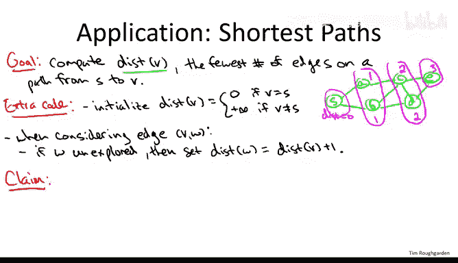

# 047：BFS与最短路径


在本节课中，我们将学习广度优先搜索算法的一个关键应用：计算从起点到图中所有其他节点的最短路径距离。我们将看到，只需对基础的BFS代码进行微小的修改，就能高效地计算出这些距离。

## 概述

上一节我们介绍了广度优先搜索的基本框架。本节中我们来看看如何利用BFS来计算图中节点间的最短路径距离。我们将定义“最短路径距离”的概念，并展示如何通过BFS的“层”结构自然地计算出它。

## 最短路径距离的定义

首先，我们定义一些符号。给定一个起始节点 **S**，我们用 **DIST(V)** 来表示从 **S** 到节点 **V** 的最短路径距离。这个距离指的是从 **S** 到 **V** 的路径上所需的最少“跳数”，也就是路径上的最少边数。这个定义对于无向图和有向图都适用。在有向图中，路径必须沿着弧的正确（向前）方向遍历。

## 修改BFS算法以计算距离

为了计算最短路径距离，我们只需要在之前展示的BFS代码基础上增加非常少量的额外代码。其核心思想是跟踪每个节点所属的“层”，而每一层恰好对应着距离起始点 **S** 的最短路径距离。

以下是需要添加的额外代码：

首先，在初始化步骤中，我们需要为每个节点设置一个初步的距离估计值。

*   对于起始节点 **S**，我们知道从 **S** 到 **S** 的路径长度为0（空路径）。因此，我们设置 `DIST(S) = 0`。
*   对于所有其他顶点 **V**，我们最初并不知道是否存在通往它的路径。因此，我们暂时将它们的距离设为正无穷（`DIST(V) = +∞`）。当然，一旦我们实际发现了一条通往 **V** 的路径，就会更新这个值。

其次，在算法的主循环中，当我们探索边并发现新节点时，需要计算其距离。

*   当我们从队列 **Q** 的前端取出一个顶点 **V**，并遍历它的边时，假设我们正在考虑边 **V-W**。
*   如果 **W** 是首次被发现（即未被探索过），那么除了像之前一样将其标记为已探索并加入队列末尾外，我们还需要计算它的距离。
*   **W** 的距离被设置为：`DIST(W) = DIST(V) + 1`。也就是说，**W** 的距离比首先发现它的那个顶点 **V** 的距离多1。

## 算法运行示例

让我们通过一个运行示例来观察这个过程。假设我们有以下简单的无向图，并以 **S** 为起点：

```
    S
   / \
  A   B
  |   |
  C---D
  |
  E
```

1.  **初始化**：设置 `DIST(S) = 0`，其他节点距离为 `∞`。将 **S** 放入队列 **Q**。
2.  **处理 S**：从 **Q** 中取出 **S**。查看其邻居 **A** 和 **B**。
    *   发现 **A**：`DIST(A) = DIST(S) + 1 = 0 + 1 = 1`。将 **A** 标记并加入 **Q**。
    *   发现 **B**：`DIST(B) = DIST(S) + 1 = 0 + 1 = 1`。将 **B** 标记并加入 **Q**。
3.  **处理 A**：从 **Q** 中取出 **A**。查看其邻居 **S**（已探索）和 **C**。
    *   发现 **C**：`DIST(C) = DIST(A) + 1 = 1 + 1 = 2`。将 **C** 标记并加入 **Q**。
4.  **处理 B**：从 **Q** 中取出 **B**。查看其邻居 **S**（已探索）和 **D**。
    *   发现 **D**：`DIST(D) = DIST(B) + 1 = 1 + 1 = 2`。将 **D** 标记并加入 **Q**。
5.  **处理 C**：从 **Q** 中取出 **C**。查看其邻居 **A**（已探索）、**D**（已探索）和 **E**。
    *   发现 **E**：`DIST(E) = DIST(C) + 1 = 2 + 1 = 3`。将 **E** 标记并加入 **Q**。
6.  算法继续，最终所有可达节点都被探索，并获得了正确的最短路径距离。

最终距离为：`DIST(S)=0`, `DIST(A)=1`, `DIST(B)=1`, `DIST(C)=2`, `DIST(D)=2`, `DIST(E)=3`。这些距离值正好对应着BFS探索中的层数。

## 算法正确性简述

我们希望证明：对于从 **S** 可达的任意顶点 **V**，BFS计算出的 `DIST(V)` 等于 **V** 在BFS层中的编号 **I**，当且仅当 **V** 和 **S** 之间的最短路径有 **I** 条边。



我们可以通过数学归纳法来证明这个结论：

*   **归纳基础**：对于第0层（即 **S** 本身），我们正确设置了 `DIST(S)=0`。
*   **归纳步骤**：假设对于所有第 `0` 层到第 `I-1` 层的节点，BFS都正确计算了距离。考虑一个第 **I** 层的节点 **V**。根据BFS的定义，**V** 之所以在第 **I** 层，是因为它被一个第 `I-1` 层的节点 **U** 首次发现，并且在此之前未被更早的层发现。根据归纳假设，`DIST(U) = I-1`。当算法通过边 **U-V** 发现 **V** 时，它会设置 `DIST(V) = DIST(U) + 1 = (I-1) + 1 = I`。因此，第 **I** 层的所有节点都获得了正确的距离标签 **I**。

通过归纳，结论对所有层都成立。

## BFS的特殊性与对比

在结束这个应用之前，需要强调：**只有广度优先搜索能保证计算出最短路径距离**。我们之前讨论过一族图搜索策略（如DFS），它们都能找到所有可达节点，BFS是其中之一。但计算最短路径距离是BFS特有的附加属性。特别是，深度优先搜索通常**不能**计算出最短路径距离。

相比之下，下一个应用——计算无向图的连通分量——则不是BFS独有的。例如，你也可以使用深度优先搜索来完成，效果一样好。

## 总结

本节课中我们一起学习了如何利用广度优先搜索来计算图中从起点到所有其他节点的最短路径距离。我们定义了最短路径距离，并通过在基础BFS算法中增加简单的距离跟踪逻辑来实现它。我们看到，BFS的层序遍历结构天然地对应着最短路径的跳数，这使得它成为解决无权图最短路径问题的理想工具。同时，我们也明确了这是BFS相对于DFS的一个独特优势。