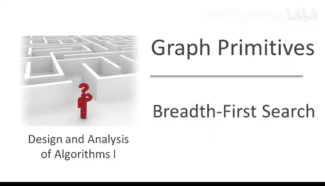
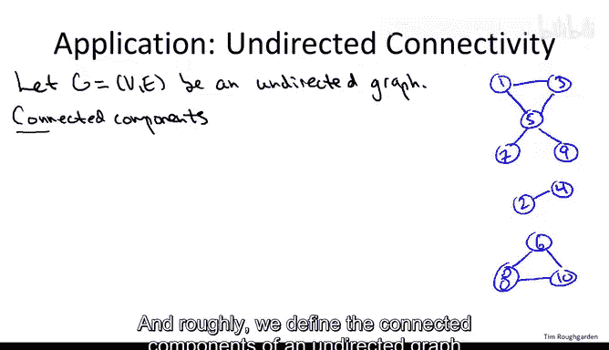
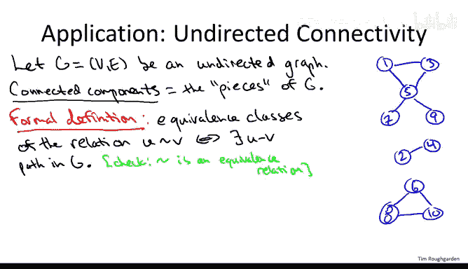
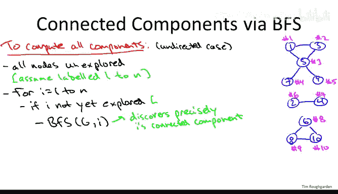

# 048：BFS与无向图连通性 🔗



在本节课中，我们将要学习如何使用广度优先搜索（BFS）来计算无向图的连通分量。我们将了解连通分量的正式定义，探讨其应用场景，并学习一个高效的线性时间算法。



---

## 概述

图搜索算法（如BFS）的核心思想在无向图和有向图中基本一致，主要区别在于处理连通性问题时。本节课我们将专注于无向图，学习如何识别图中的各个“部分”，即连通分量。连通分量是图中最大的相互连通的区域，即从该区域内的任一顶点出发，都可以通过路径到达该区域内的任何其他顶点。



## 连通分量的正式定义

为了更精确地定义连通分量，我们可以使用等价关系。对于无向图G，我们在顶点上定义一个关系：顶点U与顶点V相关（记作U ~ V），当且仅当图中存在一条从U到V的路径。

这个关系 `U ~ V` 是一个等价关系，因为它满足以下三个性质：
1.  **自反性**：每个顶点都与自身相连。`V ~ V` 总是成立，因为存在一条空路径。
2.  **对称性**：如果U到V有路径，那么V到U也有路径。`U ~ V` 蕴含 `V ~ U`。
3.  **传递性**：如果U到V有路径，且V到W有路径，那么U到W也有路径。`U ~ V` 且 `V ~ W` 蕴含 `U ~ W`。

这个等价关系的**等价类**就是图的连通分量。每个等价类都是一个最大的顶点集合，其中任意两个顶点都是相互连通的。

## 连通分量的应用

计算连通分量有许多实际应用：
*   **网络诊断**：检查一个物理网络（如互联网）是否断裂成多个部分。
*   **社交网络分析**：例如，在演员合作网络中，判断是否所有演员都能通过合作电影连接到凯文·贝肯。
*   **数据可视化**：识别图的不同部分，以便分开显示。
*   **数据聚类**：给定一组对象（如文档、图像、基因组）及其两两之间的相似度分数，可以构建一个图：每个对象是一个节点，如果两个对象的相似度足够高（例如，分数低于某个阈值），则在它们之间添加一条边。这个图的连通分量就构成了数据中高度相似的对象的“簇”。这是一种快速、线性的聚类启发式方法。

## 使用BFS计算连通分量

现在，我们来看看如何利用BFS作为核心子程序，通过一个简单的外层循环，在线性时间内计算出图的所有连通分量。

以下是算法的伪代码：

```python
# 初始化：将所有节点标记为“未探索”
将所有节点标记为 unexplored

# 外层循环：确保检查图中的每一个节点
for 每个节点 i (从1到N):
    if i 是 unexplored:
        # 启动一次BFS，探索i所在的整个连通分量
        BFS(G, i)
```

### 算法步骤解析

1.  **初始化**：算法开始时，所有节点都被标记为“未探索”。
2.  **外层循环**：按任意顺序（例如从1到N）遍历所有节点。这个循环确保每个节点最终都会被检查到。
3.  **避免重复工作**：在从一个节点`i`开始探索之前，先检查它是否已经被探索过。如果`i`是“未探索”的，说明我们遇到了一个新的连通分量。
4.  **启动BFS**：以节点`i`为起点调用BFS子程序。这次BFS会探索并标记`i`所在连通分量内的**所有**节点为“已探索”。
5.  **继续循环**：BFS结束后，返回外层循环，继续检查下一个节点。由于BFS已经标记了该分量中的所有节点，后续循环遇到这些节点时会跳过，从而避免了在每个连通分量内部进行重复的BFS调用。

### 运行时间分析

该算法的时间复杂度是 **O(n + m)**，其中n是顶点数，m是边数。原因如下：
*   **节点开销**：外层循环遍历每个节点一次，进行常数时间的检查，开销为O(n)。初始化标记也是O(n)。
*   **BFS内部开销**：每个节点只会被包含在**一次**BFS调用中。在那次调用中，BFS会为该节点做常数量的工作。因此，所有BFS调用中处理节点的总开销是O(n)。
*   **边开销**：每条边也只会被属于其连通分量的那一次BFS调用处理一次（从它的某个端点），处理每条边也是常数时间。因此，处理所有边的总开销是O(m)。



综上所述，整个算法的总运行时间与图的顶点数和边数之和成线性关系。

---

## 总结

本节课中我们一起学习了无向图连通分量的概念及其计算方法。我们了解到连通分量可以通过等价关系精确定义，并且在网络分析、数据聚类等领域有广泛应用。核心的算法是：通过一个外层循环遍历所有节点，对每个未被探索的节点启动一次广度优先搜索（BFS），BFS会探索并标记该节点所在的整个连通分量。这个算法高效、直观，其运行时间为 **O(n + m)**，是处理图连通性问题的强大工具。