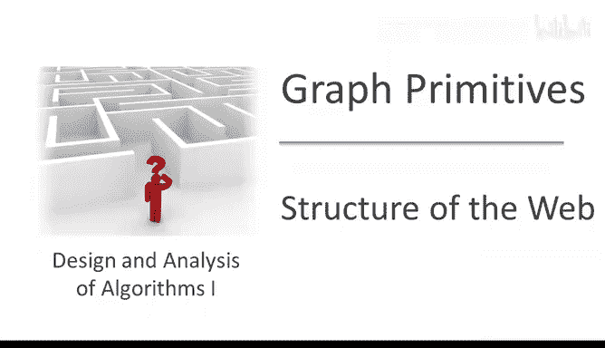
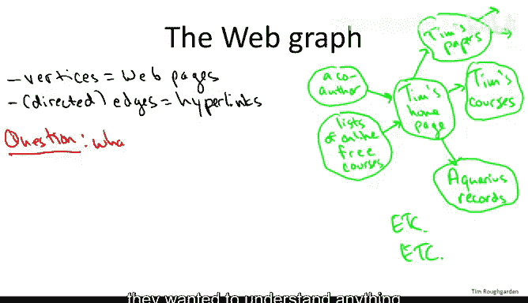
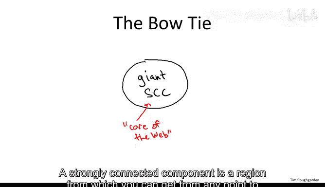
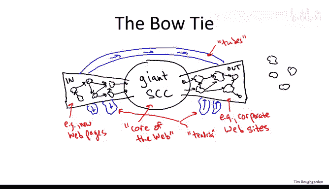
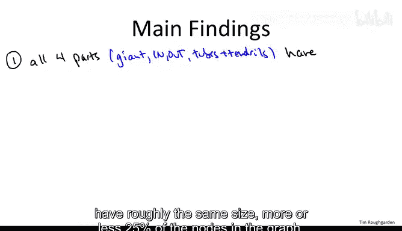
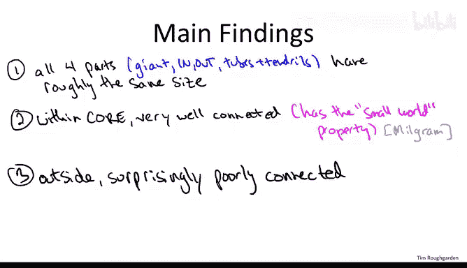
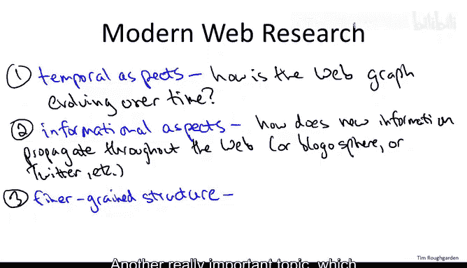

# 053：网络结构分析（选学）

在本节中，我们将探讨如何将图算法应用于超大规模图的分析，特别是以万维网（Web）图的结构研究为例。我们将了解强连通分量（SCC）算法如何帮助揭示互联网的宏观结构，并讨论相关的“小世界”现象。

---

## 什么是Web图？

Web图是一个有向图，其中：
*   **顶点** 对应网页。
*   **有向边** 对应从一个网页指向另一个网页的超链接。

例如，一个个人主页可能包含指向其研究论文、课程页面甚至喜欢的唱片店的链接。这些链接构成了有向边，尾部是包含链接的页面，头部是链接指向的页面。整个互联网就是由数十亿这样的页面和链接构成的巨大有向图。

---

## 分析Web图的挑战

理解Web图结构的主要挑战在于其**巨大的规模**。即使在互联网的“石器时代”（约2000年），一次典型研究分析的数据集也包含约**2亿个节点**和**15亿条边**。

在当时的计算环境下（没有MapReduce、Hadoop等现代大数据处理工具），研究人员必须从头开始设计算法。一个关键问题是：在计算资源有限的情况下，我们能获取关于这个图的最详细结构信息是什么？

上一节我们介绍了图的基本概念，本节中我们来看看一个核心的图算法如何被用于解决这个实际问题。

---

## 强连通分量（SCC）算法的应用

我们学过的线性时间**强连通分量（SCC）算法**成为了回答上述问题的理想工具。它可以在合理的时间内，为整个Web图计算出完整的连通性信息。

研究人员（以Andrei Broder等人为代表）对Web图运行SCC算法后，发现其结构可以用一个“**领结**”模型来形象描述。

---

### 领结模型的结构

以下是领结模型的各个组成部分：

1.  **核心（Giant SCC）**：这是一个巨大的强连通分量，可以被视为Web的“核心”。在此区域内的任意两个网页，都可以通过一系列超链接相互到达。研究表明，这个核心大约包含了全部节点的**28%**。

2.  **IN部分**：这些是能**到达核心**，但**无法从核心到达**的强连通分量集合。例如，一个全新创建并链接到核心网站，但尚未被核心网站反链的页面，就可能位于IN部分。

3.  **OUT部分**：这些是能**从核心到达**，但**无法返回核心**的强连通分量集合。例如，一些公司网站的政策禁止链接到站外，使得其内部虽然强连通，但成为了一个“只进不出”的区域。

4.  **卷须与管子（Tendrils & Tubes）**：
    *   **卷须**：指那些与IN或OUT部分相连，但既不与核心相连，也不彼此连接的区域。
    *   **管子**：指那些直接从IN部分连接到OUT部分，完全绕过核心的路径。

5.  **孤岛（Disconnected Components）**：一些与其他部分完全断开连接的独立强连通分量。

一个有趣的发现是，核心、IN、OUT以及剩余部分（卷须、管子等）的规模大致相当，各占约四分之一。

---

## 小世界现象

虽然Web核心（巨型SCC）的规模可能比预期小，但其内部的连接却异常高效，体现了“**小世界**”属性。

“小世界”现象俗称“六度分隔”，源于社会心理学家Stanley Milgram在1967年的著名实验。实验发现，平均只需通过**5到6个中间人**，就能将一封信从美国内布拉斯加州的陌生人传递到马萨诸塞州波士顿的一位特定医生手中。

在网络科学中，“小世界”属性意味着：
*   网络中任意两点间通常存在**很短的路径**。
*   更重要的是，无需全局信息，仅凭本地决策（例如，将信息传递给看似更接近目标的人），就能高效地找到这些短路径。

Web的巨型SCC就具有这种属性：内部链接丰富，短路径众多，信息路由相对容易。

---

## 网络科学的其他研究方向

强连通分量分析只是算法与信息网络研究交叉的一个早期且经典的例子。当前该领域还有许多活跃且有趣的方向：

*   **网络演化模型**：Web是动态变化的。如何建立数学模型来模拟新页面、新链接的产生与消失过程？
*   **信息传播动力学**：研究信息（如新闻、观点、病毒式内容）如何通过Web图或社交网络（如Facebook、Twitter）传播。
*   **社区发现**：如何自动、可靠地识别网络中联系紧密的节点群（即“社区”）？这比简单的图割方法要复杂得多。

这些问题不仅在数学和技术层面极具吸引力，也能帮助我们更好地理解我们所处的世界。

---

## 总结

本节课中我们一起学习了：
1.  **Web图**是一个以网页为顶点、超链接为有向边的大规模图。
2.  利用**强连通分量（SCC）算法**，可以高效分析其宏观结构，并发现其符合“**领结模型**”，包含核心、IN、OUT、卷须和管子等部分。
3.  Web的核心部分具有“**小世界**”属性，节点间路径短且易于路由。
4.  图算法是分析复杂网络的基础，在网络演化、信息传播和社区发现等前沿研究中扮演着核心角色。

若您希望深入了解网络、人群与市场，推荐阅读David Easley和Jon Kleinberg的著作《Networks, Crowds, and Markets》。