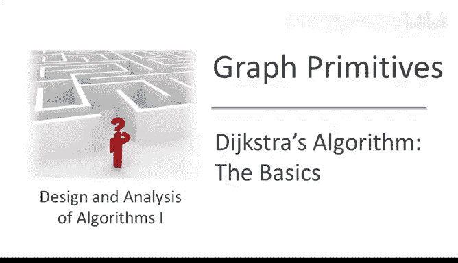
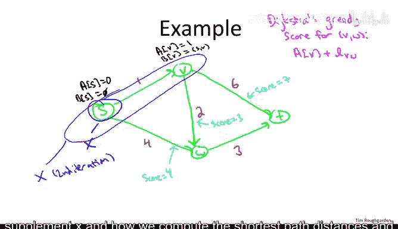
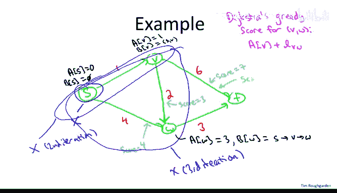
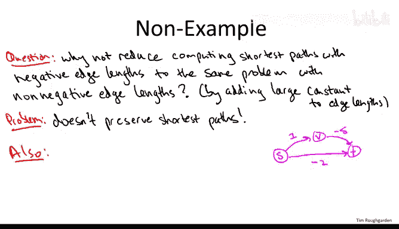

# 055：Dijkstra算法示例与局限性



在本节课中，我们将通过一个具体示例，详细演示Dijkstra算法如何逐步计算单源最短路径。我们还将探讨该算法的一个关键限制：它无法正确处理包含负权边的图。

## 算法初始化 🚀

我们从一个简单的图开始，源点为S。算法的初始化步骤是直观的。

*   我们将源点S到自身的**最短路径距离** `A[S]` 设为 `0`。
*   源点S到自身的**最短路径** `B[S]` 设为空路径。
*   初始时，集合 `X`（已确定最短路径的顶点集合）仅包含源点S。

现在，我们进入算法的主循环。

## 第一轮迭代 🔄

上一节我们完成了初始化，本节中我们来看看算法的第一轮迭代。此时，集合 `X` 中只有源点S。我们需要找出所有“跨越边界”的边，即尾节点在 `X` 内、头节点在 `X` 外的边。

以下是第一轮迭代中跨越边界的边：
*   边 `S -> V`，其长度为 `1`。
*   边 `S -> W`，其长度为 `4`。



对于每条跨越边界的边 `(v, w)`，我们计算其 **Dijkstra贪婪分数**，公式为：
`贪婪分数 = A[v] + 边(v, w)的长度`
其中 `A[v]` 是到顶点 `v` 的当前最短路径距离。

*   边 `S -> V` 的贪婪分数为 `A[S] + 1 = 0 + 1 = 1`。
*   边 `S -> W` 的贪婪分数为 `A[S] + 4 = 0 + 4 = 4`。

我们选择贪婪分数最小的边 `S -> V`。算法执行以下操作：
1.  将顶点 `V` 加入集合 `X`。现在 `X = {S, V}`。
2.  设置 `A[V] = 1`（即该边的贪婪分数）。
3.  设置 `B[V]` 为 `B[S]` 后追加边 `S -> V`，即路径 `[S -> V]`。



## 第二轮迭代 🔄

在上一轮，我们将顶点V纳入了已知集合。现在，集合 `X = {S, V}`。我们再次找出所有跨越边界的边。

以下是当前跨越边界的边：
*   边 `S -> W`（长度 `4`）。
*   边 `V -> W`（长度 `2`）。
*   边 `V -> T`（长度 `6`）。

我们计算每条边的贪婪分数：
*   `S -> W`: `A[S] + 4 = 0 + 4 = 4`
*   `V -> W`: `A[V] + 2 = 1 + 2 = 3`
*   `V -> T`: `A[V] + 6 = 1 + 6 = 7`

贪婪分数最小的边是 `V -> W`（分数为 `3`）。算法执行以下操作：
1.  将顶点 `W` 加入集合 `X`。现在 `X = {S, V, W}`。
2.  设置 `A[W] = 3`。
3.  设置 `B[W]` 为 `B[V]` 后追加边 `V -> W`，即路径 `[S -> V -> W]`。

## 第三轮（最终）迭代 🔄

经过前两轮，只剩下顶点T不在集合 `X` 中。本轮我们将确定到达T的最短路径。当前跨越边界的边有两条。

以下是最终迭代中跨越边界的边及其贪婪分数：
*   边 `V -> T`: `A[V] + 6 = 1 + 6 = 7`
*   边 `W -> T`: `A[W] + 3 = 3 + 3 = 6`

边 `W -> T` 的贪婪分数更小（`6`）。算法执行最终操作：
1.  将顶点 `T` 加入集合 `X`。现在 `X` 包含了所有顶点。
2.  设置 `A[T] = 6`。
3.  设置 `B[T]` 为 `B[W]` 后追加边 `W -> T`，即路径 `[S -> V -> W -> T]`。


至此，算法结束。数组 `A` 中存储的即为从源点S到所有顶点的最短路径距离。


## 负权边带来的挑战 ⚠️

我们刚刚看到Dijkstra算法在一个边权均为非负的图上正确工作。然而，该算法有一个重要的前提条件：**图中不能有负权边**。为什么这是一个问题呢？

一个自然的想法是：能否通过给所有边加上一个足够大的常数，使所有权重变为非负，然后再运行Dijkstra算法？遗憾的是，这种方法行不通。

原因在于，不同路径的边数可能不同。给每条边加上相同的常数 `C` 后，一条有 `k` 条边的路径，其总长度会增加 `k * C`。这改变了不同路径长度之间的相对关系，可能导致原本最短的路径不再是新图上的最短路径。

考虑以下包含负权边的简单图：
```
顶点： S, V, T
边：
S -> V: 1
S -> T: -2
V -> T: -5
```
*   路径 `S -> T` 的长度为 `-2`。
*   路径 `S -> V -> T` 的长度为 `1 + (-5) = -4`（更短）。

如果我们尝试给所有边加上 `5` 使其非负，得到：
```
S -> V: 6
S -> T: 3
V -> T: 0
```
*   新图中，路径 `S -> T` 的长度为 `3`。
*   路径 `S -> V -> T` 的长度为 `6 + 0 = 6`。
最短路径发生了反转！因此，这种简单的“平移”归约是无效的。



## Dijkstra算法在负权图上的失败 ❌

更严重的是，如果我们在包含负权边的原图上直接运行Dijkstra算法，它会产生错误的结果。

让我们在上面的三节点图上模拟Dijkstra算法：
1.  **初始化**: `A[S]=0`, `X={S}`。
2.  **第一轮迭代**: 跨越边界的边是 `S->V`（分数 `1`）和 `S->T`（分数 `-2`）。算法选择分数更小的边 `S->T`。
3.  **结果**: 算法将 `T` 加入 `X`，并**错误地**确定 `A[T] = -2`，`B[T] = [S->T]`。

然而，我们已知从 `S` 到 `T` 真正的最短路径是 `S->V->T`，长度为 `-4`。Dijkstra算法过早地将 `T` 标记为“已解决”，而忽略了通过 `V` 的、更短的路径，因为它基于贪婪策略，在存在负权边时，局部最优的选择不保证全局最优。

## 总结 📝

本节课中我们一起学习了Dijkstra算法的工作流程及其关键限制。
*   我们逐步演示了Dijkstra算法如何通过迭代扩展“已知区域” `X`，并利用贪婪分数选择边，来计算单源最短路径。
*   我们了解到，Dijkstra算法的正确性依赖于图中所有边的权重均为**非负**这一关键前提。
*   我们通过反例看到，当图中存在负权边时，Dijkstra的贪婪选择策略会失效，导致计算出错误的最短路径距离。

因此，在处理可能包含负权边的图时，需要使用其他算法，如Bellman-Ford算法。在下一节课中，我们将深入探讨如何证明Dijkstra算法在非负权图上的正确性。