# 056：Dijkstra算法正确性证明 🧠

在本节课中，我们将学习如何证明Dijkstra算法在任意边权非负的有向图中，确实能计算出从源点到所有其他顶点的正确最短路径。

---

## 算法回顾

首先，让我们回顾一下Dijkstra算法的基本思想。它与广度优先搜索等图搜索算法一脉相承。算法维护一个已处理顶点的集合 **X**。初始时，**X** 仅包含源点 **S**，从 **S** 到自身的距离自然为0。

算法的主体是一个循环，共进行 **n-1** 次迭代，每次迭代将一个当前不在 **X** 中的顶点加入 **X**。我们维持一个不变式：对于 **X** 中的每个顶点，我们已经计算出了从 **S** 到该顶点的最短路径距离估计值，以及该最短路径本身。我们始终假设从源点 **S** 到图中任何其他顶点 **V** 至少存在一条路径，并且所有边的长度都是非负的。


Dijkstra算法的核心在于如何精心选择下一个从 **X** 外部加入 **X** 的顶点。具体做法是：扫描所有跨越“前沿”的边。所谓“前沿”，是指那些起点（尾部）在 **X** 内，而终点（头部）在 **X** 外的边。

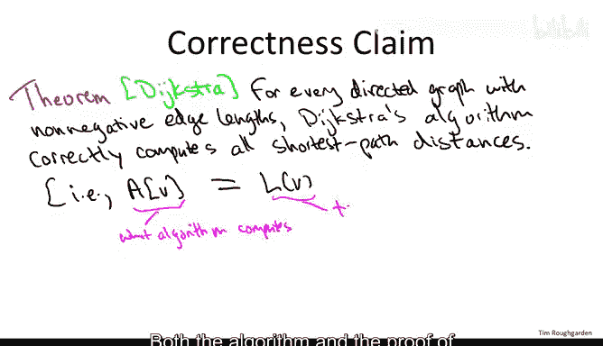

对于每一条这样的边 **(v, w)**，我们计算一个 **Dijkstra贪婪分数**，其定义为：

```
贪婪分数 = d[v] + l(v, w)
```

其中，`d[v]` 是我们已计算出的从 **S** 到 **v** 的最短路径距离，`l(v, w)` 是边 **(v, w)** 的长度。

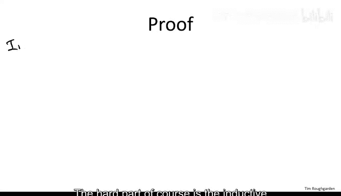

在所有跨越前沿的边中，我们选择贪婪分数最小的那条边，记为 **(v*, w*)**。然后，我们将顶点 **w*** 加入 **X**，并设置：
- 从 **S** 到 **w*** 的最短路径距离 `d[w*] = d[v*] + l(v*, w*)`
- 从 **S** 到 **w*** 的最短路径为：之前计算出的到 **v*** 的最短路径，再拼接上边 **(v*, w*)**

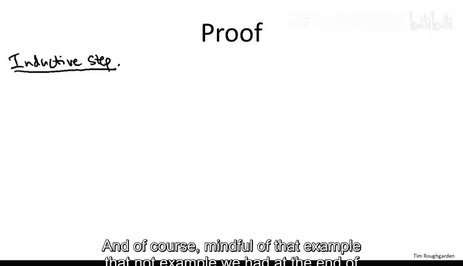


## 证明目标

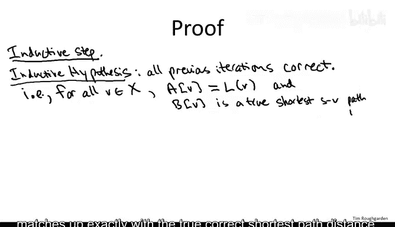

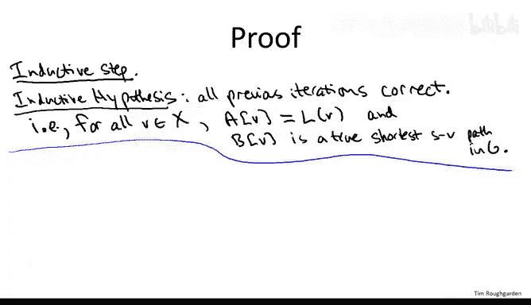

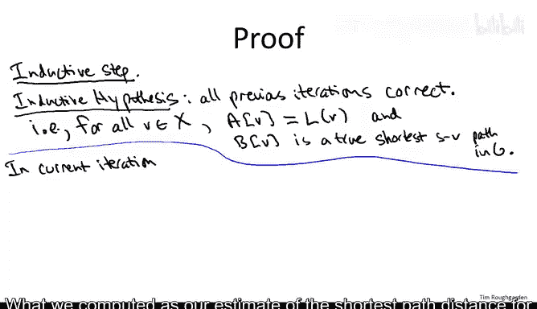

我们将要证明的定理是：对于任何边权非负的有向图，Dijkstra算法都能正确计算出所有最短路径距离。即，对于每个顶点 **V**，算法计算出的值 `A[V]` 恰好等于真正的最短路径距离 `L[V]`。

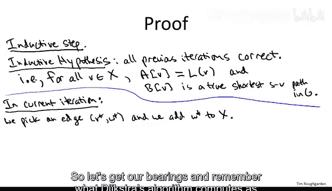

这个算法由荷兰计算机科学家Edsger Dijkstra在20世纪50年代末提出，他因其贡献在1972年获得了图灵奖。

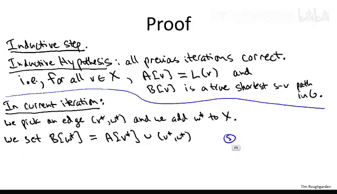

## 证明结构：归纳法

我们将采用数学归纳法来证明算法的正确性。归纳的基础是迭代次数。

**基础情况** 是平凡的。在循环开始前，我们设置从 **S** 到 **S** 的距离为0，路径为空路径。这显然是正确的（这里也用到了边权非负的假设，确保了没有比0更短的路径）。

**归纳步骤** 是证明的关键。我们假设在之前的所有迭代中，算法都已正确计算了 **X** 中所有顶点的最短路径。也就是说，对于所有 **V ∈ X**，有 `A[V] = L[V]`，并且我们记录的最短路径 `B[V]` 确实是一条真正的从 **S** 到 **V** 的最短路径。

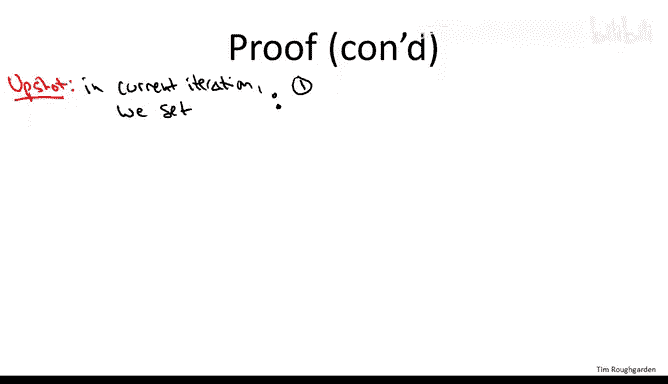

现在，考虑当前迭代。算法选择了一条边 **(v*, w*)**，并将 **w*** 加入 **X**。根据算法定义，我们为 **w*** 设置的最短路径 `B[w*]` 是 `B[v*]` 加上边 **(v*, w*)**，其长度 `A[w*]` 为 `A[v*] + l(v*, w*)`。

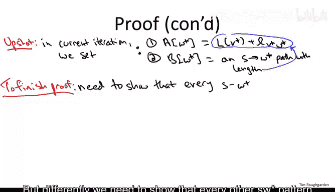

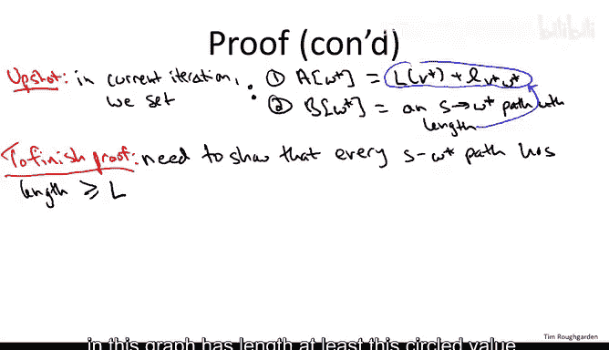

根据归纳假设，`B[v*]` 是一条真正的从 **S** 到 **v*** 的最短路径，其长度为 `L[v*]`。因此，`A[w*] = L[v*] + l(v*, w*)`，并且 `B[w*]` 是一条从 **S** 到 **w*** 的、长度为此值的真实路径。

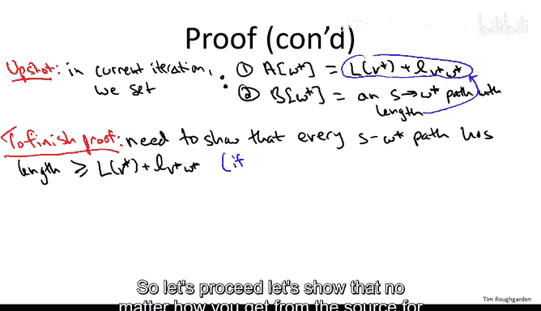

为了完成归纳步骤，我们需要证明：**不存在任何其他从 S 到 w* 的路径，其长度比 `L[v*] + l(v*, w*)` 更短**。换句话说，我们找到的这条路径就是全局最短的。

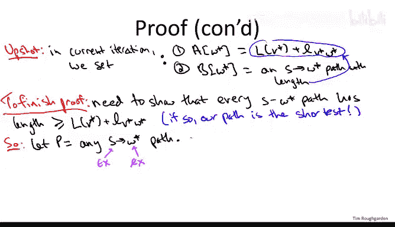

## 关键论证：任意路径的下界

考虑任意一条从 **S** 到 **w*** 的路径 **P**。由于 **S** 在 **X** 内，而 **w*** 在本次迭代开始时不在 **X** 内，因此路径 **P** 必定在某个时刻首次穿越“前沿”，从 **X** 内的某个顶点 **y**，通过一条边 **(y, z)**，到达 **X** 外的顶点 **z**。此后，路径可能继续游走，最终到达 **w***。

因此，路径 **P** 可以分解为三部分：
1.  从 **S** 到 **y** 的前缀（完全在 **X** 内）。
2.  跨越前沿的边 **(y, z)**。
3.  从 **z** 到 **w*** 的后缀（可能在 **X** 内外穿梭）。

现在，我们来分析路径 **P** 的长度下界：
-   **前缀部分**：这是一条从 **S** 到 **y** 的路径，其长度至少等于从 **S** 到 **y** 的最短路径距离 `L[y]`。根据归纳假设，`L[y] = A[y]`。
-   **跨越边部分**：其长度就是 `l(y, z)`。
-   **后缀部分**：由于所有边权非负，这部分路径的长度至少为 0。

综合以上，我们得到路径 **P** 的长度满足：
```
len(P) ≥ A[y] + l(y, z)
```

## 应用贪婪选择准则

请注意，边 **(y, z)** 是一条从 **X** 内（**y**）指向 **X** 外（**z**）的边，因此在本轮迭代中，它也是Dijkstra算法考虑的候选边之一。

Dijkstra算法的贪婪选择准则是：**选择所有候选边中贪婪分数 `A[tail] + l(tail, head)` 最小的那条**。我们本轮选择的边是 **(v*, w*)**，其贪婪分数为 `A[v*] + l(v*, w*)`。

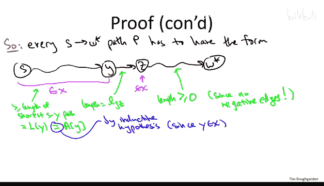

由于 **(y, z)** 也是候选边，根据算法选择规则，必有：
```
A[v*] + l(v*, w*) ≤ A[y] + l(y, z)
```

结合我们之前对任意路径 **P** 的下界分析，就有：
```
A[v*] + l(v*, w*) ≤ A[y] + l(y, z) ≤ len(P)
```

这意味着，对于任意从 **S** 到 **w*** 的路径 **P**，其长度都**不小于**我们算法为 **w*** 计算出的路径长度 `A[v*] + l(v*, w*)`。

因此，我们算法找到的这条路径确实是从 **S** 到 **w*** 的**最短路径**，其长度 `A[w*]` 就是真正的最短路径距离 `L[w*]`。

## 总结

本节课中，我们一起学习了Dijkstra算法正确性的完整证明。我们通过数学归纳法，证明了在边权非负的假设下，算法的每一步迭代都能正确选择一个顶点并确定其最短路径。证明的核心在于：
1.  利用归纳假设，确保已处理顶点信息正确。
2.  分析任意竞争路径的结构，将其分解并利用边权非负性得到下界。
3.  最后，应用算法的贪婪选择准则，证明算法找到的路径长度不大于这个下界，从而证明其最优性。

这个严谨的论证确保了Dijkstra算法在所述条件下的可靠性，为其在实际应用（如网络路由、地图导航等）中奠定了坚实的理论基础。